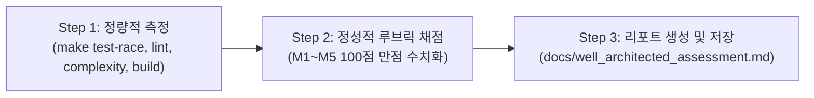

# Well-Architected 품질 평가 및 아키텍처 감사 스킬 (Architecture Review Skill)

이 스킬은 Goslide 프로젝트에서 **정량적 측정 도구(Makefile 툴체인)**와 **정성적 아키텍처 루브릭(LLM 기반 수치화 평가)**을 결합하여, 코드베이스가 Well-Architected 원칙(단순성, 관심사 분리, 안정성, 유지보수성)을 충족하는지 결정론적으로 감사하고 공식 리포트를 생성할 때 사용합니다.

---

## 1. 평가 워크플로우 3단계

에이전트는 이 스킬이 호출되면 다음 3단계를 순차적으로 수행합니다:



---

## 2. Step 1: 정량적 측정 (Quantitative Tool Execution)

반드시 실제 터미널 명령어를 실행하여 데이터를 수집합니다. (추측 금지)

1. **동시성 안전성 및 테스트 커버리지**:
   ```bash
   make test-race
   go test -cover ./...
   ```
   - 확인 지표: Data Race 발생 건수 (목표: 0건), 패키지별 커버리지 비율 (핵심 패키지 > 70%).

2. **정적 코드 분석**:
   ```bash
   make lint
   ```
   - 확인 지표: `golangci-lint` 경고/오류 건수 (목표: 0건).

3. **순환 및 인지 복잡도**:
   ```bash
   make complexity
   ```
   - 확인 지표: 순환 복잡도(Cyclomatic $\le$ 15), 인지 복잡도(Cognitive $\le$ 20) 임계치 초과 함수 건수 (목표: 0건).

4. **단일 정적 바이너리 컴파일 (CGO 0%)**:
   ```bash
   make build
   file bin/goslide
   ```
   - 확인 지표: `statically linked` 여부 (동적 라이브러리 링크 0개).

5. **린 아키텍처(Lean) 규모 측정**:
   ```bash
   # 프로덕션 코드 파일 및 라인 수
   find cmd internal pkg -name "*.go" ! -name "*_test.go" ! -name "doc.go" | xargs wc -l | sort -n
   # 테스트 코드 라인 수
   find cmd internal pkg -name "*_test.go" | xargs wc -l | sort -n
   ```

---

## 3. Step 2: 정성적 아키텍처 정량화 평가 (Qualitative Rubric Scoring)

[references/rubrics.md](./references/rubrics.md)의 5대 핵심 축(축당 20점, 총 100점 만점)을 기준으로 실제 코드 라인과 아키텍처 문서를 대조하여 채점합니다:

1. **M1. 단방향 파이프라인 & 관심사 분리 (SoC / Coupling) [20점]**:
   - `go list -f '{{.ImportPath}} -> {{.Imports}}' ./...`로 패키지 의존 그래프 검증.
   - 계층 간 역참조/순환의존성 여부 확인.
2. **M2. 단순성 및 YAGNI 원칙 준수 ([ADR-001](../../../docs/okf/decisions-simplification.md)) [20점]**:
   - 불필요한 Go측 연산기(cascader 등) 배제 및 브라우저 위임 상태 점검.
   - 프로덕션 코드 20개 파일 이내 고응집 유지 여부 점검.
3. **M3. Go 관용구 및 인터페이스 적정성 (Idiomatic Go / ISP / DIP) [20점]**:
   - `internal/model/interfaces.go`의 단일 메서드 인터페이스 준수 여부.
   - 전역 가변 상태 0건 및 `New...` DI 생성자 패턴 적용 여부.
4. **M4. 에러 맥락 및 실행 가능성 (Actionable Errors) [20점]**:
   - Go 1.13+ `%w` 에러 래핑 및 도메인 센티넬 에러 매핑 여부.
   - 실패 시 파일 경로/테마명 등 구체적 맥락(%q) 제공 여부.
5. **M5. 도메인 모델 불변성 & 확장성 (Immutability & Extensibility) [20점]**:
   - `model.Deck`, `model.Slide`가 마크다운 AST에 오염되지 않은 순수 IR인지 점검.
   - 차기 마일스톤(HTML, PDF, PPTX) 확장에 필요한 메타데이터 완비 여부.

---

## 4. Step 3: 리포트 생성 및 저장 (Report Generation)

수집된 데이터와 채점 결과를 종합하여 `docs/well_architected_assessment.md`에 저장합니다:

```bash
# 산출물 경로: docs/well_architected_assessment.md
```

### 리포트 필수 포함 섹션:
1. **메타데이터**: 버전, 평가 대상 마일스톤, 작성일자, 평가자
2. **1부: 정량적 측정 대시보드**: 도구별 기준치 vs 실측값 비교표
3. **2부: 5대 축 채점표**: 항목별 점수(만점 20점) 및 실제 코드 라인 근거
4. **세부 심층 평가**: 강점 및 사소한 개선 권장 사항
5. **종합 평점 및 판정**:
   - **90점 이상**: **최우수 (Well-Architected Pass)**
   - **75점 ~ 89점**: **양호 (Conditional Pass)**
   - **75점 미만 또는 과락**: **재작업 (Fail)**

---

## 5. 모범 사례 및 주의 사항 (Best Practices)

- **추측 금지**: 점수를 매길 때는 반드시 실제 코드 파일([`internal/...`](../../../internal/))과 라인 번호를 근거로 제시해야 합니다.
- **반복 실행 보장**: 새로운 마일스톤이 완료될 때마다 이 스킬을 실행하여 리포트를 갱신하고, 이전 점수 대비 회귀(Regression)가 없는지 검증합니다.
- **자동화 연계**: Antigravity의 `/schedule` 명령어와 결합하여 주기적(예: 주간 또는 마일스톤 단위) 품질 감사를 자동화할 수 있습니다.
