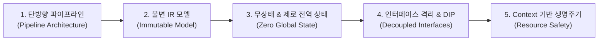

# 1. 시스템 개요 및 5대 아키텍처 원칙 (Vision & Principles)

## 1.1 시스템 개요 및 핵심 가치

**Goslide**는 마크다운(Markdown) 문서를 입력받아 프레젠테이션용 웹 슬라이드(HTML), 인쇄용 벡터 문서(PDF), 고해상도 파워포인트(PPTX)로 변환하는 Go 기반의 초경량, 고성능 슬라이드 데크 빌더입니다.

* **스크린캐스트 특화**: 유튜브 및 온라인 교육 영상 제작에 최적화된 실시간 투명 판서(Annotation) 및 발표자 제어 런타임을 내장합니다.
* **단일 실행 바이너리 (Single Binary)**: 외부 런타임(Node.js, Python 등) 및 CGO 종속성을 완전히 배제하여 어디서나 즉시 실행 가능한 순수 Go 정적 컴파일을 지향합니다.
* **결정론적 출력 (Deterministic Output)**: 동일한 마크다운과 설정에 대해 언제나 100% 동일한 레이아웃과 픽셀 결과를 보장합니다.

---

## 1.2 핵심 5대 아키텍처 원칙 (5 Architectural Principles)

### 원칙 1: 단방향 파이프라인 (Unidirectional Pipeline Architecture)
- **정의**: 데이터는 항상 `Source -> Lexer -> Parser -> Model -> Resolver -> Emitter`의 한 방향으로만 흐르며, 역방향 의존성이나 단계 건너뛰기를 엄격히 금지합니다.
- **수행 방안**:
  - 파서([`internal/parser`](../../internal/parser))는 렌더러([`internal/renderer`](../../internal/renderer))나 익스포터([`internal/exporter`](../../internal/exporter))의 존재를 전혀 알지 못합니다.
  - 각 파이프라인 단계는 입력 데이터를 가공하여 다음 단계의 명확한 타입 계약(Contract)으로 전달합니다.

### 원칙 2: 불변 중간 표현 모델 (Immutable IR)
- **정의**: 파싱 및 테마 리졸빙이 완료된 [`model.Deck`](../../internal/model/deck.go) 및 [`model.Slide`](../../internal/model/deck.go) 구조체는 읽기 전용(Read-Only) 불변 객체로 취급됩니다.
- **수행 방안**:
  - 모델 생성 후 내부 필드를 직접 수정하는 setter 메서드를 제공하지 않습니다.
  - HTML 렌더러와 PDF/PPTX 익스포터가 동일한 `Deck` 포인터를 동시에 참조하더라도 데이터 레이스(Data Race)가 원천적으로 발생하지 않는 Thread-Safe 구조를 보장합니다.

### 원칙 3: 무상태 및 제로 전역 상태 (Zero Global State)
- **정의**: 패키지 레벨 전역 변수(패키지 설정, 인메모리 캐시, 상태 플래그 등)의 선언을 전면 금지합니다.
- **수행 방안**:
  - 모든 컴포넌트는 생성자 함수(`New...`)를 통해 의존성을 명시적으로 주입(Dependency Injection)받습니다.
  - 패키지 함수 대신 구조체 인스턴스의 메서드로 로직을 캡슐화하여 동시성 호출 시 상태 충돌을 원천 방지합니다.

### 원칙 4: 인터페이스 격리와 의존성 역전 (ISP & DIP)
- **정의**: 상위 비즈니스 로직과 CLI는 구체 구현체가 아닌 최소한의 추상 인터페이스에 의존합니다.
- **수행 방안**:
  - [`model.Renderer`](../../internal/model/interfaces.go), [`model.Exporter`](../../internal/model/interfaces.go) 등의 소형 인터페이스를 선언하고, 각 포맷 모듈은 이를 구현체로서 충족합니다.
  - 새로운 출력 포맷(예: Keynote, PNG 번들 등)이 추가되더라도 기존 코어 파이프라인 코드는 일체 수정되지 않는 개방-폐쇄 원칙(OCP)을 달성합니다.

### 원칙 5: Context 기반 제어 및 리소스 누수 방지 (Resource Safety)
- **정의**: 모든 I/O 작업, 서브프로세스 제어, 장시간 연산에는 반드시 `context.Context`를 전달합니다.
- **수행 방안**:
  - 사용자 인터럽트(`Ctrl+C`) 또는 타임아웃 발생 시 즉시 컨텍스트 취소 신호를 감지하여 고루틴과 하위 프로세스를 정상 정리합니다.
  - 파일 핸들러, 네트워크 소켓, 헤드리스 브라우저 세션은 반드시 `defer close()` 또는 `defer cancel()`을 통해 결정론적으로 회수합니다.

---

## 1.3 관련 문서

* **[`02-slide-spec-and-domain-model.md`](./02-slide-spec-and-domain-model.md)**: 원칙 2(불변 IR)에 따른 도메인 데이터 모델 사양
* **[`03-package-structure-and-c4.md`](./03-package-structure-and-c4.md)**: 원칙 1, 3, 4에 따른 패키지 경계 및 C4 구조
* **[`06-runtime-security-and-lifecycle.md`](./06-runtime-security-and-lifecycle.md)**: 원칙 5에 따른 Headless 브라우저 프로세스 생명주기 관리
