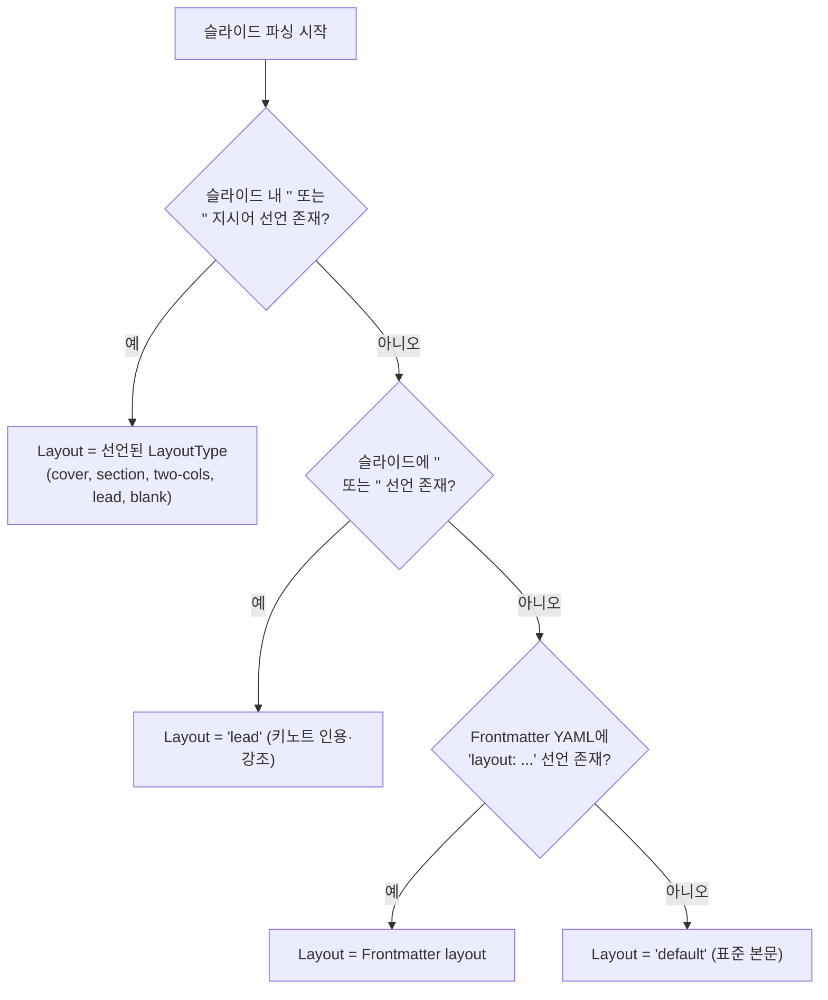
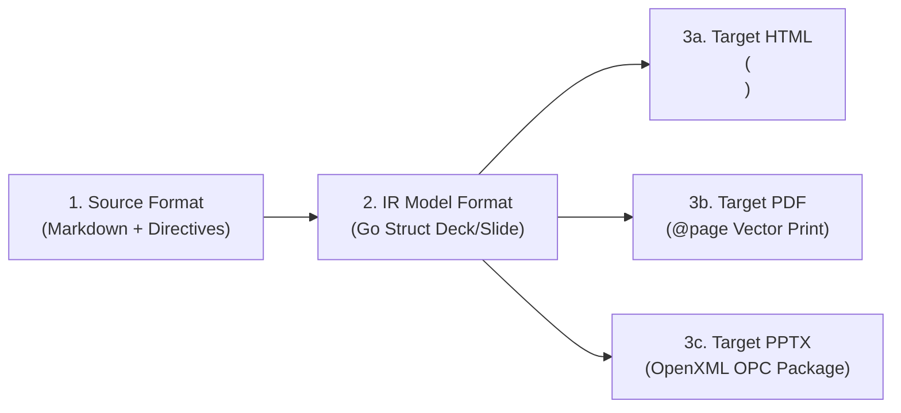

# 2. 슬라이드 문서 명세 및 도메인 IR 모델 (Slide Spec & IR Model)

## 2.1 슬라이드 표현 기능 (Slide Capabilities)

슬라이드는 발표 자료로서 텍스트, 데이터, 멀티미디어, 인터랙션을 모두 포괄하는 풍부한 시각적 요소를 표현할 수 있습니다.

| 분류 | 표현 가능 요소 및 세부 기능 | 렌더링 방식 및 지원 라이브러리 |
| :--- | :--- | :--- |
| **시맨틱 타이포그래피** | H1~H6 헤딩, 부제목, 본문 단락, 인용구(Blockquote), 글머리 기호/번호 목록 | HTML 시맨틱 태그 및 테마 CSS 타이포그래피 |
| **시맨틱 레이아웃** | • `cover`: 표지 (중앙 정렬 대형 타이틀)<br>• `default`: 상단 고정 제목 + 본문 콘텐츠<br>• `section`: 중간 간지 (테마 강조)<br>• `two-cols`: 2단 병렬 비교 컬럼<br>• `lead`: 키노트 인용·강조 (중앙 집중)<br>• `blank`: 여백 0 풀스크린 미디어/다이어그램 | CSS Flexbox 4-Tier 고정 격리 구조 ([`docs/layout-design.md`](../layout-design.md) 준수) |
| **구조화된 데이터** | GitHub Flavored Markdown (GFM) 테이블, 작업 목록(체크리스트 `[ ]`, `[x]`), 취소선, 자동 하이퍼링크 | Goldmark GFM 확장 엔진 |
| **코드 블록 & 구문 강조** | 100개 이상의 프로그래밍 언어 구문 강조, 줄 번호 표시, 테마별 컬러 팔레트 | 순수 Go 기반 `chroma/v2` 구문 강조기 (CGO 배제) |
| **수학 공식 (Math/LaTeX)** | 인라인 수식(`$E=mc^2$`), 블록 수식(`$$\sum_{i=1}^n x_i$$`) | KaTeX 스크립트 연동 및 수식 웹 폰트 |
| **멀티미디어 및 배경** | 로컬/원격 이미지 삽입, 슬라이드 전체 배경 이미지(`backgroundImage`), 배경색(`backgroundColor`), 딤 오버레이 | CSS `background-size: cover/contain`, 상대 경로 보존 |
| **발표자 노트 (Speaker Notes)** | 슬라이드 내 `<!-- note: ... -->` 메모 작성 (청중 화면에는 비노출) | 발표자 콘솔(`P` 키) 및 PPTX 슬라이드 메모(`notesSlideX.xml`) 연동 |
| **스크린캐스트 판서** | 초경량 투명 캔버스 판서 레이어 (`D` 키 토글, `C` 키 지우기), 슬라이드별 캐싱 | 프런트엔드 런타임 캔버스 컴포넌트 |

---

## 2.2 메타데이터 체계 및 지시어 태그 (Directives)

### A. 문서 전역 헤더 (Frontmatter YAML)
마크다운 문서 최상단(`---`)에 위치하며 전체 슬라이드 데크의 기본값을 정의합니다.

```yaml
---
title: "Goslide 아키텍처 설계"
author: "윤상배 (sbyun@cloit.com)"
theme: default          # 내장 테마: default | clean | dark 또는 커스텀 CSS 경로
size: 16:9              # 화면 비율: 16:9 | 4:3
paginate: true          # 슬라이드 번호 표기 여부 (true/false)
header: "클라우드 네이티브 세션" # 전역 상단 러닝 헤더 텍스트
footer: "© 2026 Cloit Inc." # 전역 하단 바닥글 텍스트
layout: default         # 전체 슬라이드의 기본 레이아웃
autofit: true           # 본문 초과 시 자동 축소 배율 적용 여부
---
```

### B. 인라인 주석 지시어 (Directives Tag)
개별 슬라이드 본문 내에 `<!-- key: value -->` 형태로 선언합니다. `_` 접두사가 붙은 지시어는 해당 슬라이드 1장에만 적용되는 Scoped Directive입니다.

| 지시어 (Directive) | 접두사 `_` 유무 차이 | 허용 값 예시 | 역할 및 설명 |
| :--- | :---: | :--- | :--- |
| `layout` / `_layout` | `_` 붙으면 해당 장만 적용 | `"cover"`, `"section"`, `"two-cols"`, `"lead"`, `"blank"` | 슬라이드 시맨틱 레이아웃 지정 |
| `class` / `_class` | `_` 붙으면 해당 장만 적용 | `"lead"`, `"invert"`, `"compact"` | 슬라이드 컨테이너 CSS 클래스 부여 |
| `backgroundColor` / `_backgroundColor` | `_` 붙으면 해당 장만 적용 | `"#f8fafc"`, `"rgb(15,23,42)"` | 슬라이드 배경색 |
| `backgroundImage` / `_backgroundImage` | `_` 붙으면 해당 장만 적용 | `"url('assets/diagram.png')"` | 슬라이드 전체 배경 이미지 지정 |
| `backgroundDim` / `_backgroundDim` | `_` 붙으면 해당 장만 적용 | `"0.5"`, `"rgba(0,0,0,0.6)"` | 가독성을 위한 배경 어두움 오버레이 |
| `color` / `_color` | `_` 붙으면 해당 장만 적용 | `"#1e293b"`, `"white"` | 기본 텍스트 색상 오버라이드 |
| `header` / `_header` | `_` 붙으면 해당 장만 적용 | `"새로운 챕터명"`, `""` | 로컬 헤더 텍스트 덮어쓰기 |
| `footer` / `_footer` | `_` 붙으면 해당 장만 적용 | `"별도 푸터"`, `""` | 로컬 푸터 텍스트 덮어쓰기 |
| `paginate` / `_paginate` | `_` 붙으면 해당 장만 적용 | `true`, `false` | 로컬 페이지 번호 표시 토글 |
| `<!-- split -->` | 단독 구분 태그 | - | `layout: two-cols` 슬라이드에서 좌/우 컬럼을 나누는 구분자 |
| `<!-- note: ... -->` | 복수 줄 블록 지원 | 마크다운 텍스트 | 발표자 전용 메모 (청중 화면 비노출) |

---

## 2.3 결정론적 레이아웃 결정 규칙 (Deterministic Layout Resolution)

Goslide는 마크다운 파서가 슬라이드 본문의 줄 수나 특정 요소를 바탕으로 레이아웃을 임의로 추측하거나 변경하는 것을 엄격히 금지합니다 (Zero Guesswork). 오직 사용자의 **명시적인 선언(Explicit Declaration)**에 의해서만 결정됩니다:



---

## 2.4 슬라이드 3단계 데이터 형식 (Slide Representations)



1. **소스 형식 (Markdown Source)**:
   - Frontmatter YAML 블록 (`^---\n` ... `\n---\n`).
   - 슬라이드 분할선: 단독 줄의 수평선(`---`). (Fenced Code Block 내부 `---`는 제외).
2. **내부 중간 표현 형식 (IR Model)**: 메모리 상의 불변 Go 구조체.
3. **타깃 출력 형식 (Target Outputs)**: 웹 표준 HTML, 무마진 벡터 PDF, OpenXML PPTX.

---

## 2.5 불변 도메인 모델 사양 ([`internal/model/deck.go`](../../internal/model/deck.go))

```go
package model

import "time"

type SizeRatio string

const (
	Ratio16x9 SizeRatio = "16:9"
	Ratio4x3  SizeRatio = "4:3"
)

type LayoutType string

const (
	LayoutDefault LayoutType = "default"
	LayoutCover   LayoutType = "cover"
	LayoutSection LayoutType = "section"
	LayoutTwoCols LayoutType = "two-cols"
	LayoutLead    LayoutType = "lead"
	LayoutBlank   LayoutType = "blank"
)

// Deck은 단일 프레젠테이션 전체를 포괄하는 최상위 불변 모델입니다.
type Deck struct {
	Title       string           `json:"title"`
	Author      string           `json:"author"`
	CreatedAt   time.Time        `json:"created_at"`
	GlobalAttrs GlobalDirectives `json:"global_attributes"`
	CustomCSS   string           `json:"custom_css,omitempty"`
	Slides      []*Slide         `json:"slides"`
}

// GlobalDirectives는 데크 전체의 전역 속성 지시자입니다.
type GlobalDirectives struct {
	Theme    string     `json:"theme"`
	Layout   LayoutType `json:"layout"`
	Size     SizeRatio  `json:"size"`
	Paginate bool       `json:"paginate"`
	Header   string     `json:"header,omitempty"`
	Footer   string     `json:"footer,omitempty"`
	Autofit  bool       `json:"autofit,omitempty"`
}

// SlideDirectives는 개별 슬라이드의 유효 스타일 지시자입니다.
type SlideDirectives struct {
	Layout          LayoutType `json:"layout,omitempty"`
	Class           []string   `json:"class,omitempty"`
	BackgroundColor string     `json:"background_color,omitempty"`
	BackgroundImage string     `json:"background_image,omitempty"`
	BackgroundDim   string     `json:"background_dim,omitempty"`
	Color           string     `json:"color,omitempty"`
	Header          string     `json:"header,omitempty"`
	Footer          string     `json:"footer,omitempty"`
	Paginate        bool       `json:"paginate"`
	Autofit         bool       `json:"autofit,omitempty"`
}

// Slide는 단일 화면 슬라이드 단위 모델입니다.
type Slide struct {
	Index         int             `json:"index"`
	Layout        LayoutType      `json:"layout"`
	Directives    SlideDirectives `json:"directives"`
	RawContent    string          `json:"-"`
	TitleHTML     string          `json:"title_html,omitempty"`
	HTMLContent   string          `json:"html_content"`
	Notes         string          `json:"notes,omitempty"`
	LeftHTML      string          `json:"left_html,omitempty"`
	RightHTML     string          `json:"right_html,omitempty"`
}
```

---

## 2.6 관련 문서

* **[`docs/layout-design.md`](../layout-design.md)**: 1920×1080 캔버스 4-Tier 물리적 높이 및 마스터 레이아웃 사양
* **[`04-interfaces-and-contracts.md`](./04-interfaces-and-contracts.md)**: `model.Parser`, `Renderer`, `Exporter` 인터페이스 계약
* **[`05-rendering-and-export-pipelines.md`](./05-rendering-and-export-pipelines.md)**: IR 모델이 각 출력 포맷으로 변환되는 상세 흐름
