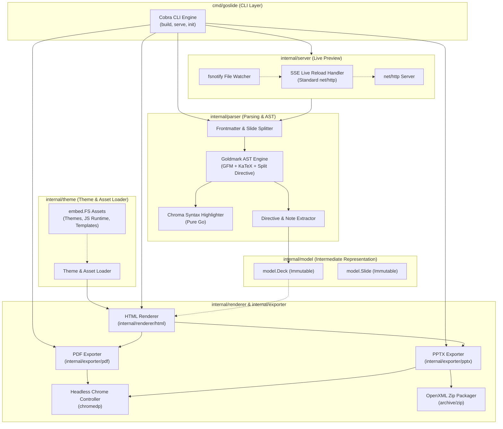
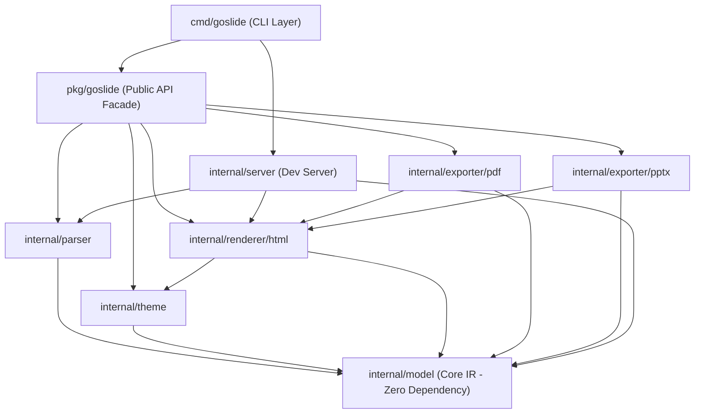

# 3. 컴포넌트 아키텍처 및 패키지 경계 (Components & Packages)

## 3.1 C4 컴포넌트 뷰 (C4 Component Diagram)



---

## 3.2 패키지 및 모듈 디렉토리 구조 (Directory Layout)

Goslide는 Go 표준 패키지 레이아웃 규칙(`cmd`, `pkg`, `internal`)을 엄격히 준수합니다:

```text
Goslide/
├── cmd/
│   └── goslide/                      # CLI 진입점 (main.go, build.go, serve.go)
│
├── pkg/
│   └── goslide/                      # 외부 Go 애플리케이션용 Public Facade API (goslide.go)
│
├── internal/                         # 코어 비즈니스 로직 (외부 임포트 금지)
│   ├── model/                        # 도메인 모델(IR) 및 인터페이스 (Zero Dependency)
│   │   ├── deck.go                   # Deck, Slide, Directives 불변 모델
│   │   ├── interfaces.go             # Parser, Renderer, Exporter 인터페이스
│   │   └── errors.go                 # 도메인 계층형 센티넬 에러
│   │
│   ├── parser/                       # 마크다운 파싱 서브시스템 (Frontmatter, Goldmark, Chroma)
│   ├── theme/                        # 테마 및 정적 에셋 로더 (embed.FS, CSS 컴포지션)
│   │   └── assets/                   # 내장 CSS/JS 에셋 (deck-canvas.css, deck-content.css, presenter.css)
│   ├── renderer/                     # 슬라이드 HTML 렌더러 (html/template)
│   │   └── html/
│   │       ├── golden_test.go        # 골든 파일 회귀 검증 테스트
│   │       └── testdata/             # 회귀 테스트 픽스처 (golden, slides)
│   ├── exporter/                     # 외부 포맷 익스포터 (pdf: chromedp, pptx: capture+zip)
│   ├── server/                       # 로컬 개발 서버 및 SSE 핫 리로드 (fsnotify)
│   ├── browser/                      # 크로스 플랫폼 Headless Chrome/Chromium 탐색기
│   ├── i18n/                         # CLI 및 런타임 영/한 다국어 메시지 카탈로그
│   └── testutil/                     # 골든 파일 회귀 검증 헬퍼
│
├── web/                              # 발표자 런타임 프런트엔드 (Svelte 5 + Tailwind + Vite)
├── examples/                         # 공식 사용자 데모 슬라이드 및 DSL 사양서
│   ├── demo/                         # 공식 데모 마크다운 및 이미지 에셋
│   └── dsl/                          # DSL 문법 사양 및 골든 예제
├── Makefile                          # 빌드, 테스트, 웹 번들링 자동화
└── AGENTS.md                         # 엔지니어링 가이드라인 및 가드레일
```

---

## 3.3 모듈별 세부 역할 및 패키지 책임 (Package Responsibilities)

| 패키지 경로 | 주요 책임 및 역할 | 핵심 산출물 및 타입 | 외부 의존성 |
| :--- | :--- | :--- | :--- |
| **`cmd/goslide`** | CLI 인자 파싱, 서브커맨드 바인딩, OS 시그널 처리 및 종료 코드 제어 | `main()`, `Execute()` | `spf13/cobra` |
| **`pkg/goslide`** | 서드파티 Go 애플리케이션용 임베딩 Facade API | `Build(ctx, opts)`, `BuildOptions` | 내부 `internal/*` |
| **`internal/model`** | 불변 프레젠테이션 데이터 모델, 파이프라인 계약 인터페이스, 센티넬 에러 | `Deck`, `Slide`, `Parser`, `Renderer`, `Exporter` | **Go 표준 라이브러리 전용 (Zero Dep)** |
| **`internal/parser`** | Frontmatter YAML 파싱, 슬라이드 분할, Goldmark AST 확장, Chroma 구문 강조 | `Parser`, `ExtractDirectives()` | `goldmark`, `yaml.v3`, `chroma/v2` |
| **`internal/theme`** | `embed.FS` 정적 에셋 로드, CSS 컴포지션, 외부 커스텀 CSS 로드 | `ThemeLoader`, `GetBaseCSS()` | Go 표준 (`embed`, `io/fs`) |
| **`internal/renderer`** | Go `html/template` 기반 단일 HTML 슬라이드 생성 및 에셋 합성 | `HTMLRenderer` | Go 표준 (`html/template`) |
| **`internal/exporter`** | chromedp 무마진 벡터 PDF 인쇄 및 뷰포트 캡처 기반 PPTX zip 패키징 | `PDFExporter`, `PPTXExporter` | `chromedp/chromedp`, 표준 `archive/zip` |
| **`internal/server`** | 로컬 정적 HTTP 호스팅, fsnotify 파일 감시 및 SSE 단방향 핫 리로드 | `DevServer`, `Watcher` | `fsnotify` |
| **`internal/browser`** | OS별 표준 바이너리 경로 및 PATH 기반 Chrome/Chromium 실행 파일 자동 탐색 | `FindChrome(customPath)` | Go 표준 (`os`, `os/exec`, `runtime`) |
| **`internal/i18n`** | CLI 및 에러 메시지 영/한(`en`, `ko`) 다국어 리소스 로드 및 번역 지원 | `T(key, args...)`, `SetLocale()` | Go 표준 (`embed`, `encoding/json`) |
| **`internal/testutil`** | 골든 파일 회귀 검증 및 자동 갱신(`-update`) 헬퍼 | `AssertGolden()` | Go 표준 (`testing`) |

---

## 3.4 패키지 계층 및 순환 참조 방지 4대 규칙 (Dependency Rules)



### 순환 참조 방지 4대 규칙:
1. **최하위 모델 패키지 격리**: `internal/model`은 최하위 패키지로서 Go 표준 라이브러리 외에 어떠한 다른 내부/외부 패키지도 임포트하지 않습니다.
2. **파서의 독립성**: `internal/parser`는 오직 `internal/model`에만 의존하며, `renderer`, `exporter`, `theme`를 임포트할 수 없습니다.
3. **파이프라인 단방향 참조**: `internal/exporter`는 인쇄/캡처 대상인 완성된 HTML 스트림을 얻기 위해 `internal/renderer/html`을 참조할 수 있으나, 반대 방향(`renderer` -> `exporter`)의 참조는 엄격히 금지됩니다.
4. **CLI의 얇은 래퍼 원칙**: `cmd/goslide` 패키지는 인자 파싱 및 실행 오케스트레이션만을 수행하며, 실질적인 비즈니스 로직은 `internal/*`의 컴포넌트를 통해 위임 처리합니다.

---

## 3.5 관련 문서

* **[`01-principles-and-vision.md`](./01-principles-and-vision.md)**: 5대 아키텍처 원칙 (단방향, 무상태, DIP)
* **[`04-interfaces-and-contracts.md`](./04-interfaces-and-contracts.md)**: `internal/model`의 인터페이스 명세
* **[`05-rendering-and-export-pipelines.md`](./05-rendering-and-export-pipelines.md)**: 렌더러와 익스포터 서브시스템의 상세 파이프라인
