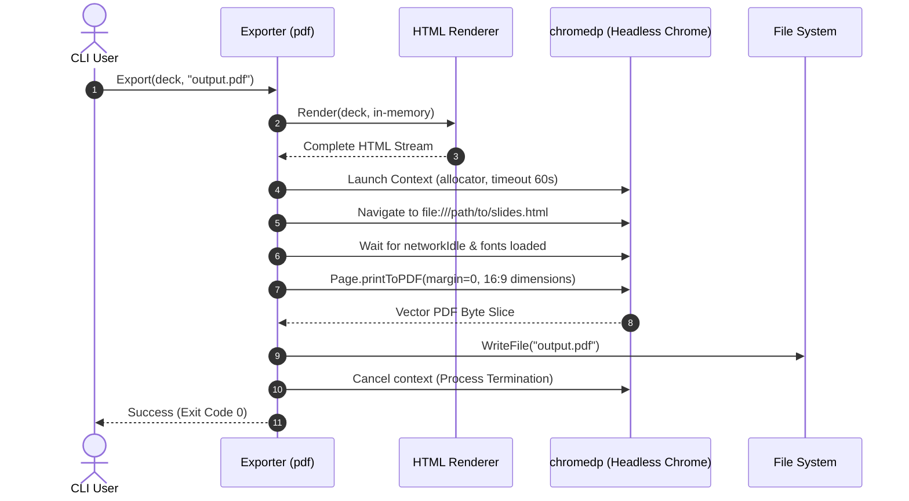
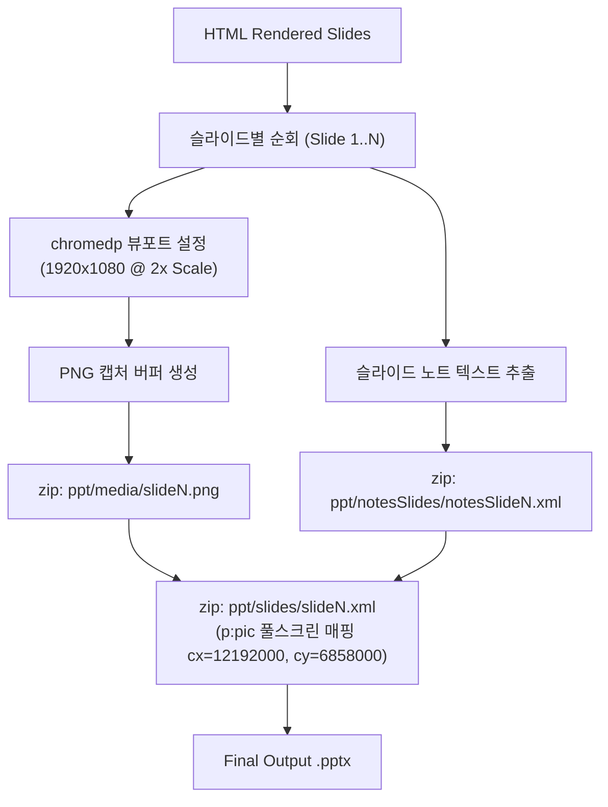

# 5. 다중 포맷 렌더링 및 익스포트 파이프라인 (Pipelines)

## 5.1 기술 스택 및 라이브러리 선정 근거 (Tech Stack)

Goslide는 **CGO를 100% 배제한 순수 Go(Pure Go)** 기반으로 컴파일되어 완벽한 크로스 플랫폼 단일 바이너리 배포를 달성합니다.

| 분류 | 채택 기술 / 라이브러리 | 버전 | 선정 배경 및 기술적 근거 |
| :--- | :--- | :--- | :--- |
| **언어 런타임** | **Go** | 1.22+ | 정적 컴파일, 초고속 빌드, 강력한 동시성 모델, `embed.FS` 내장 |
| **CLI 프레임워크** | `github.com/spf13/cobra` | v1.8+ | 사실상의 업계 표준 POSIX CLI 엔진, 플래그 바인딩 안정성 |
| **마크다운 AST 파서** | `github.com/yuin/goldmark` | v1.7+ | CommonMark 완벽 준수, 고성능 AST 조작, GFM 확장, CGO 무의존 |
| **YAML 파서** | `gopkg.in/yaml.v3` | v3.0+ | Frontmatter YAML 파싱의 신뢰성, 엄격한 구조체 언마샬링 |
| **구문 강조 엔진** | `github.com/alecthomas/chroma/v2` | v2.14+ | 순수 Go 코드 하이라이터 (Pygments 호환), CGO 없는 단일 바이너리 |
| **Headless 브라우저 제어** | `github.com/chromedp/chromedp` | v0.9+ | Chrome DevTools Protocol(CDP) 직결 제어, WebDriver 종속성 없음 |
| **파일 감시 엔진** | `github.com/fsnotify/fsnotify` | v1.7+ | OS 네이티브 파일 이벤트 감시, 개발 서버 Hot Reload 구현 |
| **실시간 핫 리로드** | 표준 라이브러리 `net/http` (SSE) | Go 표준 | 브라우저 EventSource와 표준 HTTP 단방향 스트리밍(SSE) |
| **OpenXML 압축** | 표준 라이브러리 `archive/zip` | Go 표준 | PPTX OPC 패키지 압축/해제를 CGO 없이 표준 스트리밍 처리 |

---

## 5.2 HTML 렌더러 파이프라인 ([`internal/renderer/html`](../../internal/renderer/html))

1. **템플릿 바인딩**:
   - `embed.FS`를 통해 내장된 슬라이드 레이아웃 템플릿과 CSS(`deck-canvas.css`, `deck-content.css`, `presenter.css`) 및 Svelte 5 컴파일 번들을 로드합니다.
2. **웹 표준 이미지 경로 보존**:
   - 로컬 이미지는 마크다운 원본의 상대 경로(``)를 웹 표준 그대로 유지합니다.
   - 단일 파일 공유가 필요한 경우 HTML 내에 억지로 이미지를 Base64로 인라인하지 않고, 폴더 압축(`zip`)이나 PDF/PPTX 변환을 활용합니다.
3. **레이어 분리형 아키텍처**:
   - 슬라이드 캔버스는 순수 Go 템플릿으로 `#goslide-deck` 내부에 렌더링되며, Svelte 5 프런트엔드 애플리케이션은 독립된 `

`에 마운트되어 상호 간섭이 원천 차단됩니다.

---

## 5.3 PDF 익스포터 파이프라인 ([`internal/exporter/pdf`](../../internal/exporter/pdf))

`chromedp`를 활용하여 생성된 HTML 슬라이드를 로컬 헤드리스 크롬에서 렌더링 후 벡터 PDF로 인쇄합니다.

---

## 5.4 PPTX 익스포터 파이프라인 ([`internal/exporter/pptx`](../../internal/exporter/pptx))

브라우저 뷰포트와의 100% 시각적 일치(Pixel-Perfect)를 위해 **고해상도 캡처 이미지 매핑 방식**을 채택하며, 발표자 노트 텍스트를 네이티브 XML로 보존합니다.

* **슬라이드 크기 정밀 매핑**: 16:9 기준 $12,192,000 \times 6,858,000\text{ EMU}$로 OpenXML 규격을 준수합니다.
* **OpenXML OPC 구조 보존**: `[Content_Types].xml`, `_rels/.rels`, `ppt/presentation.xml`을 Go 표준 `archive/zip`으로 패키징합니다.

---

## 5.5 관련 문서

* **[`04-interfaces-and-contracts.md`](./04-interfaces-and-contracts.md)**: `model.Renderer` 및 `model.Exporter` 인터페이스
* **[`06-runtime-security-and-lifecycle.md`](./06-runtime-security-and-lifecycle.md)**: chromedp 프로세스 라이프사이클 및 좀비 프로세스 방지 정책
* **[`docs/layout-design.md`](../layout-design.md)**: 1920×1080 고정 캔버스 레이아웃 명세
