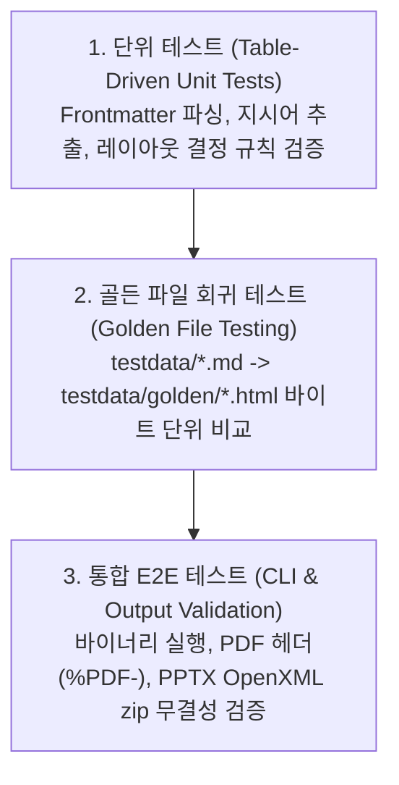

# 7. 운영 명세, 종료 코드 및 CI/CD 파이프라인 (Operations & CI/CD)

## 7.1 CLI 표준 종료 코드 (Exit Codes)

호출자(쉘 스크립트, CI/CD 러너 등)가 실패 원인을 즉시 식별할 수 있도록 명확한 종료 코드를 정의합니다:

| Exit Code | 식별자 | 발생 시나리오 |
| :---: | :--- | :--- |
| **`0`** | `ExitSuccess` | 정상 변환 및 커맨드 수행 완료 |
| **`1`** | `ExitGeneralError` | 분류되지 않은 일반 런타임 패닉/오류 |
| **`2`** | `ExitInvalidUsage` | 잘못된 CLI 플래그 조합, 누락된 필수 인자 |
| **`3`** | `ExitFileNotFound` | 입력 마크다운 파일 미존재, 에셋 경로 부재 |
| **`4`** | `ExitParseError` | YAML Frontmatter 파싱 실패 또는 마크다운 문법 오류 |
| **`5`** | `ExitExportFailed` | `chromedp` 구동 실패, PDF 인쇄 실패, PPTX zip 패키징 오류 |

---

## 7.2 빌드 자동화 ([`Makefile`](../../Makefile))

CGO를 완전히 끈 상태로 정적 링크 바이너리를 컴파일합니다:

```makefile
.PHONY: build build-web test lint clean release golden-update

BINARY_NAME=goslide
VERSION?=$(shell git describe --tags --always --dirty 2>/dev/null || echo "dev")
LDFLAGS=-ldflags "-s -w -X main.version=$(VERSION)"

build-web:
	cd web && npm run build

build: build-web
	CGO_ENABLED=0 go build $(LDFLAGS) -o bin/$(BINARY_NAME) ./cmd/goslide

test:
	go test -v -race -cover ./...

golden-update:
	go test -v ./internal/renderer/html -update

lint:
	golangci-lint run
	test -z "$$(gofmt -l .)"
	go vet ./...
```

---

## 7.3 테스트 전략 피라미드 (Testing Pyramid)



1. **테이블 기반 단위 테스트**: 파서, 지시어 파서, 레이아웃 결정기 등의 순수 함수를 검증합니다.
2. **골든 파일 회귀 테스트**: HTML 생성 결과물을 `testdata/golden/*.html`과 비교 검증하며, `-update` 플래그로 갱신합니다.
3. **통합 E2E 테스트**: 실제 빌드된 바이너리를 구동하여 출력 파일의 헤더 및 OpenXML zip 구조를 검증합니다.

---

## 7.4 배포 및 릴리즈 파이프라인 (GoReleaser + GitHub Actions)

* **크로스 컴파일 매트릭스**:
  - `linux/amd64`, `linux/arm64`
  - `darwin/amd64`, `darwin/arm64` (Apple Silicon)
  - `windows/amd64`
* **단일 바이너리 패키징**:
  - GoReleaser를 통해 Git 태그 푸시 시 각 OS/아키텍처별 아카이브(`.tar.gz`, `.zip`) 및 Checksum(`checksums.txt`)을 자동 생성하여 GitHub Releases에 배포합니다.

---

## 7.5 관련 문서

* **[`03-package-structure-and-c4.md`](./03-package-structure-and-c4.md)**: 패키지 구조 및 `cmd/goslide` CLI 계층
* **[`04-interfaces-and-contracts.md`](./04-interfaces-and-contracts.md)**: 센티넬 에러 체계
* **[`06-runtime-security-and-lifecycle.md`](./06-runtime-security-and-lifecycle.md)**: 브라우저 익스포트 타임아웃 및 프로세스 정리
