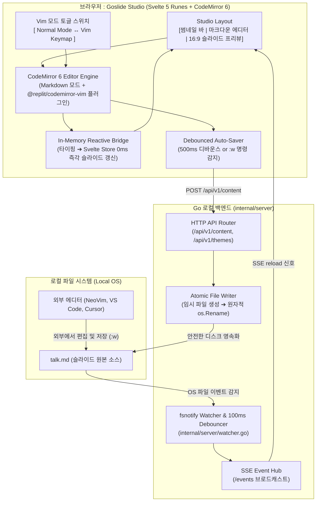

# Serve 모드 내장 웹 에디터 및 Vim 모드 아키텍처 설계서 (Embedded Editor & Vim Mode)

본 문서는 `goslide serve` 로컬 개발 서버 환경에서 사용자가 별도의 데스크톱 에디터(VS Code 등)에 의존하지 않고, **웹 브라우저 단독으로 구글 슬라이드처럼 마크다운을 편집하고 16:9 와이드스크린 슬라이드를 실시간 확인·제어할 수 있는 "Goslide Studio(내장 웹 에디터)" 및 네이티브 Vim 모드**의 아키텍처와 엔지니어링 명세를 정의합니다.

---

## 1. 개요 및 비전 (Overview & Vision)

Goslide의 핵심 철학은 **"외부 의존성 제로(CGO 0%, Node 0%)의 단일 정적 바이너리"**입니다. 

Marp처럼 특정 에디터(VS Code)의 확장에 종속되는 방식은 비-VS Code 사용자(Vim, Emacs, JetBrains, 메모장, 태블릿 사용자)를 배제하게 됩니다. 반면 `goslide serve` 내부에 **초경량 웹 마크다운 에디터와 네이티브 Vim 키바인딩 모드**를 내장하면:

1. **에디터 무관 100% 독립성**: 터미널에서 바이너리 하나만 실행하면 브라우저에 완결된 슬라이드 제작 스튜디오가 열립니다.
2. **Vim 개발자의 거부감 0%**: Obsidian이 성공한 핵심 요인인 `@replit/codemirror-vim`을 탑재하여, 브라우저 안에서도 손가락이 기억하는 `:w`, `dd`, `ci"`, `yy`, `p` 단축키를 네이티브로 제공합니다.
3. **디스크 I/O 병목이 없는 메모리 직결 렌더링**: 에디터 타이핑이 디스크 저장-감시 루프를 거치지 않고 브라우저 메모리 내에서 0ms로 슬라이드 뷰에 즉각 반영됩니다.
4. **하이브리드 유연성**: 내장 에디터를 써도 되고, 기존처럼 터미널 외부 Vim이나 Cursor에서 파일을 고쳐도 기존 `watcher.go`가 감지하여 양방향으로 동기화됩니다.

---

## 2. 시스템 아키텍처 및 듀얼 모드 흐름 (Dual-Engine Architecture)



---

## 3. 세부 설계 명세 (Specification)

### 3.1 UI 레이아웃 구조 (3-Pane Studio Layout)

```
┌────────────────────────────────────────────────────────────────────────────────────────┐
│ 🖥️ GOSLIDE STUDIO     [Theme: Clean ▾] [Vim: ON/OFF]   [ 👁️ Fullscreen ] [ 💾 Export ▾]│
├─────────────────────────┬─────────────────────────────────┬────────────────────────────┤
│ [ 슬라이드 썸네일 바 ]  │ [ 마크다운 에디터 (CodeMirror) ]│ [ 16:9 슬라이드 프리뷰 ]   │
│                         │                                 │                            │
│ ┌─────────────────────┐ │ 1: ---                          │ ┌────────────────────────┐ │
│ │ 1. Cover Slide      │ │ 2: theme: clean                 │ │                        │ │
│ └─────────────────────┘ │ 3: ---                          │ │   Microservices Core   │ │
│ ┌─────────────────────┐ │ 4: # Microservices Core         │ │                        │ │
│ │ 2. Architecture     │ │ 5:                              │ └────────────────────────┘ │
│ └─────────────────────┘ │ 6: • Pipeline Decoupling        │ [ 툴바: 슬라이드 하단 ]    │
│ ┌─────────────────────┐ │ 7: • Zero-Node Portability      │ [🔴][🔵][🟢] [얇게][보통]  │
│ │ 3. Deployment       │ │ 8:                              │                            │
│ └─────────────────────┘ │ 9: <!-- note: 발표 대본 메모 -->│ Slide 1 / 12  [Next Slide] │
└─────────────────────────┴─────────────────────────────────┴────────────────────────────┘
```

1. **좌측 썸네일 바 (Slide Navigator)**:
   * 슬라이드별 미니 썸네일 카드 나열.
   * 클릭 시 에디터 커서가 해당 슬라이드의 `---` 줄로 점프하며, 우측 프리뷰도 해당 슬라이드로 이동.
2. **중앙 에디터 (Markdown + Vim)**:
   * CodeMirror 6 기반 마크다운 구문 강조 에디터.
   * 우측 상단 토글로 Vim 모드 즉시 ON/OFF 전환.
3. **우측 슬라이드 프리뷰**:
   * 에디터에서 타이핑하는 내용이 메모리 상에서 실시간 렌더링.
   * 앞서 개발된 [GOS-15](https://joincdream.atlassian.net/browse/GOS-15)의 하단 플로팅 툴바(판서/레이저)가 슬라이드 아래 여백에 배치되어 즉시 시연 가능.

---

### 3.2 CodeMirror 6 및 네이티브 Vim 모드 연동

Obsidian과 동일한 검증된 스택인 `@replit/codemirror-vim`을 채택합니다:

```javascript
// web/src/components/studio/EditorPane.svelte
import { onMount } from 'svelte';
import { EditorView, basicSetup } from 'codemirror';
import { markdown } from '@codemirror/lang-markdown';
import { vim, Vim } from '@replit/codemirror-vim';
import { Compartment } from '@codemirror/state';

let editorContainer;
let view;
let isVimMode = $state(true);
const vimCompartment = new Compartment();

// :w 및 :write 커맨드 인터셉트
Vim.defineEx('write', 'w', () => {
  saveContentImmediately();
});

function initEditor(initialText) {
  view = new EditorView({
    doc: initialText,
    extensions: [
      basicSetup,
      markdown(),
      vimCompartment.of(isVimMode ? vim() : []),
      EditorView.updateListener.of((update) => {
        if (update.docChanged) {
          const newContent = update.state.doc.toString();
          // 1. 메모리 직결 프리뷰 갱신 (0ms 지연)
          deck.updateContentFromEditor(newContent);
          // 2. 백그라운드 500ms 디바운스 자동 저장
          scheduleAutoSave(newContent);
        }
      })
    ],
    parent: editorContainer
  });
}

export function toggleVimMode(enabled) {
  isVimMode = enabled;
  view.dispatch({
    effects: vimCompartment.reconfigure(isVimMode ? vim() : [])
  });
}
```

---

### 3.3 백엔드 REST API 명세 (`internal/server/api.go`)

Goslide의 내장 HTTP 서버에 다음 경량 엔드포인트를 추가합니다:

| 엔드포인트 | 메서드 | 설명 | 요청/응답 페이로드 |
| :--- | :---: | :--- | :--- |
| `/api/v1/content` | `GET` | 현재 슬라이드 마크다운 원문 스트림 반환 | `text/markdown` 원문 텍스트 |
| `/api/v1/content` | `POST` | 에디터에서 수정한 마크다운 원자적 저장 | Body: `text/markdown`, Resp: `{"status":"ok","bytes":1420}` |
| `/api/v1/status` | `GET` | 서버 상태, 파일 경로, 테마 목록 정보 | JSON: `{ filePath: "talk.md", theme: "clean" }` |

#### 원자적 파일 쓰기 보장 (Atomic File Write)
편집 도중 시스템 충돌이나 전원 차단으로 원본 파일이 깨지는 것을 방지하기 위해 임시 파일 생성 후 Rename 패턴을 적용합니다:

```go
// internal/server/api.go
func (s *Server) handleSaveContent(w http.ResponseWriter, r *http.Request) {
    body, err := io.ReadAll(r.Body)
    if err != nil {
        http.Error(w, "failed to read payload", http.StatusBadRequest)
        return
    }

    // 1. 임시 파일 작성
    tempFile := s.targetFilePath + ".tmp." + strconv.FormatInt(time.Now().UnixNano(), 10)
    if err := os.WriteFile(tempFile, body, 0644); err != nil {
        http.Error(w, "failed to write temp file", http.StatusInternalServerError)
        return
    }

    // 2. 파일 감시기가 자신의 저장 이벤트를 무한 루프로 처리하지 않도록 플래그 억제
    s.suppressWatcherOnce = true

    // 3. 원자적 파일 교체 (Atomic Rename)
    if err := os.Rename(tempFile, s.targetFilePath); err != nil {
        _ = os.Remove(tempFile)
        http.Error(w, "failed to atomic rename file", http.StatusInternalServerError)
        return
    }

    w.WriteHeader(http.StatusOK)
    _ = json.NewEncoder(w).Encode(map[string]any{"status": "ok", "size": len(body)})
}
```

---

## 4. 슬라이드 단위 커서 추적 및 동기화 (Cursor-to-Slide Mapping)

1. **커서 이동 ➔ 슬라이드 포커스 점프**:
   * 에디터에서 커서가 이동할 때(`selectionChange`), 현재 커서 위치의 상위에 있는 가장 가까운 `---` 구분자의 개수를 세어 현재 `slideIndex`를 산출합니다.
   * 우측 슬라이드 프리뷰가 해당 슬라이드로 부드럽게 자동 스크롤(Auto-focus)됩니다.
2. **슬라이드 클릭 ➔ 에디터 라인 점프**:
   * 우측 프리뷰 또는 좌측 썸네일에서 슬라이드를 클릭하면, 에디터의 커서가 해당 슬라이드의 시작 라인(`---` 다음 줄)으로 즉시 점프합니다.

---

## 5. 단계별 실행 계획 (5-Phase Execution Plan)

| 단계 | 작업 내용 | 대상 파일 |
| :---: | :--- | :--- |
| **Phase 1** | **백엔드 REST API 구현**<br>• `GET/POST /api/v1/content` 엔드포인트 구현<br>• 원자적 파일 쓰기 및 watcher 연쇄 감지 억제 플래그 추가 | `internal/server/server.go`<br>`internal/server/api.go` |
| **Phase 2** | **CodeMirror 6 및 Vim 모드 컴포넌트 개발**<br>• `@replit/codemirror-vim` 연동 및 `:w` 커맨드 인터셉트<br>• Vim/Normal 모드 토글 상태 관리 | `web/src/components/studio/EditorPane.svelte`<br>`web/package.json` |
| **Phase 3** | **Studio 3-Pane 레이아웃 구축**<br>• 썸네일 네비게이터, 에디터, 16:9 슬라이드 프리뷰 통합<br>• 반응형 스플릿 바(Splitter) 리사이즈 지원 | `web/src/components/studio/StudioLayout.svelte`<br>`web/src/stores/studio.svelte.js` |
| **Phase 4** | **메모리 직결 반응형 렌더링 & 커서 동기화**<br>• 디스크 안 거치는 인-메모리 실시간 파싱 및 뷰포트 바인딩<br>• 에디터 커서 라인 $\leftrightarrow$ 슬라이드 인덱스 양방향 동기화 | `web/src/stores/deck.svelte.js` |
| **Phase 5** | **번들 빌드 및 E2E 기능 검증**<br>• `npm run build`로 바이너리 임베드 및 `goslide serve` 구동 검증 | `internal/theme/assets/js/goslide-core.js` |
