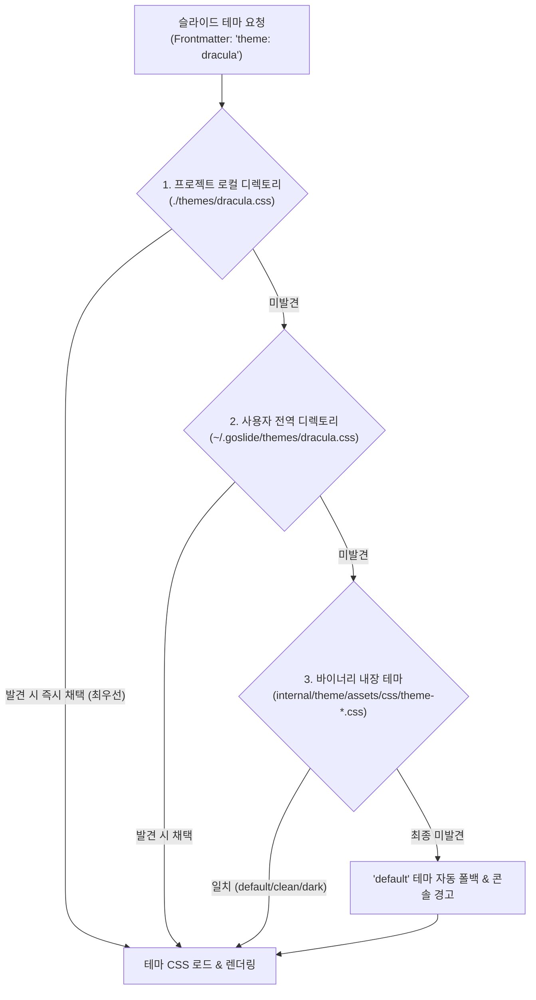
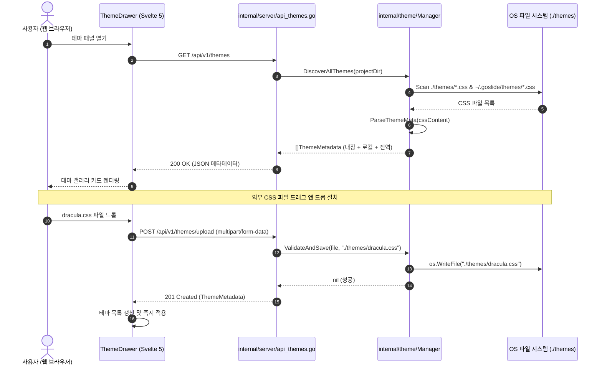

# 테마 관리 및 외부 공유 CSS 임포트 아키텍처 설계서 (Theme Management & Sharing)

본 문서는 Goslide에서 기본 내장 테마(`default`, `clean`, `dark`)를 넘어, **사용자가 직접 제작하거나 웹에서 다운로드/공유받은 CSS 테마를 프로젝트 로컬 및 전역 환경에서 체계적으로 관리하고, 구글 슬라이드처럼 웹 브라우저에서 원클릭으로 실시간 전환할 수 있는 "오픈 테마 관리 아키텍처(Theme Management Pipeline)"**의 상세 설계를 정의합니다.

---

## 1. 개요 및 설계 목표 (Goals & Vision)

프레젠테이션의 완성도를 결정짓는 가장 큰 요소 중 하나는 **"상황과 청중에 부합하는 디자인 테마"**입니다. 엔터프라이즈 환경에서는 사내 CI/CD 브랜드 컬러와 지정 폰트가 필수적이며, 기술 세미나에서는 다크 모드나 개성 있는 커뮤니티 테마가 필요합니다.

Goslide의 테마 관리 시스템은 다음 4대 핵심 목표를 달성합니다:

1. **다운로드 및 공유 테마의 제로-설정 적용**: 웹이나 슬랙으로 공유받은 `company.css`를 프로젝트 폴더에 던져두거나 브라우저에 드래그 앤 드롭하는 것만으로 즉시 적용.
2. **구글 슬라이드 스타일의 실시간 시각적 테마 갤러리**: 웹 스튜디오 UI에서 테마 카드를 클릭하는 즉시 슬라이드 전체의 색상과 폰트가 0ms로 실시간 교체.
3. **3단계 계층형 테마 탐색 (Precedence Hierarchy)**: 프로젝트 로컬 테마 $\rightarrow$ 사용자 전역 테마 $\rightarrow$ Go 바이너리 내장 테마 순으로 충돌 없이 탐색.
4. **CLI 테마 공유 및 설치 에코시스템**: `goslide theme install <URL>` 명령으로 GitHub나 웹 상의 테마를 단 한 줄로 설치.

---

## 2. 테마 탐색 계층 및 우선순위 (Theme Resolution Hierarchy)

테마 이름(예: `theme: dracula-pro`)을 해석할 때 Go 백엔드는 다음 순서로 엄격하게 우선순위를 적용하여 탐색합니다:



| 탐색 순위 | 스코프 | 경로 위치 | 용도 및 시나리오 |
| :---: | :--- | :--- | :--- |
| **Tier 1** | **프로젝트 로컬** | `./themes/*.css` 또는 `../themes/*.css` | 특정 발표 덱 전용 커스텀 스타일, 특정 고객사용 제안서 테마 |
| **Tier 2** | **사용자 전역** | `~/.goslide/themes/*.css` (`$HOME/.goslide/themes/`) | 사용자가 자주 쓰는 선호 테마, 사내 표준 테마 라이브러리 |
| **Tier 3** | **바이너리 내장** | `internal/theme/assets/css/theme-*.css` | Go 바이너리에 `embed.FS`로 번들된 기본 테마 (`default`, `clean`, `dark`) |

---

## 3. 표준 테마 메타데이터 규격 (Theme CSS Specification)

외부에서 다운로드받거나 공유할 테마 CSS 파일은 상단에 **표준 메타데이터 주석 블록**을 포함할 수 있습니다. Goslide의 파서는 이 블록을 읽어 웹 UI에 썸네일, 저자 정보, 컬러 팔레트 뱃지를 자동으로 렌더링합니다:

```css
/**
 * @theme dracula-pro
 * @name Dracula Pro
 * @author Goslide Community <hello@goslide.dev>
 * @version 1.2.0
 * @description 엔지니어링 및 다크 모드 발표에 최적화된 고대비 바이올렛 테마
 * @palette #282a36, #bd93f9, #50fa7b, #ff79c6
 * @font Fira Code, Pretentard, sans-serif
 * @license MIT
 */

/* ==========================================================================
   Goslide Custom Theme Styles
   ========================================================================== */
.slide-card {
  background-color: #282a36;
  color: #f8f8f2;
  font-family: 'Fira Code', 'Pretendard', sans-serif;
}

.slide-card h1, .slide-card h2 {
  color: #bd93f9;
}

.slide-card strong {
  color: #ff79c6;
}

.slide-card code {
  color: #50fa7b;
  background-color: #44475a;
}
```

* **`@theme`**: 마크다운 Frontmatter에서 지정할 고유 식별자 ID (소문자, 숫자, 하이픈 권장).
* **`@name`**: 웹 UI에 표시될 인간 친화적 테마 이름.
* **`@palette`**: 쉼표로 구분된 2~4개의 대표 헥스(HEX) 컬러 코드 (웹 UI 테마 카드 프리뷰 원형 뱃지로 자동 표시).
* **`@font`**: 테마에서 사용하는 권장 폰트 목록.

---

## 4. 웹 스튜디오 테마 관리 UI (Studio Theme Drawer)

Google Slides의 테마 패널처럼, `goslide serve` 웹 화면 우측(또는 상단)에 **슬라이드 테마 드로어(Theme Drawer)**를 제공합니다:

```
┌────────────────────────────────────────────────────────┐
│ 🎨 THEMES (테마 선택 및 관리)                     [✕]  │
├────────────────────────────────────────────────────────┤
│ [ ⬇️ 테마 CSS 파일 드래그 앤 드롭으로 설치 ]           │
│                                                        │
│ ┌────────────────────────────────────────────────────┐ │
│ │ 🌟 Clean (Default) [내장]                   [선택됨]│ │
│ │ 간결하고 현대적인 라이트 비즈니스 테마             │ │
│ │ 🎨 [ #ffffff ] [ #0284c7 ] [ #0f172a ]             │ │
│ └────────────────────────────────────────────────────┘ │
│ ┌────────────────────────────────────────────────────┐ │
│ │ 🌙 Dark Slate [내장]                         [적용]│ │
│ │ 시선 피로를 줄여주는 엔지니어링 다크 테마          │ │
│ │ 🎨 [ #0f172a ] [ #38bdf8 ] [ #f8fafc ]             │ │
│ └────────────────────────────────────────────────────┘ │
│ ┌────────────────────────────────────────────────────┐ │
│ │ 🟣 Dracula Pro [로컬: ./themes/dracula.css]  [적용]│ │
│ │ 고대비 바이올렛 개발자 컨퍼런스 테마               │ │
│ │ 🎨 [ #282a36 ] [ #bd93f9 ] [ #50fa7b ]             │ │
│ └────────────────────────────────────────────────────┘ │
└────────────────────────────────────────────────────────┘
```

### 4.1 핵심 UI 인터랙션
1. **원클릭 실시간 전환 (0ms CSS Hot-Swap)**:
   * 테마 카드의 `[적용]` 버튼을 클릭하면, 브라우저의 `<style id="goslide-theme-styles">` 내부 CSS를 즉시 교체하여 슬라이드가 새로고침 없이 즉각 변경됩니다.
2. **마크다운 Frontmatter 자동 업데이트**:
   * 테마를 선택하면 에디터의 마크다운 상단에 `theme: dracula-pro`를 자동으로 갱신(또는 주입)하여 파일 저장 시 영속화됩니다.
3. **드래그 앤 드롭 테마 파일 설치**:
   * 웹 브라우저의 테마 패널에 다운로드받은 `nord.css`를 드래그하여 놓으면, 백엔드 API(`/api/v1/themes/upload`)로 자동 전송되어 `./themes/nord.css`에 저장되고 즉시 새 테마 카드로 등록됩니다.

---

## 5. 백엔드 테마 API 및 아키텍처 (`internal/theme`)

기존의 정적 `theme.Manager` 구조체를 확장하여 동적 파일 탐색 및 업로드 처리를 전담합니다:



### 5.1 REST API 엔드포인트 명세
* `GET /api/v1/themes`: 사용 가능한 모든 테마 목록 및 메타데이터(이름, 설명, 팔레트, 스코프) 반환.
* `GET /api/v1/themes/:name/css`: 지정된 테마의 전체 조합 CSS 반환.
* `POST /api/v1/themes/upload`: 새 CSS 파일을 프로젝트 `./themes/` 디렉토리에 업로드 저장.

### 5.2 보안 가드레일 (Security Guardrails)
1. **경로 탈출(Path Traversal) 차단**:
   * 테마 이름은 영문 소문자, 숫자, 하이픈(`^[a-z0-9-]+$`)만 허용하며 `../` 또는 절대 경로 문자열 유입 시 `400 Bad Request` 즉시 차단.
2. **MIME 타입 및 확장자 검증**:
   * 오직 `.css` 확장자 및 텍스트 파일만 허용하며, 실행 파일(바이너리, 쉘 스크립트) 유입을 원천 차단.
3. **용량 제한**:
   * 업로드 테마 파일 크기는 최대 2MB로 제한하여 DoS 공격 방지.

---

## 6. CLI 테마 관리 명령어 체계

터미널 환경을 선호하는 엔지니어를 위해 직관적인 CLI 하위 명령어를 제공합니다:

```bash
# 1. 설치된 모든 테마 목록 확인 (로컬, 전역, 내장)
$ goslide theme list
AVAILABLE THEMES:
  [Built-in]
  • default     - Modern clean light theme (Default)
  • clean       - Minimalist monochrome presentation
  • dark        - High-contrast dark slate theme

  [Project: ./themes]
  • dracula     - Dracula Pro dark violet engineering theme

  [Global: ~/.goslide/themes]
  • company     - Acme Corp official branding theme

# 2. 웹/GitHub에서 공유받은 테마 즉시 설치
$ goslide theme install https://github.com/goslide-themes/nord/raw/main/nord.css
✓ Successfully installed theme 'nord' to ./themes/nord.css

# 3. 사용자 전역(~/.goslide/themes)으로 설치
$ goslide theme install ./my-style.css --global
✓ Successfully installed global theme 'my-style' to ~/.goslide/themes/my-style.css
```

---

## 7. 단계별 실행 계획 (5-Phase Execution Plan)

| 단계 | 작업 내용 | 대상 파일 |
| :--- : | :--- | :--- |
| **Phase 1** | **테마 메타데이터 파서 및 다층 탐색기 구현**<br>• `@theme`, `@palette` 메타데이터 주석 파싱<br>• 로컬/전역/내장 3계층 탐색 엔진 구축 | `internal/theme/meta.go`<br>`internal/theme/manager.go` |
| **Phase 2** | **백엔드 테마 REST API 구축**<br>• `GET /api/v1/themes`, `POST /api/v1/themes/upload`<br>• 경로 탈출 방지 및 파일 유효성 검증 | `internal/server/api_themes.go`<br>`internal/server/server.go` |
| **Phase 3** | **웹 스튜디오 테마 드로어(Theme Drawer) UI 개발**<br>• 테마 카드 갤러리 및 컬러 팔레트 뱃지 컴포넌트<br>• 드래그 앤 드롭 파일 업로더 구현 | `web/src/components/studio/ThemeDrawer.svelte`<br>`web/src/stores/theme.svelte.js` |
| **Phase 4** | **원클릭 실시간 CSS 핫스왑 & Frontmatter 연동**<br>• 0ms 스타일 시트 즉시 교체 파이프라인<br>• 에디터 마크다운 `theme:` 자동 동기화 | `web/src/components/DeckViewport.svelte`<br>`web/src/stores/deck.svelte.js` |
| **Phase 5** | **CLI `goslide theme` 명령어군 연동**<br>• `theme list`, `theme install` CLI 커맨드 구현 | `cmd/goslide/theme.go` |
