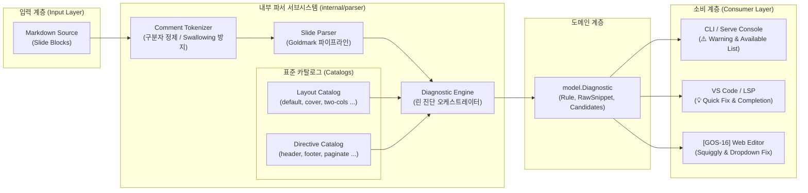
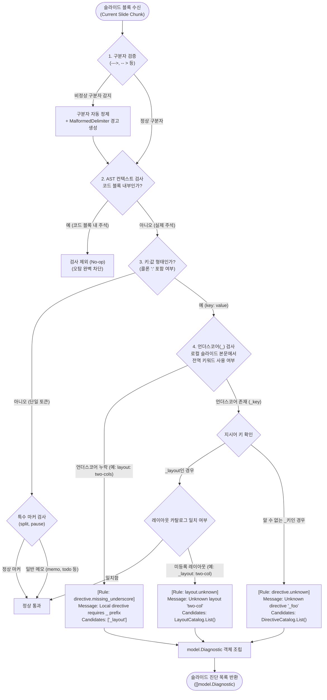

# Goslide 확장 DSL 진단 및 후보군 가이드 엔진 (DSL Diagnostic & Guiding Engine)

## 1. 개요 및 설계 철학 (Executive Summary & Philosophy)

Goslide의 슬라이드 레이아웃, 배경, 테마, 화면 분할 등 고유 확장 기능은 **HTML 주석(`<!-- ... -->`) 기반의 DSL(Domain-Specific Language)**로 정의됩니다. HTML 주석의 특성상 문법 오류나 오타가 발생해도 브라우저 화면에 에러가 노출되지 않고 조용히 기본값으로 폴백(Silent Fallback)되어, 사용자가 디버깅에 시간을 허비하는 문제가 존재했습니다.

본 문서는 이러한 사각지대를 해소하되, 과도한 추론 엔진(Heavyweight Heuristics)으로 인한 코드 복잡도를 배제하고 **"정확한 위치 지목(Location) + 정형화된 후보군 리스트(Candidate Listing)"**를 제공하는 **린(Lean) 진단 엔진**의 종합 설계서입니다.

### 핵심 설계 원칙
1. **Fact & Location First (과도한 추측 배제, 정확한 팩트 전달)**:
   - 시스템이 자의적으로 의도를 넘겨짚는 복잡한 휴리스틱/자가치유 알고리즘(Levenshtein 거리 계산 등)을 배제합니다.
   - "어디에서(Slide & Line), 무엇이 틀렸는지(Raw Snippet)"를 정확히 짚어주고, 사용 가능한 **허용 후보군 목록(`Candidates []string`)**을 명확히 제시하여 최종 판단과 교정은 개발자가 직접 수행하도록 돕습니다.
2. **Slide-Block Scope Inspection (슬라이드 블록 단위 무상태 검토)**:
   - 수정된 글자/라인만 쪼개서 검사하는 복잡한 증분 파싱(Incremental Parsing) 대신, 슬라이드 경계(`---`) 안의 **"해당 슬라이드 블록 전체"**를 하나의 단위로 검토합니다.
   - 슬라이드 1장은 수십 줄(1~2KB)에 불과하므로 스캔 오버헤드가 0.01ms 미만이며, 슬라이드 내 지시어 간의 상호작용(`layout: two-cols`와 `split` 마커의 쌍 정합성) 및 정확한 라인 오프셋을 안정적으로 보정합니다.
3. **LSP & VS Code Native Integration (정형화된 데이터 모델)**:
   - 에러 메시지에 후보군을 텍스트로 뭉뚱그려 넣지 않고, `Candidates []string` 슬라이스로 정규화하여 제공합니다.
   - 이는 향후 VS Code 확장(LSP: Language Server Protocol) 연계 시 정규식 파싱(Regex Scraping) 없이 **`CodeAction` (💡 Quick Fix) 및 `CompletionItem` (자동 완성)**으로 1:1 직결 매핑됩니다.
4. **False-Positive Zero (오탐 방지)**:
   - 마크다운 코드 블록(```html, ```markdown) 내부의 예제 주석을 슬라이드 지시어로 오인하지 않도록 마크다운 AST 컨텍스트를 분리하고, 일반 메모용 주석(`<!-- memo: ... -->`)을 지시어 에러로 잘못 경고하지 않습니다.

---

## 2. 2단계 시각화 아키텍처 (Two-Level Visualization Architecture)

시스템 구성 컴포넌트 간의 책임 분리(Level 1)와 슬라이드 블록 단위의 동적 검사 파이프라인(Level 2)을 시각화합니다.

---

### [Level 1] 시스템 컴포넌트 아키텍처 (Component Architecture View)



#### 컴포넌트별 핵심 책임
- **Comment Tokenizer**: 비정상 닫기(`--->`) 정제 및 미종료 주석(`-- >`) 사전 격리로 슬라이드 본문 증발(Swallowing) 원천 차단.
- **Diagnostic Engine**: 코드 블록을 제외한 실제 주석을 순회하며 언더스코어(`_`) 누락 및 미등록 레이아웃/지시어 검출.
- **Catalogs**: Goslide 표준 규격에서 지원하는 레이아웃 및 지시어 목록을 슬라이스로 관리.
- **Consumer Layer**: `Candidates` 슬라이스를 활용하여 CLI에서는 텍스트 목록으로 출력하고, VS Code/에디터에서는 💡 빠른 수정 목록으로 렌더링.

---

### [Level 2] 슬라이드 블록 검사 파이프라인 (Slide-Block Pipeline View)

슬라이드 1개 블록(Chunk)이 입력되었을 때 수행되는 린(Lean) 검사 흐름입니다:



---

## 3. 진단 도메인 모델 명세 (`internal/model/diagnostic.go`)

진단 엔진이 생성하는 모든 출력은 다음 구조체로 캡슐화됩니다. 과도한 치환 텍스트나 i18n 템플릿 필드를 걷어내고, 정형화된 `Candidates` 슬라이스를 핵심으로 둡니다:

```go
package model

// DiagnosticSeverity defines the visual and execution impact of a diagnostic.
type DiagnosticSeverity string

const (
	SeverityError   DiagnosticSeverity = "error"   // 구문 미종료 등 본문 유실 위험이 있는 심각한 오류
	SeverityWarning DiagnosticSeverity = "warning" // 미지원 레이아웃/지시어로 인한 기본값 폴백 오류
	SeverityInfo    DiagnosticSeverity = "info"    // 권장 문법 및 사용 팁 안내
)

// Diagnostic represents an actionable diagnostic feedback item.
type Diagnostic struct {
	Severity   DiagnosticSeverity `json:"severity"`   // "error" | "warning" | "info"
	SlideIndex int                `json:"slideIndex"` // 1-based 슬라이드 번호
	Line       int                `json:"line"`       // 슬라이드 내 상대 줄 번호
	Rule       string             `json:"rule"`       // 진단 규칙 ("layout.unknown", "directive.missing_underscore")
	Message    string             `json:"message"`    // 명확한 팩트 메시지 (예: "Unknown layout 'two-col'")
	RawSnippet string             `json:"rawSnippet"` // 문제가 발생한 원본 텍스트 ("<!-- _layout: two-col -->")
	Candidates []string           `json:"candidates"` // 선택 가능한 유효 옵션 목록 (VS Code CodeAction 및 자동완성 연계용)
}
```

---

## 4. 슬라이드 블록(Slide-Block) 검토 단위 채택 이유

수정된 글자/라인 단위의 증분(Delta) 검사 대신 **"해당 슬라이드 블록 전체"**를 하나의 검토 단위로 채택한 기술적 근거는 다음과 같습니다:

1. **지시어 간 상호작용 및 정합성 보장 (Contextual Integrity)**:
   - `<!-- _layout: two-cols -->` 선언과 슬라이드 중간의 `<!-- split -->` 마커는 상호 종속적입니다.
   - 슬라이드 블록 전체를 함께 조회해야 분할 화면 구성 시 마커 누락이나 오타를 문맥에 맞게 정확히 진단할 수 있습니다.
2. **초경량 처리 성능 (Near-Zero Overhead)**:
   - 슬라이드 1장의 텍스트는 평균 1~2KB에 불과하여, Go의 인메모리 렉서/스캐너로 블록 전체를 재검토하는 데 **0.01ms(10 마이크로초) 미만**이 소요됩니다.
   - 복잡한 AST 캐시 트리나 증분 파서(Incremental Diff Parser)의 상태 불일치 버그를 유발할 실익이 전혀 없습니다.
3. **정확한 상대 라인 번호(Line Offset) 동기화**:
   - 슬라이드 시작 경계(`---`)를 기준으로 상대 라인 번호를 오차 없이 산출하여 터미널 경고 및 에디터 밑줄(Squiggly) 위치를 일치시킵니다.

---

## 5. 소비자 계층(Consumer Layer) 표현 및 VS Code(LSP) 연계

정형화된 `Candidates []string` 필드는 소비 환경에 따라 다음과 같이 자연스럽게 매핑됩니다.

### 5.1 CLI / `goslide serve` 터미널 출력 포맷
추측성 문구 대신, **"위치(Where) + 원문(What) + 선택 가능한 후보군(Candidates)"**을 깔끔하게 출력합니다:

```text
[goslide] ⚠️  Slide 3 (Line 2): Unknown layout "two-col"
          Raw: "<!-- _layout: two-col -->"
          Available layouts: [default, cover, two-cols, split, section, blank]

[goslide] ⚠️  Slide 2 (Line 1): Local directive missing underscore prefix
          Raw: "<!-- layout: two-cols -->"
          Available directives: ["_layout"]
          (Slide-local directives must start with an underscore)
```

### 5.2 VS Code 확장 (LSP: Language Server Protocol) 연계
정형화된 `Candidates` 슬라이스는 VS Code 확장에서 추가 정규식 파싱(Regex Scraping) 없이 즉시 표준 LSP 기능으로 전환됩니다:

1. **LSP `CodeAction` (💡 빠른 수정 / Quick Fix)**:
   - VS Code에서 경고 밑줄에 노란 전구(💡)를 클릭했을 때, `Candidates`의 각 요소를 순회하여 원클릭 교체 액션을 자동 생성합니다.
   ```typescript
   // VS Code LSP CodeAction Provider 예시
   function provideCodeActions(diagnostic: Diagnostic): vscode.CodeAction[] {
       return diagnostic.candidates.map(candidate => {
           const action = new vscode.CodeAction(`Change to '${candidate}'`, vscode.CodeActionKind.QuickFix);
           action.edit = createTextEdit(diagnostic.line, candidate);
           return action;
       });
   }
   ```
2. **LSP `CompletionItem` (자동 완성)**:
   - 사용자가 `_layout: `을 입력할 때 에디터에 팝업되는 자동 완성 카탈로그를 진단 엔진의 `LayoutCatalog`와 100% 동일하게 공유합니다.

### 5.3 [GOS-16] 내장 웹 에디터 연계
- `Line` 위치에 노란 밑줄(Squiggly underline) 렌더링.
- 마우스 호버 툴팁에 `Message` 표시 및 `Candidates`를 클릭 가능한 칩(Chip) 버튼으로 표시하여 원클릭 적용.
