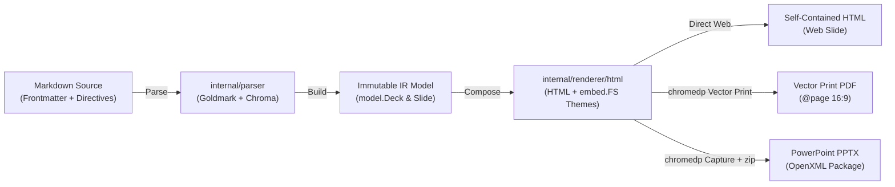

# Goslide 시스템 아키텍처 가이드 (Architecture Guide)

**Goslide**는 마크다운(Markdown) 문서를 입력받아 프레젠테이션용 웹 슬라이드(HTML), 인쇄용 벡터 문서(PDF), 고해상도 파워포인트(PPTX)로 변환하는 Go 기반의 초경량, 고성능 슬라이드 데크 빌더입니다.

본 문서는 소프트웨어 아키텍처 글로벌 표준(arc42, C4 Model, Diátaxis, OKF)에 따라 엔지니어와 AI 에이전트가 각자의 관심사에 맞게 문서를 신속하게 탐색하고 관리할 수 있도록 모듈화된 아키텍처 문서군을 안내하는 **중앙 지식 내비게이션 맵(Navigation Map)**입니다.

---

## 1. 아키텍처 모듈 지식 맵 (Architecture Knowledge Map)

모든 아키텍처 주제는 **단일 책임 원칙(Single Responsibility Principle)**에 따라 독립된 파일로 분할되어 있습니다:

| 모듈 번호 및 파일명 | 문서 Type | 핵심 주제 및 주요 내용 | 관련 코드 경로 |
| :--- | :---: | :--- | :--- |
| **[`01-principles-and-vision.md`](./01-principles-and-vision.md)** | `concept` | • 시스템 비전 및 스크린캐스트 특화 가치 • 핵심 5대 아키텍처 원칙 (단방향, 불변 IR, 무상태, DIP, Resource) | [`AGENTS.md`](../../AGENTS.md) |
| **[`02-slide-spec-and-domain-model.md`](./02-slide-spec-and-domain-model.md)** | `specification` | • 슬라이드 표현 기능 및 마크다운 지시어 DSL • 결정론적 레이아웃 결정 알고리즘 • `model.Deck` & `model.Slide` 불변 IR Go 모델 | [`internal/model/deck.go`](../../internal/model/deck.go) [`internal/parser/`](../../internal/parser/) |
| **[`03-package-structure-and-c4.md`](./03-package-structure-and-c4.md)** | `architecture` | • C4 컨테이너/컴포넌트 아키텍처 뷰 • Go 표준 패키지 레이아웃 (`cmd`, `pkg`, `internal`) • 순환 참조 방지 4대 규칙 및 `embed.FS` 정적 에셋 구조 | [`cmd/`](../../cmd/) [`internal/`](../../internal/) |
| **[`04-interfaces-and-contracts.md`](./04-interfaces-and-contracts.md)** | `contract` | • 코어 파이프라인 인터페이스 (`Parser`, `Renderer`, `Exporter`) • 도메인 계층형 센티넬 에러 및 `errors.Is`/`As` 규칙 | [`internal/model/interfaces.go`](../../internal/model/interfaces.go) [`internal/model/errors.go`](../../internal/model/errors.go) |
| **[`05-rendering-and-export-pipelines.md`](./05-rendering-and-export-pipelines.md)** | `architecture` | • 기술 스택 선정 근거 (CGO 100% 배제 순수 Go) • HTML 렌더러, PDF 벡터 인쇄, PPTX OpenXML 패키징 파이프라인 | [`internal/renderer/`](../../internal/renderer/) [`internal/exporter/`](../../internal/exporter/) |
| **[`06-runtime-security-and-lifecycle.md`](./06-runtime-security-and-lifecycle.md)** | `operations` | • chromedp Headless 브라우저 프로세스 트리 회수 (좀비 방지) • 동시성 세마포어 및 Raw HTML 보안 샌드박싱 (`--unsafe-html`) | [`internal/exporter/pdf/`](../../internal/exporter/pdf/) [`internal/parser/`](../../internal/parser/) |
| **[`07-operations-build-and-cicd.md`](./07-operations-build-and-cicd.md)** | `operations` | • 표준 CLI Exit Code 사양표 (0~5) • Makefile 빌드 자동화 및 3단계 테스트 피라미드 • GoReleaser 크로스 컴파일 및 릴리즈 파이프라인 | [`Makefile`](../../Makefile) [`cmd/goslide/`](../../cmd/goslide/) |
| **[`08-embedded-editor-and-vim-mode.md`](./08-embedded-editor-and-vim-mode.md)** | `architecture` | • `goslide serve` 내장 웹 에디터(Goslide Studio) 아키텍처 • CodeMirror 6 기반 네이티브 Vim 모드 & `:w` 자동 저장 • 메모리 직결 렌더링 & 슬라이드 커서 양방향 동기화 | [`internal/server/`](../../internal/server/) [`web/src/`](../../web/src/) |
| **[`09-theme-management-and-sharing.md`](./09-theme-management-and-sharing.md)** | `architecture` | • 로컬/전역/내장 3계층 테마 탐색 파이프라인 • 구글 슬라이드 스타일 원클릭 테마 전환 갤러리 UI • 드래그 앤 드롭 CSS 임포트 및 CLI 테마 공유/설치 | [`internal/theme/`](../../internal/theme/) [`web/src/`](../../web/src/) |

---

## 2. 거시적 단방향 파이프라인 (High-Level Data Flow)

Goslide의 모든 변환 작업은 역방향 의존성이 없는 순수 단방향 파이프라인을 따릅니다:

---

## 3. 상황별 탐색 가이드 (Task-Oriented Reading Guide)

### 3.1 사람(엔지니어/기획자)
* **새로운 슬라이드 문법이나 레이아웃 지시어를 추가할 때**: [`02-slide-spec-and-domain-model.md`](./02-slide-spec-and-domain-model.md)와 [`docs/layout-design.md`](../layout-design.md)를 참고하세요.
* **패키지를 새로 만들거나 의존성을 연결할 때**: [`03-package-structure-and-c4.md`](./03-package-structure-and-c4.md)의 순환 참조 방지 규칙을 확인하세요.
* **새로운 출력 포맷(예: Keynote, 이미지 번들)을 개발할 때**: [`04-interfaces-and-contracts.md`](./04-interfaces-and-contracts.md)의 `Exporter` 인터페이스와 [`05-rendering-and-export-pipelines.md`](./05-rendering-and-export-pipelines.md)의 파이프라인 패턴을 확인하세요.
* **배포 및 CI/CD 워크플로우를 수정할 때**: [`07-operations-build-and-cicd.md`](./07-operations-build-and-cicd.md)를 확인하세요.

### 3.2 AI 코딩 에이전트 (LLM Retrieval Rules)
1. **Zero Guesswork**: 구현 전 항상 이 인덱스 테이블을 스캔하여 작업 도메인에 부합하는 모듈 1~2개만 선택적으로 로드합니다.
2. **Context Efficiency**: 44KB 전체 문서를 읽지 않고, 해당 모듈(100~200줄)만 읽어 토큰을 절약합니다.
3. **Immutability First**: 모델 필드를 변경해야 할 때는 반드시 [`01-principles-and-vision.md`](./01-principles-and-vision.md)의 원칙 2(불변 IR)를 준수해야 합니다.

---

## 4. 연관 핵심 문서 (Cross References)

* **[`docs/layout-design.md`](../layout-design.md)**: 1920×1080 불변 캔버스 및 4-Tier 마스터 슬라이드 레이아웃 명세
* **[`docs/functional_specification.md`](../functional_specification.md)**: 제품 기능 요구사항 명세서
* **[`docs/development_roadmap.md`](../development_roadmap.md)**: 마일스톤 및 개발 로드맵
* **[`AGENTS.md`](../../AGENTS.md)**: AI 에이전트 행동 가드레일 및 엔지니어링 원칙
