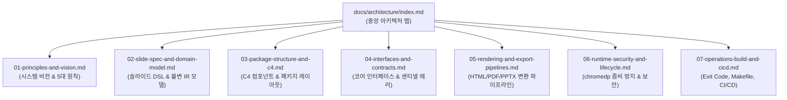

# Goslide 시스템 아키텍처 및 상세 설계서 (Architecture Design Document)

> **문서 버전**: v2.0.0 (Human & AI-Friendly Modularized Architecture)  
> **개정일**: 2026-10-05  
> **상태**: Approved Architecture Specification  
> **신규 모듈 디렉토리**: [`docs/architecture/`](./architecture/index.md)  
> **연관 티켓**: [GOS-1](https://joincdream.atlassian.net/browse/GOS-1)  

---

## 📌 아키텍처 문서 모듈화 안내 (Documentation Notice)

기존의 755줄 단일 모놀리식 아키텍처 문서는 **"사람과 AI가 모두 관리하기 쉬운 구조"**를 달성하기 위해 **arc42, C4 Model, Open Knowledge Format(OKF)** 글로벌 표준에 따라 **[`docs/architecture/`](./architecture/index.md)** 디렉토리 하위의 **7대 전문 모듈**로 체계적으로 분할 및 고도화되었습니다.

상세 아키텍처 설계와 구현 명세는 아래의 해당 모듈 링크를 참조하십시오:

---

## 아키텍처 모듈 빠른 내비게이션 (Quick Module Directory)

| 번호 | 모듈 문서 | 주요 내용 | 관련 소스 코드 |
| :---: | :--- | :--- | :--- |
| **00** | **[`docs/architecture/index.md`](./architecture/index.md)** | • 아키텍처 중앙 지식 라우터 및 작업별 내비게이션 가이드 | - |
| **01** | **[`01-principles-and-vision.md`](./architecture/01-principles-and-vision.md)** | • 시스템 비전 및 스크린캐스트 특화 가치 • 핵심 5대 원칙 (단방향 파이프라인, 불변 IR, 무상태, DIP, Resource Safety) | [`AGENTS.md`](../AGENTS.md) |
| **02** | **[`02-slide-spec-and-domain-model.md`](./architecture/02-slide-spec-and-domain-model.md)** | • 마크다운 DSL Frontmatter 및 인라인 주석 지시어 • 결정론적 레이아웃 결정 규칙 • `model.Deck` & `model.Slide` 불변 Go 구조체 명세 | [`internal/model/deck.go`](../internal/model/deck.go) [`internal/parser/`](../internal/parser/) |
| **03** | **[`03-package-structure-and-c4.md`](./architecture/03-package-structure-and-c4.md)** | • C4 컨테이너/컴포넌트 뷰 다이어그램 • Go 표준 패키지 레이아웃 (`cmd`, `pkg`, `internal`) • 순환 참조 방지 4대 규칙 및 `embed.FS` 에셋 구조 | [`cmd/`](../cmd/) [`internal/`](../internal/) |
| **04** | **[`04-interfaces-and-contracts.md`](./architecture/04-interfaces-and-contracts.md)** | • 코어 인터페이스 (`model.Parser`, `Renderer`, `Exporter`) • 도메인 계층형 센티넬 에러 및 `errors.Is`/`As` 전파 규칙 | [`internal/model/interfaces.go`](../internal/model/interfaces.go) [`internal/model/errors.go`](../internal/model/errors.go) |
| **05** | **[`05-rendering-and-export-pipelines.md`](./architecture/05-rendering-and-export-pipelines.md)** | • Pure Go 기술 스택 선정 근거 (CGO 100% 배제) • HTML 렌더러, PDF 벡터 인쇄, PPTX OpenXML(OPC Zip) 파이프라인 | [`internal/renderer/`](../internal/renderer/) [`internal/exporter/`](../internal/exporter/) |
| **06** | **[`06-runtime-security-and-lifecycle.md`](./architecture/06-runtime-security-and-lifecycle.md)** | • chromedp Headless 브라우저 프로세스 트리 회수 (좀비 방지) • 동시성 세마포어 스로틀링 및 Raw HTML 격리 (`--unsafe-html`) | [`internal/exporter/pdf/`](../internal/exporter/pdf/) [`internal/parser/`](../internal/parser/) |
| **07** | **[`07-operations-build-and-cicd.md`](./architecture/07-operations-build-and-cicd.md)** | • 표준 CLI Exit Code 사양표 (0~5) • Makefile 빌드 자동화 및 3단계 테스트 전략 • GoReleaser 크로스 컴파일 및 릴리즈 파이프라인 | [`Makefile`](../Makefile) [`cmd/goslide/`](../cmd/goslide/) |

---

## 연관 핵심 사양서
* **[`docs/layout-design.md`](./layout-design.md)**: 1920×1080 불변 캔버스 4-Tier 마스터 슬라이드 레이아웃 명세
* **[`docs/functional_specification.md`](./functional_specification.md)**: 기능 요구사항 명세서
* **[`docs/okf/index.md`](./okf/index.md)**: AI 에이전트용 경량 Open Knowledge Format 번들
