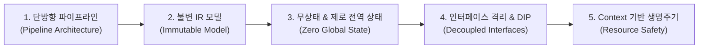
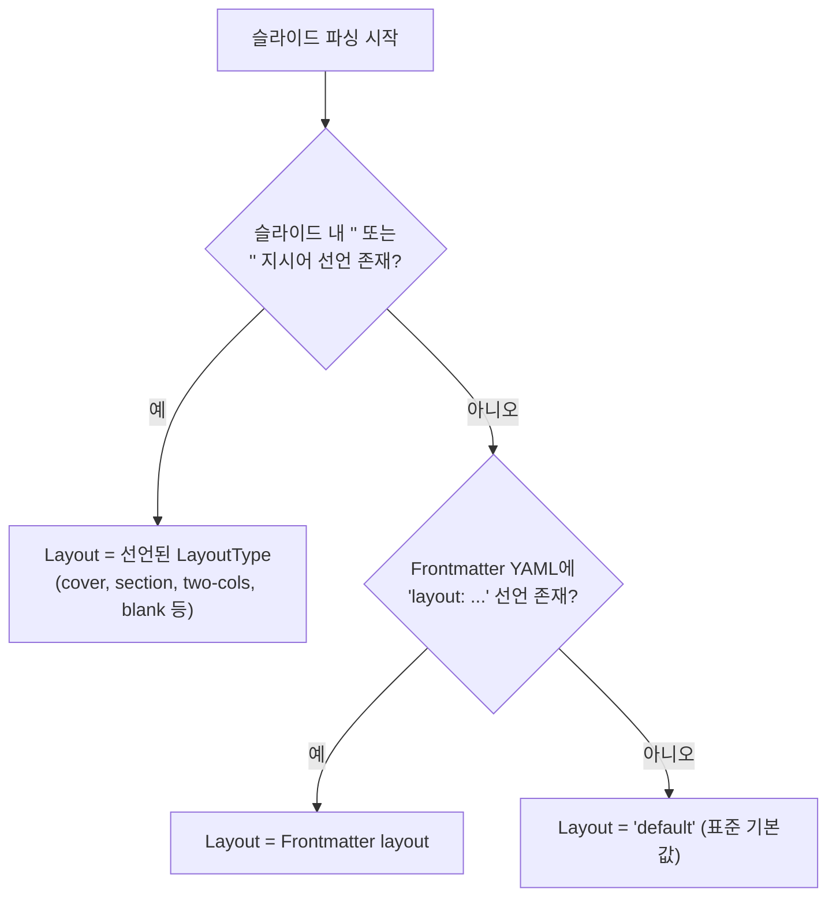
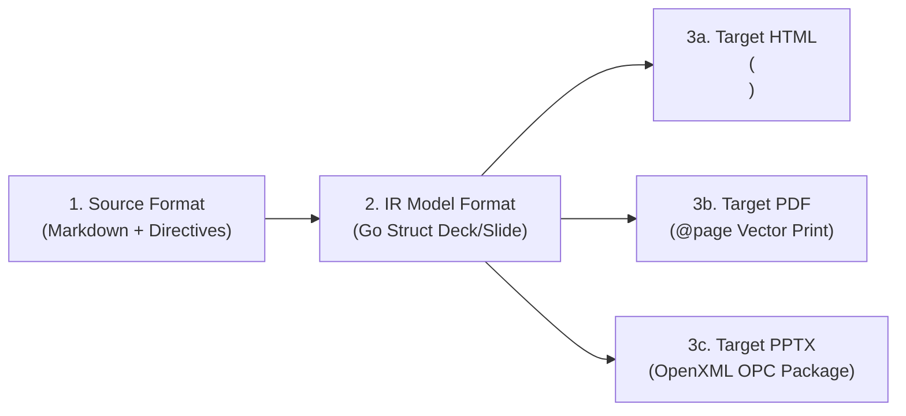
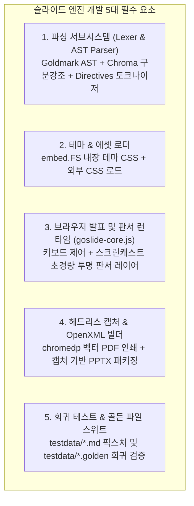
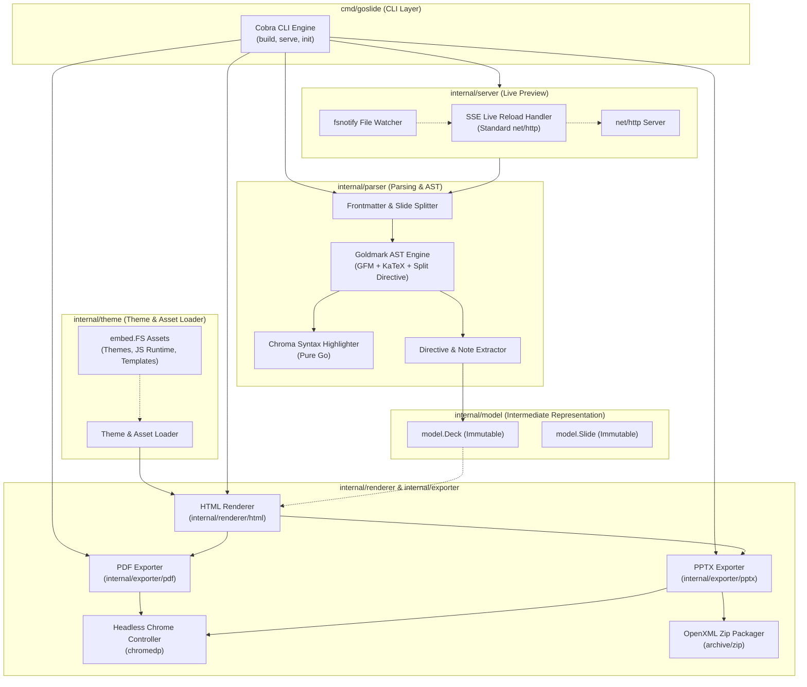
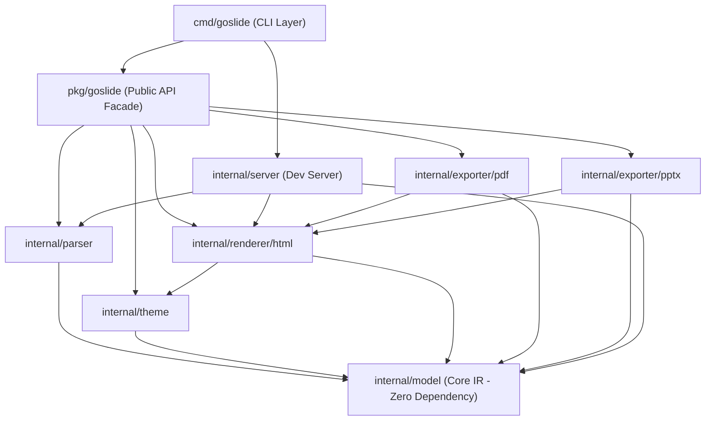
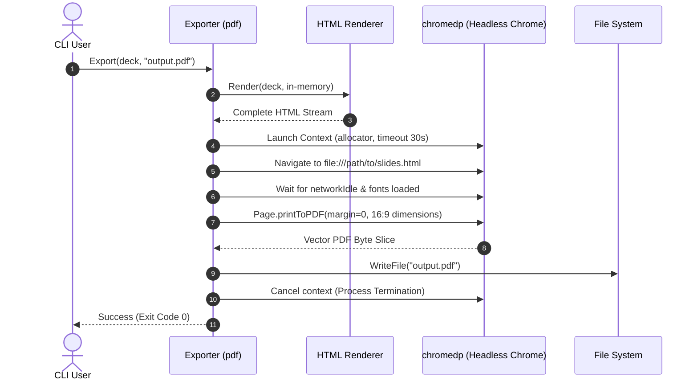
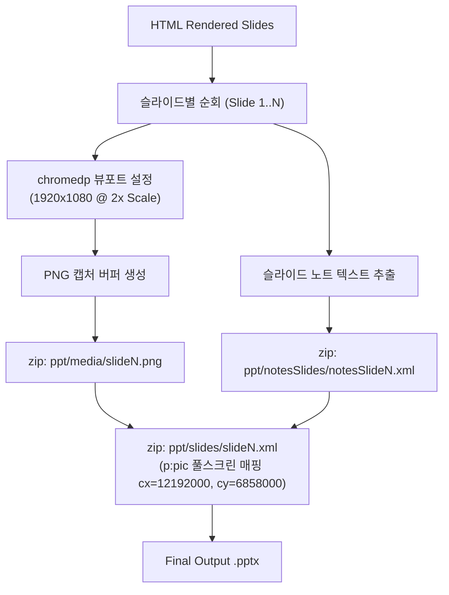
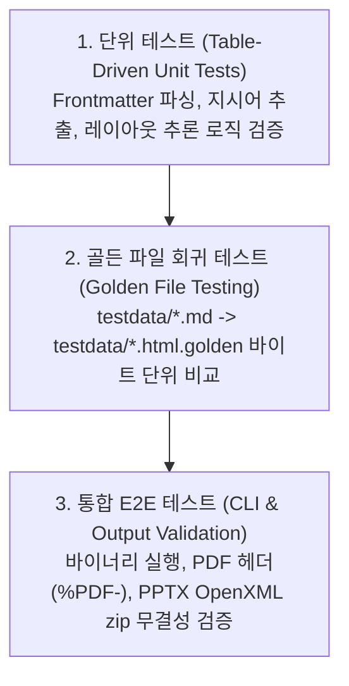

# Goslide 시스템 아키텍처 및 상세 설계서 (Architecture Design Document)

> **문서 버전**: v1.2.0  
> **작성일**: 2026-10-02  
> **상태**: Draft (검토 및 승인 대기)  
> **연관 티켓**: [GOS-1](https://joincdream.atlassian.net/browse/GOS-1)  
> **기반 문서**: [functional_specification.md](file:///home/yundream/myjob/cloit/Goslide/docs/functional_specification.md), [project_plan.md](file:///home/yundream/myjob/cloit/Goslide/docs/project_plan.md), [AGENTS.md](file:///home/yundream/myjob/cloit/Goslide/AGENTS.md)

---

## 1. 개요 및 설계 철학 (Overview & Architectural Principles)

### 1.1 시스템 개요
**Goslide**는 마크다운(Markdown) 문서를 입력받아 프레젠테이션용 웹 슬라이드(HTML), 인쇄용 벡터 문서(PDF), 고해상도 파워포인트(PPTX)로 변환하는 Go 기반의 초경량, 고성능 슬라이드 데크 빌더입니다. 특히 **스크린캐스트 기반의 유튜브 교육 영상 제작**에 최적화되어 실시간 투명 판서(Annotation) 기능을 내장하며, 외부 런타임 종속성을 완전히 배제한 단일 바이너리(Single Binary) 형태로 동작합니다.

### 1.2 핵심 아키텍처링 5대 원칙과 구체적 수행 방안



#### 원칙 1: 단방향 파이프라인 (Unidirectional Pipeline Architecture)
- **정의**: 데이터는 항상 `Source -> Lexer -> Parser -> Model -> Resolver -> Emitter`의 한 방향으로만 흐르며, 역방향 의존성이나 단계 건너뛰기를 엄격히 금지합니다.
- **수행 방안**:
  - 파서(`parser`)는 렌더러(`renderer`)나 익스포터(`exporter`)의 존재를 전혀 알지 못합니다.
  - 각 파이프라인 단계는 입력 데이터를 가공하여 다음 단계의 명확한 타입 계약(Contract)으로 전달합니다.

#### 원칙 2: 불변 중간 표현 모델 (Immutable IR)
- **정의**: 파싱 및 테마 리졸빙이 완료된 `model.Deck` 및 `model.Slide` 구조체는 읽기 전용(Read-Only) 불변 객체로 취급됩니다.
- **수행 방안**:
  - 모델 생성 후 내부 필드를 직접 수정하는 setter 메서드를 제공하지 않습니다.
  - HTML 렌더러와 PDF/PPTX 익스포터가 동일한 `Deck` 포인터를 동시에 참조하더라도 데이터 레이스(Data Race)가 원천적으로 발생하지 않는 Thread-Safe 구조를 보장합니다.

#### 원칙 3: 무상태 및 제로 전역 상태 (Zero Global State)
- **정의**: 패키지 레벨 전역 변수(패키지 설정, 인메모리 캐시, 상태 플래그 등)의 선언을 전면 금지합니다.
- **수행 방안**:
  - 모든 컴포넌트는 생성자 함수(`New...`)를 통해 의존성을 명시적으로 주입(Dependency Injection)받습니다.
  - 패키지 함수 대신 구조체 인스턴스의 메서드로 로직을 캡슐화하여 동시성 호출 시 상태 충돌을 원천 방지합니다.

#### 원칙 4: 인터페이스 격리와 의존성 역전 (ISP & DIP)
- **정의**: 상위 비즈니스 로직과 CLI는 구체 구현체가 아닌 최소한의 추상 인터페이스에 의존합니다.
- **수행 방안**:
  - `model.Renderer`, `model.Exporter` 등의 소형 인터페이스를 선언하고, 각 포맷 모듈은 이를 구현체로서 충족합니다.
  - 새로운 출력 포맷(예: Keynote, PNG 번들 등)이 추가되더라도 기존 코어 파이프라인 코드는 일체 수정되지 않는 개방-폐쇄 원칙(OCP)을 달성합니다.

#### 원칙 5: Context 기반 제어 및 리소스 누수 방지 (Resource Safety)
- **정의**: 모든 I/O 작업, 서브프로세스 제어, 장시간 연산에는 반드시 `context.Context`를 전달합니다.
- **수행 방안**:
  - 사용자 인터럽트(`Ctrl+C`) 또는 타임아웃 발생 시 즉시 컨텍스트 취소 신호를 감지하여 고루틴과 하위 프로세스를 정상 정리합니다.
  - 파일 핸들러, 네트워크 소켓, 헤드리스 브라우저 세션은 반드시 `defer close()` 또는 `defer cancel()`을 통해 결정론적으로 회수합니다.

---

## 2. 슬라이드 문서 명세 및 엔진 설계 (Slide Specification & Engine Design)

Goslide에서 생성 및 관리되는 **슬라이드(Slide)**의 표현 기능, 문서 형식, 메타데이터 체계 및 개발 구성 요소를 상세히 정의합니다.

### 2.1 슬라이드 표현 기능 (What Slides Can Represent)

슬라이드는 발표 자료로서 텍스트, 데이터, 멀티미디어, 인터랙션을 모두 포괄하는 풍부한 시각적 요소를 표현할 수 있습니다.

| 분류 | 표현 가능 요소 및 세부 기능 | 렌더링 방식 및 지원 라이브러리 |
| :--- | :--- | :--- |
| **시맨틱 타이포그래피** | H1~H6 헤딩, 부제목, 본문 단락, 인용구(Blockquote), 글머리 기호/번호 목록 | HTML 시맨틱 태그 및 테마 CSS 타이포그래피 |
| **시맨틱 레이아웃** | • `cover`: 표지 (세로/가로 중앙 정렬 대형 타이틀)<br>• `default`: 상단 고정 헤더 + 본문 콘텐츠<br>• `section`: 중간 간지 (테마 반전 다크/Primary 강조)<br>• `two-cols`: 2단 병렬 비교 컬럼<br>• `blank`: 여백 0 풀스크린 미디어/다이어그램 | CSS Flexbox 및 Grid 2열 (`1fr 1fr; gap: 2rem`) 레이아웃 |
| **구조화된 데이터** | GitHub Flavored Markdown (GFM) 테이블, 작업 목록(체크리스트 `[ ]`, `[x]`), 취소선, 자동 하이퍼링크 | Goldmark GFM 확장 엔진 |
| **코드 블록 & 구문 강조** | 100개 이상의 프로그래밍 언어 구문 강조, 줄 번호 표시, 테마별(Light/Dark) 컬러 팔레트 | 순수 Go 기반 `chroma/v2` 구문 강조기 (CGO 배제) |
| **수학 공식 (Math/LaTeX)** | 인라인 수식(`$E=mc^2$`), 블록 수식(`$$\sum_{i=1}^n x_i$$`) | KaTeX 스크립트 연동 및 수식 전용 웹 폰트 |
| **멀티미디어 및 배경** | 로컬/원격 이미지 삽입, 슬라이드 전체 배경 이미지(`backgroundImage`), 배경색(`backgroundColor`), 불투명도 조절 | CSS `background-size: cover/contain`, Base64 인라인 변환 |
| **발표자 노트 (Speaker Notes)** | 슬라이드 내 `<!-- note: ... -->` 메모 작성 (청중 화면에는 비노출) | 발표자 콘솔(`P` 키) 및 PPTX 슬라이드 메모(`notesSlideX.xml`) 연동 |
| **스크린캐스트 판서 및 네비게이션** | • 초경량 투명 캔버스 판서 레이어 (`D` 키 토글, `C` 키 지우기)<br>• 방향키/Space 슬라이드 네비게이션<br>• 전체화면 모드 (`F` 키) | `goslide-core.js` (순수 바닐라 JS 50줄 이내, `<canvas>` 투명 오버레이) |

---

### 2.2 포매터, 헤더 메타데이터 및 지시어 태그 (Directives)

슬라이드의 속성과 스타일을 제어하기 위해 **Frontmatter(YAML)**와 **인라인 주석 지시어(HTML Comments)**를 지원합니다.

#### A. 문서 전역 헤더 (Frontmatter YAML)
마크다운 문서 최상단에 위치하며 전체 슬라이드 데크의 기본값을 정의합니다.

```yaml
---
title: "Goslide 아키텍처 설계"
author: "윤상배 (joinc.dream@gmail.com)"
theme: default          # 내장 테마: default | clean | dark 또는 커스텀 CSS 경로
size: 16:9              # 화면 비율: 16:9 | 4:3
paginate: true          # 슬라이드 번호 표기 여부 (true/false)
header: "클라우드 네이티브 세션" # 전역 상단 헤더 텍스트 (마크다운 인라인 허용)
footer: "© 2026 Cloit Inc." # 전역 하단 푸터 텍스트
layout: default         # 전체 슬라이드의 기본 레이아웃
style: |                # 슬라이드 전체에 주입할 사용자 정의 CSS
  h1 { letter-spacing: -0.02em; }
---
```

#### B. 인라인 주석 지시어 (Directives Tag)
개별 슬라이드 본문 내에 `<!-- key: value -->` 형태로 선언합니다.

| 지시어 (Directive) | 접두사 `_` 유무 차이 | 허용 값 예시 | 역할 및 설명 |
| :--- | :---: | :--- | :--- |
| `layout` / `_layout` | `_` 붙으면 해당 장만 적용 | `"cover"`, `"section"`, `"two-cols"`, `"blank"` | 슬라이드 시맨틱 레이아웃 지정 |
| `class` / `_class` | `_` 붙으면 해당 장만 적용 | `"lead"`, `"invert"` | 슬라이드 컨테이너 CSS 클래스 부여 |
| `backgroundColor` / `_backgroundColor` | `_` 붙으면 해당 장만 적용 | `"#f8fafc"`, `"rgb(15,23,42)"` | 슬라이드 배경색 |
| `backgroundImage` / `_backgroundImage` | `_` 붙으면 해당 장만 적용 | `"url('assets/diagram.png')"` | 슬라이드 전체 배경 이미지 지정 |
| `color` / `_color` | `_` 붙으면 해당 장만 적용 | `"#1e293b"`, `"white"` | 기본 텍스트 색상 오버라이드 |
| `header` / `_header` | `_` 붙으면 해당 장만 적용 | `"새로운 챕터명"`, `""` | 로컬 헤더 텍스트 덮어쓰기 |
| `footer` / `_footer` | `_` 붙으면 해당 장만 적용 | `"별도 푸터"`, `""` | 로컬 푸터 텍스트 덮어쓰기 |
| `paginate` / `_paginate` | `_` 붙으면 해당 장만 적용 | `true`, `false` | 로컬 페이지 번호 표시 토글 |
| `<!-- split -->` | 단독 구분 태그 | - | `layout: two-cols` 슬라이드에서 좌/우 컬럼을 나누는 구분자 |
| `<!-- note: ... -->` | 복수 줄 블록 지원 | 마크다운 텍스트 | 발표자 전용 메모 (청중 화면 비노출) |

---

### 2.3 명시적이고 결정론적인 레이아웃 결정 규칙 (Deterministic Layout Resolution)

Goslide는 마크다운 파서가 슬라이드 본문의 줄 수나 특정 요소를 바탕으로 레이아웃을 임의로 추측하거나 변경하는 것을 엄격히 금지합니다 (Zero Guesswork). 출력의 100% 결정론(Determinism)을 보장하기 위해 오직 사용자의 **명시적인 선언(Explicit Declaration)**에 의해서만 레이아웃이 결정됩니다:



- **표지(Cover) / 간지(Section)**: 사용자가 첫 장이나 챕터 슬라이드를 표지/간지로 구성하려면 반드시 `<!-- _layout: cover -->` 또는 `<!-- _layout: section -->`을 명시합니다.
- **2단 컬럼 분할 (`<!-- split -->`)**: `layout: two-cols`가 명시된 슬라이드에서 `<!-- split -->` 태그를 좌측 컬럼(`LeftHTML`)과 우측 컬럼(`RightHTML`)의 분할점으로만 엄격히 해석하며, 레이아웃 타입을 파서가 제멋대로 변경하지 않습니다.

---

### 2.4 슬라이드 형식 체계 (Slide Formats & Representations)

슬라이드는 처리 파이프라인의 단계에 따라 3가지 구체적인 데이터 형식으로 표현됩니다.



#### 1. 소스 형식 (Markdown Source Specification)
- **Frontmatter**: 문서 시작(`^---\n`)부터 다음 수평선(`\n---\n`)까지의 YAML 텍스트.
- **슬라이드 분할선**: 라인의 시작과 끝에 위치한 독립된 수평선 구분자(`---`).
- **코드 블록 예외 처리**: Fenced Code Block(```` ``` ````) 내부의 `---`는 슬라이드 분할선에서 완전히 제외되어 코드 내용으로 보존됩니다.

#### 2. 내부 중간 표현 형식 (IR Model Specification)
- Go 언어의 엄격한 타입 모델로 메모리 상에 존재하는 불변 객체입니다.
```go
type Slide struct {
    Index         int             // 슬라이드 순번 (1-based)
    Layout        LayoutType      // 계산된 시맨틱 레이아웃 (cover, two-cols 등)
    Directives    SlideDirectives // 테마 및 상속이 완료된 최종 스타일 속성
    RawContent    string          // 원본 마크다운 텍스트
    HTMLContent   string          // 렌더링된 본문 HTML 스팬
    Notes         string          // 발표자 메모 텍스트
    LeftHTML      string          // two-cols 좌측 컬럼 렌더링 HTML
    RightHTML     string          // two-cols 우측 컬럼 렌더링 HTML
}
```

#### 3. 타깃 출력 형식 (Target Output Formats)
- **HTML 포맷**:
  - 각 슬라이드는 `<section class="slide layout-{{.Layout}} theme-{{.Theme}}" id="slide-{{.Index}}">` 태그로 변환됩니다.
  - 테마 CSS와 제어용 JS 런타임은 `embed.FS`를 통해 `<style>`, `<script>`로 HTML 내에 자체 내장되며, 이미지는 마크다운 원본의 상대 경로(``)를 웹 표준 그대로 유지합니다.
- **PDF 포맷**:
  - CSS `@page { size: 16:9; margin: 0; }` 사양 및 개별 슬라이드 끝의 `break-after: page;` 속성을 통해 페이지 잘림 없는 고품질 벡터 PDF로 인쇄됩니다.
- **PPTX 포맷**:
  - OpenXML(ECMA-376) 표준에 부합하는 OPC Zip 패키지 구조를 가집니다.
  - 슬라이드 크기는 16:9 기준 $12,192,000 \times 6,858,000\text{ EMU}$로 정밀 매핑되며, 고해상도 전체화면 이미지(`<p:pic>`)와 함께 발표자 메모(`<notesSlideX.xml>`)가 네이티브 텍스트로 보존됩니다.

---

### 2.5 슬라이드 엔진 개발 필수 구성 요소 (Engineering Building Blocks)

슬라이드 데크 빌더를 구현하기 위해 필요한 핵심 서브시스템 목록입니다:



1. **파싱 서브시스템 (Lexer & AST Parser)**:
   - Frontmatter 분리기 및 슬라이드 토크나이저.
   - Goldmark AST 확장 엔진 (GFM 테이블, 체크리스트, KaTeX 수식, `<!-- split -->` 2단 분할 AST 처리).
   - Chroma 순수 Go 구문 강조 렌더러.
2. **테마 & 에셋 로더 (Theme & Asset Loader)**:
   - `embed.FS` 기반 내장 테마 3종 (`default.css`, `clean.css`, `dark.css`) 및 사용자 커스텀 외부 CSS 파일 로드.
   - 스타일 우선순위는 별도의 백엔드 연산기 없이 브라우저 네이티브 CSS Cascading 규칙(내장/외부 CSS < 전역 `<style>` < 슬라이드 인라인 `style` 속성)에 100% 위임.
3. **브라우저 발표 및 판서 런타임 (`goslide-core.js`)**:
   - 키보드 슬라이드 네비게이션 (방향키, Space, Home/End, F 전체화면).
   - 스크린캐스트 교육 영상용 초경량 투명 판서(Annotation) 레이어:
     - 슬라이드 상단에 투명 `<canvas>`를 오버레이 (`pointer-events: none`).
     - `D` 키로 펜 모드 토글 (`pointer-events: auto`), 마우스 드래그로 즉각적인 선/도형 판서.
     - `C` 키로 현재 판서 즉시 삭제 (`clearRect`), 슬라이드 넘김 시 캔버스 자동 리셋.
     - 외부 라이브러리 없이 순수 바닐라 JS 40~50줄 이내로 초경량 구현.
4. **헤드리스 캡처 드라이버 및 OpenXML 빌더**:
   - `chromedp`를 활용한 슬라이드별 DOM 뷰포트 고해상도(2x Scale) 캡처 파이프라인.
   - Go 표준 `archive/zip` 라이브러리 기반 PPTX OPC 패키징 및 XML 관계도(`_rels`) 자동 생성기.
5. **회귀 테스트 및 검증 스위트**:
   - 표준 슬라이드 픽스처(`testdata/slides/*.md`) 및 골든 파일(`*.golden.html`).
   - 자동 갱신 플래그(`go test -update`)를 갖춘 회귀 테스트 러너.

---

## 3. 컴포넌트 아키텍처 다이어그램 (Component Diagram)

### 3.1 C4 컨테이너/컴포넌트 뷰 (Goslide Core Subsystems)



---

## 4. 패키지 및 모듈 경계 (Go Standard Layout)

Goslide는 Go 표준 레이아웃 규칙(`cmd`, `pkg`, `internal`)을 엄격히 준수하며, 순환 참조(Circular Dependency)를 원천 차단하고 단일 바이너리 빌드 및 높은 유지보수성을 달성하도록 설계되었습니다.

### 4.1 전체 애플리케이션 디렉토리 트리 (Detailed Application Directory Layout)

모든 소스 파일과 리소스의 배치를 파일 단위까지 구체화한 전체 프로젝트 디렉토리 레이아웃입니다:

```text
Goslide/
├── cmd/
│   └── goslide/                      # CLI 진입점
│       ├── main.go                   # main(), Cobra Root 커맨드, serve/version 서브커맨드
│       └── build.go                  # 'goslide build' 포맷별 변환 커맨드
│
├── pkg/
│   └── goslide/                      # 외부 Go 애플리케이션용 Public Facade API
│       └── goslide.go                # Build(ctx, opts), BuildOptions, Parse(ctx, r)
│
├── internal/                         # 코어 비즈니스 로직 (외부 노출 차단)
│   ├── model/                        # 도메인 모델(IR) 및 인터페이스 (Zero Dependency)
│   │   ├── deck.go                   # Deck, Slide, GlobalDirectives, SlideDirectives, LayoutType
│   │   └── interfaces.go             # Parser, Renderer, Exporter 인터페이스 및 도메인 에러
│   │
│   ├── parser/                       # 마크다운 파싱 서브시스템
│   │   ├── parser.go                 # Frontmatter YAML + 슬라이드 분할 + 지시어 추출 + Goldmark AST
│   │   ├── highlight.go              # Chroma 기반 순수 Go 구문 강조 렌더러
│   │   └── parser_test.go            # 테이블 기반 파서 단위/통합 테스트
│   │
│   ├── theme/                        # 테마 및 정적 에셋 서브시스템
│   │   ├── embed.go                  # //go:embed assets/* 선언 및 embed.FS 에셋 관리
│   │   ├── theme.go                  # 테마 로더 (내장 CSS 3종 vs 외부 CSS)
│   │   └── assets/                   # 바이너리 내장 정적 리소스
│   │       ├── css/                  # base.css, default.css, clean.css, dark.css
│   │       ├── js/goslide-core.js    # 키보드 네비게이션 + 스크린캐스트 투명 판서 레이어 + SSE 클라이언트
│   │       └── templates/slide.html  # 슬라이드 HTML 프레임워크 템플릿
│   │
│   ├── renderer/                     # 슬라이드 HTML 렌더러
│   │   ├── html.go                   # html/template 기반 HTML 도큐먼트 합성 로직
│   │   └── html_test.go              # HTML 렌더러 단위 및 골든 파일 비교 테스트
│   │
│   ├── exporter/                     # 외부 포맷 익스포터 서브시스템 (PDF & PPTX)
│   │   ├── pdf.go                    # chromedp 기반 벡터 PDF 인쇄 (file:// 로드)
│   │   ├── pptx.go                   # chromedp 슬라이드 뷰포트 캡처 + zip OpenXML 빌더
│   │   └── exporter_test.go          # PDF/PPTX 출력 헤더 및 무결성 검증 테스트
│   │
│   ├── server/                       # 로컬 개발 서버 및 SSE Live Preview 서브시스템
│   │   ├── server.go                 # net/http 정적 서빙 및 SSE(/events) 핫 리로드 핸들러
│   │   └── watcher.go                # fsnotify 기반 마크다운 수정 실시간 감지기
│   │
│   └── testutil/                     # 테스트 헬퍼 유틸리티
│       └── golden.go                 # 골든 파일(.golden) 비교 및 -update 갱신 헬퍼
│
├── testdata/                         # 테스트 픽스처 및 골든 파일
│   ├── slides/                       # basic.md, two_cols.md, code_math.md
│   ├── golden/                       # basic.golden.html, two_cols.golden.html
│   └── assets/                       # logo.png, diagram.svg
│
├── go.mod                            # Go 1.22+ 모듈 의존성 정의
├── Makefile                          # 빌드, 테스트, 린트 자동화
├── AGENTS.md                         # 엔지니어링 가이드라인 및 LLM 가드레일
└── README.md                         # 프로젝트 소개 및 빠른 시작 가이드
```
│       └── diagram.svg
│
├── docs/                             # 아키텍처 및 기획/명세 문서
│   ├── architecture_design.md        # 시스템 아키텍처 및 상세 설계서 (본 문서)
│   ├── functional_specification.md   # 기능 명세서
│   └── project_plan.md               # 프로젝트 마스터 플랜
│
├── .github/                          # CI/CD 및 자동화 워크플로우
│   └── workflows/
│       ├── ci.yml                    # 빌드, 린트, 단위/골든 테스트 자동화
│       └── release.yml               # GoReleaser 태그 기반 멀티플랫폼 바이너리 릴리즈
│
├── .golangci.yml                     # golangci-lint 정적 분석 룰셋 설정
├── .goreleaser.yaml                  # GoReleaser 크로스 컴파일 및 패키징 설정
├── Makefile                          # 빌드, 테스트, 린트, 골든 갱신 자동화 스크립트
├── go.mod                            # Go 모듈 의존성 정의
├── go.sum                            # 의존성 체크섬
├── AGENTS.md                         # LLM 에이전트 행동 가드레일 및 엔지니어링 원칙
└── README.md                         # 프로젝트 소개 및 빠른 시작 가이드

---

### 4.2 모듈별 세부 역할 및 패키지 책임 정의 (Package Responsibilities)

각 패키지는 단일 책임 원칙(SRP)에 따라 명확히 분리되며, 상위 계층은 하위 인터페이스에만 의존합니다.

| 레이어 | 패키지 경로 | 주요 책임 및 역할 | 핵심 산출물 및 타입 | 외부 의존성 |
| :--- | :--- | :--- | :--- | :--- |
| **CLI** | `cmd/goslide` | • CLI 인자 및 플래그 파싱<br>• 서브커맨드 바인딩 (`build`, `serve`, `init`, `version`)<br>• OS 인터럽트 시그널 수신 및 종료 코드 제어 | `main()`, `Execute()` | `spf13/cobra` |
| **Public API** | `pkg/goslide` | • 서드파티 Go 애플리케이션용 임베딩 Facade API<br>• 변환 파이프라인 단일 진입점 제공 | `Build(ctx, opts)`, `BuildOptions` | 내부 `internal/*` 패키지 |
| **Domain IR** | `internal/model` | • 불변 프레젠테이션 데이터 모델 정의<br>• 파이프라인 컴포넌트 간 계약 인터페이스 정의<br>• 센티넬 에러 및 상수 정의 | `Deck`, `Slide`, `Parser`, `Renderer`, `Exporter` | Go 표준 라이브러리 전용 (Zero Dep) |
| **Parser** | `internal/parser` | • Frontmatter YAML 및 마크다운 분할<br>• Goldmark AST 확장 (GFM, 수식)<br>• 인라인 지시어 추출 및 명시적 레이아웃 매핑<br>• Chroma 기반 코드 구문 강조 | `Parser`, `ExtractDirectives()` | `goldmark`, `yaml.v3`, `chroma/v2` |
| **Theme** | `internal/theme` | • `embed.FS` 기반 정적 테마 CSS 및 에셋 로드<br>• 사용자 정의 외부 CSS 로드<br>• 스타일 우선순위는 브라우저 네이티브 CSS Cascading에 위임 | `ThemeLoader`, `LoadTheme()` | Go 표준 라이브러리 (`embed`, `io/fs`) |
| **Renderer** | `internal/renderer` | • Go `html/template` 기반 단일 HTML 슬라이드 생성<br>• 테마 CSS 및 판서 런타임 JS 인라인 합성 | `HTMLRenderer` | Go 표준 라이브러리 (`html/template`) |
| **Exporter** | `internal/exporter` | • chromedp 기반 16:9/4:3 무마진 벡터 PDF 인쇄 (`Page.printToPDF`)<br>• chromedp 슬라이드 뷰포트 캡처 기반 고해상도 PPTX 패키징 (`archive/zip`) | `PDFExporter`, `PPTXExporter` | `chromedp/chromedp`, 표준 `archive/zip` |
| **Dev Server** | `internal/server` | • 로컬 정적 HTTP 프레젠테이션 호스팅<br>• `fsnotify` 기반 소스 파일 수정 실시간 감지<br>• Go 표준 `net/http` 기반 SSE 단방향 핫 리로드 | `DevServer`, `Watcher`, `SSEHandler` | `fsnotify` (Zero WebSocket) |
| **Test Util** | `internal/testutil` | • 골든 파일 회귀 검증 및 자동 갱신(`-update`) 헬퍼<br>• 테스트용 Mock Deck/Slide 모델 픽스처 생성 | `AssertGolden()`, `NewMockDeck()` | Go 표준 라이브러리 (`testing`) |

---

### 4.3 정적 에셋 임베딩 구조 (Embedded Assets Layout via `embed.FS`)

Goslide는 외부 의존성 없는 **단일 바이너리(Single Binary)** 배포를 달성하기 위해 모든 런타임 CSS, JS, HTML 템플릿을 Go 표준 `embed.FS`로 컴파일 타임에 내장합니다:

```go
// internal/theme/embed.go
package theme

import "embed"

//go:embed assets/css/*.css assets/js/*.js assets/templates/*.html
var AssetFS embed.FS
```

#### 에셋 구성 및 역할:
1. `assets/css/base.css`: 슬라이드 공통 리셋, CSS 변수(`--slide-width`, `--slide-height`), `@page` 인쇄 스타일.
2. `assets/css/default.css`: 시스템 표준 테마 (Pretendard 기반, 블루 악센트, 밝은 배경).
3. `assets/css/clean.css`: 미니멀 테마 (Inter 기반, 여백 중심의 타이포그래피).
4. `assets/css/dark.css`: 다크 테마 (One Dark 컬러 팔레트, 개발자 세션 특화).
5. `assets/js/goslide-core.js`:
   - 키보드 슬라이드 네비게이션 및 단축키 바인딩 (방향키, Space, Home/End, F 전체화면).
   - 스크린캐스트 교육 영상용 초경량 투명 판서(Annotation) 레이어 제어 (D 판서 토글, C 지우기, 슬라이드 전환 시 자동 리셋).
   - 개발 서버 실시간 SSE 핫 리로드 클라이언트 (브라우저 표준 EventSource 단 3줄).
   - 외부 라이브러리 및 불필요한 장식 도구(레이저, 스포트라이트 등)를 배제하여 50줄 내외의 미니멀 코드로 유지.
6. `assets/templates/slide.html`: 개별 슬라이드 및 전체 덱을 포함하는 메인 HTML 프레임워크 템플릿.

---

### 4.4 패키지 계층 및 의존성 규칙 (Dependency Rules & Boundaries)

순환 참조를 방지하고 아키텍처 원칙(DIP/ISP)을 유지하기 위한 엄격한 패키지 계층 구조입니다:



#### 순환 참조 방지 및 격리 4대 규칙:
1. **규칙 1 (최하위 모델 패키지 격리)**: `internal/model`은 최하위 패키지로서 Go 표준 라이브러리 외에 어떠한 다른 내부/외부 패키지도 임포트하지 않습니다.
2. **규칙 2 (파서의 독립성)**: `internal/parser`는 오직 `internal/model`에만 의존하며, `renderer`, `exporter`, `theme`를 임포트할 수 없습니다.
3. **규칙 3 (파이프라인 단방향 참조)**: `internal/exporter`는 캡처 및 인쇄 대상인 완성된 HTML 스트림을 얻기 위해 `internal/renderer/html`을 참조할 수 있으나, 반대 방향(`renderer` -> `exporter`)의 참조는 엄격히 금지됩니다.
4. **규칙 4 (CLI의 얇은 래퍼 원칙)**: `cmd/goslide` 패키지는 인자 파싱 및 실행 오케스트레이션만을 수행하며, 실질적인 변환 및 비즈니스 로직은 `pkg/goslide` 또는 `internal/*`의 생성자 함수를 통해 처리합니다.

---

## 5. 핵심 인터페이스 및 데이터 모델 상세 사양

### 5.1 공통 인터페이스 정의 (`internal/model/interfaces.go`)

```go
package model

import (
	"context"
	"io"
)

// Parser는 마크다운 소스를 분석하여 불변 Presentation Deck을 빌드합니다.
type Parser interface {
	Parse(ctx context.Context, r io.Reader) (*Deck, error)
}

// Renderer는 Deck을 특정 포맷(주로 HTML)의 스트림으로 렌더링합니다.
type Renderer interface {
	Render(ctx context.Context, deck *Deck, w io.Writer) error
}

// Exporter는 Deck을 외부 파일 포맷(PDF, PPTX)으로 생성하여 파일 시스템에 출력합니다.
type Exporter interface {
	Export(ctx context.Context, deck *Deck, outputPath string) error
}
```

### 5.2 데이터 모델 계층 (`internal/model/deck.go`)

```go
package model

import "time"

type SizeRatio string

const (
	Ratio16x9 SizeRatio = "16:9"
	Ratio4x3  SizeRatio = "4:3"
)

type LayoutType string

const (
	LayoutDefault LayoutType = "default"
	LayoutCover   LayoutType = "cover"
	LayoutSection LayoutType = "section"
	LayoutTwoCols LayoutType = "two-cols"
	LayoutBlank   LayoutType = "blank"
)

// Deck은 단일 프레젠테이션 전체를 포괄하는 최상위 불변 모델입니다.
type Deck struct {
	Title       string           `json:"title"`
	Author      string           `json:"author"`
	CreatedAt   time.Time        `json:"created_at"`
	GlobalAttrs GlobalDirectives `json:"global_attributes"`
	CustomCSS   string           `json:"custom_css,omitempty"`
	Slides      []*Slide         `json:"slides"`
}

// GlobalDirectives는 데크 전체의 전역 속성 지시자입니다.
type GlobalDirectives struct {
	Theme    string     `json:"theme"`
	Layout   LayoutType `json:"layout"`
	Size     SizeRatio  `json:"size"`
	Paginate bool       `json:"paginate"`
	Header   string     `json:"header,omitempty"`
	Footer   string     `json:"footer,omitempty"`
}

// SlideDirectives는 개별 슬라이드의 유효 스타일 지시자입니다.
type SlideDirectives struct {
	Layout          LayoutType `json:"layout,omitempty"`
	Class           []string   `json:"class,omitempty"`
	BackgroundColor string     `json:"background_color,omitempty"`
	BackgroundImage string     `json:"background_image,omitempty"`
	Color           string     `json:"color,omitempty"`
	Header          string     `json:"header,omitempty"`
	Footer          string     `json:"footer,omitempty"`
	Paginate        bool       `json:"paginate"`
}

// Slide는 단일 화면 슬라이드 단위 모델입니다.
type Slide struct {
	Index         int             `json:"index"`
	Layout        LayoutType      `json:"layout"`
	Directives    SlideDirectives `json:"directives"`
	RawContent    string          `json:"-"`
	HTMLContent   string          `json:"html_content"`
	Notes         string          `json:"notes,omitempty"`
	LeftHTML      string          `json:"left_html,omitempty"`
	RightHTML     string          `json:"right_html,omitempty"`
}
```

---

## 6. 사용 기술셋 및 라이브러리 선정 (Tech Stack & Dependencies)

Goslide는 **CGO를 100% 배제한 순수 Go(Pure Go)** 기반으로 컴파일되어 완벽한 크로스 플랫폼 단일 실행 파일 배포를 달성합니다.

| 분류 | 채택 기술 / 라이브러리 | 버전 | 선정 배경 및 기술적 근거 |
| :--- | :--- | :--- | :--- |
| **언어 런타임** | **Go** | 1.22+ | 정적 컴파일, 초고속 컴파일 타임, 강력한 동시성 모델, `embed.FS` 내장 |
| **CLI 프레임워크** | `github.com/spf13/cobra` | v1.8+ | 사실상의 업계 표준 POSIX CLI 엔진, 서브커맨드 및 플래그 바인딩 안정성 |
| **마크다운 AST 파서** | `github.com/yuin/goldmark` | v1.7+ | CommonMark 완벽 준수, 고성능 AST 조작 가능, GFM 확장 지원, CGO 무의존 |
| **YAML 파서** | `gopkg.in/yaml.v3` | v3.0+ | Frontmatter YAML 파싱의 신뢰성, 엄격한 구조체 언마샬링 지원 |
| **구문 강조 엔진** | `github.com/alecthomas/chroma/v2` | v2.14+ | 순수 Go 구현 코드 하이라이터 (Pygments 호환), CGO 없는 단일 바이너리 완성 |
| **Headless 브라우저 제어** | `github.com/chromedp/chromedp` | v0.9+ | Chrome DevTools Protocol(CDP) 직결 제어, WebDriver 종속성 없음, 고해상도 PDF 및 뷰포트 캡처 |
| **파일 감시 엔진** | `github.com/fsnotify/fsnotify` | v1.7+ | OS 네이티브(Inotify, Kqueue 등) 파일 시스템 이벤트 감시, 개발 서버 Hot Reload 구현 |
| **실시간 핫 리로드** | 표준 라이브러리 `net/http` (SSE) | Go 표준 | 브라우저 EventSource와 표준 HTTP 단방향 스트리밍(SSE)으로 의존성 없는 초경량 핫 리로드 달성 |
| **OpenXML 압축** | 표준 라이브러리 `archive/zip` | Go 표준 | PPTX OPC 패키지 압축/해제를 CGO 없이 표준 라이브러리로 메모리 스트리밍 처리 |

---

## 7. 포맷별 세부 아키텍처 및 파이프라인

### 7.1 HTML 렌더러 파이프라인 (`internal/renderer`)
1. **템플릿 바인딩**:
   - `embed.FS`를 통해 Go 바이너리에 내장된 슬라이드 레이아웃 템플릿(`template/slide.html`)과 초경량 판서 및 네비게이션 JS(`goslide-core.js`)를 로드합니다.
2. **웹 표준 이미지 경로 보존**:
   - 로컬 이미지는 마크다운 원본의 상대 경로(``)를 웹 표준 그대로 유지합니다.
   - 단일 파일 공유가 필요한 경우 HTML 내에 억지로 이미지를 Base64로 인라인하지 않고, 폴더 압축(`zip`)이나 PDF/PPTX 변환을 활용합니다.

### 7.2 PDF 익스포터 파이프라인 (`internal/exporter: pdf.go`)


### 7.3 PPTX 익스포터 파이프라인 (`internal/exporter: pptx.go`)
브라우저 뷰포트와의 100% 시각적 일치(Pixel-Perfect)를 위해 **고해상도 캡처 이미지 매핑 방식**을 채택하며, 발표자 노트 텍스트를 보존합니다.



---

## 8. Headless 브라우저 프로세스 생명주기 및 리소스 제어

`chromedp` 실행 시 발생할 수 있는 프로세스 누수(Zombie Process) 및 시스템 자원 고갈을 방지하기 위해 엄격한 라이프사이클 격리 정책을 구현합니다.

### 8.1 격리 및 회수 정책
```go
func (e *PDFExporter) Export(ctx context.Context, deck *model.Deck, outPath string) (err error) {
    // 1. 타임아웃 컨텍스트 결합 (최대 60초 보장)
    ctx, cancelTimeout := context.WithTimeout(ctx, 60*time.Second)
    defer cancelTimeout()

    // 2. Headless Exec Allocator 생성 (임시 사용자 디렉토리 사용)
    opts := append(chromedp.DefaultExecAllocatorOptions[:],
        chromedp.DisableGPU,
        chromedp.NoSandbox,
        chromedp.Headless,
    )
    allocCtx, cancelAlloc := chromedp.NewExecAllocator(ctx, opts...)
    defer cancelAlloc() // 프로세스 트리 종료 보장

    // 3. 탭 컨텍스트 생성
    taskCtx, cancelTask := chromedp.NewContext(allocCtx)
    defer cancelTask()

    // 4. 실행 및 에러 감지
    // ... chromedp.Run(...)
    return nil
}
```
1. **프로세스 트리 자동 회수**: `cancelAlloc()` 함수 호출을 `defer`로 등록하여, 고루틴 패닉이나 예기치 않은 오류 시에도 Chrome 서브프로세스가 부모 프로세스와 함께 즉시 종료되도록 보장합니다.
2. **동시성 제한 (Concurrency Throttling)**: 대용량 슬라이드 캡처 시 CPU/메모리 스파이크를 방지하기 위해 최대 동시 브라우저 작업 수를 제한하는 워커 풀 또는 세마포어(`sync.Semaphore`) 패턴을 적용합니다.

---

## 9. 보안 샌드박싱 및 입력 격리 (Security Hardening)

### 9.1 Raw HTML 및 악성 스크립트 격리
- 기본값(`--unsafe-html=false`): Goldmark 파서의 `html.WithUnsafe()`를 비활성화하여 마크다운 내 삽입된 `<script>`, `<iframe>` 태그를 이스케이프 처리합니다.
- 사용자가 신뢰할 수 있는 소스에 대해 명시적으로 `--unsafe-html` 플래그를 지정했을 때만 원본 HTML 삽입을 허용합니다.

---

## 10. 에러 처리 체계 및 표준 종료 코드 (Exit Codes)

### 10.1 도메인 센티넬 에러 정의 (`internal/model/errors.go`)

호출 측에서 `errors.Is()` 또는 `errors.As()`를 통해 명확히 분기할 수 있도록 계층형 에러 상수를 정의합니다:

```go
package model

import "errors"

var (
	ErrSlideNotFound      = errors.New("slide not found")
	ErrInvalidFrontmatter = errors.New("invalid frontmatter syntax")
	ErrThemeNotFound      = errors.New("theme not found")
	ErrBrowserNotFound    = errors.New("headless browser executable not found")
	ErrExportFailed       = errors.New("export operation failed")
	ErrCanceled           = errors.New("operation canceled")
)
```

### 10.2 CLI 표준 종료 코드 매핑
| Exit Code | 식별자 | 발생 시나리오 |
| :---: | :--- | :--- |
| **`0`** | `ExitSuccess` | 정상 변환 및 커맨드 수행 완료 |
| **`1`** | `ExitGeneralError` | 분류되지 않은 일반 런타임 패닉/오류 |
| **`2`** | `ExitInvalidUsage` | 잘못된 CLI 플래그 조합, 누락된 필수 인자 |
| **`3`** | `ExitFileNotFound` | 입력 마크다운 파일 미존재, 에셋 경로 부재 |
| **`4`** | `ExitParseError` | YAML Frontmatter 파싱 실패 또는 마크다운 문법 오류 |
| **`5`** | `ExitExportFailed` | `chromedp` 구동 실패, PDF 인쇄 실패, PPTX zip 패키징 오류 |

---

## 11. 빌드, 테스트, 배포 파이프라인 (Build, Test & CI/CD)

### 11.1 빌드 자동화 (`Makefile`)
CGO를 완전히 끈 상태로 정적 링크 바이너리를 컴파일합니다:

```makefile
.PHONY: build test lint clean release

BINARY_NAME=goslide
VERSION?=$(shell git describe --tags --always --dirty 2>/dev/null || echo "dev")
LDFLAGS=-ldflags "-s -w -X main.version=$(VERSION)"

build:
	CGO_ENABLED=0 go build $(LDFLAGS) -o bin/$(BINARY_NAME) ./cmd/goslide

test:
	go test -v -race -cover ./...

golden-update:
	go test -v ./internal/renderer/html -update

lint:
	golangci-lint run
	test -z "$$(gofmt -l .)"
	go vet ./...
```

### 11.2 테스트 전략 피라미드



### 11.3 배포 및 릴리즈 파이프라인 (GoReleaser + GitHub Actions)

- **크로스 컴파일 매트릭스**:
  - `linux/amd64`, `linux/arm64`
  - `darwin/amd64`, `darwin/arm64` (Apple Silicon)
  - `windows/amd64`
- **단일 바이너리 패키징**: GoReleaser를 통해 태그 푸시 시 각 OS/아키텍처별 아카이브(`.tar.gz`, `.zip`) 및 Checksum(`checksums.txt`) 자동 생성 및 GitHub Releases 배포.

---

## 12. 승인 및 피드백 (Sign-off)

- **작성자**: 애플리케이션 설계 엔지니어 (AI Agent)
- **상태**: 애플리케이션 상세 디렉토리 구조 및 패키지 책임 설계 완료 (v1.2.0, GOS-1 In Progress)
- **다음 단계**: [development_roadmap.md](file:///home/yundream/myjob/cloit/Goslide/docs/development_roadmap.md) 기준 '로드맵 1: Foundation & HTML MVP' 구현 착수
