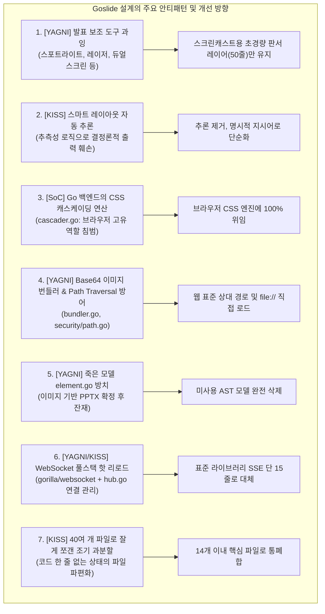

# Goslide 시스템 아키텍처 검토 및 단순화 분석 보고서 (Architecture Review Report)

> **문서 버전**: v1.0.0  
> **작성일**: 2026-10-02  
> **상태**: 검토 완료 (Reviewed)  
> **대상 문서**: [docs/architecture/index.md](file:///home/yundream/myjob/cloit/Goslide/docs/architecture/index.md) (v2.0.0)  
> **핵심 설계 원칙**: **YAGNI** (You Aren't Gonna Need It), **KISS** (Keep It Simple, Stupid), **SoC** (Separation of Concerns)

---

## 1. 검토 배경 및 목적

본 문서는 `docs/architecture_design.md`에 기술된 Goslide 시스템 아키텍처 및 상세 설계를 소프트웨어 공학의 기본 원칙인 **YAGNI(불필요한 기능 조기 구현 금지)**, **KISS(단순성 유지)**, **SoC(관심사의 분리)** 관점에서 비판적으로 재검토한 결과를 기록합니다.

초기 설계는 다양한 아이디어와 잠재적 요구사항을 포괄하려다 보니, 정작 프로젝트의 핵심 가치인 **"마크다운을 슬라이드(HTML, PDF, PPTX)로 빠르고 결정론적으로 변환한다"**는 본질을 벗어나 부가 기능과 가상의 문제를 해결하기 위한 오버엔지니어링(Over-engineering) 안티패턴이 다수 포함되었습니다. 본 보고서는 이러한 복잡도를 걷어내고 견고하고 유지보수하기 쉬운 린(Lean) 아키텍처를 정의하기 위한 개선 지침을 제공합니다.

---

## 2. 7대 오버엔지니어링 안티패턴 정밀 분석



---

### 2.1 [재정의 및 단순화] 발표 보조 도구 과잉 정리 & 스크린캐스트 특화 판서(Annotation) 레이어 유지
* **해당 영역**: `architecture_design.md` 75행, 206~209행, 346행 (`goslide-core.js`, `presenter.html`)
* **도메인 목적 및 유즈케이스 재정의**:
  - Goslide의 주 목적은 **"스크린캐스트 기반 유튜브 교육 영상 제작"**입니다.
  - 따라서 강사가 설명 도중 슬라이드 위에 밑줄을 긋거나 동그라미, 화살표를 그릴 수 있는 **판서(Annotation) 기능은 불필요한 장식이 아닌 핵심 가치(Core Value Proposition)**입니다.
* **제거 대상 (YAGNI 위반 장난감 도구들)**:
  - **레이저 포인터 SVG**: 스크린캐스트 녹화 시 마우스 커서 자체가 녹화되므로 완전 불필요.
  - **스포트라이트 마스크**: 교육 영상 편집 시 시각 흐름을 끊고 가독성을 저해함.
  - **화면 블라인드 (B/W)**: OBS 등 화면 녹화 소프트웨어의 장면 전환으로 충분히 대체 가능.
  - **BroadcastChannel 듀얼스크린**: 단일 화면 스크린 녹화 환경에서 불필요한 통신 오버헤드.
* **유지 및 구현 방안 (KISS 원칙 준수)**:
  - 복잡한 그래픽 엔진 대신, 슬라이드 상단에 **투명 `<canvas>` 레이어 1장**을 배치 (`pointer-events: none`).
  - **단축키 `D` (Draw 토글)**: `pointer-events: auto`로 전환하여 펜 모드 활성화 (마우스 3대 이벤트로 `ctx.stroke()` 선 긋기).
  - **단축키 `C` (Clear)**: `ctx.clearRect()` 단 1줄로 현재 슬라이드 판서 즉시 삭제.
  - **슬라이드 넘김 연동**: 슬라이드 이동 시 캔버스 자동 리셋.
  - **구현 복잡도**: 외부 라이브러리 없이 **순수 바닐라 JS 40~50줄 이내**로 초경량 구현.

---

### 2.2 [KISS] 스마트 레이아웃 자동 추론 엔진 (`inference.go`)
* **해당 영역**: `architecture_design.md` 119~133행, 328행 (`internal/parser/inference.go`)
* **분석 내용**:
  - `슬라이드 번호 == 1 && H1 헤딩 존재 && 코드 없음` $\rightarrow$ `cover` 자동 판정
  - `헤딩 1개 단독 존재 && 본문 2줄 이하` $\rightarrow$ `section` 간지 자동 판정
* **문제점 (Why it is an Anti-pattern)**:
  - 사용자의 마크다운 본문을 파서가 제멋대로 넘겨짚는 **추측성 로직(Speculative Logic)**입니다.
  - 작성자가 단순히 짧은 본문 슬라이드를 썼는데, 파서가 멋대로 배경이 반전된 '중간 간지(section)'로 바꿔버리면 사용자는 당황하고 예측 불가능한 결과(Non-deterministic output)를 낳습니다.
  - 파서 내부에 복잡한 예외 처리 분기와 엣지 케이스를 유발합니다.
* **개선 방안**:
  - `inference.go`를 완전 삭제합니다.
  - 기본 레이아웃은 무조건 `default`이며, 사용자가 원할 때만 `<!-- _layout: cover -->`를 명시적으로 작성하도록 단순화합니다.

---

### 2.3 [SoC 위반] 브라우저 CSS를 Go 백엔드가 계산하려는 테마 캐스케이더 (`cascader.go`)
* **해당 영역**: `architecture_design.md` 200~202행, 338행 (`internal/theme/cascader.go`)
* **분석 내용**:
  - 인라인 Scoped 주석 $\rightarrow$ `<style scoped>` $\rightarrow$ 전역 `<style>` $\rightarrow$ CLI 테마 $\rightarrow$ Frontmatter $\rightarrow$ 기본 테마의 **6단계 스타일 우선순위 캐스케이딩 연산기**.
* **문제점 (Why it is an Anti-pattern)**:
  - CSS의 **C**가 바로 **Cascading(계단식 상속)**입니다. 스타일 우선순위 계산은 브라우저 엔진이 가장 완벽하게 처리하는 브라우저 본연의 업무입니다.
  - Go 백엔드가 문자열 CSS를 파싱해서 어떤 스타일이 우선하는지 연산하고 있는 것은 **전형적인 바퀴의 재발명(Reinventing the wheel)**이자 관심사 분리(SoC) 위반입니다.
* **개선 방안**:
  - `cascader.go`를 삭제합니다.
  - Go 코드는 클래스(`class="slide layout-cover theme-dark"`)와 `<style>` 태그를 HTML에 덤프하기만 하고, 스타일 적용은 100% 브라우저 CSS 엔진에 맡깁니다.

---

### 2.4 [YAGNI] Base64 인라인 이미지 번들러 & Path Traversal 방어 모듈
* **해당 영역**: `architecture_design.md` 356행 (`bundler.go`), 382~385행 (`internal/security/path.go`)
* **분석 내용**:
  - `--standalone` 옵션을 위해 모든 로컬 이미지를 정규식/AST로 탐색하여 `data:image/png;base64,...`로 인라인 치환.
  - 이를 위해 상위 디렉토리 접근을 차단하는 보안 검증기 `ValidateSafePath` 구현.
* **문제점 (Why it is an Anti-pattern)**:
  - **33% 데이터 크기 팽창**: 바이너리 이미지를 텍스트로 바꾸어 파일 크기 및 DOM 파싱 부담 급증.
  - **연쇄적 복잡도 유발**: HTML이 거대해져 `chromedp`로 PDF/PPTX 변환 시 Data URI 길이 제한(2~32MB)에 걸려 또 다른 해결책(임시 HTTP 서버 등)을 모색해야 하는 악순환 초래.
  - **과도한 보안 제약**: 사용자가 자기 컴퓨터에서 로컬 프레젠테이션을 빌드하는데 상위 폴더(`../common-assets/logo.png`) 접근을 막는 비현실적 제약 발생.
* **개선 방안**:
  - `bundler.go`와 `internal/security/path.go`를 완전 삭제합니다.
  - 웹 표준대로 마크다운의 상대 경로(``)를 그대로 보존합니다.
  - 브라우저 및 `chromedp`는 로컬 `file://` 경로를 통해 원본 이미지를 직접 가볍고 빠르게 로드합니다.

---

### 2.5 [YAGNI] 죽은 모델 `element.go`와 과장된 PPTX 파이프라인
* **해당 영역**: `architecture_design.md` 319행 (`element.go`), 367~374행 (`internal/exporter/pptx/*`)
* **분석 내용**:
  - AST 구조화 노드 인터페이스 `internal/model/element.go` (`ElemHeading`, `ElemTable` 등).
  - PPTX 익스포터 내 `capture.go`, `packager.go`, `xml_builder.go`, `notes_builder.go`, `emu.go` 등으로 과도하게 분할.
* **문제점 (Why it is an Anti-pattern)**:
  - PPTX 익스포터는 브라우저와의 100% 시각 일치를 위해 **Chromedp 기반 고해상도 이미지 캡처 방식(`p:pic`)**으로 이미 확정되었습니다.
  - 따라서 AST 노드를 하나하나 분해하는 `element.go`는 사용처가 전혀 없는 **죽은 코드(Dead Code)**입니다.
  - PPTX 생성의 실체는 "슬라이드 캡처 후 Zip 압축"인데, 불필요하게 6개 파일로 과분할되었습니다.
* **개선 방안**:
  - `element.go`를 완전 삭제합니다.
  - PPTX 익스포터는 `exporter.go` 단일 파일(필요 시 zip 패키징 보조 파일 1개)로 단순화합니다.

---

### 2.6 [YAGNI/KISS] WebSocket 풀스택 핫 리로드 개발서버
* **해당 영역**: `architecture_design.md` 376~380행 (`hub.go`, `server.go`, `watcher.go`), 606행 (`gorilla/websocket`)
* **분석 내용**:
  - `fsnotify` 감지 후 WebSocket Hub를 통해 브라우저 클라이언트와 양방향 소켓 통신을 유지하며 슬라이드 위치 보존 리로드 수행.
* **문제점 (Why it is an Anti-pattern)**:
  - 파일 수정 감지 시 브라우저를 새로고침하는 것은 Go 표준 라이브러리(`net/http`)의 **SSE (Server-Sent Events) 단 15줄**이면 브라우저 내장 `EventSource`를 통해 완벽히 동작합니다.
  - 외부 라이브러리 `github.com/gorilla/websocket`을 의존성에 추가하고, 연결 풀/고루틴 라이프사이클을 관리하는 허브(`hub.go`)를 만드는 것은 전형적인 오버엔지니어링입니다.
* **개선 방안**:
  - `gorilla/websocket` 의존성을 제거합니다.
  - 표준 HTTP SSE 핸들러를 사용하여 핫 리로드를 극적으로 단순화합니다.

---

### 2.7 [KISS] 40여 개 파일로 잘게 쪼갠 조기 과분할 (Over-Modularization)
* **해당 영역**: `architecture_design.md` 299~420행
* **분석 내용**:
  - 아직 구현 코드 한 줄도 없는 시점에 패키지 10여 개, 소스 파일 40개 이상으로 잘게 쪼개짐.
* **문제점 (Why it is an Anti-pattern)**:
  - Go 언어는 간결함과 패키지 응집도를 지향합니다.
  - 코드가 길어지지도 않았는데 책임을 쪼개놓으면 파일 간 함수 점프만 늘어나고 인지 부하가 커집니다.
* **개선 방안**:
  - 초기 단계에는 패키지당 1~2개의 핵심 파일로 응집도 높게 작성하고, 향후 코드 크기가 수백 줄 이상 커질 때 자연스럽게 분리합니다.

---

## 3. 제거 및 단순화 대상 매트릭스

| 대상 컴포넌트/파일 | 원인 안티패턴 | 처리 방안 | 비고 |
| :--- | :--- | :---: | :--- |
| `internal/renderer/html/bundler.go` | [YAGNI/KISS] Base64 인라인 번들러 | **완전 삭제** | 마크다운 상대 경로 이미지 유지 |
| `internal/security/path.go` | [오버엔지니어링] 불필요한 보안 검증기 | **완전 삭제** | 표준 OS 파일 시스템 I/O 사용 |
| `internal/parser/inference.go` | [KISS 위반] 추측성 레이아웃 자동 판정 | **완전 삭제** | 명시적 지시어 처리로 단순화 |
| `internal/theme/cascader.go` | [SoC 위반] 백엔드에서 CSS 계산 | **완전 삭제** | 브라우저 CSS 엔진에 위임 |
| `internal/model/element.go` | [YAGNI] 이미지 PPTX에 불필요한 잔재 | **완전 삭제** | `LeftHTML`, `RightHTML`로 충분 |
| `goslide-core.js` 발표 보조 도구 | [YAGNI] 스포트라이트, 레이저, 블라인드 | **코드 제거 & 단순화** | 스크린캐스트용 초경량 판서 레이어(단축키 D, C)만 유지 |
| `gorilla/websocket`, `hub.go` | [YAGNI/KISS] 과도한 웹소켓 풀스택 | **의존성 삭제** | Go 표준 SSE 단 15줄로 대체 |
| PPTX 내부 6개 파일 분할 | [KISS 위반] 조기 과분할 | **통폐합** | `pptx.go` 단일 파일로 축소 |

---

## 4. 린(Lean) Goslide 단순화 아키텍처 (Target Architecture)

군더더기를 걷어내고 필수적인 핵심 파이프라인만 남긴 구조입니다:

```text
Goslide/
├── cmd/goslide/
│   ├── main.go               # Cobra CLI 엔트리포인트 (build, serve)
│   └── build.go              # 빌드 플래그 바인딩
│
├── internal/
│   ├── model/                # 코어 데이터 모델 (Zero Dependency)
│   │   ├── deck.go           # Deck, Slide, Directives 모델 정의
│   │   └── interfaces.go     # Parser, Renderer, Exporter 인터페이스
│   │
│   ├── parser/               # 마크다운 파서
│   │   ├── parser.go         # Frontmatter 분리 + Goldmark AST + 지시어 추출
│   │   └── highlight.go      # Chroma 코드 구문 강조
│   │
│   ├── theme/                # 테마 및 정적 에셋
│   │   ├── embed.go          # embed.FS (default.css, dark.css 내장)
│   │   └── theme.go          # 테마 CSS 로더
│   │
│   ├── renderer/
│   │   └── html.go           # html/template 기반 슬라이드 HTML 렌더러
│   │
│   ├── exporter/             # 외부 포맷 익스포터
│   │   ├── pdf.go            # chromedp 기반 벡터 PDF 인쇄 (file:// 로드)
│   │   └── pptx.go           # chromedp 캡처 + zip OpenXML 생성
│   │
│   └── server/               # 개발 서버 (Live Preview)
│       └── server.go         # net/http 정적 서빙 + SSE 리로드
│
├── testdata/                 # 골든 파일 회귀 검증 픽스처
├── go.mod
├── Makefile
└── README.md
```

### 필수 의존성 목록 (`go.mod`)
- `github.com/spf13/cobra` (CLI)
- `github.com/yuin/goldmark` (CommonMark AST)
- `gopkg.in/yaml.v3` (Frontmatter)
- `github.com/alecthomas/chroma/v2` (Pure Go 구문 강조)
- `github.com/chromedp/chromedp` (Headless 브라우저 제어)
- `github.com/fsnotify/fsnotify` (파일 감시)
- *(제거됨)*: `gorilla/websocket`

---

## 5. 결론 및 권고사항

1. **개발 생산성 및 품질 극대화**:
   - 파일 수를 40개에서 **14개 이내**로 축소함으로써 개발자가 핵심 로직(파서, 렌더러, 익스포터)에만 온전히 집중할 수 있습니다.
2. **버그 및 오버헤드 원천 차단**:
   - Base64 변환에 따른 메모리 누수, 웹소켓 끊김, 추측성 레이아웃 오판정 등의 잠재적 결함을 아키텍처 단계에서 원천 제거합니다.
3. **다음 실행 단계**:
   - 본 분석 보고서의 내용을 바탕으로 [`docs/architecture/index.md`](file:///home/yundream/myjob/cloit/Goslide/docs/architecture/index.md)를 린(Lean) 아키텍처로 개정(v2.0)하고, 곧바로 스프린트 1(M1-1 인프라 구축, M1-2 코어 파서) 구현에 착수할 것을 권장합니다.
