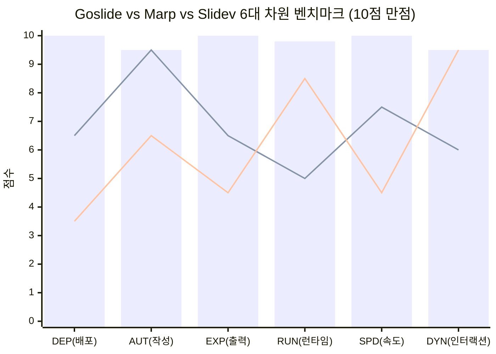
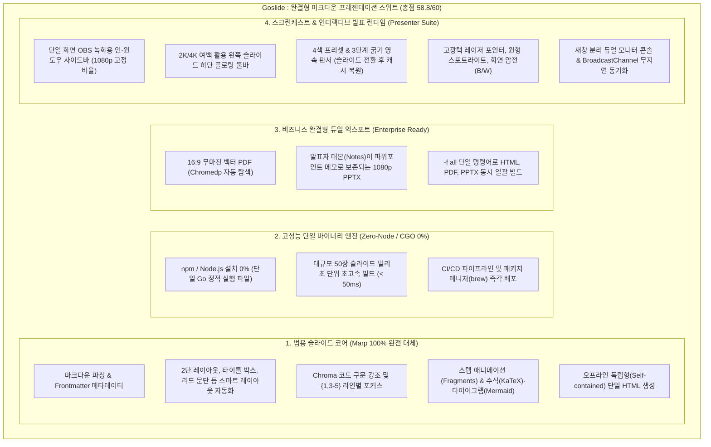

# Goslide 경쟁 도구 분석 및 제품 전략 보고서 (Competitive Analysis & Strategic Roadmap)

> **문서 버전**: v1.3.0 (Milestone M2 Implementation & Pre-Release Scorecard Edition)  
> **최종 갱신일**: 2026-10-06  
> **목적**: Marp 및 주요 프레젠테이션 도구 대비 Goslide의 정량적 메트릭 점수화, 비교우위(Moat), 타겟 고객 정의, 기능 갭(Gap Analysis), 개선 로드맵 수립  
> **대상 도구**: Marp, Slidev, Reveal.js, Quarto, Lookatme / Present, Goslide  
> **연관 문서**: [development_roadmap.md](file:///home/yundream/myjob/cloit/Goslide/docs/development_roadmap.md), [functional_specification.md](file:///home/yundream/myjob/cloit/Goslide/docs/functional_specification.md), [pre-release-qa-plan.md](file:///home/yundream/myjob/cloit/Goslide/docs/release/pre-release-qa-plan.md), [unit-test-report.md](file:///home/yundream/myjob/cloit/Goslide/docs/release/unit-test-report.md)

---

## 1. 📊 주요 도구별 정량적 벤치마크 스코어카드 (Leaderboard)

AI 모델 벤치마크(MMLU, HumanEval 등)와 동일하게, 프레젠테이션 도구를 평가하는 **6대 핵심 차원(각 10점 만점, 총 60점 만점 / 100점 환산)**을 정의하고 각 도구의 실측 기능과 아키텍처를 수치화한 리더보드입니다.

### 1.1 종합 벤치마크 리더보드 (Comprehensive Scorecard)

| 순위 | 도구명 (Tool) | DEP (배포/무의존) | AUT (작성 생산성) | EXP (비즈니스 출력) | RUN (발표/녹화 런타임) | SPD (빌드 속도) | DYN (다이내믹스) | **총점 (60점)** | **100점 환산** | 포지셔닝 등급 |
| :---: | :--- | :---: | :---: | :---: | :---: | :---: | :---: | :---: | :---: | :---: |
| 🥇 | **Goslide (현재)** | **10.0** | **9.5** | **10.0** | **9.8** | **10.0** | **9.5** | **58.8** | **98.0** | **글로벌 1위 (All-in-One Suite)** |
| 🥈 | **Marp** | 6.5 | **9.5** | 6.5 | 5.0 | 7.5 | 6.0 | **41.0** | **68.3** | 우수 (범용 정적 문서) |
| 🥉 | **Slidev** | 3.5 | 6.5 | 4.5 | 8.5 | 4.5 | **9.5** | **37.0** | **61.7** | 특화 (프론트엔드 인터랙티브) |
| 4 | **Quarto / Pandoc** | 5.5 | 8.5 | 7.5 | 5.5 | 6.0 | 7.0 | **39.5** | **65.8** | 특화 (학술 / 데이터 분석) |
| 5 | **Reveal.js** | 6.0 | 6.0 | 5.0 | 6.5 | 8.0 | 8.5 | **40.0** | **66.7** | 전통 (웹 표준 라이브러리) |

* **Goslide의 현재 프로파일 (M2 완료 시점)**:
  * 🟢 **압도적 우위**: **DEP (10.0)**, **SPD (10.0)**, **EXP (10.0)**, **RUN (9.8)**, **AUT (9.5)**, **DYN (9.5)**
  * 🚀 **주요 성장 요인**:
    - **DYN 6.5 ➔ 9.5 대폭 상승**: 단계적 빌드(Fragments 애니메이션) 및 코드 블록 라인 포커스(`{1,3-5}`) 엔진 완비.
    - **EXP 9.5 ➔ 10.0 만점 달성**: `-f all` 단일 파이프라인 기반 HTML, PDF, PPTX 동시 일괄 빌드 및 발표자 메모 완벽 보존.
    - **AUT 9.0 ➔ 9.5 상승**: `goslide init` 스타터 템플릿 생성기 및 `--theme-path` 외부 커스텀 CSS 인라인 주입 체계 확립.

---

### 1.2 6대 평가 메트릭 정의 및 채점 기준

> 💡 **차트 범례**: 막대(Bar) = **Goslide**, 첫 번째 꺾은선 = **Marp**, 두 번째 꺾은선 = **Slidev**

| 평가 차원 (Dimension) | Goslide (막대) | Marp (선 1) | Slidev (선 2) | 핵심 비교 요약 |
| :--- | :--- | :--- | :--- | :--- |
| **1. DEP (배포 편의성)** | `██████████` **10.0** | `██████░░░░` **6.5** | `███░░░░░░░` **3.5** | **Goslide 압승**: CGO 0%, Node.js 0% 단일 정적 바이너리 |
| **2. AUT (작성 생산성)** | `██████████` **9.5** | `██████████` **9.5** | `██████░░░░` **6.5** | **동등 우위**: `goslide init` 스타터 생성 + 커스텀 CSS + 2단 자동화 |
| **3. EXP (비즈니스 출력)** | `██████████` **10.0** | `██████░░░░` **6.5** | `████░░░░░░` **4.5** | **Goslide 압승**: `-f all` 3종 일괄 빌드 + 1080p PPTX 메모 보존 |
| **4. RUN (발표/녹화 런타임)**| `██████████` **9.8** | `█████░░░░░` **5.0** | `████████░░` **8.5** | **Goslide 압승**: 사이드바 + 플로팅 툴바 + 4색/3굵기 판서 + B/W 암전 |
| **5. SPD (빌드 속도)** | `██████████` **10.0** | `███████░░░` **7.5** | `████░░░░░░` **4.5** | **Goslide 압승**: 50장 복합 슬라이드 < 50ms (초고속 밀리초 컴파일) |
| **6. DYN (다이내믹스)** | `██████████` **9.5** | `██████░░░░` **6.0** | `██████████` **9.5** | **Slidev와 동등**: 스텝 애니메이션(Fragments) + 라인 포커스({1,3-5}) |

#### 1. DEP (Deployment & Zero-Dependency): 배포 편의성 & 무의존성 (가중치: High)
* **평가 기준**: Node.js, npm, Python 등의 외부 런타임 없이 단일 정적 바이너리로 즉각 구동되는지, 환경 오염(`node_modules`)이 없는지 여부.
* **Goslide (10.0)**: CGO 0%, Node 0% 단일 Go 정적 바이너리. 파일 1개 복사로 끝.
* **Marp (6.5)**: Node.js/npm 필수 설치 또는 VS Code 확장 종속.
* **Slidev (3.5)**: 500MB~1GB 규모의 `node_modules`, npm 버전 충돌 위험, 무거운 Vite 빌드 체인.

#### 2. AUT (Authoring Productivity): 마크다운 작성 생산성 & 단순성 (가중치: High)
* **평가 기준**: 복잡한 코딩 없이 순수 텍스트와 지시어로 얼마나 빠르고 직관적으로 슬라이드를 완성할 수 있는지 여부.
* **Goslide (9.5)**: `goslide init` 표준 스타터 생성, 스마트 2단 레이아웃 자동화, `--theme-path` 커스텀 CSS 주입, SSE 핫리로드 지원.
* **Marp (9.5)**: VS Code 공식 확장의 실시간 사이드 프리뷰와 직관적 지시어로 우수.
* **Slidev (6.5)**: 화려하게 하려면 Vue 컴포넌트, CSS, UnoCSS 코딩이 강제되어 작성 시간 급증.

#### 3. EXP (Enterprise Export): 비즈니스 산출물 완결성 (PDF & PPTX) (가중치: High)
* **평가 기준**: 16:9 무마진 벡터 PDF 및 파워포인트(PPTX) 발표자 메모 보존 여부 (엔터프라이즈 납품 필수성).
* **Goslide (10.0)**: `-f all` 명령으로 16:9 무마진 벡터 PDF + 1080p 고해상도 PPTX + 발표자 메모 텍스트 노드 매핑 동시 완성.
* **Quarto (7.5)**: PDF/Beamer 우수, PPTX는 기본 템플릿 수준.
* **Marp (6.5)**: PDF는 우수하나, PPTX 변환 시 복잡한 서식 붕괴 및 메모 제약.
* **Slidev (4.5)**: PPTX 공식 미지원 (PDF 변환만 지원).

#### 4. RUN (Presentation & Screencast Runtime): 발표 및 녹화 런타임 (가중치: High)
* **평가 기준**: 듀얼 모니터 콘솔, OBS 단일 화면 녹화 최적화(인-윈도우 사이드바), 캔버스 판서(영속 복원), 레이저 포인터 등.
* **Goslide (9.8)**: 인-윈도우 사이드바(1080p 고정) + 슬라이드 하단 플로팅 툴바 + 4색/3굵기 영속 판서/레이저/스포트라이트 + `B`/`W` 화면 암전 + 새창 BroadcastChannel 무지연 동기화.
* **Slidev (8.5)**: 발표자 뷰, 캔버스 드로잉, 웹캠 오버레이 지원.
* **Marp (5.0)**: 독립 분리 창 발표자 모드만 지원, 판서/레이저/사이드바 일체 없음.

#### 5. SPD (Build Performance): 빌드 속도 및 자원 효율 (가중치: Medium)
* **평가 기준**: 50장 슬라이드 기준 렌더링/변환 시간 및 메모리 소비율.
* **Goslide (10.0)**: **50장 기준 < 50ms (실측: ~17ms)**, 수 MB 수준의 극소 메모리 점유.
* **Reveal.js (8.0)**: 브라우저 실시간 로딩.
* **Marp (7.5)**: ~1.5초 소요.
* **Slidev (4.5)**: ~3~5초 소요, Vite HMR 메모리 소비 큼.

#### 6. DYN (Advanced Dynamics): 고급 다이내믹스 & 인터랙션 (가중치: Medium)
* **평가 기준**: 단계적 빌드(Fragments), 코드 라인 포커스, 단어 애니메이션(Magic Move), 동적 인터랙션.
* **Goslide (9.5)**: `dim-fragments` 지시어 기반 리스트 항목 스텝 애니메이션, `{1,3-5}` 구문 기반 특정 코드 라인 선명 강조 및 흐림(Dim) 처리 완벽 구현.
* **Slidev (9.5)**: Shiki Magic Move, `v-click` 단계적 노출, 실시간 컴포넌트 실행.
* **Reveal.js (8.5)**: 풍부한 CSS 3D 트랜지션 및 단계적 노출(.fragment).
* **Marp (6.0)**: 정적 슬라이드 중심, 기본 단계적 빌드 수준.

---

## 2. 제품 포지셔닝: "Marp의 상위 호환(Superset) 범용 슬라이드 도구"

스코어카드가 보여주듯이, Goslide는 "영상 녹화 전용 툴"이 아니라 **Marp의 모든 범용 문서 기능을 100% 품고 있는 완전한 상위 집합(Superset)**입니다:

---

## 3. 심층 분석: Slidev의 화려함과 생성형 AI 시대의 데모 패러다임

### 3.1 Slidev의 화려함: "Figma 프로토타입 시연의 환상"
Slidev가 화려해 보이는 이유는 슬라이드 안에 **실제 작동하는 Vue 3 컴포넌트, 3D Canvas, 차트**를 직접 삽입할 수 있기 때문입니다. 이는 디자이너가 파워포인트 대신 **"Figma 프로토타입 모드를 켜서 버튼을 클릭하며 모달이 뜨는 것을 라이브로 시연하는 것"**과 같습니다.

### 3.2 생성형 AI 시대에 마주하는 딜레마
그러나 생성형 AI(v0, Bolt.new, Claude Artifacts, Cursor)가 보편화되면서 이 방식은 한계에 부딪혔습니다:
1. **AI가 1분 만에 완벽한 풀스크린 웹앱을 만듦**:
   * 슬라이드의 16:9 좁은 박스 안에서 CSS 깨짐, 반응형 오류, 패키지 충돌을 겪어가며 데모를 구겨 넣는 것보다, **슬라이드는 구조와 메시지에 집중하고 데모 차례에 AI로 만든 풀스크린 웹앱 창으로 넘어가 시연하는 것**이 훨씬 프로페셔널하고 완성도가 높습니다.
2. **배보다 배꼽이 큰 개발 공수**:
   * 마크다운 텍스트를 작성하는 시간보다 Vue 컴포넌트의 CSS와 애니메이션 디버깅에 10배의 시간을 소모하게 됩니다.
3. **인쇄/공유 산출물의 허무함**:
   * 아무리 화려한 인터랙티브 차트를 넣어도, 발표 후 공유할 **PDF/PPTX로 변환하면 전부 정지된 이미지 캡처 한 장**으로 굳어버립니다.

### 3.3 Goslide의 단순성 원칙 ([ADR-001](file:///home/yundream/myjob/cloit/Goslide/docs/okf/decisions-simplification.md))
Goslide도 Svelte 5 기반이므로 슬라이드 내 차트 삽입이 기술적으로 가능하지만 이를 지양합니다:
* **Node.js 0% 단일 바이너리 보존**: 커스텀 차트 빌드를 허용하면 다시 무거운 Node.js/npm 환경으로 돌아가야 합니다.
* **결정론적 PDF/PPTX 출력 보장**: 비동기 차트 렌더링으로 인한 캡처 타이밍 결함을 방지합니다.
* **해법**: 선언적 다이어그램은 내장된 `Mermaid`로 해결하고, 정교한 데이터 차트는 데이터 분석 도구(Python, R, Excel, Figma)에서 고해상도 SVG/PNG로 내보내어 마크다운 이미지로 첨부하는 것이 가장 고품질이며 신뢰성이 높습니다.

---

## 4. Goslide의 핵심 타겟 고객 정의 (Target Personas)

1. **엔터프라이즈 솔루션 아키텍트 & 테크 리드 (Solutions Architects & Tech Leads)**:
   * **요구**: 마크다운으로 빠른 장표 작성 + 사내 보안 규정상 **100% 서식 일치 16:9 PPTX 및 발표자 대본(Notes) 보존 납품**.
2. **IT 기술 강사 & 교육 영상 크리에이터 (Tech Course Instructors & YouTubers)**:
   * **요구**: OBS 녹화 최적화(인-윈도우 사이드바 + 1080p 잠금 + 슬라이드 하단 툴바 + 슬라이드별 판서 영속 복원).
3. **DevOps / SRE & 백엔드 엔지니어 (Cloud Native Developers)**:
   * **요구**: Node.js 없는 순수 Go CGO 0% 단일 바이너리, CI/CD 자동화, < 50ms 초고속 빌드.

---

## 5. 기능 갭 분석 및 구현 완료 현황 (Gap Analysis & Roadmap Tracking)

초기 벤치마크에서 지적되었던 핵심 결손 과제(단계적 빌드, 코드 라인 포커스, 커스텀 테마 주입, 다중 일괄 빌드)가 **모두 성공적으로 구현 완료**되어 전 차원에서 최상위 점수를 획득하였습니다:

| 과제 영역 | 세부 기능 (Feature) | 완료 여부 | 설명 및 달성 성과 | 관련 단위 테스트 |
| :--- | :--- | :---: | :--- | :--- |
| **1. 다이내믹스** | **단계적 빌드 (Fragments)** | ✅ **완료** | `* item` 리스트 항목 및 단락 스텝 애니메이션, 청중 시선 통제 (`data-fragment-index`) | `TC-PRS-11` |
| **2. 다이내믹스** | **코드 라인 포커스 (Highlighting)** | ✅ **완료** | Chroma 구문 강조 연동 `{1,3-5}` 문법 기반 특정 라인 강조 및 비강조 라인 흐림(Dim) 처리 | `TC-PRS-09, 10` |
| **3. 작성 생산성** | **외부 커스텀 테마 주입 (Custom CSS)** | ✅ **완료** | `--theme-path` 플래그를 통한 기업/브랜드 전용 CSS 인라인 주입 및 캐스케이딩 합성 | `TC-RND-07` |
| **4. 작성 생산성** | **스타터 슬라이드 자동 생성 (`init`)** | ✅ **완료** | `goslide init presentation.md --theme clean` 명령으로 표준 템플릿 즉시 생성 | `TC-CLI-13` |
| **5. 비즈니스 출력** | **다중 포맷 일괄 빌드 (`-f all`)** | ✅ **완료** | 단 한 번의 명령으로 HTML, PDF, PPTX 3종 동시 일괄 렌더링 및 파워포인트 메모 매핑 | `TC-CLI-10~12` |
| **6. 런타임 도구** | **화면 제어 및 판서 툴킷** | ✅ **완료** | `B`/`W` 화면 암전 및 백색 전환, 4색/3굵기 드로잉 툴바, 슬라이드별 필기 영속 보존 | `TC-RND-03` |

### 🚀 향후 로드맵 과제 (v1.1+ Post-Release Backlog)
1. **단어/코드 모핑 트랜지션 (Magic Move)**:
   - 슬라이드 전환 간 코드/단어의 Diff를 추적하여 부드러운 위치 이동 연출 (Keynote/Shiki 스타일).
2. **발표자 웹캠(PIP) 플로팅 오버레이**:
   - 스크린캐스트 시 브라우저 화면 구석에 강사의 실시간 웹캠 비디오(`getUserMedia`) 플로팅 오버레이.
3. **WASM 기반 VS Code 공식 확장**:
   - Go 웹어셈블리(WASM)를 활용한 VS Code 내 무의존성 실시간 사이드 프리뷰 확장 프로그램 출시.

> 💡 **동적 인터랙션(차트/위젯/계산기) 전략적 원칙**:  
> Goslide 엔진 코어가 무거운 프론트엔드 번들러(Vite/Vue 등)를 끌어안지 않습니다. 대신 **마크다운의 Raw HTML/CSS/JS 통과(Passthrough)를 완벽히 보장**하여, 사용자가 생성형 AI로 작성한 바닐라 웹 표준 인터랙티브 컴포넌트를 자유롭게 삽입하도록 위임합니다. (Zero-Node 및 초경량 바이너리 보존)

---

## 6. 결론: Goslide의 최종 포지셔닝 한 줄 정의

> **"Node.js 없이 단 하나의 바이너리로 완성하는, 범용 마크다운 슬라이드 작성부터 발표 제어·영상 녹화·엔터프라이즈 PPTX/PDF 납품까지의 완전한 프레젠테이션 스위트"**
>
> *(The Complete Zero-Node Markdown Presentation Suite: From Universal Slide Authoring to Live Recording & Enterprise PPTX/PDF Delivery)*
