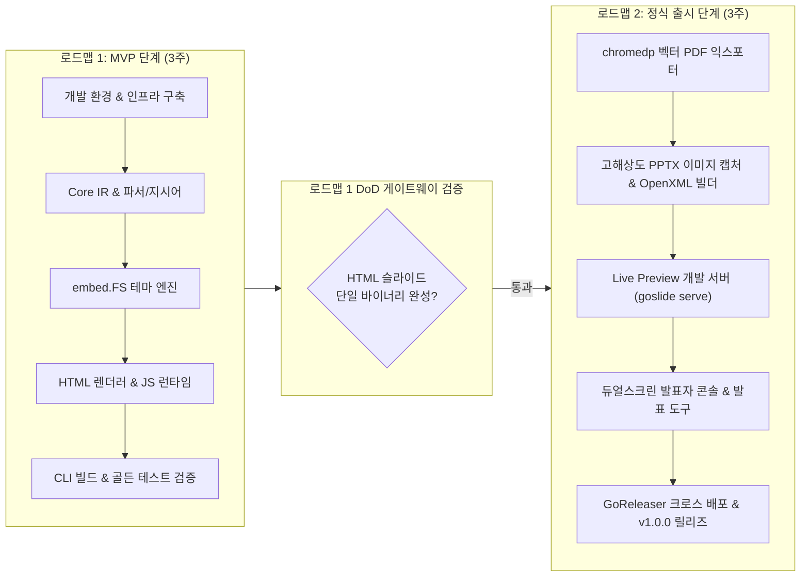

# Goslide 단계별 개발 로드맵 및 일정 계획서 (Development Roadmap & Schedule Plan)

> **문서 버전**: v1.0.0  
> **작성일**: 2026-10-02  
> **상태**: 확정 (Approved for Implementation)  
> **기반 문서**: [functional_specification.md](file:///home/yundream/myjob/cloit/Goslide/docs/functional_specification.md), [architecture_design.md](file:///home/yundream/myjob/cloit/Goslide/docs/architecture_design.md), [project_plan.md](file:///home/yundream/myjob/cloit/Goslide/docs/project_plan.md), [AGENTS.md](file:///home/yundream/myjob/cloit/Goslide/AGENTS.md)

---

## 1. 개요 및 2단계 분할 전략 (Strategic Two-Phase Approach)

본 문서는 Go 기반 고성능 슬라이드 데크 빌더 **Goslide**의 개발 일정을 2개의 핵심 로드맵으로 분할하여 단계적으로 실행하기 위한 세부 일정 계획서입니다.

### 1.1 분할 기본 원칙
1. **로드맵 1 (MVP 단계: Foundation & HTML MVP)**:
   - **원칙**: 복잡한 외부 프로세스 연동(PDF, PPTX)을 철저히 배제하고, 순수 Go 기반의 도메인 아키텍처, 파서 파이프라인, 테마 캐스케이딩, 그리고 웹 브라우저에서 실행 가능한 **인터랙티브 HTML 슬라이드 생성**에 역량을 집중합니다.
   - **산출 목표**: CGO 의존성 없는 단일 바이너리(`goslide`), `goslide build talk.md -o talk.html --standalone` 지원.
2. **로드맵 2 (정식 출시 단계: Production Release & Exporters)**:
   - **원칙**: 로드맵 1에서 견고하게 검증된 Core IR과 렌더링 결과물을 재활용하여 **PDF/PPTX 익스포터, 실시간 개발 서버(`serve`), 듀얼 윈도우 발표자 콘솔, 크로스 플랫폼 릴리즈 파이프라인**을 완성합니다.
   - **산출 목표**: 정식 v1.0.0 출시, 다중 포맷 일괄 빌드(`--format=html,pdf,pptx`), OS별 자동 배포.

---

## 2. 전체 일정 요약 타임라인 (Timeline Overview)

| 로드맵 | 주차 | 마일스톤 ID | 마일스톤 명칭 | 마감일 (Due Date) | 연관 Jira 티켓 | 핵심 목표 및 산출물 |
| :--- | :---: | :---: | :--- | :---: | :---: | :--- |
| **로드맵 1 (MVP)** | **1주차** | `M1-1` | 개발 환경 및 인프라 구축 | **2026-10-06** | [GOS-2](https://joincdream.atlassian.net/browse/GOS-2) | Go 모듈, 린트, 테스트 스위트, CI 파이프라인, 14개 파일 린 패키지 스캐폴딩 |
| | | `M1-2` | 도메인 IR 및 코어 마크다운 파서 | **2026-10-09** | [GOS-3](https://joincdream.atlassian.net/browse/GOS-3) | `model.Deck`, `model.Slide`, Frontmatter YAML 파서, 슬라이드 분할기 |
| | **2주차** | `M1-3` | 지시어 및 레이아웃 처리 | **2026-10-14** | [GOS-4](https://joincdream.atlassian.net/browse/GOS-4) | 인라인 지시어, 명시적 레이아웃(`cover`, `two-cols`), Chroma 구문 강조 |
| | | `M1-4` | 테마 시스템 및 내장 에셋 파이프라인 | **2026-10-16** | [GOS-5](https://joincdream.atlassian.net/browse/GOS-5) | `embed.FS` 기반 CSS 3종(`default`, `clean`, `dark`), 브라우저 네이티브 CSS 위임 |
| | **3주차** | `M1-5` | HTML 렌더러 및 슬라이드 런타임 | **2026-10-21** | [GOS-6](https://joincdream.atlassian.net/browse/GOS-6) | `html/template` 합성기, 키보드 제어 및 스크린캐스트 캔버스 판서(`D`/`C` 키) |
| | | `M1-6` | CLI 통합 빌드 및 MVP 품질 검증 | **2026-10-23** | [GOS-7](https://joincdream.atlassian.net/browse/GOS-7) | `goslide build` 명령어 완성, 골든 파일 회귀 검증, 벤치마크 (< 500ms) |
| **로드맵 2 (출시)** | **4주차** | `M2-1` | Headless 벡터 PDF 익스포터 | **2026-10-27** | [GOS-8](https://joincdream.atlassian.net/browse/GOS-8) | `chromedp` 프로세스 라이프사이클 제어, CSS `@page` 무마진 벡터 PDF 인쇄 |
| | | `M2-2` | 고해상도 PPTX 익스포터 | **2026-10-30** | [GOS-9](https://joincdream.atlassian.net/browse/GOS-9) | 슬라이드별 DOM 2x 캡처, OpenXML 단일 파일(`exporter.go`) 패키징, 발표자 메모 연동 |
| | **5주차** | `M2-3` | 실시간 라이브 프리뷰 개발 서버 | **2026-11-04** | [GOS-10](https://joincdream.atlassian.net/browse/GOS-10) | `net/http` 웹 서버, `fsnotify` 파일 감시, 표준 SSE(Server-Sent Events) 핫 리로드 |
| | | `M2-4` | 고급 발표자 도구 킷 완성 | **2026-11-06** | [GOS-11](https://joincdream.atlassian.net/browse/GOS-11) | 듀얼 스크린 발표자 콘솔(`P`), 레이저 포인터(`L`), 스포트라이트(`S`) |
| | **6주차** | `M2-5` | CLI 편의 기능 및 배포 자동화 | **2026-11-13** | [GOS-12](https://joincdream.atlassian.net/browse/GOS-12) | `goslide init`, `pkg/goslide` 퍼블릭 API, GoReleaser 멀티플랫폼 릴리즈 (v1.0.0) |

---

## 3. 로드맵 1: MVP 단계 상세 계획 (3주)

### 3.1 [Sprint 1 / 1주차] 개발 기반 조성 및 코어 파서 구축

#### 마일스톤 M1-1: 프로젝트 베이스라인 및 개발 인프라 구축 ([GOS-2](https://joincdream.atlassian.net/browse/GOS-2))
- **마감일 (Due Date)**: 2026-10-06
- **기간**: 1주차 1~2일차
- **담당 패키지**: 루트 인프라, `.github/workflows/`
- **상세 태스크**:
  1. `go.mod` (Go 1.22+) 초기화 및 프로젝트 기본 설정.
  2. [architecture_design.md](file:///home/yundream/myjob/cloit/Goslide/docs/architecture_design.md#L273-L318)에 정의된 14개 파일 린 디렉토리 구조 스캐폴딩:
     - `cmd/goslide/`, `pkg/goslide/`, `internal/{model,parser,theme,renderer,exporter,server,testutil}`, `testdata/`
  3. `Makefile` 작성 (`build`, `test`, `test-race`, `lint`, `golden-update`).
  4. `.golangci.yml` 린터 룰셋 구성 (errcheck, gosimple, govet, ineffassign, staticcheck, unused 등).
  5. GitHub Actions CI 워크플로우 구성 (`.github/workflows/ci.yml`).
- **완료 기준 (DoD)**:
  - `make lint` 및 `go vet ./...` 경고 0건.
  - CGO를 배제한 `CGO_ENABLED=0 go build ./...` 성공.

#### 마일스톤 M1-2: 도메인 IR 및 코어 마크다운 파서 개발 ([GOS-3](https://joincdream.atlassian.net/browse/GOS-3))
- **마감일 (Due Date)**: 2026-10-09
- **기간**: 1주차 3~5일차
- **담당 패키지**: [`internal/model`](file:///home/yundream/myjob/cloit/Goslide/docs/architecture_design.md#L303-L308), [`internal/parser`](file:///home/yundream/myjob/cloit/Goslide/docs/architecture_design.md#L310-L321)
- **상세 태스크**:
  1. [`internal/model`](file:///home/yundream/myjob/cloit/Goslide/docs/architecture_design.md#L303-L308): 불변 IR 구조체 선언 ([`Deck`](file:///home/yundream/myjob/cloit/Goslide/docs/architecture_design.md#L397-L404), [`Slide`](file:///home/yundream/myjob/cloit/Goslide/docs/architecture_design.md#L407-L416), [`GlobalDirectives`](file:///home/yundream/myjob/cloit/Goslide/docs/functional_specification.md#L233-L240), [`SlideDirectives`](file:///home/yundream/myjob/cloit/Goslide/docs/functional_specification.md#L256-L265)) 및 코어 인터페이스 ([`Parser`](file:///home/yundream/myjob/cloit/Goslide/docs/architecture_design.md#L357-L359), [`Renderer`](file:///home/yundream/myjob/cloit/Goslide/docs/architecture_design.md#L362-L364)).
  2. 도메인 센티넬 에러 정의 ([`errors.go`](file:///home/yundream/myjob/cloit/Goslide/docs/architecture_design.md#L561-L569)).
  3. [`internal/parser/frontmatter.go`](file:///home/yundream/myjob/cloit/Goslide/docs/architecture_design.md#L313): YAML Frontmatter 블록 추출 및 `gopkg.in/yaml.v3` 언마샬링.
  4. [`internal/parser/splitter.go`](file:///home/yundream/myjob/cloit/Goslide/docs/architecture_design.md#L312): 수평선(`---`) 기준 슬라이드 분할기 구현 (코드블록 Fenced Block 내의 `---` 제외 예외 처리 보장).
  5. `Goldmark` 파서 초기화 및 GFM 확장(테이블, 체크리스트, 취소선) 활성화.
- **완료 기준 (DoD)**:
  - Frontmatter 파싱 및 슬라이드 분할 테이블 기반 단위 테스트 20개 이상 통과 (`parser_test.go`, `splitter_test.go`).
  - 코드 블록 내부의 `---`가 슬라이드로 잘못 분할되지 않음을 검증.

---

### 3.2 [Sprint 2 / 2주차] 지시어, 레이아웃 및 테마 시스템 구축

#### 마일스톤 M1-3: 지시어 파서 및 명시적 레이아웃 엔진 ([GOS-4](https://joincdream.atlassian.net/browse/GOS-4))
- **마감일 (Due Date)**: 2026-10-14
- **기간**: 2주차 1~3일차
- **담당 패키지**: [`internal/parser`](file:///home/yundream/myjob/cloit/Goslide/docs/architecture_design.md#L283-L287)
- **상세 태스크**:
  1. [`internal/parser/directive.go`](file:///home/yundream/myjob/cloit/Goslide/docs/architecture_design.md#L286): 인라인 HTML 주석 지시어(`<!-- key: value -->`) 및 발표자 노트(`<!-- note: ... -->`) 토크나이저 개발.
  2. 전역 상속 지시어 vs 슬라이드 국소 지시어(`_` 언더스코어 접두사) 스코프 처리.
  3. 명시적 레이아웃 매핑 (YAGNI/KISS: 추측 배제, 작성자가 지정한 지시어 기준 결정론적 렌더링):
     - `<!-- layout: cover -->` $\rightarrow$ 중앙 정렬 타이틀 슬라이드
     - `<!-- layout: two-cols -->` or `<!-- split -->` $\rightarrow$ 좌/우 2단 그리드
     - 기본값 $\rightarrow$ `default` 일반 슬라이드
  4. [`internal/parser/highlight.go`](file:///home/yundream/myjob/cloit/Goslide/docs/architecture_design.md#L287): `alecthomas/chroma/v2` 기반 순수 Go 구문 강조 렌더러 연동.
  5. KaTeX 수식 인라인(`$...$`) 및 블록(`$$...$$`) 구문 지원 연동.
- **완료 기준 (DoD)**:
  - 지시어 파싱 및 명시적 레이아웃 매핑 단위 테스트 통과 (`directive_test.go`).
  - 주요 언어(Go, Python, JSON, Bash 등) 코드 블록 구문 강조 HTML 스팬 정상 생성 확인.

#### 마일스톤 M1-4: 테마 시스템 및 내장 정적 에셋 파이프라인 ([GOS-5](https://joincdream.atlassian.net/browse/GOS-5))
- **마감일 (Due Date)**: 2026-10-16
- **기간**: 2주차 4~5일차
- **담당 패키지**: [`internal/theme`](file:///home/yundream/myjob/cloit/Goslide/docs/architecture_design.md#L288-L293)
- **상세 태스크**:
  1. [`internal/theme/embed.go`](file:///home/yundream/myjob/cloit/Goslide/docs/architecture_design.md#L291): Go `embed.FS`를 활용한 테마 CSS 및 정적 에셋 내장 체계 구현.
  2. 핵심 테마 CSS 3종 작성:
     - `base.css`: 슬라이드 뷰포트 규격, 16:9/4:3 반응형 비율, 기본 타이포그래피.
     - `default.css`: Pretendard 기반 기술 발표 표준 테마.
     - `clean.css`: Inter 기반 미니멀 라이트 테마.
     - `dark.css`: One Dark 컬러 팔레트 다크 테마.
  3. 브라우저 네이티브 CSS 캐스케이딩 위임 (복잡한 Go단 캐스케이더 연산 제거, `<style>` 태그 순서 배치로 브라우저에 위임).
- **완료 기준 (DoD)**:
  - 테마 CSS 로딩 및 HTML 템플릿 인라인 주입 단위 테스트 통과 (`theme_test.go`).
  - 사용자 커스텀 CSS 파일 지정 시 오버라이드 동작 검증.

---

### 3.3 [Sprint 3 / 3주차] HTML 렌더러, 네비게이션 런타임 및 MVP 출시

#### 마일스톤 M1-5: HTML 렌더러 및 브라우저 네비게이션/판서 런타임 ([GOS-6](https://joincdream.atlassian.net/browse/GOS-6))
- **마감일 (Due Date)**: 2026-10-21
- **기간**: 3주차 1~3일차
- **담당 패키지**: [`internal/renderer/html`](file:///home/yundream/myjob/cloit/Goslide/docs/architecture_design.md#L294-L297), `internal/theme/assets/`
- **상세 태스크**:
  1. [`internal/renderer/html/renderer.go`](file:///home/yundream/myjob/cloit/Goslide/docs/architecture_design.md#L295): `model.Renderer` 인터페이스 구현체 작성.
  2. `html/template` 기반 슬라이드 HTML 도큐먼트 합성 로직 (`slide.html`).
  3. 브라우저 슬라이드 코어 JS 작성 (`goslide-core.js`):
     - 방향키, Space, PageUp/Down, Home/End 슬라이드 이동.
     - 숫자 키 + Enter로 특정 슬라이드 즉시 점프.
     - `F` 키를 이용한 전체화면 모드 토글.
     - 슬라이드 하단 페이지 인디케이터(`3 / 24`).
     - **유튜브 스크린캐스트용 투명 캔버스 판서 오버레이** (50줄 바닐라 JS: `D` 키 펜 토글, 드래그 드로잉, `C` 키 즉시 지우기).
- **완료 기준 (DoD)**:
  - 완전한 독립형 단일 `.html` 파일 정상 생성 및 오프라인 구동 확인.
  - 키보드 인터랙션 및 캔버스 판서(`D`/`C` 키) 동작 검증.

#### 마일스톤 M1-6: CLI 빌드 통합 및 MVP 게이트웨이 검증 ([GOS-7](https://joincdream.atlassian.net/browse/GOS-7))
- **마감일 (Due Date)**: 2026-10-23
- **기간**: 3주차 4~5일차
- **담당 패키지**: [`cmd/goslide`](file:///home/yundream/myjob/cloit/Goslide/docs/architecture_design.md#L299-L306), [`internal/testutil`](file:///home/yundream/myjob/cloit/Goslide/docs/architecture_design.md#L373-L376), `testdata/`
- **상세 태스크**:
  1. Cobra 기반 CLI 진입점 구현:
     - `cmd/goslide/main.go`, `root.go`
     - `cmd/goslide/build.go` (`goslide build <input.md> -o <out.html> [flags]`)
     - 전역 플래그 바인딩 (`--verbose`, `--quiet`, `--standalone`, `--theme-path`)
  2. 골든 파일 회귀 테스트 스위트 구축:
     - `testdata/slides/*.md` 픽스처 작성 (기본, 2단, 수식, 코드블록 등).
     - `internal/testutil/golden.go` 골든 파일 비교 및 `-update` 플래그 지원.
  3. 성능 벤치마크 테스트: 50장 슬라이드 HTML 변환 시간 측정 (목표: 500ms 미만).
  4. **로드맵 1 게이트웨이 리뷰 (MVP 완료 선언)**.
- **완료 기준 (DoD)**:
  - `goslide build example.md -o index.html --standalone` 단일 실행 파일로 정상 빌드 완료.
  - `go test -v -race ./...` 전 모듈 통과.
  - 골든 파일 회귀 검증 100% 일치.

---

## 4. 로드맵 2: 정식 출시 단계 상세 계획 (3주)

### 4.1 [Sprint 4 / 4주차] 멀티 포맷 익스포터 (PDF & PPTX) 구현

#### 마일스톤 M2-1: chromedp 기반 벡터 PDF 익스포터 ([GOS-8](https://joincdream.atlassian.net/browse/GOS-8))
- **마감일 (Due Date)**: 2026-10-27
- **기간**: 4주차 1~2일차
- **담당 패키지**: [`internal/exporter/pdf`](file:///home/yundream/myjob/cloit/Goslide/docs/architecture_design.md#L349-L355)
- **상세 태스크**:
  1. `model.Exporter` 인터페이스 구현체 작성 (`internal/exporter/pdf/exporter.go`).
  2. 시스템 Chrome/Chromium 바이너리 자동 탐색기 (`browser.go`, OS별 기본 경로 및 `GOSLIDE_CHROME_BIN`).
  3. Headless Chrome 프로세스 라이프사이클 및 타임아웃 격리:
     - `chromedp.NewExecAllocator` 생성 및 `defer cancelAlloc` 좀비 프로세스 방지.
     - 최대 30초 컨텍스트 타임아웃 (`context.WithTimeout`).
  4. `Page.printToPDF` API 연동 및 CSS `@page { size: 16:9; margin: 0; }` 인쇄 파이프라인.
- **완료 기준 (DoD)**:
  - `goslide build talk.md -f pdf -o talk.pdf` 실행 시 고해상도 벡터 PDF 생성.
  - 생성된 PDF의 매직 넘버(`%PDF-`) 및 16:9 비율 무결성 검증.
  - 비정상 종료 시 시스템에 Chrome 백그라운드 프로세스가 남지 않음을 검증.

#### 마일스톤 M2-2: 고해상도 PPTX 캡처 및 OpenXML 패키징 빌더 ([GOS-9](https://joincdream.atlassian.net/browse/GOS-9))
- **마감일 (Due Date)**: 2026-10-30
- **기간**: 4주차 3~5일차
- **담당 패키지**: [`internal/exporter/pptx`](file:///home/yundream/myjob/cloit/Goslide/docs/architecture_design.md#L302-L305)
- **상세 태스크**:
  1. `model.Exporter` 인터페이스 구현체 작성 (`internal/exporter/pptx/exporter.go`).
  2. chromedp 기반 슬라이드별 DOM 뷰포트 고해상도(1920x1080 @ 2x Scale) 스크린샷 순차 캡처 파이프라인.
  3. Go 표준 `archive/zip` 라이브러리를 활용한 OpenXML(OPC) zip 패키징 및 단일 파일 완성 (`exporter.go` 내 응집):
     - `[Content_Types].xml`, `_rels/.rels`, `ppt/presentation.xml`, `ppt/slides/slideX.xml`
     - 16:9 슬라이드 크기 EMU 매핑 ($12,192,000 \times 6,858,000\text{ EMU}$, `p:pic` 풀스크린 매핑)
     - 발표자 메모 연동 (`ppt/notesSlides/notesSlideX.xml`).
- **완료 기준 (DoD)**:
  - `goslide build talk.md -f pptx -o talk.pptx` 실행 시 정상 열람 가능한 파워포인트 파일 생성.
  - MS PowerPoint에서 열었을 때 HTML 화면과 100% 시각적 일치(Pixel-Perfect) 확인.
  - 파워포인트 발표자 보기에서 마크다운 발표자 메모가 정상 노출됨을 검증.

---

### 4.2 [Sprint 5 / 5주차] 실시간 개발 서버 및 고급 발표자 툴킷

#### 마일스톤 M2-3: 실시간 Live Preview 로컬 개발 서버 ([GOS-10](https://joincdream.atlassian.net/browse/GOS-10))
- **마감일 (Due Date)**: 2026-11-04
- **기간**: 5주차 1~2일차
- **담당 패키지**: [`internal/server`](file:///home/yundream/myjob/cloit/Goslide/docs/architecture_design.md#L306-L309), `cmd/goslide/serve.go`
- **상세 태스크**:
  1. Go `net/http` 기반 초경량 슬라이드 호스팅 서버 구현 (`server.go`).
  2. `fsnotify` 기반 소스 마크다운 파일 감시.
  3. Go 표준 라이브러리 기반 SSE (Server-Sent Events) 브로드캐스터 구현 (`sse.go`): 외부 WebSocket 의존성 제거, 변경 감지 시 `event: reload\ndata: {"slideIndex": N}\n\n` 스트리밍.
  4. 클라이언트 위치 보존: 핫 리로드 시 사용자가 보고 있던 슬라이드 번호(`currentSlide`) 유지.
- **완료 기준 (DoD)**:
  - `goslide serve presentation.md --port=8080` 실행 후 마크다운 수정 시 300ms 이내에 브라우저 자동 갱신 확인.
  - 슬라이드 편집 중 첫 페이지로 리셋되지 않고 현재 페이지가 유지됨을 확인.
  - 외부 WebSocket 라이브러리 없이 Go 표준 `net/http`만으로 통신 성공 검증.

#### 마일스톤 M2-4: 고급 인터랙티브 발표자 도구 킷 ([GOS-11](https://joincdream.atlassian.net/browse/GOS-11))
- **마감일 (Due Date)**: 2026-11-06
- **기간**: 5주차 3~5일차
- **담당 패키지**: `internal/theme/assets/js/goslide-core.js`, `presenter.html`
- **상세 태스크**:
  1. 듀얼 윈도우 발표자 콘솔 (`P` 키):
     - `BroadcastChannel` 기반 메인 화면과 발표자 창 간 무지연 양방향 실시간 동기화.
     - 현재 슬라이드, 다음 슬라이드 미리보기, 발표자 메모 리치 텍스트 렌더링.
     - 발표 경과 시간 타이머, 현재 시각, 목표 시간 카운트다운 및 진행률 바.
  2. 시선 집중 도구:
     - 레이저 포인터(`L` 키): 마우스 커서 위치에 발광 레드 도트 애니메이션.
     - 스포트라이트(`S` 키): 마우스 주변 원형 영역 외 어두운 딤 마스크 오버레이.
     - 화면 블라인드(`B` 키 블랙아웃, `W` 키 화이트아웃).
  3. 인-슬라이드 드로잉 캔버스 (`D` 키):
     - HTML5 `<canvas>` 오버레이 기반 자유 필기, 펜 색상 변경, 슬라이드별 필기 내용 유지 및 지우기(`C` 키).
  4. 플로팅 컨트롤 바 및 그리드 개요 모드 (`O` or `ESC` 키).
- **완료 기준 (DoD)**:
  - 듀얼 모니터 환경에서 `P` 키로 발표자 창 분리 후 슬라이드 넘김 및 레이저 포인터 동기화 검증.
  - 캔버스 필기 및 스포트라이트 모드 정상 작동 검증.

---

### 4.3 [Sprint 6 / 6주차] CLI 편의 기능 및 배포 자동화 (v1.0.0 릴리즈)

#### 마일스톤 M2-5: CLI 고도화, GoReleaser 배포 및 공식 릴리즈 ([GOS-12](https://joincdream.atlassian.net/browse/GOS-12))
- **마감일 (Due Date)**: 2026-11-13
- **기간**: 6주차 1~5일차
- **담당 패키지**: `cmd/goslide/`, [`pkg/goslide`](file:///home/yundream/myjob/cloit/Goslide/docs/architecture_design.md#L308-L312), `.goreleaser.yaml`, `.github/workflows/release.yml`
- **상세 태스크**:
  1. 템플릿 생성기 `goslide init [filename.md] --theme=default` 커맨드 구현.
  2. 서드파티 Go 애플리케이션 연동을 위한 Public Facade API 확립 (`pkg/goslide/goslide.go`).
  3. GoReleaser 크로스 컴파일 파이프라인 구성:
     - OS/Arch 매트릭스: `linux/amd64`, `linux/arm64`, `darwin/amd64`, `darwin/arm64`, `windows/amd64`
     - 체크섬(`checksums.txt`) 및 아카이브 패키징 자동화.
  4. 최종 통합 회귀 테스트 및 메모리 누수 점검:
     - 50장 슬라이드 일괄 빌드 (`--format=html,pdf,pptx`) 메모리 피크 100MB 이하 검증.
     - 동시성 데이터 레이스 점검 (`go test -race ./...`).
  5. **공식 v1.0.0 태그 릴리즈 및 릴리즈 노트 배포**.
- **완료 기준 (DoD)**:
  - 단일 명령 `goslide build talk.md -f html,pdf,pptx -o dist/`로 3종 산출물 동시 생성 확인.
  - GitHub Releases에 5개 플랫폼 단일 바이너리 자동 업로드 확인.

---

## 5. 게이트웨이 검증 체크리스트 (Definition of Done)

### 5.1 로드맵 1 (MVP) 완료 판정 체크리스트
- [ ] CGO가 100% 배제된 단일 실행 바이너리(`goslide`)가 빌드되는가?
- [ ] `goslide build input.md -o out.html --standalone`으로 외부 네트워크 없이 동작하는 완전한 HTML 슬라이드가 생성되는가?
- [ ] Frontmatter, 슬라이드 분할(`---`), 기본 내장 테마 3종이 정상 렌더링되는가?
- [ ] 코드 블록 구문 강조(Chroma) 및 GFM 테이블이 깨짐 없이 표시되는가?
- [ ] 키보드 방향키, 스페이스, 번호 점프 등 기본 네비게이션이 매끄럽게 동작하는가?
- [ ] 투명 캔버스 판서 오버레이(`D` 키 드로잉, `C` 키 지우기)가 정상 동작하는가?
- [ ] `go test -race ./...` 및 `golangci-lint` 검사를 무결하게 통과하는가?

### 5.2 로드맵 2 (정식 출시) 완료 판정 체크리스트
- [ ] `goslide build` 시 `--format=pdf`로 16:9 벡터 PDF가 페이지 잘림 없이 출력되는가?
- [ ] `goslide build` 시 `--format=pptx`로 비주얼이 100% 일치하고 발표자 메모가 보존된 파워포인트 파일이 생성되는가?
- [ ] `goslide serve` 실행 시 마크다운 수정 사항이 슬라이드 위치를 유지한 채 실시간 핫 리로드되는가?
- [ ] `P` 키로 발표자 콘솔을 띄웠을 때 듀얼 스크린 간 슬라이드가 실시간 동기화되는가?
- [ ] 크로스 플랫폼(Linux, macOS Intel/M시리즈, Windows) 바이너리가 GoReleaser를 통해 정상 패키징되는가?
- [ ] 50장 대용량 슬라이드 빌드 시 메모리 피크가 100MB 이하를 유지하는가?

---

## 6. 위험 요소(Risk) 및 기술적 대응 전략

| 위험 요소 (Risk) | 영향도 | 발생 가능성 | 기술적 대응 전략 |
| :--- | :---: | :---: | :--- |
| **시스템 내 Chrome/Chromium 부재** (PDF/PPTX 생성 불가) | 높음 | 중간 | • 시스템 설치 경로 탐색 외 환경변수 `GOSLIDE_CHROME_BIN` 지원. • 미설치 환경 실행 시 명확한 에러 메시지(`ErrBrowserNotFound`) 및 설치 가이드 출력 (Exit Code 5). |
| **대용량 슬라이드 캡처 시 메모리 스파이크** | 중간 | 높음 | • PPTX 생성 시 슬라이드 전체를 일괄 캡처하지 않고 워커 세마포어 기반 순차/제한적 병렬 캡처 적용. • `archive/zip` 스트리밍 압축을 통해 메모리 점유 최소화. |
| **Chromedp 좀비 프로세스 누수** | 높음 | 낮음 | • 모든 브라우저 컨텍스트에 30초 타임아웃 부여. • 패닉이나 취소 시에도 `defer cancelAlloc()`이 호출되도록 상위 블록에서 확실히 보장. |
| **내장 에셋 경로 및 OS 간 줄바꿈 차이** | 낮음 | 중간 | • `embed.FS`는 슬래시(`/`) 기반 가상 경로를 사용하므로 OS 의존성 없음. • 마크다운 개행 문자(`\r\n` vs `\n`)를 파서 진입부에서 일괄 정규화(`\n`). |
