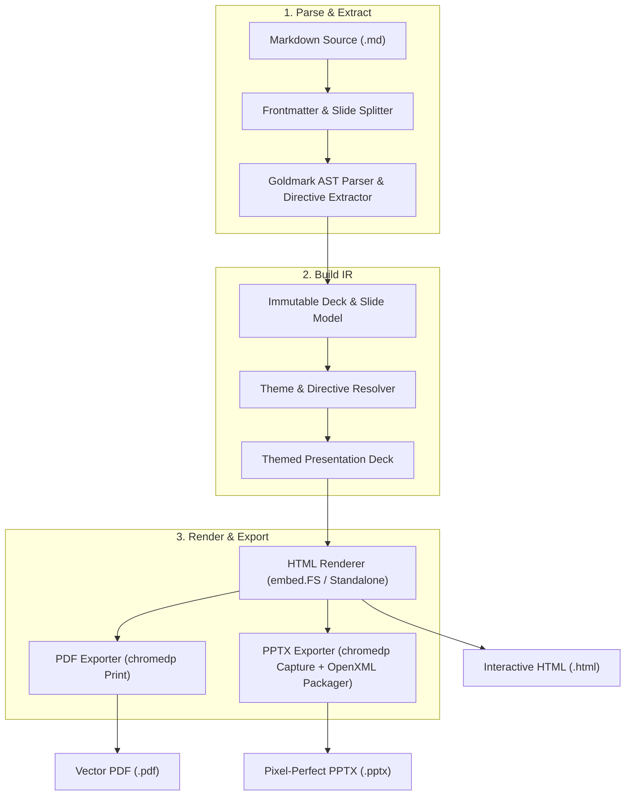

# Goslide 기능 명세서 (Functional Specification)

> **문서 버전**: v1.0.0  
> **작성일**: 2026-10-01  
> **상태**: 확정 (Approved for Implementation)  
> **기반 문서**: [project_plan.md](file:///home/yundream/myjob/cloit/Goslide/docs/project_plan.md), [AGENTS.md](file:///home/yundream/myjob/cloit/Goslide/AGENTS.md)

---

## 1. 개요 및 목적 (Overview & Goals)

### 1.1 문서 목적
본 문서는 Go 기반 Markdown 슬라이드 데크 빌더 **Goslide**의 세부 기능 사양, 데이터 모델, 컴포넌트 간 상호작용 규칙, 입출력 포맷 및 예외 처리 정책을 상세히 정의합니다. 본 문서는 구현 및 테스트의 단일 진실 공급원(Single Source of Truth)으로 기능합니다.

### 1.2 핵심 용어 정의 (Terminology)
| 용어 | 정의 |
| :--- | :--- |
| **Deck** | 전체 프레젠테이션을 구성하는 최상위 불변 중간 표현(IR) 모델 (메타데이터, 전역 설정, 슬라이드 목록 포함). |
| **Slide** | 단일 화면에 렌더링되는 개별 슬라이드 객체 (슬라이드 번호, AST 노드, 로컬 지시어, 발표자 노트 포함). |
| **Directive** | 마크다운 내에서 슬라이드 메타데이터 및 서식을 제어하는 특수 지시자 (Frontmatter 및 주석 형태). |
| **Global Directive** | 데크 전체에 영향을 미치는 지시자 (예: `theme`, `size`, `paginate`, `header`, `footer`). |
| **Scoped Directive** | 특정 슬라이드에만 적용되는 지시자 (예: `_class`, `backgroundColor`, `color`). |
| **Layout** | 슬라이드의 시맨틱 배치 구조 (표지, 본문, 간지, 2단 분할, 풀스크린 여백 제로 등). |
| **EMU** | English Metric Unit. Office OpenXML(PPTX)에서 사용하는 정수 기반 길이 단위 ($1\text{ inch} = 914,400\text{ EMU}$, $1\text{ cm} = 360,000\text{ EMU}$, $1\text{ pt} = 12,700\text{ EMU}$). |

### 1.3 전체 기능 목록 (Feature Matrix)

Goslide의 전체 기능 체계를 대분류별로 요약한 목록입니다. 각 기능의 세부 사양은 명시된 섹션을 참조하십시오.

| 기능 ID | 대분류 | 기능명 | 핵심 사양 및 설명 | 대상 포맷 | 명세 위치 |
| :--- | :--- | :--- | :--- | :---: | :---: |
| **F-PRS-01** | 파서 & 지시어 | **YAML Frontmatter 파싱** | 문서 최상단 메타데이터(제목, 작성자, 기본 테마 등) 추출 | 공통 | [3.1절](#31-입력-소스-분할-규칙) |
| **F-PRS-02** | 파서 & 지시어 | **슬라이드 분할 (`---`)** | 수평선 기준 슬라이드 분할 및 코드블록 내 예외 처리 | 공통 | [3.1절](#31-입력-소스-분할-규칙) |
| **F-PRS-03** | 파서 & 지시어 | **전역/로컬 지시자 처리** | `theme`, `size`, `paginate`, `class`, `backgroundColor` 등 상속/오버라이드 | 공통 | [3.2절](#32-지시어directive-사양-및-우선순위) |
| **F-PRS-04** | 파서 & 지시어 | **발표자 노트 추출** | `<!-- note: ... -->` 구문 파싱 및 발표자 화면/PPT 연동 | HTML, PPTX | [3.2절](#c-발표자-노트-speaker-notes) |
| **F-PRS-05** | 파서 & 지시어 | **마크다운 구문 확장** | GFM 테이블/체크리스트, Chroma 구문 강조, KaTeX 수식 지원 | 공통 | [3.4절](#34-마크다운-ast-파싱-확장) |
| **F-LAY-01** | 레이아웃 | **표준 시맨틱 레이아웃 5종** | `cover`(표지), `default`(본문), `section`(간지), `two-cols`, `blank` | 공통 | [3.3절](#a-표준-내장-레이아웃-세트-standard-layout-set) |
| **F-LAY-02** | 레이아웃 | **2단 컬럼 분할 (`<!-- split -->`)** | 슬라이드 내 좌/우 콘텐츠 슬롯 분할 구문 지원 | HTML, PPTX | [3.3절](#b-2단-컬럼-분할-구문---split---) |
| **F-LAY-03** | 레이아웃 | **스마트 레이아웃 자동 추론** | 지시어 생략 시 첫 장(cover), 헤딩 단독(section) 등 자동 판정 | 공통 | [3.3절](#c-스마트-레이아웃-자동-추론-smart-inference) |
| **F-HTM-01** | HTML 렌더러 | **독립형 번들링 (`--standalone`)** | `embed.FS` 기반 CSS/JS 내장 및 이미지 Base64 Data URI 인라인 변환 | HTML | [5.1절](#a-번들링-및-임베딩-정책) |
| **F-HTM-02** | HTML 렌더러 | **키보드 네비게이션 & 단축키** | 방향키, Space, Home/End, 슬라이드 번호 직접 점프, 도움말(`?`) | HTML | [5.1절](#c-브라우저-인터랙션-및-단축키-매핑-shortcuts--navigation) |
| **F-TL-01** | 발표 도구 | **시선 집중 도구 (포인터/스포트라이트)** | 레이저 포인터(`L`), 마우스 중심 원형 스포트라이트(`S`), 블라인드(`B`/`W`) | HTML | [5.1절](#d-인-슬라이드-발표-보조-도구-in-slide-presentation-tools) |
| **F-TL-02** | 발표 도구 | **인-슬라이드 펜 필기 (Drawing)** | HTML5 캔버스 기반 자유 드로잉(`D`), 색상 변경, 슬라이드별 보존/삭제(`C`) | HTML | [5.1절](#d-인-슬라이드-발표-보조-도구-in-slide-presentation-tools) |
| **F-TL-03** | 발표 도구 | **플로팅 컨트롤 바** | 마우스 접근 시 자동 노출되는 반투명 네비게이션/도구 모음 툴바 | HTML | [5.1절](#d-인-슬라이드-발표-보조-도구-in-slide-presentation-tools) |
| **F-TL-04** | 발표 도구 | **듀얼 스크린 발표자 콘솔 (`P`)** | `BroadcastChannel` 실시간 동기화, 다음 슬라이드 미리보기, 스마트 타이머/노트 | HTML | [5.1절](#e-발표자-콘솔-dual-window-presenter-mode--p-키) |
| **F-TL-05** | 발표 도구 | **그리드 개요 모드 (`O`/`ESC`)** | 전체 슬라이드 반응형 썸네일 그리드 조망 및 원클릭 점프 | HTML | [5.1절](#f-그리드-개요-모드-grid-overview--o-or-esc-키) |
| **F-EXP-01** | PDF 익스포터 | **고품질 벡터 PDF 생성** | `chromedp` Headless 브라우저 연동, `@page` 제로 마진 및 페이지 브레이크 | PDF | [5.2절](#52-pdf-익스포터-internalexporterpdf) |
| **F-EXP-02** | PPTX 익스포터 | **Pixel-Perfect 이미지 PPTX 생성** | 고해상도(1920x1080) 슬라이드 캡처 기반 OpenXML 패키징 (HTML과 100% 일치) | PPTX | [5.3절](#53-pptx-익스포터-internalexporterpptx) |
| **F-EXP-03** | PPTX 익스포터 | **발표자 노트 텍스트 연동** | 마크다운 노트를 OpenXML 슬라이드 메모(`notesSlideX.xml`)에 실제 텍스트로 보존 | PPTX | [5.3절](#b-발표자-노트speaker-notes-텍스트-보존) |
| **F-THM-01** | 테마 & 스타일 | **내장 테마 3종 제공** | `default`(기술 표준), `clean`(미니멀), `dark`(다크 모드) 기본 탑재 | 공통 | [6.1절](#61-기본-테마-명세) |
| **F-THM-02** | 테마 & 스타일 | **커스텀 CSS 및 Scoped 스타일** | 마크다운 내 `<style>` 블록 및 CLI 외부 CSS 주입(`--theme-path`) | HTML | [6.2절](#62-스타일-적용-우선순위-cascading-order) |
| **F-SRV-01** | 개발 서버 | **실시간 라이브 프리뷰 (`serve`)** | `net/http` + `fsnotify` + WebSocket 기반 핫 리로드 (슬라이드 위치 보존) | HTML | [7.1절](#71-아키텍처-및-통신) |
| **F-CLI-01** | CLI 도구 | **서브커맨드 인터페이스** | `goslide build`, `goslide serve`, `goslide init`, `goslide version` | CLI | [8.1절](#81-커맨드-목록-및-옵션-명세) |
| **F-SEC-01** | 보안 & 안정성 | **보안 샌드박싱 & 무결성** | Path Traversal 원천 차단, Raw HTML 격리(`--unsafe-html`), 프로세스 자동 회수 | 공통 | [9.1절](#91-보안-검증-security-hardening) |

---

## 2. 시스템 아키텍처 및 처리 파이프라인

단방향 파이프라인(Unidirectional Pipeline)을 통해 결합도를 낮추고 각 단계의 입출력을 명확히 분리합니다.



---

## 3. Markdown 파서 및 지시어(Directive) 상세 사양

### 3.1 입력 소스 분할 규칙
1. **Frontmatter 처리**:
   - 문서의 첫 번째 줄이 `---`로 시작할 경우, 다음 `---`가 나올 때까지를 YAML Frontmatter 블록으로 파싱합니다.
   - Frontmatter 이후의 본문부터 슬라이드 분할 규칙을 적용합니다.
2. **슬라이드 분할자 (`---`)**:
   - 라인의 시작과 끝에 독립된 수평선 구분자(`---`)가 나타나면 개별 슬라이드로 분리합니다.
   - **예외 처리**:
     - 코드 블록(Fenced Code Block: ```` ``` ```` 등) 내부의 `---`는 슬라이드 분할자로 취급하지 않고 코드 본문으로 보존합니다.
     - 연속된 분할선(`---\n---`)이 나타날 경우, 빈 슬라이드를 생성하되 에러는 발생시키지 않습니다.
     - 앞뒤 공백(Trailing/Leading Whitespaces)을 트림하여 판별합니다.

### 3.2 지시어(Directive) 사양 및 우선순위
지시어는 문서 최상단 **Frontmatter(YAML)** 또는 마크다운 내 **HTML 주석(`<!-- ... -->`)** 형태로 선언됩니다.

#### A. Global Directives (전역 지시자)
| Directive | 기본값 | 허용 값 | 설명 |
| :--- | :--- | :--- | :--- |
| `theme` | `"default"` | `"default"`, `"clean"`, `"dark"` 또는 사용자 커스텀 테마명 | 슬라이드 전체에 적용될 테마 CSS |
| `layout` | `"default"` | `"default"`, `"cover"`, `"section"`, `"two-cols"`, `"blank"` | 슬라이드 전체의 기본 레이아웃 |
| `size` | `"16:9"` | `"16:9"`, `"4:3"` | 슬라이드 가로세로 비율 |
| `paginate` | `false` | `true`, `false` | 페이지 번호 표기 여부 |
| `header` | `""` | 문자열 (Markdown 인라인 허용) | 슬라이드 상단 공통 헤더 텍스트 |
| `footer` | `""` | 문자열 (Markdown 인라인 허용) | 슬라이드 하단 공통 푸터 텍스트 |
| `style` | `""` | CSS 문자열 | 전역으로 주입할 사용자 정의 CSS |

#### B. Scoped Directives (슬라이드 단위 지시자)
슬라이드 내부 어디에서나 `<!-- key: value -->` 형태로 선언할 수 있습니다. 지시어 키 앞에 언더스코어(`_`)가 붙으면 **해당 슬라이드에만 일회성으로 적용**되며, 언더스코어가 없으면 **해당 슬라이드 및 이후 모든 슬라이드로 상속**됩니다.

| Directive | 언더스코어 지원 | 허용 값 예시 | 설명 |
| :--- | :---: | :--- | :--- |
| `layout` / `_layout` | O | `"cover"`, `"section"`, `"two-cols"`, `"blank"`, `"default"` | 개별 슬라이드 시맨틱 레이아웃 지정 |
| `class` / `_class` | O | `"lead"`, `"invert"` 등 | 슬라이드 컨테이너 클래스 지정 |
| `backgroundColor` / `_backgroundColor` | O | `"#f8fafc"`, `"rgb(255,255,255)"` | 슬라이드 배경색 |
| `backgroundImage` / `_backgroundImage` | O | `"url('assets/bg.png')"` | 슬라이드 배경 이미지 URL/로컬 경로 |
| `color` / `_color` | O | `"#1e293b"`, `"white"` | 슬라이드 기본 텍스트 색상 |
| `header` / `_header` | O | `"새로운 헤더"`, `""` | 로컬 헤더 오버라이드 |
| `footer` / `_footer` | O | `"새로운 푸터"`, `""` | 로컬 푸터 오버라이드 |
| `paginate` / `_paginate` | O | `true`, `false` | 로컬 페이지 번호 노출 토글 |

#### C. 발표자 노트 (Speaker Notes)
- 슬라이드 내 `<!-- note: ... -->` 주석 또는 슬라이드 하단의 연속된 주석 블록을 발표자 노트로 파싱합니다.
- 복수 줄 발표자 노트 지원:
  ```markdown
  <!--
  note:
  이 슬라이드에서는 신규 아키텍처의 3대 핵심 요소를 강조할 것.
  시간 배분: 2분 이내
  -->
  ```
- 발표자 노트는 일반 슬라이드 렌더링 시 노출되지 않으며, Presentation 모드의 발표자 콘솔 및 PPTX 슬라이드 메모 영역에만 전달됩니다.

### 3.3 레이아웃 시스템 및 스마트 자동 추론 (Layout & Smart Inference)

Goslide는 마크다운의 간결성을 유지하면서도 웹 슬라이드(HTML)와 오피스 프레젠테이션(PPTX) 모두에서 최적의 배치를 달성하기 위해 **시맨틱 레이아웃** 모델을 지원합니다.

#### A. 표준 내장 레이아웃 세트 (Standard Layout Set)
| 레이아웃명 | 주 사용 목적 및 콘텐츠 구성 | HTML 렌더링 구조 | PPTX 매핑 (Image-based) |
| :--- | :--- | :--- | :--- |
| **`cover`** | 발표 표지, 메인 타이틀<br>(H1 타이틀, 부제목, 발표자/날짜 메타데이터) | 세로 중앙 정렬 (`display: flex; justify-content: center; align-items: center;`), 대형 H1, 부제목 | 고해상도 전체화면 이미지(`p:pic`) 삽입<br>(HTML과 100% 동일한 비주얼 보장) |
| **`default`** | 일반 본문 슬라이드<br>(상단 H2 헤더 + 본문 단락, 불릿, 코드블록 등) | 상단 고정 헤더 + 콘텐츠 컨테이너 패딩 레이아웃 | 고해상도 전체화면 이미지(`p:pic`) 삽입<br>+ 발표자 노트(`notesSlideX.xml`) 연동 |
| **`section`** | 중간 챕터 구분 / 간지<br>(테마 반전 배경, 대형 섹션 타이틀) | 테마 반전(Dark/Primary) 색상 + 중앙 정렬 텍스트 블록 | 고해상도 전체화면 이미지(`p:pic`) 삽입 |
| **`two-cols`** | 2단 병렬 비교, 이미지+설명, 2열 목록<br>(좌/우 컬럼 콘텐츠) | CSS Grid 2열 (`grid-template-columns: 1fr 1fr; gap: 2rem;`) | 고해상도 전체화면 이미지(`p:pic`) 삽입 |
| **`blank`** | 전체 화면 다이어그램, 이미지, 풀스크린 코드 | 상하좌우 여백(Padding) 제로, 중앙 정렬 컨테이너 | 고해상도 전체화면 이미지(`p:pic`) 삽입 |

#### B. 2단 컬럼 분할 구문 (`<!-- split -->`)
- `layout: two-cols` 슬라이드 내부에서 좌/우 컬럼을 구분하기 위해 `<!-- split -->` 구분자 주석을 사용합니다:
  ```markdown
  <!-- _layout: two-cols -->
  ## 레거시 vs 신규 아키텍처 비교

  ### 기존 구조 (Python)
  - 높은 런타임 메모리
  - 멀티스레드 한계

  <!-- split -->

  ### 신규 구조 (Go)
  - 단일 바이너리 배포
  - 경량 고루틴 병렬 처리
  ```
- 파서는 `<!-- split -->`을 기준으로 앞부분 요소를 `LeftElements`, 뒷부분 요소를 `RightElements`로 구조화하여 분리합니다.

#### C. 스마트 레이아웃 자동 추론 (Smart Inference)
사용자가 명시적으로 `<!-- _layout: ... -->`을 선언하지 않은 경우, 파서는 슬라이드의 구조와 메타데이터를 분석하여 최적의 레이아웃을 자동 결정합니다:
1. **`cover` 자동 감지**:
   - 슬라이드 인덱스가 `1` (첫 번째 슬라이드)이고, H1 헤딩을 포함하며 복잡한 코드블록이나 표(Table)가 없는 경우.
2. **`two-cols` 자동 감지**:
   - 슬라이드 본문 내에 `<!-- split -->` 주석 구분자가 존재하는 경우.
3. **`section` 자동 감지**:
   - 슬라이드에 H1 또는 H2 헤딩이 1개만 존재하고, 본문 텍스트가 2줄(또는 100자) 이하인 경우.
4. **기본값 Fallback**:
   - 그 외 모든 일반 슬라이드는 Frontmatter의 `layout` 값(기본: `default`)을 따릅니다.

### 3.4 마크다운 AST 파싱 확장
Goldmark 기반 파서를 확장하여 다음 구문을 완벽히 지원합니다:
1. **GitHub Flavored Markdown (GFM)**:
   - 표(Tables), 작업 목록(Task Lists), 취소선(Strikethrough), 자동 링크(Autolinks).
2. **코드 블록 및 구문 강조 (Syntax Highlighting)**:
   - 순수 Go 라이브러리(`alecthomas/chroma`)를 연동하여 단일 바이너리 환경에서 CGO 없이 구문 강조 HTML 스팬 태그 생성.
3. **수식 렌더링 (Math / LaTeX)**:
   - 인라인 `$E=mc^2$` 및 블록 `$$...$$` 구문 지원 (HTML 내 KaTeX 스크립트 연동).

---

## 4. 내부 IR 데이터 모델 (Intermediate Representation)

`internal/model` 패키지에 정의되는 핵심 불변 데이터 구조체 명세입니다.

```go
package model

import "time"

// SizeRatio는 슬라이드의 화면 비율을 정의합니다.
type SizeRatio string

const (
	Ratio16x9 SizeRatio = "16:9"
	Ratio4x3  SizeRatio = "4:3"
)

// LayoutType은 슬라이드의 시맨틱 레이아웃 유형을 정의합니다.
type LayoutType string

const (
	LayoutDefault LayoutType = "default"
	LayoutCover   LayoutType = "cover"
	LayoutSection LayoutType = "section"
	LayoutTwoCols LayoutType = "two-cols"
	LayoutBlank   LayoutType = "blank"
)

// Deck은 전체 프레젠테이션의 최상위 불변 모델입니다.
type Deck struct {
	Title       string            `json:"title"`
	Author      string            `json:"author"`
	CreatedAt   time.Time         `json:"created_at"`
	GlobalAttrs GlobalDirectives  `json:"global_attributes"`
	CustomCSS   string            `json:"custom_css,omitempty"`
	Slides      []*Slide          `json:"slides"`
}

// GlobalDirectives는 전역 설정 지시자입니다.
type GlobalDirectives struct {
	Theme    string     `json:"theme"`
	Layout   LayoutType `json:"layout"`
	Size     SizeRatio  `json:"size"`
	Paginate bool       `json:"paginate"`
	Header   string     `json:"header,omitempty"`
	Footer   string     `json:"footer,omitempty"`
}

// Slide는 단일 슬라이드의 데이터 모델입니다.
type Slide struct {
	Index         int               `json:"index"`          // 1-based index
	Layout        LayoutType        `json:"layout"`         // 계산된 최종 레이아웃
	Directives    SlideDirectives   `json:"directives"`     // 적용 완료된 계산된 속성
	RawContent    string            `json:"-"`              // 원본 마크다운
	HTMLContent   string            `json:"html_content"`   // 렌더링된 본문 HTML
	Notes         string            `json:"notes,omitempty"`// 발표자 노트
	Elements      []Element         `json:"elements"`       // AST 기반 구조화 요소 (단일 컬럼)
	LeftElements  []Element         `json:"left_elements,omitempty"`  // two-cols 좌측 요소
	RightElements []Element         `json:"right_elements,omitempty"` // two-cols 우측 요소
}

// SlideDirectives는 개별 슬라이드의 유효 스타일 지시자입니다.
type SlideDirectives struct {
	Layout          LayoutType `json:"layout,omitempty"`
	Class           []string   `json:"class,omitempty"`
	BackgroundColor string     `json:"background_color,omitempty"`
	BackgroundImage string     `json:"background_image,omitempty"`
	Color           string     `json:"color,omitempty"`
	Header          string     `json:"header,omitempty"`
	Footer          string     `json:"footer,omitempty"`
	Paginate        bool       `json:"paginate"`
}

// Element는 PPTX 변환을 위한 구조화된 노드 인터페이스입니다.
type ElementType string

const (
	ElemHeading   ElementType = "heading"
	ElemParagraph ElementType = "paragraph"
	ElemList      ElementType = "list"
	ElemCodeBlock ElementType = "code_block"
	ElemTable     ElementType = "table"
	ElemImage     ElementType = "image"
)

type Element interface {
	Type() ElementType
}
```

---

## 5. 포맷별 세부 출력 사양

### 5.1 HTML 렌더러 (`internal/renderer/html`)

#### A. 번들링 및 임베딩 정책
- **내장 리소스**: `embed.FS`를 사용하여 기본 테마 CSS(`default.css`, `clean.css`, `dark.css`), 슬라이드 네비게이션 런타임 JS(`goslide-core.js`), 아이콘 폰트를 단일 바이너리에 포함합니다.
- **`--standalone` 모드**:
  - 로컬 이미지 파일(``)을 감지하여 `data:image/png;base64,...` 형태의 Data URI로 자동 인라인 변환합니다.
  - 외부 네트워크가 차단된 환경에서도 단일 `.html` 파일만으로 완전한 프레젠테이션 동작을 보장합니다.

#### B. 시맨틱 레이아웃 HTML/CSS 매핑
각 슬라이드는 계산된 `Layout` 값에 따라 `<section>` 태그에 클래스가 부여되며, CSS Flexbox/Grid를 통해 렌더링됩니다:
- 태그 구조: `<section class="slide layout-{{.Layout}} theme-{{.Theme}} {{range .Classes}}{{.}} {{end}}" ...>`
- 레이아웃별 CSS 구조:
  - `layout-cover`: `display: flex; flex-direction: column; justify-content: center; align-items: center; text-align: center;`
  - `layout-default`: 상단 고정 헤더, 메인 콘텐츠 패딩 영역, 하단 고정 푸터
  - `layout-section`: 테마 반전 색상, 화면 중앙 강조 타이포그래피
  - `layout-two-cols`: `<div class="content-grid"><div class="col col-left">{{.LeftHTML}}</div><div class="col col-right">{{.RightHTML}}</div></div>` (`grid-template-columns: 1fr 1fr; gap: 2rem;`)
  - `layout-blank`: 여백 0, 풀스크린 미디어/다이어그램 뷰포트

#### C. 브라우저 인터랙션 및 단축키 매핑 (Shortcuts & Navigation)
슬라이드 발표 중 빠르고 직관적인 제어를 위해 풍부한 키보드 단축키를 제공합니다:

| 키 입력 | 기능 분류 | 동작 설명 |
| :--- | :---: | :--- |
| `→` / `Space` / `PageDown` / `J` / `N` | 네비게이션 | 다음 슬라이드로 이동 |
| `←` / `Shift+Space` / `PageUp` / `K` | 네비게이션 | 이전 슬라이드로 이동 |
| `Home` / `End` | 네비게이션 | 첫 번째 / 마지막 슬라이드로 이동 |
| 숫자 + `Enter` | 네비게이션 | 지정한 슬라이드 번호로 즉시 점프 |
| `F` / `F11` | 화면 모드 | 전체 화면 모드(Fullscreen) 토글 |
| `O` / `ESC` | 화면 모드 | 그리드 개요 모드(Grid Overview) 토글 |
| `P` | 발표자 모드 | 듀얼 스크린 발표자 콘솔(Presenter View) 창 분리 팝업 |
| `L` | 시선 집중 | 레이저 포인터(Laser Pointer) 토글 |
| `S` | 시선 집중 | 스포트라이트(Spotlight) 모드 토글 |
| `B` / `.` | 화면 블라인드 | 블랙아웃(Blackout: 검은 화면) 토글 (청중 시선 집중) |
| `W` / `,` | 화면 블라인드 | 화이트아웃(Whiteout: 흰 화면) 토글 |
| `D` | 드로잉 | 인-슬라이드 펜 필기(Drawing) 모드 토글 |
| `C` | 드로잉 | 현재 슬라이드의 펜 드로잉 전체 지우기 (Clear) |
| `?` | 도움말 | 키보드 단축키 안내 팝업 모달 토글 |

#### D. 인-슬라이드 발표 보조 도구 (In-Slide Presentation Tools)
웹 프레젠테이션 런타임 JS(`goslide-core.js`)에 내장된 강력한 발표 지원 인터랙티브 툴킷입니다:

1. **플로팅 발표 컨트롤 바 (Floating Presenter Toolbar)**:
   - 마우스 커서가 화면 하단 영역(100px 이내)으로 접근하면 부드러운 애니메이션과 함께 반투명 툴바가 노출됩니다.
   - 구성: 이전/다음 버튼, 슬라이드 번호 인디케이터(`3 / 42`), 레이저 포인터 버튼, 펜/드로잉 툴 선택(색상: 빨강/노랑/파랑/형광펜), 스포트라이트 토글, 그리드 오버뷰, 발표자 콘솔 오픈, 전체화면 버튼.
   - 마우스 이동이 3초간 없을 경우 화면 방해를 최소화하기 위해 자동 숨김(Auto-hide) 처리됩니다.
2. **레이저 포인터 (Laser Pointer / `L` 키)**:
   - 마우스 커서를 강렬한 붉은색 발광 도트(Glow CSS 애니메이션)로 대체하여 청중의 시선을 원하는 코드 라인이나 다이어그램으로 유도합니다.
3. **스포트라이트 (Spotlight / `S` 키)**:
   - 마우스 커서를 중심으로 반경 120px의 원형 영역만 정상 노출하고, 슬라이드의 나머지 전체 영역을 75% 불투명도의 어두운 오버레이(Dark Dimming Mask)로 덮어 핵심 요소를 극적으로 강조합니다.
4. **인-슬라이드 펜 드로잉 & 주석 (Drawing Canvas / `D` 키)**:
   - 슬라이드 상단에 투명 HTML5 `<canvas>` 오버레이를 생성하여 자유로운 마우스/터치 필기 및 밑줄 긋기를 지원합니다.
   - 색상 변경(빨강, 파랑, 형광펜) 및 지우개 기능 지원.
   - 슬라이드를 앞뒤로 이동해도 작성된 주석 데이터는 해당 슬라이드 메모리에 보존됩니다 (`C` 키로 초기화).
5. **화면 블라인드 (Blackout & Whiteout / `B` & `W` 키)**:
   - 발표자가 슬라이드 내용 대신 구두 설명에 청중의 주의를 집중시키고자 할 때 화면 전체를 즉시 암전(Black) 또는 명전(White) 처리합니다 (아무 키나 누르면 해제).

#### E. 발표자 콘솔 (Dual-Window Presenter Mode / `P` 키)
- `P` 키 입력 시 `window.open("?presenter=true")`를 통해 발표자 전용 독립 창을 실행합니다 (빔프로젝터/발표 모니터와 발표자 노트북 모니터 간 듀얼 스크린 활용).
- **실시간 양방향 동기화**:
  - 메인 발표 창과 발표자 창은 `BroadcastChannel` API(폴백: `localStorage` 스토리지 이벤트)를 통해 딜레이 없이 실시간 동기화됩니다.
  - 슬라이드 넘김뿐만 아니라 타이머 시작/정지, 레이저 포인터 좌표까지 완벽히 연동됩니다.
- **발표자 콘솔 UI 레이아웃**:
  1. **현재 슬라이드 뷰 (Current Slide)**: 청중 화면과 100% 동일한 현재 슬라이드 실시간 미러링.
  2. **다음 슬라이드 미리보기 (Next Slide Preview)**: 다음에 나올 슬라이드를 미리 확인하여 매끄러운 멘트 전환 유도.
  3. **발표자 노트 패널 (Speaker Notes)**:
     - 마크다운 `<!-- note: ... -->` 본문을 리치 텍스트로 렌더링.
     - 가독성을 위한 폰트 크기 확대/축소 버튼(`A+`, `A-`) 제공.
  4. **스마트 타이머 & 클록 (Timer & Clock)**:
     - 발표 경과 시간(Elapsed Time), 현재 시각 시계 표시.
     - 목표 발표 시간(예: 20분) 설정 시 남은 시간 카운트다운 및 마감 3분 전/초과 시 시각적 경고(타이머 주황/빨강 점멸).
  5. **진행률 바 (Progress Bar)**:
     - 전체 프레젠테이션 대비 현재 진행 상황을 시각적으로 바 형태로 노출.

#### F. 그리드 개요 모드 (Grid Overview / `O` or `ESC` 키)
- 전체 슬라이드를 바둑판 형태의 반응형 썸네일 그리드로 축소하여 한눈에 조망합니다.
- 키보드 방향키 또는 마우스 호버로 슬라이드를 탐색하고, 클릭 시 해당 슬라이드로 즉시 점프하며 프레젠테이션 모드로 복귀합니다.
- 슬라이드 번호 및 H1/H2 제목 뱃지를 표시하여 빠른 섹션 이동을 돕습니다.

#### G. 보안 및 샌드박싱
- 기본적으로 마크다운 내의 Raw `<script>`, `<iframe>` 등 위험 HTML 태그는 안전하게 이스케이프(`html.EscapeString`) 처리합니다.
- 사용자가 명시적으로 `--unsafe-html` 플래그를 지정한 경우에만 Raw HTML 삽입을 허용합니다.

---

### 5.2 PDF 익스포터 (`internal/exporter/pdf`)

#### A. 렌더링 파이프라인
1. `internal/renderer/html`를 사용하여 메모리 상에 완전한 인쇄용 HTML 문서를 생성합니다.
2. `chromedp` 라이브러리를 통해 시스템에 설치된 Chrome 또는 Chromium의 Headless 브라우저 프로세스를 실행합니다.
3. 임시 로컬 웹소켓 또는 인메모리 HTTP 서버를 통해 HTML을 로드하고, 모든 웹 폰트 및 이미지가 렌더링 완료(`networkIdle`)될 때까지 대기합니다.
4. `Page.printToPDF` API를 호출하여 고품질 벡터 PDF 스트림을 추출한 후 지정된 경로에 기록합니다.

#### B. 인쇄 규격 및 CSS `@page` 사양
- 여백: `margin: 0` (Zero Margin).
- 크기 사양 매핑:
  - **16:9**: 폭 $297\text{mm}$, 높이 $167.06\text{mm}$ (혹은 $1920\text{px} \times 1080\text{px}$ 해상도 96 DPI 기준).
  - **4:3**: 폭 $297\text{mm}$, 높이 $222.75\text{mm}$ (혹은 $1440\text{px} \times 1080\text{px}$).
- 각 슬라이드는 CSS `break-after: page;` 속성을 적용하여 페이지 잘림 현상을 원천 방지합니다.

#### C. 프로세스 및 리소스 라이프사이클 관리
- 실행 타임아웃은 기본 30초(`context.WithTimeout`)로 설정하며, 타임아웃 발생 시 즉시 프로세스 트리 전체를 강제 종료(`SIGKILL`)하여 좀비 프로세스 누수를 방지합니다.
- 시스템 Chrome 탐색 순서:
  1. 환경변수 `GOSLIDE_CHROME_BIN`
  2. 기본 OS 경로:
     - Linux: `/usr/bin/google-chrome`, `/usr/bin/chromium-browser`, `/usr/bin/chromium`
     - macOS: `/Applications/Google Chrome.app/Contents/MacOS/Google Chrome`
     - Windows: `C:\Program Files\Google\Chrome\Application\chrome.exe`

---

### 5.3 PPTX 익스포터 (`internal/exporter/pptx`)

Goslide의 PPTX 익스포터는 브라우저 화면과의 100% 시각적 일치(Pixel-Perfect)를 보장하기 위해 **고해상도 슬라이드 캡처 이미지 번들링 방식**을 기본으로 채택합니다.

#### A. 이미지 기반 렌더링 파이프라인
1. `internal/renderer/html`를 사용하여 메모리 상에 완전한 독립형 HTML 프레젠테이션 문서를 생성합니다.
2. `chromedp`를 활용하여 Headless 브라우저를 구동하고, 인메모리 HTML을 렌더링합니다.
3. 각 슬라이드 컨테이너(`<section class="slide">`)의 뷰포트를 고해상도(16:9 기준 $1920 \times 1080\text{px}$, Device Scale Factor 2.0 적용 시 $3840 \times 2160\text{px}$) PNG 이미지로 개별 캡처합니다.
4. 캡처된 이미지를 PPTX OpenXML 패키지 내 `ppt/media/slide1.png`, `slide2.png` 등으로 저장합니다.
5. 각 슬라이드 XML(`ppt/slides/slideX.xml`)에 슬라이드 캔버스를 가득 채우는 풀스크린 이미지 도형(`<p:pic>`)을 삽입합니다.

#### B. 발표자 노트(Speaker Notes) 텍스트 보존
- 슬라이드 시각 요소는 캡처 이미지로 삽입되지만, 마크다운의 발표자 노트(`<!-- note: ... -->`)는 OpenXML의 슬라이드 메모 영역(`ppt/notesSlides/notesSlideX.xml`)에 **실제 텍스트로 보존**됩니다.
- 결과적으로 발표자는 PowerPoint의 "발표자 보기(Presenter View)" 모드에서 마크다운으로 작성한 발표 메모를 정상적으로 읽고 활용할 수 있습니다.

#### C. OpenXML 패키지 구조 사양
PPTX 출력물은 표준 OPC(Open Packaging Conventions) 규격에 따라 zip 컨테이너로 압축되며, 다음 디렉토리 구조를 엄격히 준수합니다:

```
[Content_Types].xml
_rels/
    .rels
ppt/
    presentation.xml
    _rels/
        presentation.xml.rels
    slideLayouts/
        slideLayout1.xml (Blank Slide Layout)
    slideMasters/
        slideMaster1.xml
    slides/
        slide1.xml
        slide2.xml
        _rels/
            slide1.xml.rels
    notesSlides/
        notesSlide1.xml
    notesMasters/
        notesMaster1.xml
    media/
        slide1.png
        slide2.png
    theme/
        theme1.xml
```

#### D. EMU 단위 슬라이드 치수 및 풀스크린 매핑
- 슬라이드 크기 표준 설정 (`presentation.xml`의 `p:sldSz`):
  - **16:9**: $12,192,000 \times 6,858,000\text{ EMU}$ ($13.333 \times 7.5\text{ inch}$).
  - **4:3**: $9,144,000 \times 6,858,000\text{ EMU}$ ($10 \times 7.5\text{ inch}$).
- 풀스크린 이미지 Shape 매핑 (`slideX.xml`의 `p:pic`):
  - 위치: `x="0"`, `y="0"` (여백 제로)
  - 크기: `cx="12192000"`, `cy="6858000"` (16:9 기준 캔버스 100% 매핑)
  - 회전 및 왜곡 방지: `rot="0"`, 원본 종횡비 고정

#### E. 이미지 최적화 및 압축 정책
- 브라우저 스크린샷 캡처 시 무손실(Lossless) 압축 수준을 조정하여 슬라이드 당 평균 200~400KB 수준으로 최적화.
- 50장 슬라이드 기준 생성되는 PPTX 파일 크기를 **15~20MB 이내**로 억제.

---

## 6. 테마 및 스타일링 시스템 (`internal/theme`)

### 6.1 기본 테마 명세
1. **`default` (기술 발표 표준)**:
   - 폰트 스택: `Pretendard`, `-apple-system`, `BlinkMacSystemFont`, `"Segoe UI"`, `Roboto`, `sans-serif`
   - 배경: `#FFFFFF`, 본문 색상: `#24292F`, Primary 악센트: `#0969DA`
   - 코드 폰트: `"JetBrains Mono"`, `Consolas`, `"Fira Code"`, `monospace`
2. **`clean` (미니멀/라이트)**:
   - 폰트 스택: `"Inter"`, `sans-serif`
   - 배경: `#F8FAFC`, 본문 색상: `#0F172A`, Primary 악센트: `#3B82F6`
   - 장식 요소를 배제한 타이포그래피 중심 레이아웃
3. **`dark` (개발자 컨퍼런스 다크 모드)**:
   - 배경: `#0D1117`, 본문 색상: `#C9D1D9`, Primary 악센트: `#58A6FF`
   - 다크 톤에 최적화된 코드 블록 테마(One Dark 계열) 적용

### 6.2 스타일 적용 우선순위 (Cascading Order)
스타일 규칙 충돌 시 다음 우선순위에 따라 덮어씌웁니다:
1. 슬라이드 인라인 Scoped Directive (`<!-- _backgroundColor: ... -->`) *(최우선)*
2. 슬라이드 내부 `<style scoped>` 블록
3. 마크다운 전역 `<style>` 블록
4. CLI 옵션 주입 테마 (`--theme-path=custom.css`)
5. Frontmatter 지정 테마 (`theme: gaia`)
6. 시스템 기본 테마 (`theme: default`) *(최저)*

---

## 7. 로컬 개발 서버 및 라이브 프리뷰 (`goslide serve`)

### 7.1 아키텍처 및 통신
- Go 표준 라이브러리 `net/http` 기반의 경량 웹 서버 구동.
- 파일 시스템 변경 감지(`fsnotify` 라이브러리 활용):
  - 슬라이드 대상 마크다운 파일 및 참조 중인 로컬 에셋(이미지, CSS 등) 디렉토리 감시.
- 클라이언트 브라우저와 WebSocket 연결 유지:
  - 파일 변경 이벤트 발생 시 즉시 재파싱 및 변환 수행.
  - 변환 성공 시 브라우저로 `{ type: "RELOAD", slideIndex: N }` 이벤트 전송.
  - 현재 시청 중이던 슬라이드 위치(Slide Index)를 보존하여 불필요한 첫 페이지 리셋 방지.
  - 문법 오류 발생 시 슬라이드 화면 상단에 토스트 에러 오버레이 표시.

---

## 8. CLI 인터페이스 상세 사양 (`cmd/goslide`)

`cobra` 라이브러리를 사용하여 CLI를 구현하며, POSIX 표준 플래그 규격을 준수합니다.

### 8.1 커맨드 목록 및 옵션 명세

#### A. `goslide build` (슬라이드 빌드)
- **문법**: `goslide build <input.md> [flags]`
- **플래그**:
  | 플래그 | 단축키 | 기본값 | 설명 |
  | :--- | :---: | :--- | :--- |
  | `--format` | `-f` | `"html"` | 출력 포맷 (콤마로 다중 선택 가능: `html,pdf,pptx`) |
  | `--output` | `-o` | `""` | 출력 경로 또는 출력 디렉토리 (미지정 시 입력 파일명 기반 생성) |
  | `--standalone` | `-s` | `false` | 이미지 등 에셋을 Base64 인라인 임베딩한 단일 파일 생성 |
  | `--theme-path` | `-t` | `""` | 외부 커스텀 CSS 테마 파일 경로 |
  | `--unsafe-html`| | `false` | 마크다운 내 Raw HTML 및 스크립트 실행 허용 |
  | `--chrome-path`| | `""` | PDF 변환 시 사용할 Chrome/Chromium 바이너리 경로 명시 |

#### B. `goslide serve` (라이브 프리뷰 서버)
- **문법**: `goslide serve <input.md> [flags]`
- **플래그**:
  | 플래그 | 단축키 | 기본값 | 설명 |
  | :--- | :---: | :--- | :--- |
  | `--port` | `-p` | `8080` | 웹 서버 수신 포트 |
  | `--host` | | `"127.0.0.1"` | 바인딩 호스트 인터페이스 |
  | `--open` | | `true` | 서버 시작 시 기본 웹 브라우저 자동 실행 |
  | `--theme-path` | `-t` | `""` | 외부 커스텀 CSS 테마 파일 경로 |

#### C. `goslide init` (새 프레젠테이션 템플릿 생성)
- **문법**: `goslide init [filename.md] [flags]`
- **플래그**:
  | 플래그 | 단축키 | 기본값 | 설명 |
  | :--- | :---: | :--- | :--- |
  | `--theme` | | `"default"` | 템플릿에 지정할 기본 테마명 |
  | `--title` | | `"Untitled Presentation"` | 슬라이드 기본 제목 |

#### D. 전역 플래그 (Global Flags)
| 플래그 | 단축키 | 기본값 | 설명 |
| :--- | :---: | :--- | :--- |
| `--verbose` | `-v` | `false` | 상세 디버그 로그 출력 |
| `--quiet` | `-q` | `false` | 에러 외 표준 출력 억제 |
| `--help` | `-h` | | 도움말 출력 |
| `--version` | | | 버전 및 빌드 정보 출력 |

### 8.2 종료 코드 (Exit Codes)
| 코드 | 정의 | 발생 조건 |
| :---: | :--- | :--- |
| `0` | `ExitSuccess` | 작업 정상 완료 |
| `1` | `ExitGeneralError` | 일반 런타임 오류 및 알 수 없는 오류 |
| `2` | `ExitInvalidUsage` | 잘못된 CLI 플래그 또는 누락된 인자 |
| `3` | `ExitFileNotFound` | 입력 마크다운 또는 참조 리소스 파일 없음 |
| `4` | `ExitParseError` | YAML Frontmatter 파싱 실패 또는 손상된 구문 |
| `5` | `ExitExportFailed` | PDF (`chromedp`) 또는 PPTX 파일 생성 실패 |

---

## 9. 보안 및 비기능 요구사항 검증 사양

### 9.1 보안 검증 (Security Hardening)
1. **경로 탐색(Path Traversal) 공격 차단**:
   - 로컬 이미지 또는 외부 CSS 참조 경로 분석 시, `filepath.Clean`을 거친 후 지정된 베이스 작업 디렉토리(Current Working Directory) 하위인지 반드시 검증합니다.
   - 상위 디렉터리(`../..`)를 통한 시스템 파일(`/etc/passwd` 등) 참조 시 `ErrSecurityViolation`을 반환하며 빌드를 즉시 중단합니다.
2. **XSS 및 인젝션 격리**:
   - `--unsafe-html` 플래그가 비활성화된 기본 상태에서는 모든 HTML 태그가 텍스트 리터럴로 치환됩니다.

### 9.2 성능 및 메모리 제약
1. **처리 시간 기준**:
   - 50장 기준 일반 슬라이드 HTML 변환: **1초 미만**
   - 50장 기준 PDF / PPTX 변환: **5초 미만**
2. **동시성 및 리소스 해제**:
   - `chromedp` 브라우저 컨텍스트는 `defer cancel()`을 통해 반드시 정리되어 고루틴 누수를 방지합니다.
   - PPTX zip 패키징 작업 시 스트리밍 압축을 적용하여 메모리 피크를 100MB 이내로 유지합니다.

---

## 10. 테스트 및 품질 보증 (Testing & QA)

### 10.1 테스트 전략
1. **테이블 기반 단위 테스트 (Table-Driven Unit Tests)**:
   - `internal/parser`: Frontmatter 파싱, 지시어 추출, 주석 처리 등 20개 이상의 엣지 케이스 테이블 테스트.
2. **골든 파일 회귀 테스트 (Golden File Testing)**:
   - `internal/renderer/html`: `testdata/*.md` 입력을 받아 `testdata/*.html.golden` 결과와 바이트 단위 비교.
   - `go test -update` 플래그로 의도된 변경 시 골든 파일 자동 갱신 지원.
3. **통합 테스트**:
   - CLI E2E 테스트: `cmd/goslide` 실행 후 반환 코드, 생성된 파일의 존재 및 유효성(Zip 압축 헤더, PDF 매직 넘버 `%PDF-`) 검증.
4. **정적 분석 및 린트**:
   - `go vet ./...`
   - `test -z "$(gofmt -l .)"`
   - `golangci-lint run`
