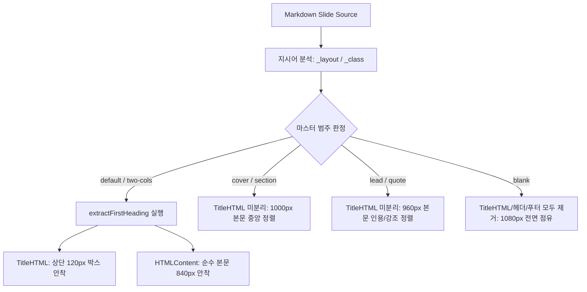

# Goslide PPT 기반 슬라이드 레이아웃 설계 사양서 (PPT Master Layout Specification)

> **문서 상태**: Approved Design Spec  
> **버전**: v2.1.0 (PPT 6대 슬라이드 마스터 범주 체계화 및 키노트 인용·강조 레이아웃 고도화)  
> **대상 경로**: `docs/layout-design.md`  
> **설계 철학**: PowerPoint(PPT/PPTX) Slide Master Architecture 기반의 결정론적 고정 레이아웃  
> **연관 문서**: [`docs/okf/core-architecture.md`](./okf/core-architecture.md), [`docs/okf/contracts-interfaces.md`](./okf/contracts-interfaces.md), [`docs/okf/index.md`](./okf/index.md)

---

## 1. 비전 및 핵심 설계 철학

Goslide는 유동적인 반응형 웹 문서를 만드는 도구가 아니라, **오피스 파워포인트(PowerPoint/Keynote)의 슬라이드 마스터(Slide Master) 아키텍처**를 웹 표준 기술(HTML/CSS)과 순수 Go로 완벽히 구현하는 프레젠테이션 엔진입니다.

### 1.1 PPT 마스터 슬라이드 3대 원칙
1. **절대 불변의 1920 × 1080 물리적 캔버스**:
   - 모든 슬라이드는 예외 없이 **가로 `1920px`, 세로 `1080px` (Full HD, 16:9)**의 고정 픽셀 캔버스를 가집니다.
   - 반응형 CSS 미디어 쿼리나 동적 뷰포트 높이 계산은 일체 배제합니다.
2. **배율 조정 전용 원칙 (Scale-Only Principle)**:
   - 창 크기 맞춤(Fit to Window)이나 발표자 콘솔의 다음 슬라이드 미리보기(Next Slide Preview), 오버뷰 모드(Overview Grid) 등 모든 화면 표시는 **오직 CSS `transform: scale(...)`로 1920×1080 캔버스 전체의 배율만 축소/확대**합니다.
   - 슬라이드 내부의 물리적 픽셀 좌표와 폰트 크기는 어떤 디스플레이 환경에서도 영구히 불변입니다.
3. **독립된 4대 구조 구역 (Strict 4-Tier Structural Isolation)**:
   - 표준 슬라이드는 `[1. 러닝 헤더] - [2. 슬라이드 제목] - [3. 슬라이드 본문] - [4. 바닥글]`로 영역을 완전 분리하여, 본문 내용이 아무리 많아도 제목을 덮치거나 바닥글을 밀어낼 수 없습니다.

### 1.2 "2026 AI TECH..."와 슬라이드 제목의 본질적 분리
* **러닝 헤더 (Running Header / Category Tracker)**:
  - 마크다운 Frontmatter의 `header: "2026 AI Tech Seminar: Deep Dive into LLMs"`는 각 슬라이드의 제목이 아니라, 발표 전체의 **행사명, 대주제, 챕터 메타데이터**입니다.
  - PPT에서 슬라이드 상단 구석에 아주 작고 은은하게 표시되는 트래커 텍스트(높이 40px)입니다.
* **슬라이드 제목 (Slide Title)**:
  - 각 슬라이드의 진짜 주인공인 `## 세미나 아젠다 & 진행 로드맵`, `## 패러다임의 전환: RNN vs Transformer` 등입니다.
  - PPT의 **[제목 상자(Title Placeholder)]**에 해당하며, **모든 일반 슬라이드에서 1px의 오차도 없이 동일한 위치(Y: 40px)와 고정된 높이(120px)를 가집니다.**

---

## 2. PPT 슬라이드 페이지 6대 범주 (Slide Master Categories)

프레젠테이션의 모든 슬라이드는 내용과 발표 목적에 따라 아래 **6가지 고유한 마스터 범주** 중 하나에 배정됩니다.

| 범주 번호 | 마스터 범주 (Category) | 고유 Layout 명 | 지시어 (Directives) | 주요 목적 및 시각적 특징 |
| :---: | :--- | :--- | :--- | :--- |
| **Cat 1** | **Title Slide (표지)** | `cover` | `<!-- _layout: cover -->` | 발표 시작 표지. 대제목 + 부제목 + 발표자 정보 중앙 집중 |
| **Cat 2** | **Section Divider (간지/챕터)** | `section` | `<!-- _layout: section -->` | 대단원 전환. 챕터 번호 및 대형 챕터 제목 중앙 배치 |
| **Cat 3** | **Title & Content (표준 본문)** | `default` | (기본값) | 글머리 기호, 단락, 표, 코드블록 등 일반 콘텐츠 (헤더+제목+본문+푸터) |
| **Cat 4** | **Two Content (2단 비교 본문)** | `two-cols` | `<!-- _layout: two-cols -->` | 좌우 비교, 코드 vs 설명. 상단 제목 고정 + 본문 2열 분할 |
| **Cat 5** | **Quote / Callout (키노트 인용·강조)** | `lead` (또는 `quote`) | `<!-- _layout: lead -->`<br>`<!-- _class: lead -->` | **원포인트 임팩트 슬라이드**. 핵심 문구, 명언, Big Stat 대형 중앙 배치 |
| **Cat 6** | **Blank / Full Bleed (전면 캔버스)** | `blank` | `<!-- _layout: blank -->` | 전면 아키텍처 다이어그램, 풀스크린 이미지 (여백 및 헤더/푸터 0px) |

---

## 3. 범주별 4대 구역 물리적 치수 및 레이아웃 매핑 (1920 × 1080)

1080px 세로 높이는 각 범주의 특성에 맞춰 고정 구역(In-Flow)으로 엄격하게 분할됩니다:

```
[Cat 3 & 4: 표준 본문 / 2단 비교]           [Cat 5: 키노트 인용 / 강조 (lead)]
┌──────────────────────────────────────┐ 0px    ┌──────────────────────────────────────┐ 0px
│ 1. 러닝 헤더 .slide-tracker (40px)    │        │ 1. 러닝 헤더 .slide-tracker (40px)    │
├──────────────────────────────────────┤ 40px   ├──────────────────────────────────────┤ 40px
│ 2. ★ 슬라이드 제목 .slide-title-box   │        │                                      │
│    (고정 120px, Y좌표 40px 절대 불변) │        │                                      │
├──────────────────────────────────────┤ 160px  │ 3. [중앙 집중 인용/강조 본문 상자]    │
│                                      │        │    .slide-content-box (고정 960px)   │
│ 3. [본문 상자] .slide-content-box     │        │    - 제목과 인용문이 일체화되어      │
│    (고정 840px)                      │        │      화면 정중앙에 수직/수평 정렬     │
│    - default: 일반 본문              │        │    - font-size: 1.5rem ~ 3.25rem     │
│    - two-cols: 좌/우 2열 분할        │        │                                      │
├──────────────────────────────────────┤ 1000px ├──────────────────────────────────────┤ 1000px
│ 4. 슬라이드 바닥글 .slide-footer (80px)│        │ 4. 슬라이드 바닥글 .slide-footer (80px)│
└──────────────────────────────────────┘ 1080px └──────────────────────────────────────┘ 1080px

[Cat 1 & 2: 표지 / 간지 (cover, section)]      [Cat 6: 전면 캔버스 (blank)]
┌──────────────────────────────────────┐ 0px    ┌──────────────────────────────────────┐ 0px
│ (러닝 헤더 숨김: 0px)                 │        │ (모든 헤더/제목/바닥글 제거: 0px)     │
├──────────────────────────────────────┤        │                                      │
│ (별도 제목상자 미분리: 0px)           │        │ 3. [전면 점유 본문]                  │
├──────────────────────────────────────┤ 0px    │    .slide-content-box (고정 1080px)  │
│ 3. [중앙 집중 표지 본문 상자]         │        │    - 패딩 0px, 마진 0px              │
│    .slide-content-box (고정 1000px)  │        │    - 다이어그램/이미지 100% 채움     │
│    - 대제목/부제목/발표자 중앙 정렬   │        │                                      │
├──────────────────────────────────────┤ 1000px │                                      │
│ 4. 슬라이드 바닥글 .slide-footer (80px)│        │                                      │
└──────────────────────────────────────┘ 1080px └──────────────────────────────────────┘ 1080px
```

### 3.1 범주별 구역 높이 및 활성화 사양표

| 마스터 범주 | 러닝 헤더 (`.slide-tracker`) | 슬라이드 제목 상자 (`.slide-title-box`) | 본문 상자 (`.slide-content-box`) | 슬라이드 바닥글 (`.slide-footer`) | 총 세로 높이 합계 |
| :--- | :---: | :---: | :---: | :---: | :---: |
| **Cat 1 (cover)** | `0px` (`display: none`) | `0px` (본문 포함) | **`1000px`** (중앙 집중) | **`80px`** | $1000 + 80 = \mathbf{1080px}$ |
| **Cat 2 (section)** | `0px` (`display: none`) | `0px` (본문 포함) | **`1000px`** (대형 중앙) | **`80px`** | $1000 + 80 = \mathbf{1080px}$ |
| **Cat 3 (default)** | **`40px`** | **`120px`** (독립 안착) | **`840px`** (일반 본문) | **`80px`** | $40 + 120 + 840 + 80 = \mathbf{1080px}$ |
| **Cat 4 (two-cols)** | **`40px`** | **`120px`** (상단 전폭) | **`840px`** (2단 분할) | **`80px`** | $40 + 120 + 840 + 80 = \mathbf{1080px}$ |
| **Cat 5 (lead/quote)** | **`40px`** (은은한 메타) | `0px` (본문 일체화) | **`960px`** (중앙 인용) | **`80px`** | $40 + 960 + 80 = \mathbf{1080px}$ |
| **Cat 6 (blank)** | `0px` (`display: none`) | `0px` (`display: none`) | **`1080px`** (전면 100%) | `0px` (`display: none`) | $1080 = \mathbf{1080px}$ |

---

## 4. 특수 사례 분석: 3Page (키노트 인용·강조 슬라이드)

### 4.1 문제 현상 및 원인 분석
- **마크다운 소스 (3Page)**:
  ```markdown
  <!-- _class: lead -->
  # The Bitter Lesson
  
  > *"General methods that leverage computation are ultimately the most effective by a large margin."*
  >
  > — **Rich Sutton** (AI Pioneer)
  ```
- **원인**:
  - 기존 파서는 `_layout`이 지정되지 않고 `_class: lead`만 있는 경우 이를 **Cat 3 (default, 표준 본문)**으로 취급했습니다.
  - 그 결과 `# The Bitter Lesson`이 슬라이드 상단 120px 제목 상자로 강제 분리되어, 아래 본문 상자의 인용문(`> ...`)과 공간적으로 분절되는 어색한 레이아웃이 발생했습니다.

### 4.2 올바른 사양 및 해결책
- 3Page는 **Cat 5: Quote / Callout (키노트 인용·강조)** 범주입니다.
- **파서 규칙**:
  - `_layout: lead`, `_layout: quote`, 또는 `_class: lead` 지시어가 감지되면 슬라이드 레이아웃을 `model.LayoutLead`로 매핑합니다.
  - `LayoutLead`에서는 첫 번째 헤딩(`# The Bitter Lesson`)을 상단으로 분리하지 않고 본문 상자(`.slide-content-box`) 내에 유지합니다.
- **렌더링 규칙**:
  - `.slide-tracker` (40px)는 상단에 은은하게 유지됩니다.
  - `.slide-title-box`는 생성되지 않습니다 (`0px`).
  - `.slide-content-box` (960px) 내부에서 제목(`h1`)과 인용구(`blockquote`)가 수직/수평 정중앙에 하나의 통일된 시각 덩어리로 배치됩니다 (`justify-content: center; align-items: center; text-align: center;`).

---

## 5. 파서 및 렌더러 처리 계약 (AST Transformation Contract)



### 5.1 첫 번째 헤딩 분리 규칙 (`extractFirstHeading`)
- **분리 대상**: `LayoutDefault` (Cat 3), `LayoutTwoCols` (Cat 4)
- **분리 제외 (일체형 유지)**:
  - `LayoutCover` (Cat 1): 표지 전체 중앙 집중
  - `LayoutSection` (Cat 2): 챕터명 중앙 집중
  - `LayoutLead` (Cat 5): 인용구/원포인트 키노트 메시지 일체형 중앙 집중
  - `LayoutBlank` (Cat 6): 100% 풀스크린 캔버스

---

## 6. CSS 핵심 구현 명세 (Core Stylesheet Spec)

```css
/* ==========================================================================
   Goslide PPT Slide Master Layout Specification
   Physical Fixed Canvas: 1920px x 1080px
   ========================================================================== */

/* 16:9 Slide Canvas */
.slide-card {
  width: 1920px !important;
  height: 1080px !important;
  min-width: 1920px !important;
  max-width: 1920px !important;
  min-height: 1080px !important;
  max-height: 1080px !important;
  position: absolute;
  top: 0;
  left: 0;
  overflow: hidden;
  padding: 0 !important;
  display: none !important;
  flex-direction: column !important;
  box-sizing: border-box;
}

.slide-card.active {
  display: flex !important;
}

/* --------------------------------------------------------------------------
   PPT 4-Tier Master Structure (Standard Content)
   -------------------------------------------------------------------------- */

/* 1. Running Header / Tracker (Height: 40px) */
.slide-tracker {
  flex: 0 0 40px;
  height: 40px;
  box-sizing: border-box;
  padding: 16px 80px 0 80px;
  font-size: 0.75rem;
  line-height: 1.4;
  opacity: 0.6;
  text-align: left !important;
  white-space: nowrap;
  overflow: hidden;
  text-overflow: ellipsis;
}

/* 2. Slide Title Placeholder Box (Height: 120px) */
.slide-title-box {
  flex: 0 0 120px;
  height: 120px;
  box-sizing: border-box;
  padding: 10px 80px;
  display: flex;
  align-items: center;
  justify-content: flex-start;
  text-align: left !important;
}

.slide-title-box h1,
.slide-title-box h2 {
  margin: 0;
  font-size: 2.25rem;
  line-height: 1.2;
  font-weight: 700;
  white-space: nowrap;
  overflow: hidden;
  text-overflow: ellipsis;
}

/* 3. Slide Content Box (Standard Height: 840px) */
.slide-content-box {
  flex: 0 0 840px;
  height: 840px;
  min-height: 840px;
  max-height: 840px;
  box-sizing: border-box;
  padding: 20px 80px;
  overflow: hidden;
  display: flex;
  flex-direction: column;
  justify-content: flex-start;
  position: relative;
}

/* 4. Slide Footer (Height: 80px) */
.slide-footer {
  flex: 0 0 80px;
  height: 80px;
  box-sizing: border-box;
  padding: 0 80px 24px 80px;
  display: flex;
  justify-content: space-between;
  align-items: center;
  font-size: 0.75rem;
  opacity: 0.65;
}

/* --------------------------------------------------------------------------
   Semantic Master Layout Overrides (Cat 1, 2, 5, 6)
   -------------------------------------------------------------------------- */

/* Cat 1: Cover Layout & Cat 2: Section Layout */
.slide-card.cover .slide-tracker,
.slide-card.cover .slide-title-box,
.slide-card.section .slide-tracker,
.slide-card.section .slide-title-box,
.slide-card.layout-cover .slide-tracker,
.slide-card.layout-cover .slide-title-box,
.slide-card.layout-section .slide-tracker,
.slide-card.layout-section .slide-title-box {
  display: none !important;
}

.slide-card.cover .slide-content-box,
.slide-card.section .slide-content-box,
.slide-card.layout-cover .slide-content-box,
.slide-card.layout-section .slide-content-box {
  flex: 0 0 1000px !important;
  height: 1000px !important;
  min-height: 1000px !important;
  max-height: 1000px !important;
  justify-content: center !important;
  align-items: center !important;
  text-align: center !important;
}

/* Cat 5: Quote / Callout Layout (Lead) */
.slide-card.lead .slide-title-box,
.slide-card.quote .slide-title-box,
.slide-card.layout-lead .slide-title-box,
.slide-card.layout-quote .slide-title-box {
  display: none !important;
}

.slide-card.lead .slide-content-box,
.slide-card.quote .slide-content-box,
.slide-card.layout-lead .slide-content-box,
.slide-card.layout-quote .slide-content-box {
  flex: 0 0 960px !important;
  height: 960px !important;
  min-height: 960px !important;
  max-height: 960px !important;
  justify-content: center !important;
  align-items: center !important;
  text-align: center !important;
  padding: 40px 140px !important;
}

.slide-card.lead h1,
.slide-card.quote h1 {
  font-size: 3.25rem !important;
  margin-bottom: 2rem !important;
  font-weight: 800 !important;
}

.slide-card.lead blockquote,
.slide-card.quote blockquote {
  font-size: 2rem !important;
  line-height: 1.6 !important;
  border-left: none !important;
  background: transparent !important;
  padding: 0 !important;
  font-style: italic !important;
}

/* Cat 6: Blank Layout */
.slide-card.blank .slide-tracker,
.slide-card.blank .slide-title-box,
.slide-card.blank .slide-footer,
.slide-card.layout-blank .slide-tracker,
.slide-card.layout-blank .slide-title-box,
.slide-card.layout-blank .slide-footer {
  display: none !important;
}

.slide-card.blank .slide-content-box,
.slide-card.layout-blank .slide-content-box {
  flex: 0 0 1080px !important;
  height: 1080px !important;
  min-height: 1080px !important;
  max-height: 1080px !important;
  padding: 0 !important;
}
```

---

## 7. 검증 및 합격 기준 (Definition of Done)

1. **6대 범주별 레이아웃 충실도 검증**:
   - 각 범주(표지, 간지, 일반본문, 2단, 인용강조, 전면백지)가 사양서에 정의된 구역 높이(헤더, 제목, 본문, 푸터)를 정확히 준수할 것.
2. **슬라이드 전환 시 제목 불변성 검증**:
   - 일반 본문 슬라이드(Cat 3, Cat 4) 간 전환 시, 제목 상자의 시작 Y좌표(40px), 높이(120px)가 1px도 흔들리지 않고 불변으로 유지될 것.
3. **3Page(Cat 5 Lead) 일체형 검증**:
   - 3Page에서 제목(`# The Bitter Lesson`)이 상단으로 뜯겨 나가지 않고, 중앙 960px 본문 상자 내에서 인용구와 함께 완벽한 수직/수평 정중앙 정렬을 이룰 것.
4. **결정론적 1920×1080 준수**:
   - 모든 슬라이드의 합계 높이는 정확히 `1080px`이며, 브라우저 크기 조정 시 `scale` 배율만 변경되고 레이아웃 구조는 절대 깨지지 않을 것.
