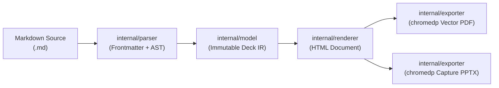

# Goslide 코어 아키텍처 및 파이프라인

Goslide는 결합도가 낮은 **단방향 파이프라인(Unidirectional Pipeline)**을 통해 마크다운 문서를 인터랙티브 웹 슬라이드, 벡터 PDF, 고해상도 PPTX로 변환합니다.

---

## 1. 단방향 데이터 흐름

데이터는 항상 한 방향으로만 흐르며, 역방향 의존성이나 단계 건너뛰기는 금지됩니다:

1. **파서 단계**:
   - YAML Frontmatter 추출 및 마크다운 수평선(`---`) 기준 슬라이드 분할.
   - 인라인 지시어(`<!-- key: value -->`) 및 발표자 메모(`<!-- note: -->`) 추출.
   - Goldmark AST 기반 HTML 본문 변환 및 Chroma 순수 Go 코드 구문 강조.
2. **불변 IR 단계**:
   - 파싱 완료된 `model.Deck` 및 `model.Slide` 포인터는 읽기 전용 불변 객체로 취급.
3. **렌더링 & 익스포트 단계**:
   - `internal/renderer`: Go `html/template` 및 `embed.FS` 테마 CSS/JS를 결합하여 단일 HTML 생성.
   - `internal/exporter`: 생성된 HTML을 브라우저에 로컬 파일(`file://`)로 로드하여 PDF 인쇄 및 PPTX 뷰포트 캡처 수행.

---

## 2. 3대 포맷별 처리 계약 (Execution Contracts)

### 2.1 HTML 렌더러 (`internal/renderer/html.go`)
- **이미지 상대 경로 유지**: 마크다운의 상대 경로(``)를 웹 표준 그대로 보존. (불필요한 Base64 인라인 변환 배제)
- **에셋 임베딩**: 내장 테마 CSS와 제어 JS(`goslide-core.js`)는 `embed.FS`를 통해 `<style>`, `<script>`로 HTML 내에 완전 내장.

### 2.2 PDF 익스포터 (`internal/exporter/pdf.go`)
- **로컬 탐색**: `chromedp`를 구동하여 로컬 HTML 경로 **`file:///path/to/slides.html`**로 직접 내비게이션.
- **인쇄 사양**: `Page.printToPDF` API 호출 (Margin=0, 16:9 비율 `@page { size: 16:9; margin: 0; }`).
- **리소스 정리**: `defer cancelAlloc()`을 통해 Chrome 프로세스 트리를 즉시 회수하여 좀비 프로세스 방지.

### 2.3 PPTX 익스포터 (`internal/exporter/pptx.go`)
- **고해상도 캡처**: 각 슬라이드 뷰포트(1920x1080 @ 2x)를 캡처하여 `ppt/media/slideN.png`로 저장.
- **풀스크린 매핑**: 슬라이드 XML(`ppt/slides/slideN.xml`) 내에 16:9 캔버스($12,192,000 \times 6,858,000\text{ EMU}$)를 100% 채우는 `<p:pic>` 도형 매핑.
- **발표자 노트 보존**: 마크다운 발표 메모를 `ppt/notesSlides/notesSlideN.xml`에 실제 텍스트로 보존.
- **패키징**: Go 표준 `archive/zip`으로 OpenXML OPC ZIP 컨테이너 빌드.

---

## 3. 실시간 개발 서버 (`internal/server/server.go`)

- **표준 HTTP 서빙**: `net/http`를 사용하여 슬라이드 HTML 및 로컬 정적 에셋 서빙.
- **SSE (Server-Sent Events) 핫 리로드**:
  - `fsnotify`가 마크다운 파일 수정을 감지하면 `/events` SSE 스트림으로 갱신 이벤트 전파.
  - 브라우저 클라이언트는 표준 `new EventSource('/events')` 단 3줄로 갱신 수신 시 새로고침 수행. (WebSocket 의존성 배제)

---

## 4. 결정론적 레이아웃 정책 (Deterministic Layout)

파서는 슬라이드 본문의 줄 수나 헤딩 개수를 자의적으로 해석하거나 추측하지 않습니다(Zero Guesswork):
1. **1순위**: 슬라이드 로컬 지시어 `<!-- _layout: ... -->`가 명시된 경우 해당 레이아웃 적용.
2. **2순위**: 상속된 지시어 `<!-- layout: ... -->` 또는 Frontmatter의 `layout` 선언 적용.
3. **기본값**: 선언이 없으면 무조건 표준 레이아웃인 **`default`** 적용.
4. **`<!-- split -->`**: `layout: two-cols` 슬라이드에서 좌/우 컬럼의 분할점으로만 엄격히 해석.
