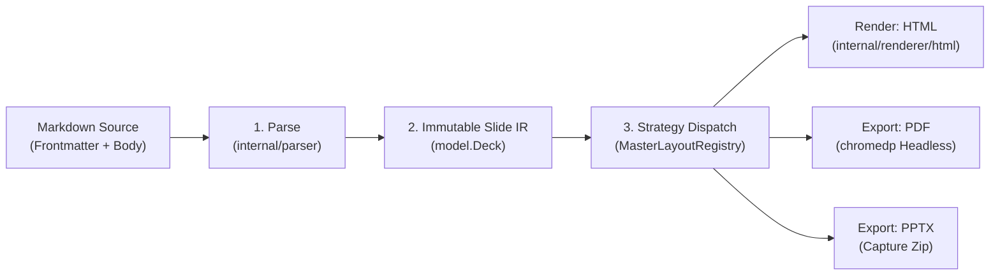

# Goslide 코어 아키텍처 및 파이프라인 (Core Architecture)

Goslide는 마크다운 소스로부터 최종 프레젠테이션 결과물을 생성할 때 결합도가 낮은 **단방향 파이프라인(Unidirectional Pipeline)**을 거칩니다.

---

## 1. 단방향 변환 파이프라인 (Core Pipeline)

* **원칙**: 상위 계층은 하위 계층을 알지만, 하위 계층은 상위 계층을 전혀 모릅니다 (Zero Reverse Dependency).
* **불변성**: `model.Deck`은 파서에 의해 생성된 후 읽기 전용으로 소비됩니다.

---

## 2. 상세 아키텍처 사양서 포인터 (Navigation)

| 영역 | 상세 사양서 | 핵심 대상 소스 |
| :--- | :--- | :--- |
| **비전 및 4대 원칙** | [`docs/architecture/01-principles-and-vision.md`](file:///home/yundream/myjob/cloit/Goslide/docs/architecture/01-principles-and-vision.md) | Single Binary, Deterministic Output |
| **패키지 레이아웃 & C4** | [`docs/architecture/03-package-structure-and-c4.md`](file:///home/yundream/myjob/cloit/Goslide/docs/architecture/03-package-structure-and-c4.md) | `cmd`, `pkg`, `internal` 패키지 경계 |
| **렌더링 & 익스포트 파이프라인** | [`docs/architecture/05-rendering-and-export-pipelines.md`](file:///home/yundream/myjob/cloit/Goslide/docs/architecture/05-rendering-and-export-pipelines.md) | HTML 렌더러, PDF/PPTX 익스포터 |
| **런타임 보안 & 생명주기** | [`docs/architecture/06-runtime-security-and-lifecycle.md`](file:///home/yundream/myjob/cloit/Goslide/docs/architecture/06-runtime-security-and-lifecycle.md) | Context 취소 전파, 리소스 정리 |
