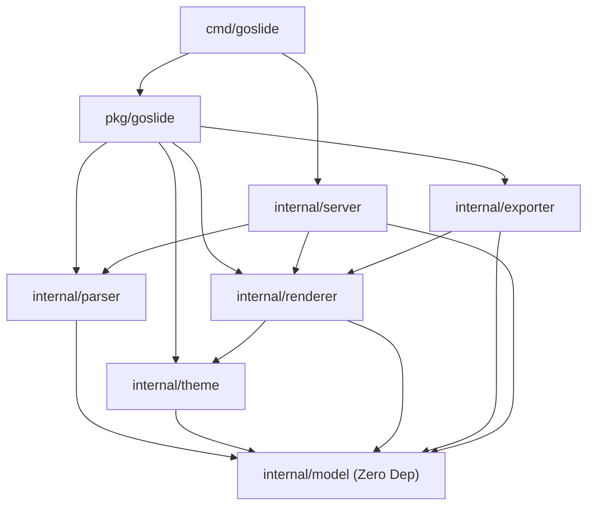

# Goslide 절대적 엔지니어링 제약 (Hard Constraints)

본 사양서는 Goslide의 모든 코드 작성 및 리팩토링 시 예외 없이 준수해야 하는 **절대적인 제약 조건**입니다.

---

## 1. 5대 핵심 코딩 가드레일

1. **CGO 의존성 0% (Pure Go)**:
   - `CGO_ENABLED=0` 환경에서 정상 컴파일되어야 함.
   - CGO가 필요한 패키지 임의 추가 금지 (`chroma/v2`, 표준 `archive/zip` 활용).
2. **글로벌 상태(Global State) 전면 금지**:
   - 패키지 레벨 `var`로 설정, 캐시, 인스턴스 보관 금지.
   - 모든 컴포넌트는 생성자(`New...`)를 통한 의존성 주입(DI) 필수.
3. **`panic()` 남용 금지**:
   - 내부 패키지 로직에서 `panic` 호출 절대 금지.
   - 모든 에러는 `fmt.Errorf("...: %w", err)`를 통해 명시적으로 반환.
4. **Context 생명주기 및 리소스 회수 보장**:
   - 파일 I/O 및 `chromedp` 서브프로세스 제어에는 반드시 `context.Context` 전달.
   - 파일 디스크립터, 브라우저 세션 등은 `defer close()` 또는 `defer cancel()`로 결정론적 회수.
5. **모델 불변성 (Immutability)**:
   - 파싱된 `Deck`과 `Slide` 구조체는 빌드 후 읽기 전용으로 취급하여 데이터 레이스 원천 차단.

---

## 2. 순환 참조 방지 및 패키지 격리 4대 규칙



1. **규칙 1 (최하위 모델 패키지 격리)**: `internal/model`은 최하위 패키지로서 Go 표준 라이브러리 외에 어떠한 다른 내부/외부 패키지도 임포트하지 않는다.
2. **규칙 2 (파서의 독립성)**: `internal/parser`는 오직 `internal/model`에만 의존하며, `renderer`, `exporter`, `theme`를 임포트할 수 없다.
3. **규칙 3 (파이프라인 단방향 참조)**: `internal/exporter`는 캡처 대상인 완성된 HTML을 얻기 위해 `internal/renderer`를 참조할 수 있으나, 반대 방향(`renderer` $\rightarrow$ `exporter`) 참조는 엄격히 금지된다.
4. **규칙 4 (CLI의 얇은 래퍼 원칙)**: `cmd/goslide` 패키지는 인자 파싱 및 실행 오케스트레이션만을 수행하며, 실질적인 비즈니스 로직은 `pkg/goslide` 또는 `internal/*`를 통해 처리한다.

---

## 3. 작업 완료 기준 (Definition of Done)

모든 코드 작업 완료 전 아래 명령어를 반드시 통과해야 합니다:

```bash
# 1. 정적 분석 및 포맷팅 검증
test -z "$(gofmt -l .)"
go vet ./...
golangci-lint run

# 2. 단위/통합 테스트 및 레이스 컨디션 검증
go test -v -race -cover ./...

# 3. 골든 파일 회귀 검증
go test -v ./internal/renderer -update
```
