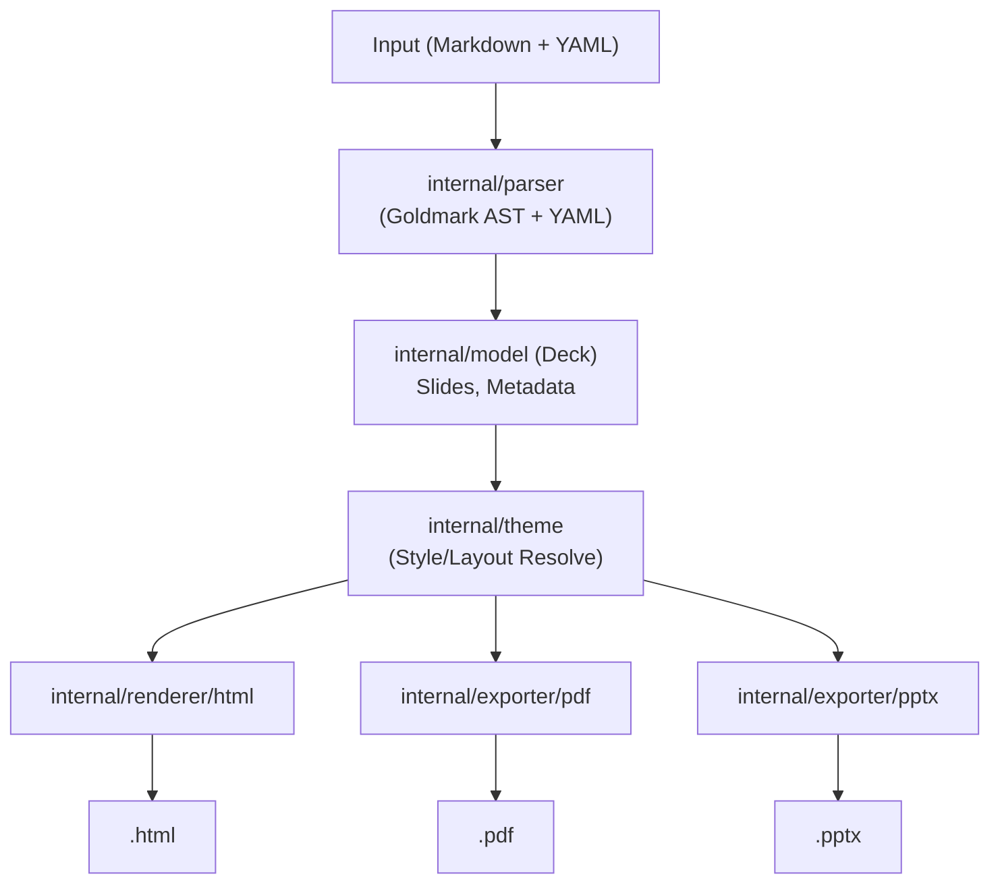

# Goslide 기획 문서 (초안)

> **문서 버전**: v0.1.0  
> **작성일**: 2026-09-30  
> **상태**: Draft (검토 및 피드백 단계)  

---

## 1. 프로젝트 개요 (Overview)

### 1.1 프로젝트 명칭 및 정의
- **프로젝트명**: **Goslide**
- **정의**: Go 언어로 구현된 초경량, 고성능 Markdown 기반 프레젠테이션 슬라이드 생성 도구 (CLI 및 Go 패키지).
- **벤치마크 모델**: [Marp (Markdown Presentation Ecosystem)](https://marp.app/)

### 1.2 추진 배경 및 필요성
- **단일 바이너리의 부재**: 기존 Marp 생태계는 Node.js 런타임 및 수많은 npm 의존성에 종속되어 있어, 경량 컨테이너 환경이나 CI/CD 파이프라인, 임베디드 배포 환경에서 설정 오버헤드가 큽니다.
- **다양한 출력 포맷에 대한 단일 워크플로우 요구**:
  - 웹 기반 발표 및 공유를 위한 **HTML** (인터랙티브 웹 슬라이드)
  - 인쇄 및 보관용 **PDF** (고해상도 벡터 출력)
  - 협업 및 사후 편집을 위한 **PPTX** (네이티브 Office Open XML 오브젝트 매핑)
- **Go 생태계의 강점 극대화**: 정적 컴파일, 초고속 파싱 성능, 낮은 메모리 사용량, 안정적인 크로스 플랫폼 배포를 제공합니다.

### 1.3 핵심 가치 제안 (Key Value Propositions)
1. **Zero External Runtime**: 복잡한 Node.js/Python 런타임 설치 없이 단일 실행 파일로 즉시 구동.
2. **Deterministic & Fast**: 동일한 마크다운 입력에 대해 100% 동일한 출력을 밀리초(ms) 단위로 보장.
3. **Pixel-Perfect PPTX Output**: HTML 웹 슬라이드와 100% 동일한 비주얼(폰트, 여백, 레이아웃 등)을 보장하는 고해상도 이미지 기반 PPTX 생성 (발표자 메모 텍스트 연동 지원).

---

## 2. 타깃 사용자 및 핵심 유스케이스

### 2.1 타깃 사용자
- **소프트웨어 엔지니어 / 아키텍트**: 코드 중심의 발표자료를 IDE에서 마크다운으로 신속히 작성하고 버전 관리(`git`)하고자 하는 개발자.
- **데브옵스(DevOps) / 테크니컬 라이터**: 기술 문서 및 릴리즈 노트를 CI/CD 빌드 단계에서 슬라이드(HTML/PDF)로 자동 생성하여 퍼블리싱하는 팀.
- **사내 발표자 및 컨설턴트**: 마크다운으로 뼈대를 빠르게 작성한 뒤, 필요 시 PPTX로 내보내어 회사 공식 양식이나 디테일 편집을 추가하려는 사용자.

### 2.2 주요 유스케이스 (Use Cases)
1. **로컬 라이브 프리뷰**:
   - `goslide serve presentation.md` 명령으로 로컬 서버 실행.
   - 마크다운 저장 시 브라우저에서 실시간 핫 리로드(Hot Reload)로 슬라이드 확인.
2. **다중 포맷 일괄 빌드**:
   - `goslide build presentation.md --format=html,pdf,pptx -o dist/`
   - 한 번의 명령으로 세 가지 포맷의 발표 산출물 생성.
3. **CI/CD 문서 자동화**:
   - GitHub Actions 등의 워크플로우에서 단일 바이너리를 다운로드받아 사내 정적 사이트(GitHub Pages 등)에 배포.

---

## 3. 핵심 기능 요구사항 (Functional Requirements)

### 3.1 Markdown 파싱 및 지시어(Directive) 사양
Marp의 문법적 직관성을 계승하되, Go의 엄격한 타입 모델로 안전하게 파싱합니다.

1. **슬라이드 분할**:
   - `---` (수평선 구분자)를 기준으로 슬라이드를 분할합니다.
   - 문서 최상단의 YAML Frontmatter(`---` ~ `---`)와 슬라이드 구분자를 정확히 구별합니다.
2. **Global Directives (전역 지시자)**:
   - Frontmatter 또는 마크다운 주석 형태 지원:
     - `theme: default | gaia | uncover` (기본 내장 테마)
     - `paginate: true | false` (페이지 번호 표시)
     - `header: "Header Text"`
     - `footer: "Footer Text"`
     - `size: 16:9 | 4:3` (화면 비율)
3. **Scoped Directives (슬라이드 단위 지시자)**:
   - 슬라이드 내 `<!-- _class: lead -->`, `<!-- backgroundColor: #f8fafc -->`, `<!-- color: #1e293b -->` 등 슬라이드별 속성 오버라이드.
4. **발표자 노트 (Speaker Notes)**:
   - 슬라이드 내 `<!-- note: 발표 시 전달할 핵심 메시지 -->` 구문을 파싱하여 발표자 모드에서 노출.

---

### 3.2 포맷별 출력 상세 요구사항

#### A. HTML (Interactive Web Presentation)
- **독립형 실행(Standalone)**: 외부 네트워크 연결 없이 동작하도록 기본 테마 CSS 및 슬라이드 제어 JS를 바이너리에 임베드 (`embed.FS`).
- **인터랙션 및 발표 보조 도구**:
  - 키보드 네비게이션 (방향키, Space, PageUp/Down, Home/End, 슬라이드 번호 점프).
  - 레이저 포인터(`L`), 스포트라이트(`S`), 인-슬라이드 펜 필기/드로잉(`D`), 화면 블라인드(`B`/`W`).
  - 전체화면 토글 (`F` 키) 및 반응형 썸네일 그리드 개요(Overview) 뷰 (`O` 키 또는 `ESC`).
  - 하단 반투명 플로팅 컨트롤 바 (마우스 접근 시 자동 노출).
- **발표자 콘솔 (Presenter Console)**:
  - `P` 키 입력 시 듀얼 윈도우 지원 (현재 슬라이드, 다음 슬라이드 미리보기, 발표자 노트, 타이머/시계, 진행률 바, 실시간 양방향 동기화).

#### B. PDF (Print/Vector Slide)
- **품질**: 텍스트 선택 및 링크 클릭이 가능한 고품질 벡터/웹 렌더링 PDF.
- **엔진 전략**:
  - 로컬에 설치된 Chrome/Chromium을 제어하는 `chromedp` 드라이버를 기본 채택.
  - Headless 환경이 없는 경우를 대비한 순수 Go PDF 렌더러 플러그인 확장 가능성 열어둠.

#### C. PPTX (Pixel-Perfect PowerPoint)
- **이미지 기반 렌더링 (Image-based Slide Generation)**:
  - HTML 슬라이드 렌더링 화면을 헤드리스 브라우저(`chromedp`)를 통해 고해상도(1920x1080 등) 이미지로 캡처하여 각 PPT 슬라이드에 1:1 풀스크린 이미지(`p:pic`)로 삽입합니다.
  - 브라우저에서 보는 폰트, CSS 스타일, 코드 하이라이팅, 레이아웃이 100% 동일하게 유지됩니다.
- **발표자 노트(Speaker Notes) 보존**:
  - 마크다운 내 `<!-- note: ... -->` 구문을 추출하여 파워포인트의 네이티브 슬라이드 메모 영역(`notesSlideX.xml`)에 텍스트로 보존합니다 (발표 시 슬라이드 노트 정상 활용 가능).

---

### 3.3 테마 및 스타일링 시스템
- **내장 테마 기본 제공**:
  - `default`: 깔끔하고 모던한 기술 발표용 테마.
  - `clean`: 미니멀한 라이트 톤 테마.
  - `dark`: 개발자 컨퍼런스용 다크 테마.
- **커스텀 스타일 지원**:
  - 마크다운 내 `<style>` 블록 허용 (Scoped CSS 지원).
  - CLI 플래그 `--theme-path=./my-theme.css`를 통한 외부 CSS 주입.

---

## 4. CLI 인터페이스 설계 (Command Line Interface)

명확하고 관용적인 서브커맨드 구조를 따릅니다 (`cobra` 기반):

```bash
# 1. 파일 빌드 (기본: HTML 출력)
goslide build presentation.md

# 2. 다중 포맷 빌드 및 대상 디렉토리 지정
goslide build presentation.md --format=html,pdf,pptx -o ./dist

# 3. 단독 실행형(리소스 인라인 임베딩) HTML 빌드
goslide build presentation.md --standalone -o index.html

# 4. 개발용 실시간 라이브 서버 (Hot Reload 지원)
goslide serve presentation.md --port=8080

# 5. 새 슬라이드 템플릿 생성
goslide init my-talk.md --theme=default
```

---

## 5. 아키텍처 및 모듈 구성

단방향 파이프라인(Parser $\rightarrow$ Intermediate Model $\rightarrow$ Resolver $\rightarrow$ Target Emitter)을 엄격히 준수합니다.



---

## 6. 비기능적 요구사항 (Non-Functional Requirements)

1. **성능 및 단순성 균형 (Performance & Simplicity)**:
   - **단순한 구조 우선 (KISS)**: 과도한 병렬 파싱이나 복잡한 인메모리 캐싱 레이어를 지양하고, Go의 명확하고 관용적인 단일 파이프라인을 유지하여 코드 가독성과 유지보수성을 최우선으로 합니다.
   - **현실적 빌드 시간**:
     - **HTML 빌드 / 라이브 프리뷰**: 일반적인 프레젠테이션 분량(30~50장) 기준 **1초 이내** 완료 (로컬 편집 및 핫 리로드 시 체감 지연이 없는 수준).
     - **PDF / PPTX 익스포트**: Headless 브라우저 프로세스(`chromedp`) 구동 및 OpenXML 압축 처리를 감안하여 **3~5초 이내** 완료.
   - **리소스 소비**: 일반적인 발표 문서 기준 메모리 피크 **100MB 내외** 유지 (초고해상도 이미지 임베딩 제외).
2. **이식성 (Portability)**:
   - Linux, macOS(Apple Silicon/Intel), Windows 전 플랫폼 크로스 컴파일 지원.
   - CGO 종속성을 배제하여 정적 컴파일 바이너리 배포.
3. **보안 (Security)**:
   - 외부 리소스(로컬 이미지/테마) 로드 시 상위 디렉터리 접근(Path Traversal / `../`) 차단.
   - Raw HTML 인젝션 허용 여부를 명시적 플래그(`--allow-local-files`, `--unsafe-html`)로 격리.

---

## 7. 단계별 개발 로드맵 (Milestones)

> 💡 **상세 일정 및 주차별 마일스톤 계획서**: [development_roadmap.md](file:///home/yundream/myjob/cloit/Goslide/docs/development_roadmap.md) 문서를 참조하십시오.

전체 개발 여정은 **「로드맵 1: MVP 구축」**과 **「로드맵 2: 정식 출시」**의 2대 축으로 분할하여 단계적으로 추진합니다:

| 대구분 | 마일스톤 | 목표 기간 | 핵심 목표 및 산출물 |
|:---|:---|:---:|:---|
| **로드맵 1<br>(MVP 단계)** | **Phase 1: Foundation & HTML MVP** | 1~3주 | • 개발 인프라, `internal/model`, `internal/parser` 파이프라인 확립<br>• 지시어 및 스마트 레이아웃 자동 추론 (`cover`, `two-cols` 등)<br>• `embed.FS` 내장 테마 3종 및 CSS 캐스케이딩<br>• `internal/renderer/html` 기반 독립형 HTML 슬라이드 생성<br>• `goslide build` CLI 및 골든 파일 회귀 테스트 통과<br>*(※ PDF, PPTX는 배제)* |
| **로드맵 2<br>(출시 단계)** | **Phase 2: Exporters & Production Release** | 4~6주 | • `internal/exporter/pdf`: `chromedp` 기반 벡터 PDF 인쇄<br>• `internal/exporter/pptx`: 고해상도 DOM 캡처 + OpenXML 패키징 + 발표자 메모 연동<br>• `internal/server`: `goslide serve` 실시간 개발 서버 (핫 리로드)<br>• 듀얼 스크린 발표자 콘솔(`P`) 및 고급 발표 도구(포인터, 펜 드로잉)<br>• `goslide init`, `pkg/goslide` 퍼블릭 API, GoReleaser 크로스 배포 (v1.0.0) |

---

## 8. 향후 논의 및 검토 과제 (Open Questions)

1. **향후 네이티브 편집 가능 객체(Editable PPTX) 모드 검토**:
   - v1.0에서는 안정적이고 픽셀 완벽한 이미지 기반 생성을 기본으로 하고, 향후 마이너 버전에서 AST 직접 매핑 모드(`--pptx-mode=native`) 추가 검토.
2. **PDF/PPTX 생성 시 브라우저 미설치 환경 대응**:
   - 시스템에 Chrome이 설치되지 않은 환경(순수 Linux 서버 등)에서의 가이드라인 제공.
