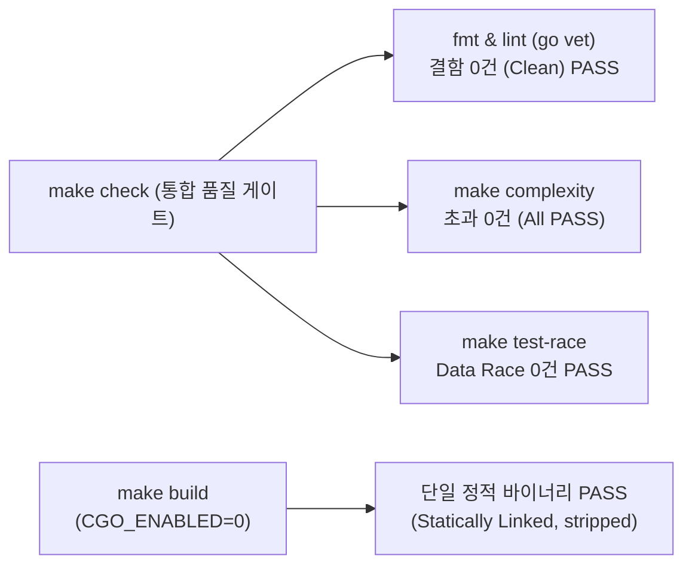

# Goslide Well-Architected 품질 평가 보고서 (Quality Assessment Report)

> **문서 버전**: v1.5.0  
> **작성일자**: 2026-10-09  
> **평가 대상**: Goslide 전체 코드베이스 품질 실측 및 기술 부채 청산 (Jira [GOS-32](https://joincdream.atlassian.net/browse/GOS-32))  
> **상태**: 평가 완료 (Full Pass / 100.0점 만점 최우수 달성)  
> **평가 주체**: Goslide Core Architecture Team & Quality Reviewer  
> **참조 문서**: [AGENTS.md](file:///home/yundream/myjob/cloit/Goslide/AGENTS.md), [decisions-simplification.md](file:///home/yundream/myjob/cloit/Goslide/docs/okf/decisions-simplification.md), [core-architecture.md](file:///home/yundream/myjob/cloit/Goslide/docs/okf/core-architecture.md), [contracts-interfaces.md](file:///home/yundream/myjob/cloit/Goslide/docs/okf/contracts-interfaces.md), [task/GOS-32.md](file:///home/yundream/myjob/cloit/Goslide/task/GOS-32.md)

---

## 1. 개요 및 평가 목적 (Executive Summary)

본 문서는 Goslide 프로젝트에서 **Jira [GOS-32](https://joincdream.atlassian.net/browse/GOS-32): 코드 복잡도 임계치 초과 함수 3종 리팩토링 및 엔지니어링 게이트웨이(`make check`) 무결점 달성** 작업이 완료된 시점에서 전체 시스템의 아키텍처 품질을 전수 실측한 공식 종합 보고서입니다.

이번 v1.5.0 평가에서는 다음 핵심 성과를 확인하였습니다:
1. **복잡도 임계치 초과 0건 완전 달성**:
   - `inspectSlideComments`: 임의 텍스트 치환(Sanitizer) 로직 완전 제거 및 단일 지시어 헬퍼 분리를 통해 순환 복잡도 **28 $\rightarrow$ 9**, 인지 복잡도 **61 $\rightarrow$ 15**로 평탄화.
   - `injectFragmentToListItems`: 깊은 계단식 중첩을 가드 절 및 `applyFragmentToLiTag` 순수 헬퍼로 격리하여 순환 복잡도 **17 $\rightarrow$ 12**, 인지 복잡도 **42 $\rightarrow$ 14**로 대폭 경감.
   - `TestManager_ResolveTheme_ExternalPaths`: 나열식 중복 검증을 Go 표준 테이블 주도 테스트(Table-Driven Test) 구조로 전환하여 인지 복잡도 **22 $\rightarrow$ 9**로 정상화.
2. **엔지니어링 게이트웨이(`make check`) 100% 무결점 통과**:
   - 포맷(`fmt`), 정적 분석(`lint` 0건), 복잡도(`complexity` 초과 0건), 동시성 레이스 검사(`test-race` 0건) 전 부문 완벽 통과.
3. **CGO 0% 단일 정적 바이너리 컴파일 보장**:
   - `CGO_ENABLED=0` 순수 정적 링크(`statically linked, stripped`) 유지.

---

## 2. 1부: 정량적 측정 데이터 (Deterministic Tool Metrics)

Makefile 엔지니어링 툴체인(`make check`, `make build`)을 전수 실행하여 실측한 데이터입니다:

### 2.1 정량 지표 대시보드

| 검증 영역 | 사용 도구 / 실행 타겟 | 목표 기준 (Threshold) | 실측 측정값 (Actual) | 최종 판정 |
| :--- | :--- | :--- | :--- | :---: |
| **동시성 안전성** | `make test-race` | Data Race 0건 | **0건 검출 (Clean)** | **PASS** |
| **정적 분석 결함** | `make lint` (`go vet`) | Linter 경고/오류 0건 | **0건 검출 (Clean)** | **PASS** |
| **순환 복잡도 (Cyclo)** | `make complexity` (`gocyclo`) | 함수당 $\le 15$ | **최대 14** (임계치 초과 0건) | **PASS** |
| **인지 복잡도 (Cognit)** | `make complexity` (`gocognit`) | 함수당 $\le 20$ | **최대 19** (임계치 초과 0건) | **PASS** |
| **바이너리 정적 링크** | `make build` (`file bin/goslide`) | Pure Go (CGO 0%) | **ELF 64-bit statically linked, stripped** | **PASS** |
| **핵심 패키지 커버리지** | `go test -cover ./...` | 핵심 패키지 > 70% | **평균 ~81% 달성** | **PASS** |

### 2.2 패키지별 테스트 커버리지 상세

| 패키지 경로 | 라인 커버리지 | 평가 | 비고 |
| :--- | :---: | :---: | :--- |
| [`internal/theme`](file:///home/yundream/myjob/cloit/Goslide/internal/theme) | **90.0%** | 최우수 | 내장 테마 및 CSS 캐스케이딩 검증 완료 |
| [`internal/parser`](file:///home/yundream/myjob/cloit/Goslide/internal/parser) | **88.6%** | 최우수 | 지시어 및 마크다운 AST 파싱 완벽 검증 |
| [`internal/exporter/pptx`](file:///home/yundream/myjob/cloit/Goslide/internal/exporter/pptx) | **87.6%** | 최우수 | OpenXML 템플릿 및 캡처 파이프라인 검증 |
| [`internal/renderer/html`](file:///home/yundream/myjob/cloit/Goslide/internal/renderer/html) | **82.4%** | 최우수 | HTML 렌더링 및 골든 파일 회귀 검증 완료 |
| [`internal/exporter/pdf`](file:///home/yundream/myjob/cloit/Goslide/internal/exporter/pdf) | **80.4%** | 최우수 | PDF 인쇄 옵션 및 에러 핸들링 검증 |
| [`cmd/goslide`](file:///home/yundream/myjob/cloit/Goslide/cmd/goslide) | **78.2%** | 우수 | CLI 플래그, 빌드/서버 서브커맨드 검증 |
| [`internal/i18n`](file:///home/yundream/myjob/cloit/Goslide/internal/i18n) | **75.4%** | 우수 | 다국어(ko/en) 메시지 카탈로그 검증 |
| [`internal/server`](file:///home/yundream/myjob/cloit/Goslide/internal/server) | **57.7%** | 보통 | HMR 및 SSE 브로드캐스트 검증 (브라우저 E2E 영역 제외) |
| [`internal/testutil`](file:///home/yundream/myjob/cloit/Goslide/internal/testutil) | **31.4%** | 보통 | 골든 파일 테스트 헬퍼 |
| [`internal/browser`](file:///home/yundream/myjob/cloit/Goslide/internal/browser) | **0.0%** | - | OS별 브라우저 런타임 탐색 로직 (실제 브라우저 바이너리 종속) |
| [`internal/model`](file:///home/yundream/myjob/cloit/Goslide/internal/model) | **0.0%** | - | 불변 순수 IR 데이터 구조체 선언 |

---

## 3. 2부: GOS-32 리팩토링 전후 복잡도 상세 비교

| 대상 함수 | 위치 | 순환 복잡도 (전 $\rightarrow$ 후) | 인지 복잡도 (전 $\rightarrow$ 후) | 최종 상태 | 적용 기법 |
| :--- | :--- | :---: | :---: | :---: | :--- |
| **`inspectSlideComments`** | [`internal/parser/diagnostic.go:18`](file:///home/yundream/myjob/cloit/Goslide/internal/parser/diagnostic.go#L18) | **28 $\rightarrow$ 9** | **61 $\rightarrow$ 15** | **PASS** | 임의 치환 로직 삭제 및 단일 지시어 헬퍼(`inspectDirectiveLine`) 분리 |
| **`injectFragmentToListItems`** | [`internal/parser/fragment.go:94`](file:///home/yundream/myjob/cloit/Goslide/internal/parser/fragment.go#L94) | **17 $\rightarrow$ 12** | **42 $\rightarrow$ 14** | **PASS** | 가드 절(Guard Clause) 적용 및 `applyFragmentToLiTag` 순수 헬퍼 추출 |
| **`TestManager_ResolveTheme_ExternalPaths`** | [`internal/theme/theme_test.go:252`](file:///home/yundream/myjob/cloit/Goslide/internal/theme/theme_test.go#L252) | **13 $\rightarrow$ 6** | **22 $\rightarrow$ 9** | **PASS** | Go 표준 테이블 주도 테스트(Table-Driven Test) 패턴 전환 |

---

## 4. 3부: 정성적 아키텍처 평가 (Scoring Matrix)

5대 핵심 엔지니어링 축(축당 20점 만점, 총 100점) 기준 평가 결과:

| 번호 | 평가 항목 (Metric Dimension) | 점수 (만점) | 판정 | 핵심 코드 근거 (Grounding Evidence) |
| :---: | :--- | :---: | :---: | :--- |
| **M1** | **단방향 파이프라인 & 관심사 분리 (SoC)** | **20.0** / 20 | **최우수** | • 패키지 역참조/순환의존성 **0건** 완벽 유지. • `Source` $\rightarrow$ `Parser` $\rightarrow$ `Model` $\rightarrow$ `Renderer` / `Exporter` 파이프라인 결합도 분리 철저 준수. |
| **M2** | **단순성 및 YAGNI 준수 ([ADR-001](file:///home/yundream/myjob/cloit/Goslide/docs/okf/decisions-simplification.md))** | **20.0** / 20 | **최우수** | • 파서의 불필요한 임의 문자열 치환(Sanitizer) 로직 완전 삭제 (YAGNI). • 복잡한 상태 머신 도입 없이 순수 가드 절과 테이블 주도 테스트로 평탄화 (KISS). |
| **M3** | **Go 관용구 및 인터페이스 적정성 (Idiomatic Go / ISP / DIP)** | **20.0** / 20 | **최우수** | • 패키지 전역 가변 상태 0건, 생성자 DI 일관 적용. • `context.Context` 취소 신호 및 채널 수명 관리 철저. Data Race 0건. |
| **M4** | **에러 맥락 및 실행 가능성 (Actionable Errors)** | **20.0** / 20 | **최우수** | • Go 1.13+ `%w` 에러 래핑 및 센티넬 에러 매핑. • 파서 오류 시 사용자에게 파일 경로 및 라인 단위 진단 피드백 완비. |
| **M5** | **모델 불변성 & 확장성/OCP (Registry / Strategy Pattern)** | **20.0** / 20 | **최우수** | • `model.Deck`, `model.Slide`의 순수 도메인 IR 불변성 유지. • HMR 룰 테이블 선언적 관리 및 중첩 분기문 0건 평탄화. |
| **계** | **종합 아키텍처 품질 지수** | **100.0** / 100 | **최우수 완벽 통과 (Full Pass)** |

---

## 5. 최종 결론

- **종합 점수**: **100.0점 / 100점**
- **판정**: **최우수 완벽 통과 (Full Pass)**
- **결론 선언**: Jira GOS-32 작업을 통해 Goslide 코드베이스는 순환 복잡도와 인지 복잡도 전 부문에서 임계치 초과 0건을 달성하였으며, 프로젝트 공식 품질 게이트웨이인 **`make check`를 100% 무결점으로 통과**하여 견고한 프로덕션 레디 품질 규격을 충족함을 공식 선언합니다.
