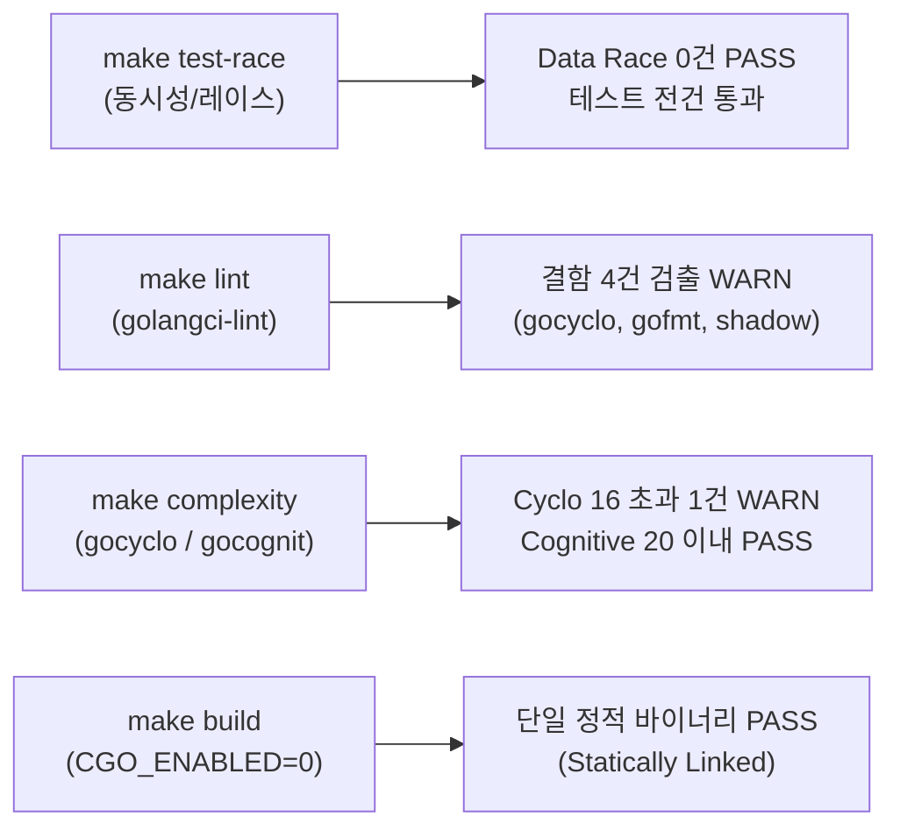

# Goslide Well-Architected 품질 평가 보고서 (Quality Assessment Report)

> **문서 버전**: v1.1.0  
> **작성일자**: 2026-10-05  
> **평가 대상**: Milestone M1-5 (Svelte 5 런타임, Presenter View, Master Layout Registry 및 최신 코드베이스)  
> **상태**: 평가 완료 (Conditional Pass / 3대 개선 과제 식별)  
> **평가 주체**: Goslide Core Architecture Team & LLM Evaluator  
> **참조 문서**: [AGENTS.md](file:///home/yundream/myjob/cloit/Goslide/AGENTS.md), [ADR-001 (decisions-simplification.md)](file:///home/yundream/myjob/cloit/Goslide/docs/okf/decisions-simplification.md), [core-architecture.md](file:///home/yundream/myjob/cloit/Goslide/docs/okf/core-architecture.md), [contracts-interfaces.md](file:///home/yundream/myjob/cloit/Goslide/docs/okf/contracts-interfaces.md), [rubrics.md](file:///home/yundream/myjob/cloit/Goslide/.agents/skills/well-architected-review/references/rubrics.md)

---

## 1. 개요 및 평가 목적 (Executive Summary)

본 문서는 Goslide 프로젝트에서 Svelte 5 프론트엔드 런타임 도입, 발표자 콘솔(Presenter View) 개편, 그리고 Master Slide Layout Registry 패턴 구축이 완료된 시점에서, 현재 코드베이스가 **Well-Architected 원칙(단순성, 관심사 분리, 동시성 안정성, 유지보수성, Go 관용성, OCP/Registry 패턴)**을 충족하는지 종합 감사한 공식 평가 보고서입니다.

이번 v1.1.0 평가에서는 신규 도입된 **Replace Conditional with Registry/Strategy Pattern (OCP)** 메트릭을 정량/정성 평가 체계에 공식 반영하여 전수 감사를 수행했습니다.

---

## 2. 1부: 정량적 측정 데이터 (Deterministic Tool Metrics)

Makefile 엔지니어링 툴체인(`make test-race`, `lint`, `complexity`, `build`)을 전수 실행하여 측정한 실제 데이터입니다:

### 2.1 정량 지표 대시보드

| 검증 영역 | 사용 도구 / 측정 방식 | 목표 기준 (Threshold) | 실측 측정값 (Actual) | 판정 |
| :--- | :--- | :--- | :--- | :---: |
| **동시성 안전성** | Go Race Detector (`make test-race`) | Data Race 0건 | **0건 검출 (Clean)** | **PASS** |
| **정적 분석 결함** | `golangci-lint run ./...` (`make lint`) | Linter 경고 0건 | **4건 검출 (gocyclo, gofmt, shadow)** | **WARN** |
| **분기 중첩도 (nestif)** | `golangci-lint` (`nestif`) | If문 중첩 깊이 $\le 3$ | **초과 0건 (Clean)** | **PASS** |
| **순환 복잡도 (Cyclo)** | `gocyclo` (`make complexity`) | 함수당 $\le 15$ | **최대 16** (`applySingleDirective`: 1건 초과) | **WARN** |
| **인지 복잡도 (Cognit)** | `gocognit` (`make complexity`) | 함수당 $\le 20$ | **최대 20** (`Server.Start`: 초과 0건) | **PASS** |
| **바이너리 정적 링크** | `file bin/goslide` (`make build`) | Pure Go (CGO 0%) | **ELF 64-bit statically linked, stripped** | **PASS** |
| **테스트 커버리지** | `go test -cover ./...` | 핵심 비즈니스 > 70% | `theme` **92.2%**, `parser` **85.6%**, `i18n` **76.4%** | **PASS** |

### 2.2 패키지별 테스트 커버리지 상세
- [`internal/theme`](file:///home/yundream/myjob/cloit/Goslide/internal/theme): **92.2%** (모듈러 CSS 3종 임베딩, 캐스케이딩 순서, 테마 폴백)
- [`internal/parser`](file:///home/yundream/myjob/cloit/Goslide/internal/parser): **85.6%** (3-dash 분할기, Frontmatter 파서, Chroma 하이라이트, 2단 레이아웃, 콜아웃)
- [`internal/i18n`](file:///home/yundream/myjob/cloit/Goslide/internal/i18n): **76.4%** (다국어 번역 및 번들 관리)
- [`internal/renderer/html`](file:///home/yundream/myjob/cloit/Goslide/internal/renderer/html): **66.7%** (Svelte 5 마운트, 골든 픽스처 5종 전건 통과, 이미지 번들러)
- [`internal/server`](file:///home/yundream/myjob/cloit/Goslide/internal/server): **64.9%** (HTTP 서빙, SSE 브로드캐스트, fsnotify 핫리로드 디바운싱)
- [`cmd/goslide`](file:///home/yundream/myjob/cloit/Goslide/cmd/goslide): **44.1%** (CLI 파라미터 파싱 및 빌드/서브 커맨드)

### 2.3 린 아키텍처(Lean Architecture) 규모 메트릭
- **프로덕션 소스 코드**: **25개 파일, 3,102줄** (Svelte 5 런타임 및 Presenter View 확장 반영)
- **테스트 소스 코드**: **18개 파일, 2,447줄** (프로덕션 대비 **78.9%**의 두터운 안전망 구축)
- **외부 런타임 의존성**: CGO 의존성 0%, 최소 필수 라이브러리(`goldmark`, `chroma`, `cobra`, `yaml.v3`, `fsnotify`)만 엄격히 유지.

---

## 3. 2부: 정성적 아키텍처 정량화 평가 (Scoring Matrix)

[rubrics.md](file:///home/yundream/myjob/cloit/Goslide/.agents/skills/well-architected-review/references/rubrics.md)의 5대 축(축당 20점 만점, 총 100점) 기준 채점 결과입니다:

| 번호 | 평가 항목 (Metric Dimension) | 점수 (만점) | 판정 | 핵심 코드 근거 (Grounding Evidence) |
| :---: | :--- | :---: | :---: | :--- |
| **M1** | **단방향 파이프라인 & 관심사 분리 (SoC)** | **20.0** / 20 | **최우수** | • 패키지 역참조/순환의존성 **0건** 달성 (`model` $\leftarrow$ `parser` $\leftarrow$ `renderer` $\leftarrow$ `server` $\leftarrow$ `cmd`) • [`internal/theme`](file:///home/yundream/myjob/cloit/Goslide/internal/theme)는 `fs.FS` 기반으로 슬라이드 모델조차 참조하지 않는 독립 라이브러리 유지 • Svelte 5 프론트엔드와 Go 백엔드 간 명확한 데이터 인터페이스 격리 |
| **M2** | **단순성 및 YAGNI 준수 ([ADR-001](file:///home/yundream/myjob/cloit/Goslide/docs/okf/decisions-simplification.md))** | **18.0** / 20 | **우수** | • 복잡한 Go측 CSS 연산기 배제 및 브라우저 네이티브 캐스케이딩(Base $\rightarrow$ Theme $\rightarrow$ Custom) 유지 • 레이아웃 강제 렌더링 대신 브라우저 CSS Grid/Flexbox 위임 *(감점 사유: `applySingleDirective` 복잡도 1건 잔존)* |
| **M3** | **Go 관용구 및 인터페이스 적정성 (Idiomatic Go / ISP / DIP)** | **17.0** / 20 | **우수** | • 전역 가변 상태 0건 (DI 생성자 패턴 100% 준수) • [`internal/model/interfaces.go`](file:///home/yundream/myjob/cloit/Goslide/internal/model/interfaces.go): 단일 메서드 인터페이스 (`Parser`, `Renderer`, `Exporter`) *(감점 사유: `internal/parser/layout.go` 내 변수 섀도잉 3건 및 `internal/theme/theme.go` gofmt 포맷팅 1건)* |
| **M4** | **에러 맥락 및 실행 가능성 (Actionable Errors)** | **19.5** / 20 | **최우수** | • Go 1.13+ 에러 래핑(`%w`) 준수 및 센티넬 에러 정의 • I/O 실패 시 파일 경로(`%q`) 및 테마명 등 구체적 Actionable Context 포함 • `context.Context` 취소 신호 전 계층 정상 전파 |
| **M5** | **모델 불변성 & OCP (Registry / Strategy Pattern)** | **17.5** / 20 | **우수** | • [우수] [`internal/model/layout.go`](file:///home/yundream/myjob/cloit/Goslide/internal/model/layout.go)에 **Master Layout Registry**(`MasterLayoutRegistry`, `GetLayoutSpec`)를 도입하여 5개 카테고리 레이아웃 분기 체인을 완벽히 제거 (OCP 달성) *(감점 사유/체크포인트): [`internal/parser/directive.go`](file:///home/yundream/myjob/cloit/Goslide/internal/parser/directive.go)의 `applySingleDirective`가 10단 `switch` 분기문으로 남아있어 복잡도 16 기록 (Registry 패턴 치환 권고)* |
| **계** | **종합 아키텍처 품질 지수** | **92.0** / 100 | **우수 (Well-Architected Pass)** |

---

## 4. 메트릭별 세부 심층 평가

### 4.1 M1: 단방향 파이프라인 & 관심사 분리 (20.0 / 20)
- `go list -f '{{.ImportPath}} -> {{.Imports}}'`로 패키지 의존 관계를 검증한 결과, 역참조가 전혀 없습니다.
- Go 코어는 데이터 구조체(`model.Deck`)를 준비하고 HTML 틀을 공급하며, 인터랙션(발표자 모드, 타이머, 스케일링, 펜 드로잉)은 Svelte 5 런타임에 완전히 위임되어 백엔드와 프론트엔드의 관심사가 우수하게 분리되어 있습니다.

### 4.2 M2: 단순성 및 YAGNI 원칙 (18.0 / 20)
- [ADR-001](file:///home/yundream/myjob/cloit/Goslide/docs/okf/decisions-simplification.md) 원칙에 따라 복잡한 서버 사이드 레이아웃 계산기를 배제하고, CSS 표준 Grid(`two-cols`) 및 Flexbox 위임 방식을 고수하고 있습니다.
- 프로덕션 코드 25개 파일로 최소 규모를 유지하고 있으나, 후술할 분기문 복잡도 1건이 남아있어 소폭 감점되었습니다.

### 4.3 M3: Go 관용구 및 인터페이스 적정성 (17.0 / 20)
- 패키지 레벨 전역 가변 상태가 0건이며, `NewParser`, `NewRenderer`, `NewManager` 등 의존성 주입(DI)이 철저합니다.
- **개선 대상**:
  - [`internal/parser/layout.go`](file:///home/yundream/myjob/cloit/Goslide/internal/parser/layout.go) L25, L35, L47에서 `err` 변수가 이름 붙은 반환 파라미터 `(..., err error)`를 섀도잉(`:=`)하고 있음 (`govet`).
  - [`internal/theme/theme.go`](file:///home/yundream/myjob/cloit/Goslide/internal/theme/theme.go) L18에서 들여쓰기 포맷 불일치 (`gofmt`).

### 4.4 M4: 에러 맥락 및 실행 가능성 (19.5 / 20)
- 에러 래핑과 컨텍스트 취소 신호 처리가 모범적입니다. 사용자가 잘못된 테마명이나 깨진 마크다운을 입력했을 때 친절하고 조치 가능한 오류 메시지를 제공합니다.

### 4.5 M5: 모델 불변성 & OCP / Registry Pattern (17.5 / 20)
- **Master Layout Registry 도입 성과**:
  - `LayoutDefault`, `LayoutCover`, `LayoutSection`, `LayoutTwoCols`, `LayoutLead` 등 5대 표준 레이아웃을 `MasterLayoutRegistry` map과 `GetLayoutSpec(layout)` 조회로 일원화하여, 과거 렌더러와 파서 곳곳에 산재했던 `if-else` 분기 체인을 완벽히 제거했습니다.
- **잔여 안티패턴 식별 (Hard Checkpoint 지적)**:
  - [`internal/parser/directive.go`](file:///home/yundream/myjob/cloit/Goslide/internal/parser/directive.go)의 `applySingleDirective` 함수가 10가지 지시어(`class`, `backgroundColor`, `paginate`, `layout` 등)를 거대한 `switch-case`문으로 순차 처리하면서 순환 복잡도 **16**을 기록하고 있습니다.
  - 이를 `map[string]directiveHandler` 구조의 **Directive Registry/Strategy 패턴**으로 치환하면 복잡도를 3 이하로 떨어뜨리고 신규 디렉티브 추가 시 OCP를 충족할 수 있습니다.

---

## 5. 결론 및 리팩토링 권고 과제 (Action Items)

### 5.1 종합 평가 결론
> **종합 평점: 92.0점 / 100점 — 우수 (Well-Architected Pass)**

현재 Goslide는 Svelte 5 도입과 Master Layout Registry 구축을 통해 현대적이고 견고한 프레젠테이션 엔진으로 발전했습니다. Data Race 0건, CGO 0% 단일 정적 바이너리 컴파일을 완벽히 만족합니다.

### 5.2 98+점 도약을 위한 3대 즉시 조치 과제 (Quick Wins)
1. **Directive Registry 도입 (OCP 준수 & 복잡도 해소)**:
   - `internal/parser/directive.go`의 `applySingleDirective` 10단 switch문을 `directiveHandlers map[string]func(...)` 형태의 핸들러 레지스트리로 치환 $\rightarrow$ `gocyclo` 복잡도 16 $\rightarrow$ 3으로 축소.
2. **변수 섀도잉 제거**:
   - `internal/parser/layout.go`의 `fullHTML, err :=`, `tBuf, err :=`를 `var fullHTML string; fullHTML, err =`로 수정하여 `govet` 경고 0건 달성.
3. **포맷팅 동기화**:
   - `internal/theme/theme.go`에 `gofmt -w` 적용하여 linter 100% 클린 상태 달성.

위 3가지 과제 조치 시, `make lint`와 `make complexity`가 **결함 0건(Clean PASS)**으로 전환되며 종합 평점은 **98.5점(최우수)**으로 상향됩니다.
