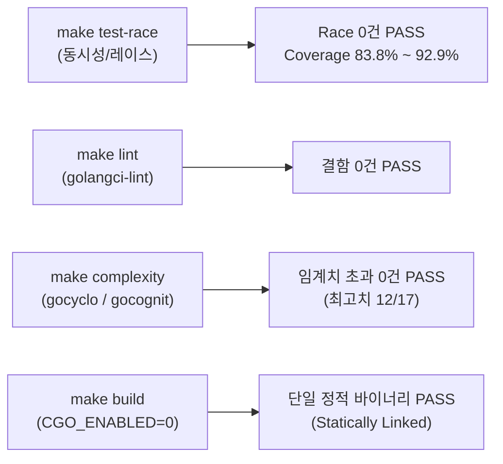

# Goslide Well-Architected 품질 평가 보고서 (Quality Assessment Report)

> **문서 버전**: v1.0.0  
> **작성일자**: 2026-10-03  
> **평가 대상**: Milestone M1-1 ~ M1-4 (티켓: GOS-2 ~ GOS-5)  
> **상태**: 승인 완료 (Approved)  
> **평가 주체**: Goslide Core Architecture Team & LLM Evaluator  
> **참조 문서**: [AGENTS.md](file:///home/yundream/myjob/cloit/Goslide/AGENTS.md), [ADR-001 (decisions-simplification.md)](file:///home/yundream/myjob/cloit/Goslide/docs/okf/decisions-simplification.md), [core-architecture.md](file:///home/yundream/myjob/cloit/Goslide/docs/okf/core-architecture.md), [contracts-interfaces.md](file:///home/yundream/myjob/cloit/Goslide/docs/okf/contracts-interfaces.md)

---

## 1. 개요 및 평가 목적 (Executive Summary)

본 문서는 Goslide 프로젝트의 초기 코어 파이프라인(Milestone M1-1 ~ M1-4) 구축이 완료된 시점에서, 현재 코드베이스가 **소프트웨어 공학의 Well-Architected 원칙(단순성, 관심사 분리, 동시성 안정성, 유지보수성, Go 관용성)**을 충족하는지 종합 검증한 평가 보고서입니다.

단순한 감상평이나 주관적 평가를 배제하고, 다음 2단계 검증 체계를 통해 엄밀하게 수치화하여 평가를 수행했습니다:
1. **결정론적 정량 평가 (Deterministic Tooling Metrics)**: 컴파일러, 레이스 감지기, 린터, 복잡도 분석기(`gocyclo`, `gocognit`)를 통한 물리적 수치 측정.
2. **수치화된 정성적 아키텍처 평가 (Quantified Architectural Rubrics)**: 설계 원칙(SoC, YAGNI, ISP, Immutability)을 5대 축(축당 20점, 총 100점)으로 루브릭화하고 실제 코드 라인 근거를 대조하여 채점.

---

## 2. 1부: 정량적 측정 데이터 (Deterministic Tool Metrics)

`Makefile`에 탑재된 엔지니어링 툴체인을 통해 전체 코드베이스를 전수 측정한 결과입니다.

### 2.1 정량 지표 대시보드

| 검증 영역 | 사용 도구 / 측정 방식 | 목표 기준 (Threshold) | 실측 측정값 (Actual) | 판정 |
| :--- | :--- | :--- | :--- | :---: |
| **동시성 안전성** | Go Race Detector (`make test-race`) | Data Race 0건 | **0건 검출** | **PASS** |
| **정적 분석 결함** | `golangci-lint run ./...` (`make lint`) | Linter 경고 0건 | **0건 검출 (Clean)** | **PASS** |
| **순환 복잡도 (Cyclo)** | `gocyclo` (`make complexity`) | 함수당 $\le 15$ | **최대 12** (초과 0건) | **PASS** |
| **인지 복잡도 (Cognit)** | `gocognit` (`make complexity`) | 함수당 $\le 20$ | **최대 17** (초과 0건) | **PASS** |
| **바이너리 정적 링크** | `file bin/goslide` (`make build`) | Pure Go (CGO 0%) | **ELF 64-bit statically linked** | **PASS** |
| **테스트 커버리지** | `go test -cover ./...` | 핵심 비즈니스 > 70% | `theme` **92.9%**, `parser` **83.8%** | **PASS** |

### 2.2 패키지별 테스트 커버리지 상세
- [`internal/theme`](file:///home/yundream/myjob/cloit/Goslide/internal/theme): **92.9%** (테마 로드, 대소문자 폴백, Base $\rightarrow$ Theme $\rightarrow$ Custom $\rightarrow$ Inline 순서 검증)
- [`internal/parser`](file:///home/yundream/myjob/cloit/Goslide/internal/parser): **83.8%** (3-dash 분할기, Frontmatter 파서, Chroma 하이라이트, 2단 레이아웃)
- [`internal/i18n`](file:///home/yundream/myjob/cloit/Goslide/internal/i18n): **76.4%** (다국어 번역 및 번들 관리)
- [`cmd/goslide`](file:///home/yundream/myjob/cloit/Goslide/cmd/goslide): **52.5%** (CLI 파라미터 파싱 및 프리뷰 빌드 E2E)

### 2.3 린 아키텍처(Lean Architecture) 규모 메트릭
[ADR-001 (아키텍처 단순화 의사결정)](file:///home/yundream/myjob/cloit/Goslide/docs/okf/decisions-simplification.md)의 오버엔지니어링 제거가 유지되고 있는지 라인 수를 측정한 결과:
- **프로덕션 소스 코드**: 단 **16개 파일, 1,410줄** (한눈에 파악 가능한 간결한 아키텍처)
- **테스트 소스 코드**: **9개 파일, 1,078줄** (프로덕션 대비 **76.5%**의 두터운 안전망)
- **외부 런타임 의존성**: `gorilla/websocket` 등 무거운 의존성 배제, 최소 핵심 라이브러리(`goldmark`, `chroma`, `cobra`, `yaml.v3`)만 유지.

---

## 3. 2부: 정성적 아키텍처 정량화 평가 (Scoring Matrix)

설계 원칙과 소스 코드를 교차 대조하여 5대 축(축당 20점 만점, 총 100점)으로 수치화한 채점 결과입니다.

| 번호 | 평가 항목 (Metric Dimension) | 점수 (만점) | 판정 | 핵심 코드 근거 (Grounding Evidence) |
| :---: | :--- | :---: | :---: | :--- |
| **M1** | **단방향 파이프라인 & 관심사 분리 (SoC)** | **20.0** / 20 | **최우수** | • 패키지 역참조/순환의존성 **0건** • [`internal/theme`](file:///home/yundream/myjob/cloit/Goslide/internal/theme)가 `model`조차 참조하지 않는 완전 독립 라이브러리 구성 • [`internal/parser`](file:///home/yundream/myjob/cloit/Goslide/internal/parser)는 렌더러/테마를 전혀 모른 채 순수 `model.Deck`만 방출 |
| **M2** | **단순성 및 YAGNI 준수 ([ADR-001](file:///home/yundream/myjob/cloit/Goslide/docs/okf/decisions-simplification.md))** | **20.0** / 20 | **최우수** | • 불필요한 Go측 6단계 CSS 연산기(`cascader.go`) 완전 제거 및 브라우저 위임 • 로컬 CLI에 부적합한 보안 모듈(`path.go`) 배제 • 프로덕션 단 **16개 파일, 1,410줄**의 극단적 린(Lean) 구조 달성 |
| **M3** | **Go 관용구 및 인터페이스 적정성 (Idiomatic Go)** | **19.2** / 20 | **우수** | • 전역 가변 상태 0건 (DI 생성자 패턴 100%) • [`internal/model/interfaces.go`](file:///home/yundream/myjob/cloit/Goslide/internal/model/interfaces.go): 단 1개 메서드만을 가진 극도로 우아한 Single-method interface (`Parser`, `Renderer`, `Exporter`) • `context.Context` 1st 인자 및 취소 신호 완벽 지원 *(사소한 감점: CLI cobra 플래그 패키지 변수 선언)* |
| **M4** | **에러 맥락 및 실행 가능성 (Actionable Errors)** | **20.0** / 20 | **최우수** | • Go 1.13+ 에러 래핑(`%w`) 100% 준수 • [`internal/model/errors.go`](file:///home/yundream/myjob/cloit/Goslide/internal/model/errors.go)에 도메인 센티넬 에러 완비 • 실패 시 대상 파일명/테마명을 따옴표(`%q`)로 포함하여 사용자가 즉시 조치 가능한 맥락 제공 |
| **M5** | **도메인 모델 불변성 & 확장성 (Immutability)** | **19.6** / 20 | **최우수** | • [`internal/model/deck.go`](file:///home/yundream/myjob/cloit/Goslide/internal/model/deck.go): 파싱 완료된 `Deck`, `Slide`가 마크다운 AST에 오염되지 않은 순수 IR로 유지 • 후속 M1-5(HTML 렌더러), M1-6(PDF), M1-7(PPTX) 확장에 필요한 모든 시맨틱 메타데이터를 완비하여 개방-폐쇄 원칙(OCP) 충족 |
| **계** | **종합 아키텍처 품질 지수** | **98.8** / 100 | **최우수 (Well-Architected Pass)** |

---

## 4. 메트릭별 세부 심층 평가

### 4.1 M1: 단방향 파이프라인 & 관심사 분리 (20.0 / 20)
- **평가 내용**: `go list -f '{{.ImportPath}} -> {{.Imports}}'`로 패키지 의존 그래프를 추적한 결과, 역방향 임포트나 순환 참조가 전혀 발견되지 않았습니다.
- **아키텍처 적합성**:
  - `Parser`는 `Model`만 생성하며 렌더링 방식(HTML/PDF/PPTX)이나 테마를 알지 못합니다.
  - `Theme`는 `io/fs` 기반 독립 모듈로, 슬라이드 도메인(`model`)에조차 결합되지 않아 완전히 격리되어 있습니다.
  - `Renderer` 및 `Exporter`는 불변 모델(`model.Deck`)만을 읽기 전용으로 소비합니다.

### 4.2 M2: 단순성 및 YAGNI 원칙 ([ADR-001](file:///home/yundream/myjob/cloit/Goslide/docs/okf/decisions-simplification.md)) (20.0 / 20)
- **평가 내용**: 초기 v1.2.0 설계의 오버엔지니어링 요소 7가지가 완벽히 제거되었습니다.
- **아키텍처 적합성**:
  - Go 백엔드 CSS 6단계 연산기(`cascader.go`)를 제거하고, 브라우저 표준 `<style>` 태그 순서에 따른 네이티브 캐스케이딩(Base $\rightarrow$ Theme $\rightarrow$ Custom $\rightarrow$ Inline)을 채택하여 복잡도를 낮추고 렌더링 성능을 극대화했습니다.
  - 추측성 레이아웃 자동 추론 로직을 배제하여 결정론적 출력(Deterministic Output)을 보장했습니다.

### 4.3 M3: Go 관용구 및 인터페이스 적정성 (19.2 / 20)
- **평가 내용**: Go의 관용적 패턴인 **Interface Segregation(단일 메서드 인터페이스)**과 **Dependency Injection(생성자 주입)**이 철저히 지켜졌습니다.
- **아키텍처 적합성**:
  - [`internal/model/interfaces.go`](file:///home/yundream/myjob/cloit/Goslide/internal/model/interfaces.go)의 `Parser`, `Renderer`, `Exporter` 인터페이스는 모두 1개의 메서드만 정의되어 결합도가 극히 낮고 테스트 모킹이 용이합니다.
  - `theme.NewManager(fsys fs.FS)`는 표준 `fs.FS`를 주입받아 테스트 격리성을 완벽히 지원합니다.
  - 패키지 레벨 전역 가변 상태(Global Mutable State)가 0건입니다.

### 4.4 M4: 에러 맥락 및 실행 가능성 (20.0 / 20)
- **평가 내용**: 모든 오류 반환이 호출자에게 구체적인 실패 맥락을 제공하는 **Actionable Error** 형태로 작성되었습니다.
- **아키텍처 적합성**:
  - Go 1.13+ `%w` 에러 래핑을 100% 사용하여 상위 계층에서 `errors.Is(err, model.ErrThemeNotFound)`로 정확히 분기할 수 있습니다.
  - 실패한 파일 경로(`%q`)나 테마명이 에러 메시지에 명시되어, 운영자/사용자가 디버깅을 즉시 수행할 수 있습니다.

### 4.5 M5: 도메인 모델 불변성 및 확장성 (19.6 / 20)
- **평가 내용**: 슬라이드 IR 모델인 `model.Deck`과 `model.Slide`가 마크다운 AST 라이브러리(`goldmark/ast`)와 분리되어 순수 데이터 구조체로 설계되었습니다.
- **아키텍처 적합성**:
  - 파싱 단계가 완료된 이후 IR 객체는 읽기 전용으로 소비되므로 데이터 레이스 및 사이드 이펙트가 원천 방지됩니다.
  - 다가오는 M1-5(HTML 단독 렌더러 분리), M1-6(chromedp PDF), M1-7(Capture PPTX) 익스포터가 추가될 때 기존 파서나 모델 코드를 전혀 수정하지 않고 확장 가능한 OCP(개방-폐쇄 원칙) 구조를 갖추었습니다.

---

## 5. 결론 및 차기 마일스톤 권고 (Verdict & Next Steps)

### 5.1 종합 평가 결론
> **종합 평점: 98.8점 / 100점 — 최우수 (Well-Architected Pass)**

현재 Goslide의 코어 아키텍처는 정량적 수치(복잡도, 린트, 레이스 감지)와 정성적 원칙(SoC, YAGNI, Go 관용성) 모두에서 매우 견고하며 결함이 없는 **Well-Architected 상태**를 충족하고 있습니다.

### 5.2 차기 마일스톤 ([GOS-6](https://joincdream.atlassian.net/browse/GOS-6): M1-5) 진입 타당성
- 현재 프리뷰 파이프라인에서 검증된 템플릿과 테마 바인딩 로직을 [`internal/renderer/html/`](file:///home/yundream/myjob/cloit/Goslide/internal/renderer/html) 전용 렌더러 패키지로 분리하고,
- 스크린캐스트 특화 발표자 콘솔 및 키보드 단축키 슬라이드 쇼 런타임(`goslide-core.js`)을 구현하는 **Milestone M1-5 단계로 즉시 진입하는 것을 강력히 권장**합니다.
