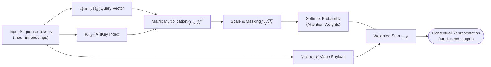
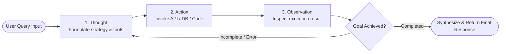

<!-- _layout: cover -->

# Modern LLM Architecture
### From Transformer Core Mechanisms to Agentic AI Pipelines

**Presenter**: joinc edu AI Tech Lab  
**Date**: October 2026 Tech Seminar  
**Shortcut Guide**: <kbd>P</kbd> Presenter View | <kbd>N</kbd> Sidebar | <kbd>D</kbd> Draw Mode | <kbd>?</kbd> All Shortcuts

<!-- note:
[Introduction]
- Welcome all attendees and emphasize that today's seminar goes beyond conceptual overviews to address real-world, production-grade engineering architectures.
- Press 'P' to open the detached presenter console, or 'N' to toggle the in-window sidebar and start the timer.
-->

---

## Seminar Agenda & Roadmap

Here are the 4 core engineering topics and session roadmap for today:

- [x] **Transformer Core**: Self-Attention and Causal Language Modeling (Causal LM)
<!-- pause -->
- [ ] **Modern Model Comparison**: Parameter Scaling Laws and Benchmark Evaluations
<!-- pause -->
- [ ] **Tool Calling & Agents**: Function Calling and Structured JSON Outputs
<!-- pause -->
- [ ] **Production Serving**: Go-based High-Performance Streaming Proxy Architecture

> [!NOTE] Session Structure
> Each chapter consists of 5 minutes of theory and 5 minutes of hands-on code analysis. Feel free to ask questions anytime.

<!-- note:
- Briefly walk through the table of contents and estimated duration (around 10 minutes per chapter).
- Check the audience's background (experience with Transformers) for a quick icebreaker.
-->

---

<!--
_class: lead
-->

# The Bitter Lesson

> *"General methods that leverage computation are ultimately the most effective by a large margin."*
>
> — **Rich Sutton** (AI Pioneer)

<!-- note:
- Keynote emphasis slide.
- Share the fundamental lesson from AI history: general methods leveraging computation ultimately triumph over human-crafted heuristic rules.
-->

---

<!-- _layout: two-cols -->
## Paradigm Shift: RNN vs Transformer

### Classical Sequence Models (RNN / LSTM)
- ~~Sequential Processing~~: Locked to sequential state; cannot parallelize
- ~~Slow Training~~: $O(N)$ sequential time complexity accumulation on long texts
- ~~Vanishing Long-Term Memory~~: Information degradation over long contexts

<!-- split -->

### Transformer (Decoder-Only Architecture)
- **Fully Parallelized**: Concurrent execution across GPU Tensor Cores
- **Self-Attention ($O(1)$ Path)**: Direct token-to-token correlation regardless of distance
- **Scaling Laws**: Exponential intelligence gains proportional to compute scale

<!-- note:
- Press 'L' to turn on the laser pointer, and highlight 'Fully Parallelized' and 'Self-Attention' on the right column.
- Explain why Transformers became the universal standard across GPU clusters from a computational complexity perspective.
-->

---

## Scaled Dot-Product Attention: Formula & Mechanism

The attention mechanism computes a weighted sum over **Value** vectors based on similarity between **Query** and **Key**:

$$\text{Attention}(Q, K, V) = \text{softmax}\left(\frac{QK^T}{\sqrt{d_k}}\right)V$$

* **Query ($Q$)**: Query vector representing the token currently focusing its attention
* **Key ($K$)**: Index vectors representing intrinsic attributes of all tokens in context
* **Value ($V$)**: Information payload vectors to be retrieved and synthesized
* **Scaling Factor ($\sqrt{d_k}$)**: Prevents vanishing gradients in Softmax as dimensionality grows

<!-- note:
- Use the database analogy: Query corresponds to a search query, Key to indexing keys, and Value to actual data records.
- Press 'D' to activate draw/annotation mode, draw a circle around the denominator, and intuitively illustrate the role of the scaling factor.
-->

---

## Transformer Self-Attention Dataflow

Complete pipeline showing input embeddings projected via linear weights ($W_Q, W_K, W_V$) into contextualized vectors:



> [!NOTE] Parallel Tensor Optimization
> Pairwise token similarities are computed in a single large-scale matrix multiplication (Matmul) to maximize GPU acceleration.

<!-- note:
- Visually trace the parallel pipeline from Q, K, V projections to final weighted-sum contextual output.
- Observe how the Mermaid diagram spans cleanly across the 16:9 slide canvas.
-->

---

<!--
_class: lead
_backgroundImage: linear-gradient(135deg, #0b192c 0%, #1e3e62 60%, #0073bb 100%)
_color: #ffffff
-->

# HANDS ON
### Engineering Practice: From Tool Integration to Serving Pipelines

<!-- note:
[Session Transition: Hands-on Phase]
- Announce the transition from Transformer theory to practical implementation and engineering practice.
- Walk through Python Tool Calling followed by a Go streaming proxy implementation.
-->

---

<!--
_class: compact
-->

## Python: Tool Calling Implementation Example

Standard pattern where the LLM inspects structured JSON schemas to invoke external APIs:

```python {5-19}
import json
from openai import OpenAI

client = OpenAI()
tools = [{
    "type": "function",
    "function": {
        "name": "query_database",
        "description": "Query quarterly financial metrics from the enterprise database",
        "parameters": {
            "type": "object",
            "properties": {
                "ticker": {"type": "string", "description": "Stock ticker symbol (e.g. AAPL)"},
                "quarter": {"type": "string", "enum": ["Q1", "Q2", "Q3", "Q4"]}
            },
            "required": ["ticker", "quarter"]
        }
    }
}]
response = client.chat.completions.create(model="gpt-4o", messages=[{"role": "user", "content": "Analyze AAPL Q3 financial performance"}], tools=tools)
```

> [!TIP] Prompt Engineering Tip
> Providing clear, precise descriptions in the schema dramatically improves tool selection accuracy.

<!-- note:
- Verify Chroma syntax highlighting quality in the code block.
- Clarify to the audience that the LLM does not execute code directly; it outputs the structured function name and argument JSON.
-->

---

## 2026 Frontier & Open LLM Specification Matrix

Comparative landscape of leading models evaluated for modern enterprise deployments:

| Model                 | Provider  |        Parameters | Context |    License     | Primary Use Case                      |
| :-------------------- | :-------: | ----------------: | ------: | :------------: | :------------------------------------ |
| **GPT-4o**            |  OpenAI   | Undisclosed (MoE) |    128k | Commercial API | Complex Reasoning, Multimodal         |
| **Claude 3.5 Sonnet** | Anthropic |       Undisclosed |    200k | Commercial API | Coding Agents, Long Document Analysis |
| **Llama 3.3**         |   Meta    |         70B Dense |    128k |   Community    | On-Premise Enterprise Deployment      |
| **Qwen 2.5 Coder**    |  Alibaba  |         32B Dense |    128k |   Apache 2.0   | Open-Source Code Generation           |
| **Gemma 2**           |  Google   |         27B Dense |      8k |     Terms      | Edge Devices & Low-Power Serving      |

> [!NOTE] Enterprise Adoption Recommendation
> For domains with strict regulatory compliance (finance/healthcare), private hosting using Apache 2.0 or Community licensed models is recommended.

<!-- note:
- Note the surge in demand for on-premise private hosting driven by open-weight models like Llama and Qwen.
- Highlight the column alignments (left, center, right) in the table for visual readability.
-->

---

<!-- _layout: two-cols -->
## RAG vs Agentic Pipelines

### Naïve Retrieval-Augmented Generation (RAG)
- **Linear Pipeline**: Query $\rightarrow$ Embedding $\rightarrow$ Search $\rightarrow$ Answer
- **Single-Turn Bottleneck**: Poor retrieval yields unrecoverable hallucinations
- **Read-Only Limitation**: Cannot execute writes or dynamic conditional re-queries

<!-- split -->

### Agentic Workflow (Agentic AI)
- **Iterative Reasoning (ReAct Loop)**: Thought $\rightarrow$ Action $\rightarrow$ Observation
- **Autonomous Tool Use**: Execute SQL, run code, browse the web
- **Self-Correction**: Autonomously inspects output failures and retries queries

<!-- note:
- Press 'S' to activate spotlight mode, and hover over 'Self-Correction' on the right to focus audience attention.
- Discuss the industry migration from basic RAG to autonomous agentic architectures.
-->

---

## Autonomous Agent ReAct Reasoning Loop

A state machine iteratively cycling through Thought, Action, and Observation to achieve user goals:



> [!TIP] Deterministic Verification Gates
> Placing static linters or schema validators within the agent loop reduces hallucination rates close to 0%.

<!-- note:
- Walk through how an agent's ReAct cycle functions using the Mermaid diagram.
- Observe how vector diagrams scale cleanly across the presentation canvas.
-->

---

## 📽️ Agentic AI Live Demonstration


<!-- note:
- YouTube live demo video embedding demonstration.
- Play the video to show autonomous multi-step reasoning in real time.
-->

---

<!--
_class: compact
-->

## Ultra-Lightweight LLM Streaming Proxy in Go

Zero-allocation token streaming architecture leveraging Go goroutines and standard `net/http` Server-Sent Events (SSE):

```go {15-18,21-25}
package main

import (
    "bufio"
    "context"
    "fmt"
    "io"
    "net/http"
)

// StreamTokenProxy handles real-time token streaming with zero memory allocations
func StreamTokenProxy(ctx context.Context, w http.ResponseWriter, upstreamBody io.Reader) error {
    w.Header().Set("Content-Type", "text/event-stream")
    w.Header().Set("Cache-Control", "no-cache")
    flusher, ok := w.(http.Flusher)
    if !ok {
        return fmt.Errorf("streaming unsupported by client")
    }

    scanner := bufio.NewScanner(upstreamBody)
    for scanner.Scan() {
        tokenLine := scanner.Text()
        fmt.Fprintf(w, "data: %s\n\n", tokenLine)
        flusher.Flush()
    }
    return scanner.Err()
}
```

> [!IMPORTANT] Zero-Allocation High-Performance Principle
> Stream buffer reuse and channel buffering are applied to minimize Go runtime garbage collector (GC) pressure.

<!-- note:
- Highlight that Goslide's live reload feature (`goslide serve`) uses this exact standard Go SSE mechanism.
-->

---

<!-- _layout: section -->
<!-- _fragmentStyle: dim -->

# Engineering Conclusions & Roadmap
### "Moving Beyond Simple Prompts toward Autonomous Agents & Domain Optimization"

* **Deterministic Verification** — Schema validation gates to eliminate hallucinations
<!-- pause -->
* **Enterprise Private Serving** — Open-weight models for TCO & data sovereignty
<!-- pause -->
* **Real-Time Observability** — Live TTFT latency & token throughput metrics

<!-- note:
- Final section wrap-up and transition slide.
- Summarize the 3 core takeaways and bridge smoothly to the Q&A session.
-->

---

<!-- _layout: cover -->
<!-- _autofit: true -->

# Thank You (Q & A)
### Questions & Discussion Welcome

* **Seminar Deck Repository**: `github.com/joincdream/goslide`
* **Presentation Engine**: Goslide Pure Go Presentation Builder (Single Binary)
* **Presenter Tooling**: 1080p Screencasting, Live Annotation, Laser Pointer & Shortcuts

- [x] Core presentation concepts delivered
- [x] Live preview & real-time hot reload demonstrated
- [ ] Open Q&A and technical feedback session

<!-- note:
[Closing]
- Invite questions from the audience and conclude the presentation.
- Press '?' to bring up the keyboard shortcut cheat sheet during Q&A.
-->
