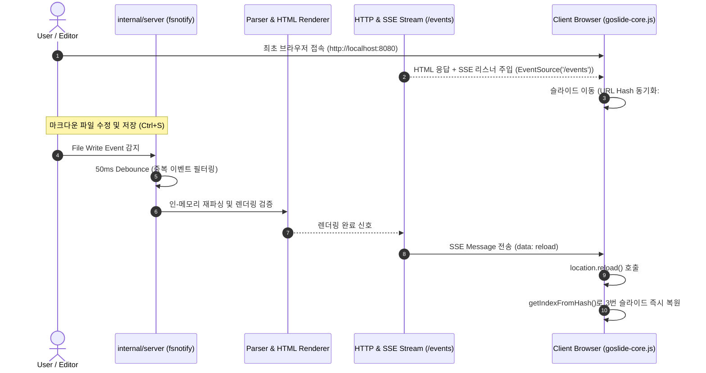

# [GOS-10] M2-3: Live Preview 로컬 개발 서버(goslide serve) 구현 계획서

> **티켓 번호**: [GOS-10](https://joincdream.atlassian.net/browse/GOS-10)  
> **마일스톤**: 로드맵 2 (Release) / Milestone M2-3  
> **마감일**: 2026-11-04  
> **상태**: 완료 (Done)  
> **담당자**: Goslide Core Team  
> **참조 문서**: [development_roadmap.md](file:///home/yundream/myjob/cloit/Goslide/docs/development_roadmap.md), [functional_specification.md](file:///home/yundream/myjob/cloit/Goslide/docs/functional_specification.md), [core-architecture.md](file:///home/yundream/myjob/cloit/Goslide/docs/okf/core-architecture.md), [decisions-simplification.md](file:///home/yundream/myjob/cloit/Goslide/docs/okf/decisions-simplification.md), [contracts-interfaces.md](file:///home/yundream/myjob/cloit/Goslide/docs/okf/contracts-interfaces.md), [hard-constraints.md](file:///home/yundream/myjob/cloit/Goslide/docs/okf/hard-constraints.md)

---

## 1. 개요 및 가치 제안 (Overview & Value Proposition)

본 태스크의 목적은 마크다운 슬라이드 작성 시 빌드와 브라우저 새로고침을 수동으로 반복하는 비효율을 없애고, **순수 Go 표준 라이브러리(`net/http`)와 파일 감시자(`fsnotify`), 그리고 단방향 SSE(Server-Sent Events) 스트리밍**을 결합하여 **초고속 핫 리로드(Hot Reload) 실시간 프리뷰 개발 서버(`goslide serve`)**를 구축하는 것입니다.

사용자가 마크다운 파일을 저장하면 300ms 이내에 브라우저가 자동으로 갱신되며, 이미 구축된 해시 기반 런타임([`goslide-core.js`](file:///home/yundream/myjob/cloit/Goslide/internal/theme/assets/js/goslide-core.js))과 연동되어 **편집 중이던 슬라이드 위치(인덱스)가 그대로 보존**됩니다. 또한 프로젝트의 아키텍처 결정 레코드([ADR-001](file:///home/yundream/myjob/cloit/Goslide/docs/okf/decisions-simplification.md))에 따라 무거운 WebSocket 라이브러리(`gorilla/websocket`)와 양방향 관리 허브를 배제하고, 표준 HTTP SSE 기반의 극도로 단순하고 견고한 아키텍처를 실현합니다.

### 1.1 사용자 및 개발자에게 제공하는 핵심 가치
1. **극대화된 개발자 경험 (DX & Live Feedback Loop)**:
   - 에디터(VS Code, Vim 등)에서 마크다운 내용을 수정하고 저장하는 즉시 브라우저에 반영되어 슬라이드 디자인과 레이아웃을 실시간으로 확인 가능.
2. **슬라이드 위치 보존 (Zero-Disruption State Preservation)**:
   - 갱신 시 첫 페이지로 튕기는 기존 도구들의 불편함을 해소. 브라우저 URL Hash(`#3`)와 연동되어 작업 중이던 슬라이드 화면이 안정적으로 유지됨.
3. **로컬 정적 에셋(이미지/스타일)의 완벽한 상대 경로 서빙**:
   - 마크다운 파일이 위치한 작업 디렉토리를 루트로 에셋을 함께 서빙하여 `./images/diagram.png`와 같은 로컬 이미지가 엑스박스(404) 없이 자연스럽게 로드됨.
4. **KISS & YAGNI 원칙의 순수 Go 단일 바이너리 강화**:
   - 서드파티 웹소켓 패키지 없이 Go 표준 `net/http`와 `http.Flusher`를 활용한 15줄 수준의 SSE 스트림으로 구현되어, 런타임 메모리 누수 및 의존성 복잡도를 원천 차단.
5. **편리한 개발자 CLI 편의 기능**:
   - 포트 지정(`--port`, `-p`), 바인드 주소(`--bind`), 저장 시 디바운스(50ms) 중복 갱신 방지, 기본 브라우저 자동 실행(`--open`) 지원.

---

## 2. 결과물의 구체적 모습 (Concrete Manifestation)

### 2.1 CLI 서브커맨드 인터랙션 명세
```bash
# 1. 기본 실행 (기본 포트 8080, localhost 바인드)
goslide serve presentation.md
# 터미널 출력:
# 🚀 Goslide Live Server started at http://localhost:8080
# 📂 Watching: presentation.md, /path/to/assets (Theme: clean)
# 💡 Press Ctrl+C to stop

# 2. 포트 및 바인드 주소 변경, 브라우저 자동 오픈
goslide serve talk.md --port 3000 --bind 0.0.0.0 --open

# 3. 테마 강제 오버라이드 및 외부 CSS 지정
goslide serve talk.md --theme dark --theme-path ./custom.css

# 4. 파일 수정 시 실시간 갱신 로그 (디바운싱 적용)
# [17:35:12] File modified: presentation.md -> Rebuilding... -> Reload broadcasted (38ms)
```

### 2.2 실시간 핫 리로드 시퀀스 (SSE Data Flow)



---

## 3. 핵심 설계 원칙 및 규칙 (Architectural Rules)

### 3.1 OKF ADR-001 준수: WebSocket 배제 및 Go 표준 SSE
- **원칙**: 브라우저에서 서버로 역방향 데이터 통신이 필요 없는 "새로고침 알림" 특성상 WebSocket은 과도한 오버엔지니어링(YAGNI)입니다.
- **구현 사양**:
  - `GET /events`: `Content-Type: text/event-stream`, `Cache-Control: no-cache`, `Connection: keep-alive`
  - 연결된 브라우저 클라이언트 채널 목록(`sync.RWMutex` 보호) 관리.
  - 마크다운 변경 시 모든 활성 클라이언트에 `data: reload\n\n` 브로드캐스트.
  - 브라우저 연결 종료(`r.Context().Done()`) 시 채널 맵에서 안전하게 회수.

### 3.2 중복 이벤트 디바운싱 (Debounce Guardrail)
- 현대 에디터는 파일 저장 시 `Write`, `Chmod`, 임시 파일 생성/삭제 등 복수의 파일 이벤트를 연달아 발생시킵니다.
- `time.AfterFunc` 또는 채널 타이머를 활용하여 **50ms 윈도우 디바운스(Debounce)**를 적용, 마지막 파일 변경 이벤트 후 한 번만 빌드 및 브로드캐스트가 실행되도록 보장합니다.

### 3.3 인-메모리 렌더링 (Zero Disk Overhead)
- `goslide serve`는 개발 도중 디스크에 불필요한 `.html` 파일을 계속 쓰지 않습니다.
- 메모리 버퍼(`bytes.Buffer`) 상에서 파싱과 렌더링을 직접 수행하여 HTTP 응답으로 서빙합니다.
- 마크다운 파싱 에러(Frontmatter 손상 등) 발생 시 프로세스가 종료되지 않고, 터미널에 친절한 경고를 출력하며 브라우저에는 기존 정상 상태를 유지하거나 에러 메시지를 표시하여 개발 흐름을 끊지 않습니다.

### 3.4 로컬 에셋 정적 파일 서빙 (Static Asset Hosting)
- 마크다운 파일이 위치한 기본 디렉토리(`filepath.Dir(markdownPath)`)를 기준으로 `http.FileServer`를 마운트합니다.
- HTML 요청(`/` 또는 `/index.html`)과 SSE 스트림(`/events`)을 제외한 나머지 경로는 로컬 파일 시스템에서 직접 스트리밍하여 이미지, 폰트, 상대 경로 에셋을 투명하게 제공합니다.

### 3.5 안전한 생명주기 관리 (Graceful Shutdown)
- OS 시그널(`SIGINT`, `SIGTERM`)을 감지하면 `http.Server.Shutdown(ctx)`을 호출하여 모든 열려 있는 SSE 연결과 리소스를 3초 타임아웃 내에 안전하게 회수하고 정상 종료합니다.

---

## 4. 세부 개발 태스크 (Work Breakdown Structure)

### 4.1 의존성 추가 (`go.mod`)
- [x] Go 표준 및 검증된 파일 감시 라이브러리 `github.com/fsnotify/fsnotify` 추가 (`go get github.com/fsnotify/fsnotify`).

### 4.2 파일 감시자 구현 (`internal/server/watcher.go`)
- [x] `Watcher` 구조체 정의 및 `NewWatcher(targetPath string, debounceDuration time.Duration)` 생성자.
- [x] 마크다운 파일 및 대상 디렉토리 재귀적 감시 등록.
- [x] 타이머 기반 디바운스 로직으로 다중 `fsnotify.Write` 이벤트를 단일 이벤트로 압축하여 알림 채널(`chan struct{}`)로 전파.
- [x] `Close()` 메서드를 통한 리소스 누수 없는 `fsnotify.Watcher` 정리.

### 4.3 개발 서버 및 SSE 브로드캐스터 구현 (`internal/server/server.go`)
- [x] `Server` 구조체 및 `Config` 정의:
  ```go
  type Config struct {
      Port         int
      Bind         string
      MarkdownPath string
      Theme        string
      ThemePath    string
      OpenBrowser  bool
  }
  ```
- [x] SSE 스트리밍 핸들러 (`handleEvents`):
  - `http.Flusher` 인터페이스 검증 및 `text/event-stream` 헤더 설정.
  - 클라이언트 채널 등록 및 `r.Context().Done()` 수신 시 등록 해제.
  - `BroadcastReload()` 호출 시 모든 활성 클라이언트에 `data: reload\n\n` 전송.
- [x] 메인 슬라이드 서빙 핸들러 (`handleIndex`):
  - 마크다운 파일 읽기 및 `parser.Parser` + `htmlrenderer.Renderer` 메모리 렌더링.
  - 렌더링된 HTML의 `</body>` 직전에 SSE 자동 리로드 스크립트 인라인 인젝션:
    ```html
    <script>
      (function() {
        const es = new EventSource('/events');
        es.onmessage = function(e) {
          if (e.data === 'reload') {
            console.log('[goslide] Reloading presentation...');
            location.reload();
          }
        };
      })();
    </script>
    ```
- [x] 정적 파일 서빙 핸들러 (`handleStatic`):
  - `http.FileServer(http.Dir(baseDir))` 바인딩으로 상대 경로 이미지 서빙.
- [x] `Start(ctx context.Context)` 및 `Shutdown(ctx context.Context)` 생명주기 메서드.
- [x] OS 기본 브라우저 자동 오픈 헬퍼 (`openBrowser(url)`: Linux `xdg-open`, macOS `open`, Windows `rundll32`).

### 4.4 CLI 커맨드 바인딩 (`cmd/goslide/serve.go` & `root.go`)
- [x] `cmd/goslide/serve.go` 작성:
  - 플래그 등록: `--port` (`-p`, 기본: 8080), `--bind` (기본: "localhost"), `--open` (기본: false), `--theme` (`-t`), `--theme-path`.
  - 입력 인자 검증 (마크다운 파일 존재 여부 확인).
  - 시그널 컨텍스트(`signal.NotifyContext`) 연동 및 서버 구동/종료 로깅.
- [x] `cmd/goslide/root.go`의 더미 `serveCmd`를 실제 구현체와 연결.

### 4.5 단위 및 통합 테스트 (`internal/server/`)
- [x] `internal/server/watcher_test.go`:
  - 임시 파일 생성 및 수정 시 디바운스 작동 검증 (단일 알림 수신 확인).
- [x] `internal/server/server_test.go`:
  - `httptest.NewServer`를 활용하여 `/` 경로의 슬라이드 HTML 렌더링 및 SSE 스크립트 주입 검증.
  - `/events` 연결 후 `BroadcastReload()` 호출 시 SSE 이벤트 스트림 정상 수신 검증.
  - 상대 경로 이미지 에셋 서빙 정상 동작(Status 200) 검증.
- [x] `cmd/goslide/serve_test.go`:
  - 잘못된 플래그 및 존재하지 않는 파일 입력 시 적절한 에러 종료 코드 반환 검증.

---

## 5. 검증 기준 및 완료 조건 (Definition of Done)

| 번호 | 검증 항목 | 세부 기준 |
| :---: | :--- | :--- |
| **DoD 1** | **CLI 커맨드 동작** | `goslide serve sample.md` 실행 시 정상적으로 포트(8080)가 열리고 슬라이드가 서빙되는가? |
| **DoD 2** | **실시간 핫 리로드 속도** | 에디터에서 파일 수정 저장 시 300ms 이내에 브라우저가 자동으로 새로고침되는가? |
| **DoD 3** | **슬라이드 위치 보존** | 슬라이드 3번(`#3`) 열람 중 파일 수정 시, 새로고침 후에도 여전히 3번 슬라이드가 표시되는가? |
| **DoD 4** | **로컬 에셋 서빙 무결성** | 마크다운 내 상대 경로 로컬 이미지(`./assets/logo.png`)가 깨짐 없이 정상 렌더링되는가? |
| **DoD 5** | **SSE 단방향 단순화** | 외부 WebSocket 패키지 없이 Go 표준 `net/http` SSE 기반으로 메모리 누수 없이 동작하는가? |
| **DoD 6** | **안전한 종료 (Graceful)** | `Ctrl+C` 입력 시 포트 점유나 좀비 고루틴 없이 깔끔하게 서버가 종료되는가? |
| **DoD 7** | **테스트 및 레이스 검증** | `go test -v -race ./internal/server/...` 및 CLI 테스트를 100% 통과하는가? |

---

## 6. 위험 요소 및 대응 방안 (Risk & Mitigation)

1. **에디터의 원자적 저장(Atomic Save) 시 inode 변경 문제**:
   - 일부 에디터(Vim, VS Code 등)는 파일 저장 시 기존 파일을 지우고 새 임시 파일을 rename하여 교체하므로 `fsnotify`의 감시 핸들이 끊어질 수 있음.
   - **대응**: 파일 단일 감시뿐만 아니라 상위 디렉토리(`filepath.Dir`)도 함께 감시하거나, `Rename`/`Remove` 이벤트 수신 시 대상 파일에 대해 감시 핸들을 즉시 재등록(Re-watch)하도록 구현.
2. **슬라이드 작성 중 일시적 문법 에러에 의한 서버 크래시 방지**:
   - 마크다운을 타이핑하는 도중 저장하면 YAML Frontmatter가 일시적으로 깨질 수 있음.
   - **대응**: 렌더링 에러가 발생해도 서버 프로세스를 중단시키지 않고 직전 정상 HTML을 유지하거나 터미널에 에러 로그를 출력하여 개발 연속성 보장.
3. **포트 충돌(Port Conflict) 처리**:
   - 이미 8080 포트가 사용 중일 경우 패닉 없이 "Port 8080 already in use, please specify another port using --port"와 같이 직관적인 오류 메시지와 함께 표준 종료 코드 반환.
