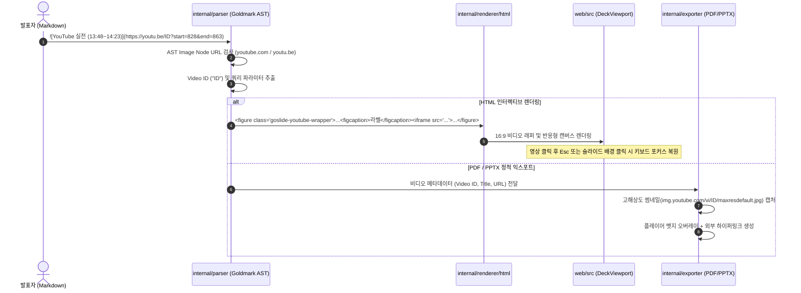

# [GOS-13] 슬라이드 내 유튜브(YouTube) 미디어 임베드 문법 및 플레이어 지원 계획서

> **티켓 번호**: [GOS-13](https://joincdream.atlassian.net/browse/GOS-13)  
> **마일스톤**: Core Feature Enhancement  
> **상태**: 진행 중 (In Progress)  
> **담당자**: Goslide Core Team  
> **참조 문서**: [docs/layout-design.md](file:///home/yundream/myjob/cloit/Goslide/docs/layout-design.md), [docs/okf/core-architecture.md](file:///home/yundream/myjob/cloit/Goslide/docs/okf/core-architecture.md), [docs/okf/contracts-interfaces.md](file:///home/yundream/myjob/cloit/Goslide/docs/okf/contracts-interfaces.md), [docs/okf/hard-constraints.md](file:///home/yundream/myjob/cloit/Goslide/docs/okf/hard-constraints.md)

---

## 1. 개요 및 가치 제안 (Overview & Value Proposition)

기술 세미나, 사내 교육, 제품 데모 슬라이드에서 **유튜브(YouTube) 영상 임베딩**은 핵심적인 전달 수단입니다. 현재 Goslide는 마크다운 내 Raw HTML(`<iframe>`)을 허용하므로 영상 삽입 자체는 기술적으로 가능하나, 실제 사용자 경험 측면에서 다음과 같은 명확한 한계가 존재합니다:

1. **복잡한 수동 마크업 작성 부담**:
   - 매번 긴 `<iframe width="..." height="..." src="https://www.youtube.com/embed/..." ...></iframe>` 코드를 수동으로 복사·붙여넣기 해야 합니다.
2. **슬라이드 키보드 내비게이션 단축키 먹통 현상 (Focus Stealing UX Bug)**:
   - 유튜브 영상을 재생/일시정지하기 위해 iframe 내부를 클릭하면 브라우저의 키보드 포커스가 YouTube iframe 플레이어로 이동합니다.
   - 이로 인해 이후 슬라이드를 넘기려고 <kbd>→</kbd>, <kbd>Space</kbd>, <kbd>PageDown</kbd> 키를 눌러도 슬라이드가 넘어가지 않고 영상이 제어되는 UX 문제가 발생합니다.
3. **1920 × 1080 마스터 캔버스 내 16:9 비율 유지 및 깨짐**:
   - 고정 해상도 및 다양한 뷰포트 배율(`transform: scale(...)`) 환경에서 비디오 컨테이너의 가로세로 비율(16:9 Aspect Ratio)이 어긋나거나 슬라이드 제목/바닥글 영역을 침범할 수 있습니다.
4. **정적 포맷(PDF / PPTX) 출력 시의 블랙아웃**:
   - 정적 인쇄 포맷인 PDF 및 PPTX로 변환 시 동영상이 재생되지 않으므로, 렌더링 시 검은 박스나 깨진 영역으로 방치됩니다.

### 1.1 핵심 가치 및 채택 원칙 (Adopted Principles)
- **마크다운 표준 미디어 임베드 문법(``) 채택**:
  - 마크다운 본래의 시맨틱(링크 `[text](url)`는 이동, 미디어 ``는 임베드)을 그대로 준수합니다.
  - 전용 지시어 없이 표준 마크다운 문법을 활용하므로 학습 비용이 제로이며 타 마크다운 도구와의 호환성이 유지됩니다.
- **파서 복잡도 최소화 (KISS 원칙)**:
  - 일반 링크(`[라벨](URL)`)의 문맥(단독 문단 여부 등)을 판별하기 위해 부모/자식 AST 노드를 복잡하게 순회하지 않습니다.
  - Goldmark AST의 이미지 노드(`ast.KindImage`)에서 URL 도메인이 유튜브(`youtube.com`, `youtu.be`)인지만 O(1)로 확인하여 파서의 복잡도 증가를 원천 차단합니다.
- **포커스 자동 복원 UX**: 영상 외부 제어 바 또는 백드롭 클릭을 통한 슬라이드 단축키 포커스 즉각 복원.
- **반응형 16:9 컨테이너**: 슬라이드 본문(`slide-body`, 840px) 높이에 최적화된 중앙 정렬 비디오 컨테이너 및 상단 캡션 라벨 렌더링.
- **우아한 Fallback (Graceful Degradation)**: PDF / PPTX 내보내기 시 고해상도 썸네일(`img.youtube.com/vi/<ID>/maxresdefault.jpg`)과 클릭 가능한 외부 링크로 자동 대체.

---

## 2. 문법 명세 및 사용자 인터페이스 (Syntax Specification)

### 2.1 마크다운 미디어 임베드 문법 (Markdown Media Embed)

슬라이드 원하는 위치에 마크다운 이미지 임베드 문법(`!`)으로 유튜브 URL을 작성합니다:

```markdown

```

- **단축 URL 및 비디오 ID 자동 호환**:
  - 정규 URL: `https://www.youtube.com/watch?v=oDjESsByBmM&t=828s`
  - 단축 URL: `https://youtu.be/oDjESsByBmM?start=828&end=863`
  - 임베드 URL: `https://www.youtube.com/embed/oDjESsByBmM`
- **라벨 텍스트(`[...]`)의 역할**:
  - 플레이어 상단에 비디오 타이틀/캡션(Caption Header)으로 자동 렌더링.
- **표준 텍스트 링크와의 명확한 분리**:
  - `` (느낌표 포함) ➔ **16:9 인터랙티브 비디오 플레이어**로 임베드
  - `[라벨](유튜브URL)` (느낌표 없음) ➔ **표준 텍스트 하이퍼링크**로 안전하게 유지 (충돌 없음)

### 2.2 유튜브 표준 쿼리 파라미터 자동 정규화
작성자가 유튜브에서 복사한 URL의 쿼리 스트링을 파서가 유튜브 임베드 규격으로 자동 변환합니다:
- `start`, `t`: 시작 시간 (초 단위 정수 또는 `13m48s` 시간 포맷을 초 단위로 자동 파싱)
- `end`: 종료 시간 (초)
- `loop`: 구간 반복 (`loop=1&playlist=VIDEO_ID` 형태로 정규화)
- `autoplay`: 자동 재생 (`0` 또는 `1`, 기본값 `0`)
- `mute`: 음소거 (`0` 또는 `1`, 기본값 `0`)

---

## 3. 아키텍처 및 파이프라인 흐름 (System Architecture)



---

## 4. 구현 작업 명세 (Task Scope: Parser & CSS)

### 4.1 Go 파서 유튜브 미디어 변환기 구현 (완료)
- **파일**: `internal/parser/youtube.go`, `internal/parser/youtube_test.go`, `internal/parser/postprocess.go`
- **구현 내용**:
  - `mediaProviders map[string]MediaHandler` 호스트 기반 O(1) 레지스트리 구축
  - 정규 URL(`watch?v=`), 단축 URL(`youtu.be/`), 임베드(`embed/`), 쇼츠(`shorts/`) 비디오 ID 파싱
  - 시간 포맷(`13m48s` ➔ `828`), 구간 반복(`loop=1&playlist=ID`), 시작/종료(`start`, `end`), 자동재생, 음소거 정규화
  - ``을 16:9 반응형 `<figure class="goslide-youtube-wrapper">` iframe HTML로 변환
  - 일반 텍스트 링크(`[라벨](URL)`)는 100% 보존
  - 파서 단위 테스트 100% 통과

### 4.2 CSS 레이아웃 및 16:9 컨테이너 스타일링 (완료)
- **파일**: `internal/theme/assets/css/deck-content.css`
- **구현 내용**:
  - 전면 집중형(`1200px × 675px`, 16:9 비율) 컨테이너 및 캡션 바 스타일 구현
  - `aspect-ratio: 16 / 9` 기반 반응형 비율 유지 및 그림자 효과 적용
  - `two-cols` 레이아웃 내 삽입 시 컬럼 폭 자동 적응

---

## 5. 완료 정의 (Definition of Done - DoD)

- [x] `` 구문이 올바른 16:9 iframe HTML로 렌더링된다.
- [x] 일반 링크(`[라벨](URL)`)는 영향받지 않고 표준 텍스트 링크로 유지된다.
- [x] 정규 URL, 축약 URL(`youtu.be`), 쿼리 파라미터(`start`, `end`, `loop` 등)가 정상 변환된다.
- [x] 1200x675 전면 집중형 16:9 CSS 컨테이너가 적용된다.
- [x] 파서 단위 테스트가 100% 통과한다.
