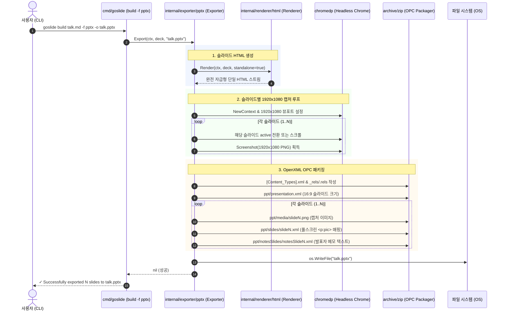

# [GOS-14] M2-2: chromedp 캡처 및 발표자 노트 기반 16:9 PPTX 익스포터 개발 계획서

> **티켓 번호**: [GOS-14](https://joincdream.atlassian.net/browse/GOS-14)  
> **마일스톤**: 로드맵 2 (RM2-Release) / Milestone M2-2 (PPTX 익스포터)  
> **마감일**: 2026-10-31  
> **상태**: 완료 (Done)  
> **담당자**: Goslide Core Team  
> **참조 문서**: [ADR-001 (decisions-simplification.md)](file:///home/yundream/myjob/cloit/Goslide/docs/okf/decisions-simplification.md), [core-architecture.md](file:///home/yundream/myjob/cloit/Goslide/docs/okf/core-architecture.md), [contracts-interfaces.md](file:///home/yundream/myjob/cloit/Goslide/docs/okf/contracts-interfaces.md), [hard-constraints.md](file:///home/yundream/myjob/cloit/Goslide/docs/okf/hard-constraints.md), [05-rendering-and-export-pipelines.md](file:///home/yundream/myjob/cloit/Goslide/docs/architecture/05-rendering-and-export-pipelines.md)

---

## 1. 개요 및 가치 제안 (Overview & Value Proposition)

본 태스크의 목적은 마크다운 소스로부터 **1920×1080 16:9 와이드스크린 고해상도 슬라이드 캡처와 마크다운 발표자 노트(`<!-- note: ... -->`)를 보존하는 Microsoft PowerPoint(PPTX) 파일을 생성하는 `internal/exporter/pptx` 패키지 및 CLI 연동을 구현**하는 것입니다.

비개발자 조직(기획, 영업, 경영진)과의 협업이나 사내 템플릿 통합 시 PPTX 제출을 요구받는 현실적인 비즈니스 요구사항에 대응하면서도, [ADR-001](file:///home/yundream/myjob/cloit/Goslide/docs/okf/decisions-simplification.md)의 원칙에 따라 복잡도를 최소화하는 **고해상도 캡처 기반 패키징 방식**을 채택합니다.

### 1.1 핵심 가치 및 기술 원칙
1. **시각적 레이아웃 100% 일치 (Pixel-Perfect 16:9)**:
   - 복잡한 CSS(Flexbox, Grid, Chroma 구문 강조, KaTeX 수식, Mermaid 다이어그램)를 파워포인트 XML 도형으로 불완전하게 재구현하지 않고, Headless Chrome(`chromedp.Screenshot`)이 렌더링한 1920×1080 고해상도 화면을 그대로 보존합니다.
2. **발표자 메모(Notes) 텍스트 보존**:
   - 슬라이드 화면은 이미지이지만, 마크다운의 `<!-- note: ... -->` 내용은 PowerPoint 네이티브 슬라이드 메모(`notesSlideN.xml`)의 순수 텍스트로 보존되어 **PowerPoint의 발표자 보기(Presenter View)에서 대본과 큐시트를 온전히 활용**할 수 있습니다.
3. **CGO 0% 순수 Go 단일 바이너리 (Pure Go)**:
   - 외부 C 라이브러리 없이 Go 표준 라이브러리 `archive/zip`만으로 OpenXML OPC(Open Packaging Conventions) 압축 컨테이너를 조립합니다.
4. **초경량 린(Lean) 아키텍처**:
   - 방대한 Office OpenXML 스펙 대신 정형화된 XML 템플릿과 이미지 매핑만으로 300줄 이내의 간결하고 견고한 코드를 달성합니다.

---

## 2. 시스템 아키텍처 및 파이프라인 (Architecture & Pipeline)



---

## 3. 세부 컴포넌트 설계 명세

### 3.1 패키지 레이아웃 (`internal/exporter/pptx/`)
```
internal/exporter/pptx/
├── template.go       # OpenXML 정적 템플릿 및 관계(Relations) 매핑 정의
├── capture.go        # chromedp 기반 슬라이드별 1920x1080 PNG 캡처
├── exporter.go       # model.Exporter 인터페이스 구현체 및 archive/zip 패키징
└── exporter_test.go  # 단위 테스트, ZIP 구조 무결성 및 PK 매직 넘버 검증
```

### 3.2 OpenXML OPC 규격 매핑 (16:9 와이드스크린)
- **16:9 슬라이드 크기 (EMU 단위)**:
  - 가로: $12,192,000\text{ EMU}$ ($13.333\text{ 인치}$)
  - 세로: $6,858,000\text{ EMU}$ ($7.5\text{ 인치}$)
- **슬라이드 본문 매핑 (`ppt/slides/slideN.xml`)**:
  ```xml
  <p:spTree>
    <p:pic>
      <p:nvPicPr>
        <p:cNvPr id="2" name="Slide Image"/>
      </p:nvPicPr>
      <p:blipFill>
        <a:blip r:embed="rId1"/>
      </p:blipFill>
      <p:spPr>
        <a:xfrm>
          <a:off x="0" y="0"/>
          <a:ext cx="12192000" cy="6858000"/>
        </a:xfrm>
        <a:prstGeom prst="rect"/>
      </p:spPr>
    </p:pic>
  </p:spTree>
  ```
- **발표자 메모 매핑 (`ppt/notesSlides/notesSlideN.xml`)**:
  ```xml
  <p:sp>
    <p:txBody>
      <a:bodyPr/>
      <a:p>
        <a:r>
          <a:t>{{ .SlideNotes }}</a:t>
        </a:r>
      </a:p>
    </p:txBody>
  </p:sp>
  ```

---

## 4. 완료 정의 (Definition of Done - DoD)

- [x] `internal/exporter/pptx/` 패키지가 `model.Exporter` 단일 인터페이스를 100% 준수하여 구현된다.
- [x] 1920×1080 16:9 규격($12,192,000 \times 6,858,000\text{ EMU}$)으로 풀스크린 이미지가 배치된다.
- [x] 마크다운의 `<!-- note: ... -->`가 슬라이드별 발표자 메모에 순수 텍스트로 보존된다.
- [x] `cmd/goslide/build.go`에 `-f pptx` 플래그 및 `<input>.pptx` 자동 확장자 매핑이 연동된다.
- [x] 생성된 `.pptx` 파일의 첫 4바이트가 ZIP 매직 넘버(`PK\x03\x04`)를 만족하고 표준 압축 해제가 가능하다.
- [x] 단위 테스트(`go test -v ./internal/exporter/pptx/...`) 및 전체 테스트(`make check`)가 100% 통과한다.

---

## 5. 단계별 실행 계획 (5-Phase Execution Plan)

| 단계 | 작업 내용 | 대상 파일 |
| :---: | :--- | :--- |
| **Phase 1** | **OpenXML 템플릿 및 OPC 구조 정의**<br>• `[Content_Types].xml`, `presentation.xml`, `slide.xml`, `notesSlide.xml` 템플릿 구현 | `internal/exporter/pptx/template.go` |
| **Phase 2** | **슬라이드별 고해상도 캡처 파이프라인 구현**<br>• `chromedp`를 활용한 1920x1080 슬라이드별 PNG 버퍼 획득 | `internal/exporter/pptx/capture.go` |
| **Phase 3** | **PPTX 압축 패키징 및 Exporter 구현**<br>• `model.Exporter` 인터페이스 준수 및 `archive/zip` 조립<br>• 발표자 메모 텍스트 주입 | `internal/exporter/pptx/exporter.go` |
| **Phase 4** | **CLI 빌드 연동 및 도움말 갱신**<br>• `-f pptx` 플래그 지원 및 확장자 자동 치환<br>• `ko.json`, `en.json` 다국어 도움말 갱신 | `cmd/goslide/build.go`<br>`internal/i18n/locales/` |
| **Phase 5** | **단위 테스트 및 게이트웨이 검증**<br>• PPTX 생성, ZIP 구조 검증, 매직 넘버 테스트<br>• `make check` 전체 통과 | `internal/exporter/pptx/exporter_test.go` |
