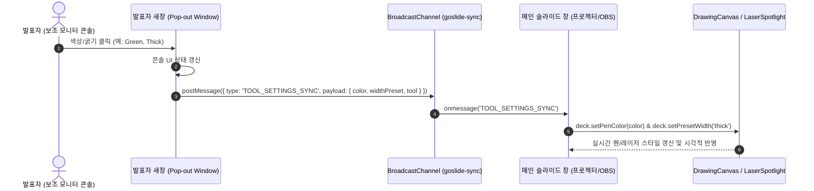

# [GOS-15] 프리젠테이션 뷰 Drawing 및 레이저포인트 색상/굵기 선택 툴바 개발 계획서

> **티켓 번호**: [GOS-15](https://joincdream.atlassian.net/browse/GOS-15)  
> **마일스톤**: 로드맵 2 (Release) / Milestone M2-4 확장 (프리젠테이션 뷰 UX 강화)  
> **마감일**: 2026-11-06  
> **상태**: 완료 (Done)  
> **담당자**: Goslide Core Team  
> **참조 문서**: [GOS-11.md](file:///home/yundream/myjob/cloit/Goslide/task/GOS-11.md), [screencast-annotation.md](file:///home/yundream/myjob/cloit/Goslide/docs/okf/screencast-annotation.md), [contracts-interfaces.md](file:///home/yundream/myjob/cloit/Goslide/docs/okf/contracts-interfaces.md), [hard-constraints.md](file:///home/yundream/myjob/cloit/Goslide/docs/okf/hard-constraints.md)

---

## 1. 개요 및 가치 제안 (Overview & Value Proposition)

본 태스크의 목적은 Goslide의 프리젠테이션 뷰(Presenter View)에서 발표자가 청중의 주의를 집중시키고 시각적 설명을 극대화할 수 있도록, **판서(Drawing) 및 레이저포인트(Laser Pointer)의 색상(4종 프리셋)과 굵기(3단계 프리셋)를 손쉽게 전환할 수 있는 전용 툴바 UI 컴포넌트를 개발하고 듀얼 뷰포트(새창 vs 사이드바 모드) 환경에 최적화하여 배치**하는 것입니다.

발표 환경과 스크린 해상도의 특성에 맞추어 다음과 같은 핵심 UX 원칙을 적용합니다:
1. **Side bar 모드 최적화 (2K/4K 와이드스크린 여백 활용)**:
   - 480px 폭의 좁은 발표자 사이드바 내부에 조작 툴바를 무리하게 배치하지 않고, **왼쪽 메인 슬라이드 뷰포트 바로 밑(하단 중앙 여백)**에 플로팅 툴바(Floating Dock)로 배치합니다.
   - 사이드바 모드를 사용하는 사용자는 통상 2K(1440p) 이상의 대화면을 사용하므로, 16:9 슬라이드 화면 하단에 넉넉한 세로 여백이 존재하여 슬라이드 가림 없이 최고의 조작 접근성을 제공합니다.
2. **새창 모드 동기화 (Pop-out Window Console)**:
   - 독립 팝업 콘솔 창 내부에 동일한 색상/굵기 선택 툴바를 배치하여, 프로젝터 연결 시 발표자가 보조 모니터의 콘솔에서 마우스 클릭으로 설정을 즉시 변경할 수 있도록 합니다.
   - `BroadcastChannel`을 통해 메인 화면으로 설정값(`TOOL_SETTINGS_SYNC`)을 0ms 무지연으로 전파하여 화면에 실시간 반영합니다.
3. **직관적인 4색 & 3단계 굵기 프리셋**:
   - 복잡한 컬러피커 대신 발표 현장에서 가장 빈번히 사용되는 4가지 명확한 시인성의 색상(Red, Blue, Green, Yellow)과 3단계 굵기(얇게, 보통, 굵게)를 원터치 토글로 제공합니다.

---

## 2. 시스템 아키텍처 및 UI 레이아웃 구조

### 2.1 뷰 모드별 툴바 배치 레이아웃

#### 1) [사이드바 모드] 왼쪽 슬라이드 하단 플로팅 독 (Floating Dock at Slide Bottom)
```
┌─────────────────────────────────────────────────────────────┬───────────────────────────────┐
│                                                             │  PRESENTER SIDEBAR (480px)    │
│                 MAIN SLIDE VIEWPORT (16:9)                  │  [ ↗ Pop-out ]  [ 14:32:05 ]  │
│                                                             ├───────────────────────────────┤
│    ┌───────────────────────────────────────────────────┐    │ [ NEXT SLIDE PREVIEW ]        │
│    │                                                   │    │ ┌───────────────────────────┐ │
│    │                 # Presentation Slide              │    │ │                           │ │
│    │                                                   │    │ └───────────────────────────┘ │
│    │                                                   │    ├───────────────────────────────┤
│    └───────────────────────────────────────────────────┘    │ [ PRESENTER NOTES ]           │
│                                                             │ • 핵심 아키텍처 설명          │
│               [ 툴바: 왼쪽 슬라이드 하단 여백 ]                 │ • 판서로 데이터 흐름 강조     │
│       ┌───────────────────────────────────────────────┐     ├───────────────────────────────┤
│       │ [🔴][🔵][🟢][🟡] │ [얇게][보통][굵게] │ [펜][포인터][🗑️]│     │ [PROGRESS] [████░░] Slide 3/10│
│       └───────────────────────────────────────────────┘     └───────────────────────────────┘
└─────────────────────────────────────────────────────────────┴───────────────────────────────┘
```
- **배치 원리**: `position: fixed; bottom: 24px; left: calc((100vw - 480px) / 2); transform: translateX(-50%);`
- 사이드바 폭(480px)을 제외한 좌측 영역의 정중앙 하단에 글래스모피즘(Glassmorphism) 플로팅 툴바로 안착되어, 슬라이드 콘텐츠를 침범하지 않고 마우스 동선을 최소화합니다.

#### 2) [새창 분리 모드] 발표자 콘솔 내부 툴바 및 BroadcastChannel 동기화


---

## 3. 세부 설계 명세 (Specification)

### 3.1 색상 및 굵기 프리셋 스펙

| 구분 | 단계 / 이름 | 값 (Value / Hex) | 세부 사양 (Pen / Laser) | 단축키 매핑 |
| :---: | :---: | :---: | :--- | :---: |
| **색상 (Color)** | **Red (레드)** | `#ef4444` | 기본 강조색, 눈에 잘 띄는 경고/포인트 | `1` |
| | **Blue (블루)** | `#3b82f6` | 정보, 기술적 설명, 차분한 주석 | `2` |
| | **Green (그린)** | `#22c55e` | 성공, 긍정, 완료 마크 | `3` |
| | **Yellow (옐로)** | `#eab308` | 하이라이트, 형광펜 효과, 주목선 | `4` |
| **굵기 (Width)** | **얇게 (Thin)** | `thin` | • Pen: `2px`<br>• Laser: 직경 `8px` (Glow 6px) | `-` |
| | **보통 (Medium)** | `medium` | • Pen: `4px`<br>• Laser: 직경 `14px` (Glow 10px) (기본값) | - |
| | **굵게 (Thick)** | `thick` | • Pen: `8px`<br>• Laser: 직경 `22px` (Glow 16px) | `+` / `=` |

### 3.2 상태 저장소 스키마 확장 (`web/src/stores/deck.svelte.js`)
```javascript
// 프리셋 상수 정의
export const COLOR_PRESETS = [
  { id: 'red', hex: '#ef4444', label: '레드' },
  { id: 'blue', hex: '#3b82f6', label: '블루' },
  { id: 'green', hex: '#22c55e', label: '그린' },
  { id: 'yellow', hex: '#eab308', label: '옐로' }
];

export const WIDTH_PRESETS = {
  thin: { pen: 2, laser: 8, glow: 6, label: '얇게' },
  medium: { pen: 4, laser: 14, glow: 10, label: '보통' },
  thick: { pen: 8, laser: 22, glow: 16, label: '굵게' }
};

// DeckStore 상태 추가
export class DeckStore {
  // ... 기존 상태 유지 ...
  activeColor = $state('#ef4444');        // 펜 및 레이저 공통 선택 색상
  activeWidthPreset = $state('medium');   // 'thin' | 'medium' | 'thick'
  
  // 게터/헬퍼
  get currentPenWidth() {
    return WIDTH_PRESETS[this.activeWidthPreset].pen;
  }

  get currentLaserSize() {
    return WIDTH_PRESETS[this.activeWidthPreset].laser;
  }

  get currentLaserGlow() {
    return WIDTH_PRESETS[this.activeWidthPreset].glow;
  }

  // 액션 메서드
  setColorPreset(hex) {
    this.activeColor = hex;
    this.penColor = hex;
    this.broadcastToolSettings();
  }

  setWidthPreset(presetKey) {
    if (WIDTH_PRESETS[presetKey]) {
      this.activeWidthPreset = presetKey;
      this.penWidth = WIDTH_PRESETS[presetKey].pen;
      this.broadcastToolSettings();
    }
  }

  broadcastToolSettings() {
    if (!this.channel) return;
    this.channel.postMessage({
      type: 'TOOL_SETTINGS_SYNC',
      payload: {
        activeColor: this.activeColor,
        activeWidthPreset: this.activeWidthPreset,
        isLaserActive: this.isLaserActive,
        isDrawMode: this.isDrawMode
      }
    });
  }
}
```

### 3.3 신규 컴포넌트: `web/src/components/PresenterToolbar.svelte`
- **역할**: 사이드바 모드 활성화 시(`deck.isSidebarOpen`) 왼쪽 슬라이드 하단에 플로팅되는 반응형 툴바.
- **주요 UI 블록**:
  1. **모드 스위처**: 펜(`D`), 레이저포인트(`L`), 지우기(`C`) 버튼.
  2. **색상 팔레트**: 4개 프리셋 원형 컬러 버튼 (현재 선택된 색상에 링/스케일 애니메이션).
  3. **굵기 셀렉터**: 3단계 바(얇게/보통/굵게) 버튼.
  4. **디자인 스타일**: 다크 글래스모피즘(`bg-slate-900/90 backdrop-blur-md border border-slate-700 shadow-2xl rounded-2xl`).

### 3.4 새창 콘솔 연동 (`PresenterSidebar.svelte` -> `openPopout`)
- `openPopout()`으로 생성되는 독립 HTML 템플릿의 하단 푸터(또는 헤더) 영역에 동일한 툴바 마크업 및 이벤트 리스너 주입.
- 콘솔에서 색상/굵기 클릭 시 `ch.postMessage({ type: 'TOOL_SETTINGS_SYNC', ... })` 호출.
- 메인 창에서 수신 시 `deck.setColorPreset()`, `deck.setWidthPreset()` 호출로 완전 동기화.

### 3.5 `LaserSpotlight.svelte` 및 `DrawingCanvas.svelte` 동적 렌더링
- **`LaserSpotlight.svelte`**:
  ```svelte
  {#if deck.isLaserActive}
    <div
      class="fixed rounded-full pointer-events-none z-[9999] -translate-x-1/2 -translate-y-1/2 transition-[transform,width,height] duration-[40ms] ease-out"
      style="left: {mouseX}px; top: {mouseY}px; width: {deck.currentLaserSize}px; height: {deck.currentLaserSize}px; background-color: {deck.activeColor}; box-shadow: 0 0 {deck.currentLaserGlow}px 2px {deck.activeColor}, 0 0 {deck.currentLaserGlow * 2}px 4px {deck.activeColor}99;"
    ></div>
  {/if}
  ```
- **`DrawingCanvas.svelte`**:
  - `ctx.strokeStyle = deck.activeColor`
  - `ctx.lineWidth = deck.currentPenWidth`

---

## 4. 완료 정의 (Definition of Done - DoD)

- [x] **색상 프리셋**: 4개 색상(Red, Blue, Green, Yellow) 선택 시 펜과 레이저포인트에 즉시 반영된다.
- [x] **굵기 프리셋**: 3단계 굵기(얇게, 보통, 굵게) 선택 시 펜 굵기(2/4/8px)와 레이저포인트 직경(8/14/22px)이 즉시 변경된다.
- [x] **사이드바 모드 툴바 위치**: 사이드바(`N`) 활성화 시, 사이드바 내부가 아닌 '왼쪽 슬라이드 하단 여백'에 플로팅 툴바가 배치된다.
- [x] **새창 모드 동기화**: 새창(`P`) 콘솔 내부에 툴바가 배치되며, 클릭 시 메인 창과 실시간 양방향 동기화된다.
- [x] **키보드 단축키 연동**: 기존 단축키(`1`~`4` 색상, `+`/`-` 굵기, `L`, `D`, `C`)와 툴바 UI 인디케이터가 일치하여 작동한다.
- [x] **빌드 및 번들**: Vite를 통한 프로덕션 번들(`npm run build`)이 정상 빌드되어 `internal/theme/assets/js/goslide-core.js`에 임베드된다.

---

## 5. 단계별 실행 계획 (5-Phase Execution Plan)

| 단계 | 작업 내용 | 대상 파일 |
| :---: | :--- | :--- |
| **Phase 1** | **상태 저장소 스키마 확장 & 프리셋 정의**<br>• 4색 & 3단계 굵기 프리셋 및 게터 정의<br>• `BroadcastChannel` 프로토콜에 `TOOL_SETTINGS_SYNC` 메시지 핸들러 구현 | `web/src/stores/deck.svelte.js` |
| **Phase 2** | **레이저 & 드로잉 캔버스 동적 스타일링**<br>• `LaserSpotlight.svelte`: 동적 색상/크기/글로우 적용<br>• `DrawingCanvas.svelte`: 동적 굵기 및 색상 동기화 | `web/src/components/LaserSpotlight.svelte`<br>`web/src/components/DrawingCanvas.svelte` |
| **Phase 3** | **사이드바 모드용 왼쪽 슬라이드 하단 툴바 컴포넌트 개발**<br>• `PresenterToolbar.svelte` UI 구현<br>• 좌측 슬라이드 하단 정렬 스타일링 및 단축키 인디케이터 매핑 | `web/src/components/PresenterToolbar.svelte`<br>`web/src/App.svelte` |
| **Phase 4** | **새창 콘솔(Pop-out Window) 툴바 연동 및 양방향 동기화**<br>• 새창 템플릿 내 툴바 UI 배치<br>• 새창 ↔ 메인 창 간 실시간 `BroadcastChannel` 이벤트 송수신 | `web/src/components/PresenterSidebar.svelte` |
| **Phase 5** | **프론트엔드 번들 빌드 및 최종 연동 검증**<br>• `npm run build`로 `goslide-core.js` 빌드<br>• 사이드바 모드 및 새창 모드 동작 확인 및 완료 처리 | `internal/theme/assets/js/goslide-core.js` |
