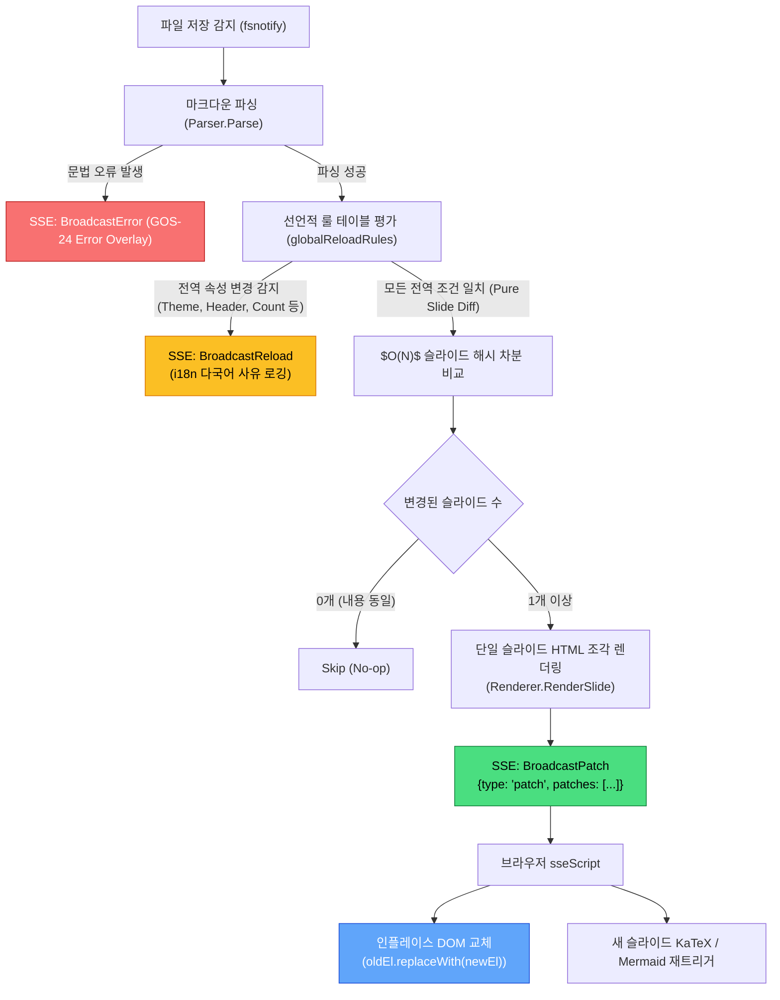

# [GOS-19] 슬라이드 단위 증분 핫 리로드(HMR) 및 깜빡임 없는 인플레이스 DOM 패칭 구현 계획서

> **티켓 번호**: [GOS-19](https://joincdream.atlassian.net/browse/GOS-19)  
> **마일스톤**: 개발 서버(`goslide serve`) 고도화 & 작성자 경험(Authoring DX) 혁신 (Zero-Flicker HMR)  
> **마감일**: 2026-11-20  
> **상태**: 완료 (Done)  
> **담당 패키지**: `internal/server/`, `internal/renderer/html/`, `internal/i18n/`  
> **설계 철학**:  
> - [ADR-001 (KISS, YAGNI, SoC)](file:///home/yundream/myjob/cloit/Goslide/docs/okf/decisions-simplification.md) — 프리젠테이션 런타임 상태(판서/타이머)와의 불필요한 결합 배제  
> - **Table-Driven Pattern**: if문 나열을 지양하고 선언적 룰 테이블로 전역 변경 조건을 OCP 준수 방식으로 구조화  
> - **i18n First**: 모든 리로드 사유 및 진단 로그 메시지의 완전한 다국어(ko/en) 카탈로그 바인딩  
> **연관 소스 파일**:  
> - [`internal/server/server.go`](file:///home/yundream/myjob/cloit/Goslide/internal/server/server.go)  
> - [`internal/server/hmr.go`](file:///home/yundream/myjob/cloit/Goslide/internal/server/hmr.go) *(신규 생성)*  
> - [`internal/server/hmr_test.go`](file:///home/yundream/myjob/cloit/Goslide/internal/server/hmr_test.go) *(신규 생성)*  
> - [`internal/server/server_test.go`](file:///home/yundream/myjob/cloit/Goslide/internal/server/server_test.go)  
> - [`internal/renderer/html/renderer.go`](file:///home/yundream/myjob/cloit/Goslide/internal/renderer/html/renderer.go)  
> - [`internal/renderer/html/template.go`](file:///home/yundream/myjob/cloit/Goslide/internal/renderer/html/template.go)  
> - [`internal/renderer/html/renderer_test.go`](file:///home/yundream/myjob/cloit/Goslide/internal/renderer/html/renderer_test.go)  
> - [`internal/i18n/locales/ko.json`](file:///home/yundream/myjob/cloit/Goslide/internal/i18n/locales/ko.json)  
> - [`internal/i18n/locales/en.json`](file:///home/yundream/myjob/cloit/Goslide/internal/i18n/locales/en.json)  
> - [`task/GOS-24.md`](file:///home/yundream/myjob/cloit/Goslide/task/GOS-24.md)  

---

## 1. 개요 및 배경 (Context & Problem Statement)

### 1.1 현상 및 문제점 분석

현재 `goslide serve` 모드는 마크다운 파일 저장(`Ctrl+S`) 시 전체 문서를 다시 빌드하고 브라우저 `location.reload()`를 실행하여 전체 페이지를 새로고침합니다.

작성자(Authoring) 관점에서 발생하는 핵심 문제는 다음과 같습니다:

1. **백지 깜빡임(White Flash / FOUC)으로 인한 시각적 피로**:
   - 에디터와 브라우저를 나란히 띄워두고 글을 쓰는 과정에서, 저장할 때마다 브라우저 창 전체가 하얗게 번쩍였다가 다시 렌더링되어 눈의 피로도가 큽니다.
2. **단일 슬라이드 수정 시의 불필요한 전체 리렌더링**:
   - 슬라이드 1장의 오탈자 수정에도 수십 장의 슬라이드 전체 DOM, 폰트, KaTeX 수식, Mermaid 다이어그램이 전부 재파싱되고 리플로우(Reflow)됩니다.

> [!NOTE] YAGNI 설계 원칙: 에디팅 모드와 프리젠테이션 모드의 분리
> 슬라이드 작성 단계에서는 청중 발표용 기능(캔버스 펜 판서, 발표 타이머 등)을 사용하지 않으므로, 핫 리로드 시 판서나 타이머 상태를 보존하려는 과도한 상태 머신 연동은 **불필요한 복잡도(YAGNI)**로 규정하고 설계에서 완전히 배제합니다.

### 1.2 개선 목표

- **Zero-Flicker 인플레이스 교체**: 브라우저 전체 새로고침 없이 수정된 슬라이드 DOM 노드만 즉각 치환.
- **최소주의 아키텍처 (KISS)**: 백엔드에서 변경된 슬라이드 번호만 $O(N)$으로 감지하고, 브라우저에서는 10줄 이내의 단순 DOM 교체로 완결.
- **명확한 전역 변경 vs 슬라이드 로컬 변경 경계**:
  - `theme`, `title`, `header`, `footer` 등 전역 속성 변경 시 ➔ **전체 페이지 새로고침(`reload`)으로 100% 안전하게 폴백**.
  - 개별 슬라이드 본문/로컬 지시어 변경 시 ➔ **증분 패치(`patch`)로 깜빡임 없이 즉시 치환**.

---

## 2. 글로벌 정보 변경 vs 슬라이드 로컬 변경 영향도 분석

[`internal/model/deck.go`](file:///home/yundream/myjob/cloit/Goslide/internal/model/deck.go)에 정의된 속성들의 영향 범위(Blast Radius)는 다음과 같이 명확히 구분됩니다:

| 분류 | 속성명 | 변경 시 영향 범위 | 동작 방식 | 사유 |
| :--- | :--- | :--- | :---: | :--- |
| **문서 전역** | `theme`, `custom_css` | `<style id="goslide-theme-styles">` 전체 치환 | **`reload`** | 전체 CSSOM 및 폰트 변경으로 전체 리로드 필수 |
| **문서 전역** | `title` | 브라우저 탭 `<title>` | **`reload`** | 문서 메타데이터 갱신 |
| **문서 전역** | `size` (16:9 / 4:3) | 슬라이드 캔버스 종횡비 및 컨테이너 규격 | **`reload`** | 전체 레이아웃 스케일링 변경 |
| **슬라이드 전역**| `header` | 로컬 헤더가 없는 모든 슬라이드의 `.slide-header` | **`reload`** | 전 슬라이드 상속 전파 |
| **슬라이드 전역**| `footer`, `paginate` | 모든 슬라이드의 푸터 및 페이지 번호 | **`reload`** | 전 슬라이드 상속 전파 |
| **슬라이드 전역**| `layout`, `autofit` | 로컬 지정이 없는 모든 슬라이드의 기본 배치 | **`reload`** | 전 슬라이드 상속 전파 |
| **구조 변경** | 슬라이드 개수 증감 | `len(slides)` 변화, 전체 인덱스 재정렬 | **`reload`** | 총 페이지 수 및 URL Hash 불일치 방지 |
| **슬라이드 로컬**| 개별 슬라이드 마크다운, 로컬 지시어 | **해당 슬라이드 1장의 `<section>` 내부** | **`patch`** | **Zero-Flicker 인플레이스 DOM 치환 적용** |

---

## 3. 시스템 아키텍처 및 데이터 흐름 (Architecture & Pipeline)



---

## 4. 상세 기술 설계 (Technical Specifications)

### 4.1 선언적 룰 테이블 기반 차분 감지기 ([`internal/server/hmr.go`](file:///home/yundream/myjob/cloit/Goslide/internal/server/hmr.go))

반복적인 `if`문 나열 대신 **테이블 주도(Table-Driven) 규칙 엔진**을 사용하여 전역 변경 조건을 선언적으로 관리합니다.

```go
package server

import (
	"crypto/sha256"
	"encoding/hex"
	"fmt"
	"io"

	"github.com/yundream/goslide/internal/model"
)

// SlidePatch represents an incremental HTML update for a single slide.
type SlidePatch struct {
	Index int    `json:"index"` // 1-based slide index
	HTML  string `json:"html"`  // Rendered <section class="slide-card ..."> snippet
}

// DeckSnapshot stores the state of a deck for diffing.
type DeckSnapshot struct {
	Title       string
	SlideCount  int
	GlobalAttrs model.GlobalDirectives
	CustomCSS   string
	SlideHashes []string
}

// DiffResult describes whether a reload or a patch is needed.
type DiffResult struct {
	NeedsReload     bool
	ReloadReasonKey string // i18n translation key (e.g. "server.hmr.reload.theme")
	ChangedIndices  []int  // 0-based slide indices requiring re-render
}

// reloadRule defines a declarative rule for triggering a full reload.
type reloadRule struct {
	reasonKey string
	isChanged func(old *DeckSnapshot, new *model.Deck) bool
}

// globalReloadRules defines all conditions that mandate a full page reload.
var globalReloadRules = []reloadRule{
	{
		reasonKey: "server.hmr.reload.slide_count",
		isChanged: func(old *DeckSnapshot, new *model.Deck) bool {
			return old.SlideCount != len(new.Slides)
		},
	},
	{
		reasonKey: "server.hmr.reload.title",
		isChanged: func(old *DeckSnapshot, new *model.Deck) bool {
			return old.Title != new.Title
		},
	},
	{
		reasonKey: "server.hmr.reload.custom_css",
		isChanged: func(old *DeckSnapshot, new *model.Deck) bool {
			return old.CustomCSS != new.CustomCSS
		},
	},
	{
		reasonKey: "server.hmr.reload.theme",
		isChanged: func(old *DeckSnapshot, new *model.Deck) bool {
			return old.GlobalAttrs.Theme != new.GlobalAttrs.Theme
		},
	},
	{
		reasonKey: "server.hmr.reload.header",
		isChanged: func(old *DeckSnapshot, new *model.Deck) bool {
			return old.GlobalAttrs.Header != new.GlobalAttrs.Header
		},
	},
	{
		reasonKey: "server.hmr.reload.footer",
		isChanged: func(old *DeckSnapshot, new *model.Deck) bool {
			return old.GlobalAttrs.Footer != new.GlobalAttrs.Footer
		},
	},
	{
		reasonKey: "server.hmr.reload.layout",
		isChanged: func(old *DeckSnapshot, new *model.Deck) bool {
			return old.GlobalAttrs.Layout != new.GlobalAttrs.Layout
		},
	},
	{
		reasonKey: "server.hmr.reload.size",
		isChanged: func(old *DeckSnapshot, new *model.Deck) bool {
			return old.GlobalAttrs.Size != new.GlobalAttrs.Size
		},
	},
	{
		reasonKey: "server.hmr.reload.paginate",
		isChanged: func(old *DeckSnapshot, new *model.Deck) bool {
			return old.GlobalAttrs.Paginate != new.GlobalAttrs.Paginate
		},
	},
	{
		reasonKey: "server.hmr.reload.autofit",
		isChanged: func(old *DeckSnapshot, new *model.Deck) bool {
			return old.GlobalAttrs.Autofit != new.GlobalAttrs.Autofit
		},
	},
}

// ComputeSlideHash generates a deterministic hash representing the slide's content and style.
func ComputeSlideHash(s *model.Slide) string {
	h := sha256.New()
	_, _ = io.WriteString(h, s.RawContent)
	_, _ = io.WriteString(h, string(s.Layout))
	_, _ = io.WriteString(h, fmt.Sprintf("%+v", s.Directives))
	return hex.EncodeToString(h.Sum(nil))
}

// NewDeckSnapshot creates a snapshot of the deck for incremental diffing.
func NewDeckSnapshot(deck *model.Deck) *DeckSnapshot {
	hashes := make([]string, len(deck.Slides))
	for i, s := range deck.Slides {
		hashes[i] = ComputeSlideHash(s)
	}
	return &DeckSnapshot{
		Title:       deck.Title,
		SlideCount:  len(deck.Slides),
		GlobalAttrs: deck.GlobalAttrs,
		CustomCSS:   deck.CustomCSS,
		SlideHashes: hashes,
	}
}

// CompareSnapshots evaluates differences between previous snapshot and current deck.
func CompareSnapshots(oldSnap *DeckSnapshot, newDeck *model.Deck) DiffResult {
	if oldSnap == nil {
		return DiffResult{NeedsReload: true, ReloadReasonKey: "server.hmr.reload.initial"}
	}

	// 1. 선언적 룰 테이블 평가 (전역 속성 변경 감지)
	for _, rule := range globalReloadRules {
		if rule.isChanged(oldSnap, newDeck) {
			return DiffResult{
				NeedsReload:     true,
				ReloadReasonKey: rule.reasonKey,
			}
		}
	}

	// 2. 슬라이드 단위 해시 비교 ($O(N)$)
	var changed []int
	for i, s := range newDeck.Slides {
		newHash := ComputeSlideHash(s)
		if i >= len(oldSnap.SlideHashes) || oldSnap.SlideHashes[i] != newHash {
			changed = append(changed, i)
		}
	}

	return DiffResult{
		NeedsReload:    false,
		ChangedIndices: changed,
	}
}
```

---

### 4.2 i18n 메시지 카탈로그 정의 ([`internal/i18n/locales/`](file:///home/yundream/myjob/cloit/Goslide/internal/i18n/locales/))

#### 1) `locales/ko.json`
```json
{
  "server.hmr.reload.initial": "초기 슬라이드 로드",
  "server.hmr.reload.slide_count": "슬라이드 개수 변경 (추가/삭제)",
  "server.hmr.reload.title": "프레젠테이션 제목(Title) 변경",
  "server.hmr.reload.custom_css": "전역 커스텀 스타일(CSS) 변경",
  "server.hmr.reload.theme": "전역 테마(Theme) 변경",
  "server.hmr.reload.header": "전역 헤더(Header) 변경",
  "server.hmr.reload.footer": "전역 푸터(Footer) 변경",
  "server.hmr.reload.layout": "전역 기본 레이아웃 변경",
  "server.hmr.reload.size": "전역 화면 비율(Size) 변경",
  "server.hmr.reload.paginate": "전역 페이지 번호 설정 변경",
  "server.hmr.reload.autofit": "전역 텍스트 자동 맞춤(Autofit) 설정 변경",
  "server.hmr.patch.log": "[%s] 슬라이드 %d 증분 패치 완료"
}
```

#### 2) `locales/en.json`
```json
{
  "server.hmr.reload.initial": "Initial slide load",
  "server.hmr.reload.slide_count": "Slide count changed (added/deleted)",
  "server.hmr.reload.title": "Presentation title changed",
  "server.hmr.reload.custom_css": "Global custom CSS changed",
  "server.hmr.reload.theme": "Global theme changed",
  "server.hmr.reload.header": "Global header changed",
  "server.hmr.reload.footer": "Global footer changed",
  "server.hmr.reload.layout": "Global default layout changed",
  "server.hmr.reload.size": "Global slide size ratio changed",
  "server.hmr.reload.paginate": "Global pagination setting changed",
  "server.hmr.reload.autofit": "Global autofit setting changed",
  "server.hmr.patch.log": "[%s] Slide %d incrementally patched"
}
```

---

### 4.3 단일 슬라이드 HTML 부분 렌더링 ([`internal/renderer/html/`](file:///home/yundream/myjob/cloit/Goslide/internal/renderer/html/))

전체 HTML 문서 대신 특정 슬라이드의 `<section class="slide-card ...">` 태그만 독립적으로 렌더링하는 `RenderSlide` 메서드를 추가합니다:

```go
// RenderSlide renders a single slide into its self-contained <section> HTML element.
func (r *HTMLRenderer) RenderSlide(ctx context.Context, deck *model.Deck, slideIndex int, w io.Writer) error {
	if slideIndex < 0 || slideIndex >= len(deck.Slides) {
		return fmt.Errorf("invalid slide index: %d", slideIndex)
	}
	s := deck.Slides[slideIndex]
	view, err := r.buildSlideView(slideIndex, s, deck)
	if err != nil {
		return err
	}
	tmpl, err := template.New("slideCard").Parse(slideSectionTemplate)
	if err != nil {
		return fmt.Errorf("failed to parse slide card template: %w", err)
	}
	return tmpl.Execute(w, view)
}
```

---

### 4.4 SSE 메시지 프로토콜 확장 & 서버 로깅 ([`internal/server/server.go`](file:///home/yundream/myjob/cloit/Goslide/internal/server/server.go))

```go
const (
	EventReload EventType = "reload"
	EventError  EventType = "error"
	EventPatch  EventType = "patch"
)

type SSEMessage struct {
	Type    EventType    `json:"type"`
	Title   string       `json:"title,omitempty"`
	Message string       `json:"message,omitempty"`
	File    string       `json:"file,omitempty"`
	Patches []SlidePatch `json:"patches,omitempty"`
}
```

#### 서버 감지 루프 내 처리 흐름
```go
diff := CompareSnapshots(s.lastSnapshot, deck)
bundle, _ := i18n.GetDefaultBundle()

if diff.NeedsReload {
    reason := bundle.T(diff.ReloadReasonKey)
    log.Printf("[goslide] Full reload triggered: %s", reason)
    s.BroadcastReload()
} else if len(diff.ChangedIndices) > 0 {
    var patches []SlidePatch
    for _, idx := range diff.ChangedIndices {
        var buf bytes.Buffer
        if err := s.renderer.RenderSlide(ctx, deck, idx, &buf); err == nil {
            patches = append(patches, SlidePatch{Index: idx + 1, HTML: buf.String()})
        }
    }
    log.Printf(bundle.T("server.hmr.patch.log", time.Since(start), diff.ChangedIndices[0]+1))
    s.BroadcastPatches(patches)
}
s.lastSnapshot = NewDeckSnapshot(deck)
```

---

### 4.5 브라우저 인플레이스 DOM 패칭 (`sseScript` in [`internal/server/server.go`](file:///home/yundream/myjob/cloit/Goslide/internal/server/server.go))

```javascript
else if (payload.type === 'patch') {
  removeOverlay();
  (payload.patches || []).forEach(function(patch) {
    var oldEl = document.querySelector('.slide-card[data-slide="' + patch.index + '"]');
    if (!oldEl) return;

    var temp = document.createElement('div');
    temp.innerHTML = patch.html.trim();
    var newEl = temp.firstElementChild;
    if (!newEl) return;

    // 현재 활성화된 슬라이드인 경우 active 클래스 유지
    if (oldEl.classList.contains('active')) {
      newEl.classList.add('active');
    }

    // 부드러운 페이드 전환 효과
    newEl.style.transition = 'opacity 0.15s ease-in-out';
    newEl.style.opacity = '0.7';

    oldEl.replaceWith(newEl);
    requestAnimationFrame(function() {
      newEl.style.opacity = '1';
    });

    // KaTeX 수식 재렌더링
    if (typeof renderMathInElement === 'function') {
      renderMathInElement(newEl, {
        delimiters: [
          {left: '$$', right: '$$', display: true},
          {left: '$', right: '$', display: false}
        ],
        throwOnError: false
      });
    }

    // Mermaid 다이어그램 재실행
    if (typeof mermaid !== 'undefined' && newEl.querySelector('.mermaid')) {
      mermaid.run({ nodes: newEl.querySelectorAll('.mermaid') });
    }
  });
}
```

---

## 5. 단계별 구현 계획 (Implementation Steps)

| 단계 | 작업 내용 | 타겟 소스 파일 |
| :---: | :--- | :--- |
| **Step 1** | **i18n 메시지 카탈로그 등록**<br>- `ko.json` 및 `en.json`에 `server.hmr.reload.*` 및 `server.hmr.patch.log` 키 추가 | [`internal/i18n/locales/ko.json`](file:///home/yundream/myjob/cloit/Goslide/internal/i18n/locales/ko.json)<br>[`internal/i18n/locales/en.json`](file:///home/yundream/myjob/cloit/Goslide/internal/i18n/locales/en.json) |
| **Step 2** | **단일 슬라이드 HTML 부분 렌더링 API 구현**<br>- `slideSectionTemplate` 서브 템플릿 분리<br>- `HTMLRenderer.RenderSlide` 구현 및 단위 테스트 작성 | [`internal/renderer/html/renderer.go`](file:///home/yundream/myjob/cloit/Goslide/internal/renderer/html/renderer.go)<br>[`internal/renderer/html/template.go`](file:///home/yundream/myjob/cloit/Goslide/internal/renderer/html/template.go)<br>[`internal/renderer/html/renderer_test.go`](file:///home/yundream/myjob/cloit/Goslide/internal/renderer/html/renderer_test.go) |
| **Step 3** | **선언적 룰 테이블 기반 차분 감지기(HMR Engine) 구현**<br>- `globalReloadRules` 룰 테이블 선언<br>- `ComputeSlideHash`, `DeckSnapshot`, `CompareSnapshots` 구현<br>- 테이블 주도 단위 테스트 작성 | [`internal/server/hmr.go`](file:///home/yundream/myjob/cloit/Goslide/internal/server/hmr.go)<br>[`internal/server/hmr_test.go`](file:///home/yundream/myjob/cloit/Goslide/internal/server/hmr_test.go) |
| **Step 4** | **개발 서버 SSE 프로토콜 확장 및 Watcher 루프 연동**<br>- `SSEMessage`에 `EventPatch` 및 `Patches` 추가<br>- `Server.Start` 감지 루프에 HMR 감지 & i18n 로깅 & `BroadcastPatches` 연결 | [`internal/server/server.go`](file:///home/yundream/myjob/cloit/Goslide/internal/server/server.go)<br>[`internal/server/server_test.go`](file:///home/yundream/myjob/cloit/Goslide/internal/server/server_test.go) |
| **Step 5** | **`sseScript` 인플레이스 DOM 치환 및 동적 렌더러 연동**<br>- `patch` 이벤트 수신 핸들러 추가<br>- `replaceWith` 치환 및 KaTeX/Mermaid 국소 재렌더링 | [`internal/server/server.go`](file:///home/yundream/myjob/cloit/Goslide/internal/server/server.go) |
| **Step 6** | **통합 검증 및 회귀 테스트**<br>- 단일 슬라이드 텍스트 수정 시 인플레이스 치환 확인<br>- 전역 속성(Header, Theme, Count 등) 수정 시 i18n 리로드 사유 로깅 및 전체 새로고침 확인 | 단위 테스트 스위트 및 수동 스모크 테스트 |

---

## 6. 수용 기준 및 검증 계획 (Acceptance Criteria & Verification)

### 6.1 수용 기준 (Acceptance Criteria)

- [ ] 특정 슬라이드의 텍스트/마크다운 수정 후 저장 시 브라우저 깜빡임(FOUC / White Flash) 없이 해당 슬라이드만 실시간으로 즉시 교체되어야 함.
- [ ] 현재 보고 있는 슬라이드 위치(URL Hash `#N` 및 `active` 클래스)가 유지되어야 함.
- [ ] 전역 속성(`theme`, `title`, `header`, `footer`, `paginate`, `size`, `layout`, `custom_css`) 또는 슬라이드 개수 변경 시에는 안전하게 `location.reload()`(전체 새로고침)로 폴백되어야 함.
- [ ] 리로드 사유가 `internal/i18n`을 통해 현재 로케일 언어(ko/en)로 콘솔에 정확히 로깅되어야 함.
- [ ] 마크다운 문법 오류 시 기존 GOS-24의 에러 오버레이가 정상적으로 뜨고, 수정 후 저장 시 복구가 정상 작동해야 함.
- [ ] `internal/server` 및 `internal/renderer/html`의 신규 단위 테스트가 모두 통과해야 함.
