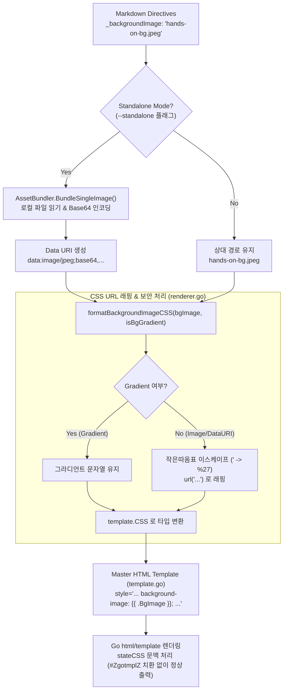

# [GOS-20] --standalone 빌드 시 배경 이미지 Base64 Data URI 치환 누락 및 #ZgotmplZ 렌더링 버그 수정 계획서

> **티켓 번호**: [GOS-20](https://joincdream.atlassian.net/browse/GOS-20)  
> **마일스톤**: HTML 렌더러 안정화 및 에셋 번들러(AssetBundler) 무결성 확보  
> **상태**: 완료 (Done)  
> **담당 패키지**: `internal/renderer/html/`  
> **연관 소스 파일**:  
> - [`internal/renderer/html/template.go`](file:///home/yundream/myjob/cloit/Goslide/internal/renderer/html/template.go)  
> - [`internal/renderer/html/renderer.go`](file:///home/yundream/myjob/cloit/Goslide/internal/renderer/html/renderer.go)  
> - [`internal/renderer/html/bundler.go`](file:///home/yundream/myjob/cloit/Goslide/internal/renderer/html/bundler.go)  
> - [`internal/renderer/html/renderer_test.go`](file:///home/yundream/myjob/cloit/Goslide/internal/renderer/html/renderer_test.go)  
> **연관 테스트 파일**: [`testdata/demo.md`](file:///home/yundream/myjob/cloit/Goslide/testdata/demo.md), [`testdata/hands-on-bg.jpeg`](file:///home/yundream/myjob/cloit/Goslide/testdata/hands-on-bg.jpeg)

---

## 1. 개요 및 배경 (Overview & Problem Statement)

### 1.1 결함 현상
Goslide CLI에서 `--standalone` 옵션을 사용하여 슬라이드를 단일 독립형 HTML 파일로 빌드할 때, 슬라이드 지시어 `_backgroundImage` (또는 `backgroundImage`)로 지정한 로컬 이미지(예: `"hands-on-bg.jpeg"`)가 최종 생성된 HTML 화면에 출력되지 않고 배경이 누락되는 결함이 발견되었습니다.

실제 빌드 산출물인 `demo-standalone.html`의 1426번 줄을 분석한 결과, 아래와 같이 특수 문자열이 삽입되어 있었습니다:

```html
<!-- 실제 산출물 (demo-standalone.html:1426) -->
<section class="slide-card lead layout-lead lead has-bg-dim"
         data-slide="7"
         style="background-image: url('#ZgotmplZ'); background-size: cover; background-position: center;color: #ffffff;">
```

### 1.2 근본 원인 (Root Cause)
1. **AssetBundler의 정상 변환**:
   `--standalone` 모드 활성화 시 [`AssetBundler`](file:///home/yundream/myjob/cloit/Goslide/internal/renderer/html/bundler.go#L77)는 정상적으로 로컬 디스크의 `hands-on-bg.jpeg`를 읽어 `data:image/jpeg;base64,...` 형태의 Data URI로 변환합니다.
2. **Go `html/template`의 과도한 URL 필터링**:
   [`internal/renderer/html/template.go`](file:///home/yundream/myjob/cloit/Goslide/internal/renderer/html/template.go#L54)의 템플릿에 `background-image: url('{{ .BgImage }}');` 형태로 `url('...')`이 하드코딩되어 있습니다.
3. Go 표준 라이브러리의 `html/template` 렉서는 템플릿 내에 `url('` 구문이 있으면 이를 URL 문맥(`stateURL`)으로 인식하고 URL 검증기(`urlFilter`)를 구동합니다.
4. `urlFilter`는 XSS 방지를 위해 `http`, `https`, `mailto` 및 상대 경로만 통과시키고, `data:` 스킴을 잠재적 위험으로 판단하여 전체 문자열을 특수 센티넬 값인 **`#ZgotmplZ`**로 강제 치환해 버립니다.

---

## 2. 보안 영향도 및 안전성 분석 (Security Impact & Safety Assessment)

`#ZgotmplZ` 치환을 우회하여 Base64 Data URI를 렌더링할 때의 보안 및 잠재적 사이드 이펙트를 검토합니다:

1. **Base64 인코딩의 구조적 무결성**:
   `AssetBundler`가 생성하는 Base64 문자열은 오직 `[A-Za-z0-9+/=]`로만 구성됩니다. 따옴표(`'`), 세미콜론(`;`), 꺾쇠괄호(`<`) 같은 CSS 구문 탈출(Breakout) 및 HTML 태그 인젝션 특수문자가 원천 배제되므로 XSS가 불가능합니다.
2. **W3C 브라우저 CSS 이미지 격리 표준**:
   SVG 등 스크립트를 포함할 수 있는 이미지 파일이라 할지라도, 모던 브라우저는 CSS `background-image` 문맥에서 실행되는 모든 JavaScript 코드를 강제로 비활성화합니다.
3. **경로 내 작은따옴표(`'`) 이스케이프 방어**:
   일반 파일 경로에 작은따옴표가 포함된 경우(예: `my'photo.png`) CSS 문법 오류나 인젝션을 방지하기 위해, `renderer.go`에서 `url('...')` 래핑 시 작은따옴표를 `%27`로 안전하게 치환합니다.

---

## 3. 상세 기술 설계 (Technical Design)



### 3.1 `internal/renderer/html/template.go` 변경
기존:
```html
style="{{ if .BgColor }}background-color: {{ .BgColor }};{{ end }}{{ if .BgImage }}{{ if .IsBgGradient }}background-image: {{ .BgImage }};{{ else }}background-image: url('{{ .BgImage }}'); background-size: cover; background-position: center;{{ end }}{{ end }}{{ if .Color }}color: {{ .Color }};{{ end }}"
```
변경:
```html
style="{{ if .BgColor }}background-color: {{ .BgColor }};{{ end }}{{ if .BgImage }}background-image: {{ .BgImage }};{{ if not .IsBgGradient }} background-size: cover; background-position: center;{{ end }}{{ end }}{{ if .Color }}color: {{ .Color }};{{ end }}"
```

### 3.2 `internal/renderer/html/renderer.go` 변경
`buildSlideView` 함수 내 배경 이미지 CSS 빌드 로직 분리:
```go
func formatBackgroundImageCSS(bgImage string, isBgGradient bool) template.CSS {
	if bgImage == "" {
		return ""
	}
	if isBgGradient {
		return template.CSS(bgImage)
	}
	// 작은따옴표를 %27로 치환하여 CSS url('...') 구문 탈출 방지
	safePath := strings.ReplaceAll(bgImage, "'", "%27")
	return template.CSS(fmt.Sprintf("url('%s')", safePath))
}
```

---

## 4. 단계별 작업 계획 (Implementation Plan)

| 단계 | 작업 내용 | 대상 파일 | 검증 방법 |
| :---: | :--- | :--- | :--- |
| **Step 1** | 템플릿 내 `url('...')` 하드코딩 제거 및 `stateCSS` 연동 | [`internal/renderer/html/template.go`](file:///home/yundream/myjob/cloit/Goslide/internal/renderer/html/template.go) | 정적 코드 분석 |
| **Step 2** | `renderer.go`에 `formatBackgroundImageCSS` 도우미 구현 및 따옴표 방어 | [`internal/renderer/html/renderer.go`](file:///home/yundream/myjob/cloit/Goslide/internal/renderer/html/renderer.go) | 빌드 및 구문 검사 |
| **Step 3** | 회귀 방지 단위 테스트 작성 (Standalone 모드에서 Base64 Data URI 및 `#ZgotmplZ` 미발생 검증) | [`internal/renderer/html/renderer_test.go`](file:///home/yundream/myjob/cloit/Goslide/internal/renderer/html/renderer_test.go) | `go test -v -run TestHTMLRenderer_Standalone_BackgroundImage` |
| **Step 4** | 실제 `testdata/demo.md`를 대상으로 `goslide build --standalone` 재빌드 및 산출물 HTML 내 7번 슬라이드 이미지 데이터 검증 | `demo-standalone.html` | 산출물 내 `data:image/jpeg;base64` 포함 및 `#ZgotmplZ` 부재 확인 |
| **Step 5** | 작업 완료 코멘트 및 Jira 티켓 상태 완료 전이 | Jira GOS-20 | `jira comment`, `jira move` |

---

## 5. 완료 기준 (Definition of Done)

1. `goslide build <input.md> --standalone` 실행 시 `_backgroundImage`가 `#ZgotmplZ` 없이 Base64 Data URI(`data:image/...;base64,...`)로 온전히 HTML에 포함되어야 함.
2. 일반 빌드(`--standalone` 없음) 및 CSS 그라디언트(`linear-gradient(...)`) 슬라이드 배경이 기존과 동일하게 정상 동작해야 함.
3. 이미지 파일명에 따옴표가 포함되어도 CSS 구문 에러나 XSS 취약점이 발생하지 않아야 함.
4. 단위 테스트가 추가되어 회귀를 방지해야 함.
