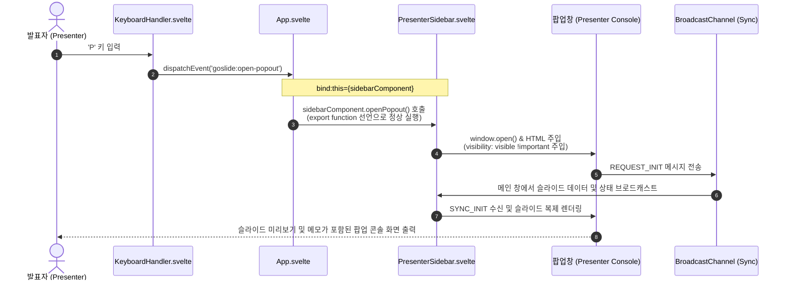

# [GOS-21] 'P' 키 입력 시 별도 팝업 발표자 콘솔 미기동 및 슬라이드 검은색 렌더링 버그 수정 계획서

> **티켓 번호**: [GOS-21](https://joincdream.atlassian.net/browse/GOS-21)  
> **마일스톤**: 프론트엔드 발표자 콘솔(Presenter Console) 및 듀얼 스크린 동기화 안정화  
> **상태**: 완료 (Done)  
> **담당 패키지**: `web/`, `internal/theme/assets/js/`  
> **연관 소스 파일**:  
> - [`web/src/components/PresenterSidebar.svelte`](file:///home/yundream/myjob/cloit/Goslide/web/src/components/PresenterSidebar.svelte)  
> - [`web/src/App.svelte`](file:///home/yundream/myjob/cloit/Goslide/web/src/App.svelte)  
> - [`web/src/components/KeyboardHandler.svelte`](file:///home/yundream/myjob/cloit/Goslide/web/src/components/KeyboardHandler.svelte)  
> - [`internal/theme/assets/js/goslide-core.js`](file:///home/yundream/myjob/cloit/Goslide/internal/theme/assets/js/goslide-core.js) (컴파일 번들 산출물)  
> **연관 체크리스트**: [`docs/release/linux-user-test-checklist.md`](file:///home/yundream/myjob/cloit/Goslide/docs/release/linux-user-test-checklist.md) (섹션 6.3)

---

## 1. 개요 및 배경 (Overview & Problem Statement)

### 1.1 결함 현상
1. **단축키 `P` 입력 무반응**:
   * 프레젠테이션 화면에서 키보드 `P` 키를 눌러도 별도 발표자 팝업 콘솔(`Goslide Presenter Console`)이 열리지 않고 무반응임.
   * 브라우저 콘솔 확인 시 `Uncaught TypeError: sidebarComponent.openPopout is not a function` 런타임 예외 발생.
2. **팝업 콘솔 내 슬라이드 뷰 검은 화면(Blackout) 현상**:
   * 사이드바(`N`)의 마우스 버튼 클릭을 통해 강제로 팝업창을 띄우더라도, 현재 슬라이드 및 다음 슬라이드 미리보기 영역이 내용 없이 완전한 검은색으로만 렌더링됨.

### 1.2 근본 원인 분석 (Root Cause Analysis)

#### 1) `openPopout` 메서드 `export` 누락 (Svelte 5 리팩토링 회귀)
* 커밋 `31f25cd`에서 순수 바닐라 JS를 Svelte 5 컴포넌트로 마이그레이션하면서 `openPopout` 함수를 [`web/src/components/PresenterSidebar.svelte`](file:///home/yundream/myjob/cloit/Goslide/web/src/components/PresenterSidebar.svelte) 내부로 이동시킴.
* Svelte 컴포넌트 인스턴스 바인딩(`bind:this={sidebarComponent}`)을 통해 부모 컴포넌트([`web/src/App.svelte`](file:///home/yundream/myjob/cloit/Goslide/web/src/App.svelte))가 자식 메서드를 호출하려면 **`export function openPopout()`** 형태로 선언되어야 함.
* 그러나 단순 `function openPopout()`로만 선언되어 인스턴스 외부에 메서드가 노출되지 않았고, `sidebarComponent.openPopout`이 `undefined`가 되어 호출 실패.

#### 2) 팝업 창 내 `.slide-card`의 `visibility: visible` 재정의 누락
* 메인 슬라이드 스타일시트(`deck-canvas.css`)에서 슬라이드 기본 상태는 `visibility: hidden !important; opacity: 0 !important;`로 설정되어 있고 활성 슬라이드만 `.active`로 보여줌.
* 팝업 창 내부의 `.frame-box .slide-card` 스타일에서 `opacity: 1 !important;`는 명시했으나, **`visibility: visible !important;`가 누락**됨.
* 결과적으로 프레임 박스 내부로 복제된 슬라이드 DOM 요소들이 여전히 `visibility: hidden` 상태로 남아 있어, 부모 박스의 배경색인 검은색(`#000`)만 표시됨.

---

## 2. 상세 기술 설계 (Technical Design)



---

## 3. 코드 수정 상세 명세 (Code Changes Specification)

### 3.1 [`web/src/components/PresenterSidebar.svelte`](file:///home/yundream/myjob/cloit/Goslide/web/src/components/PresenterSidebar.svelte)

#### A. 인스턴스 메서드 `export` 선언 (4번 라인)
```diff
-  function openPopout() {
+  export function openPopout() {
     const popoutWin = window.open('', 'goslide-presenter-' + window.location.pathname, 'width=1100,height=750');
```

#### B. 팝업 CSS 내 `visibility: visible !important` 추가 (33~45번 라인)
```diff
     .frame-box .slide-card {
       position: absolute !important;
       top: 50% !important;
       left: 50% !important;
       width: 1920px !important;
       height: 1080px !important;
       display: flex !important;
+      visibility: visible !important;
       opacity: 1 !important;
       box-shadow: none !important;
       border-radius: 0 !important;
       transform-origin: center center !important;
       pointer-events: none !important;
     }
```

---

## 4. 단계별 실행 계획 (Step-by-Step Implementation Roadmap)

| 단계 | 작업 내용 | 대상 파일 및 명령어 | 검증 기준 |
| :---: | :--- | :--- | :--- |
| **Step 1** | `openPopout` 메서드 `export` 및 팝업 CSS에 `visibility: visible !important` 반영 | [`web/src/components/PresenterSidebar.svelte`](file:///home/yundream/myjob/cloit/Goslide/web/src/components/PresenterSidebar.svelte) | 코드 리뷰 및 문법 점검 |
| **Step 2** | Svelte 5 프론트엔드 빌드 및 Go 정적 에셋 동기화 | `cd web && npm run build` | `internal/theme/assets/js/goslide-core.js` 갱신 확인 |
| **Step 3** | Goslide 바이너리 재빌드 | `go build -o bin/goslide ./cmd/goslide` | 빌드 성공 (종료 코드 0) |
| **Step 4** | E2E 브라우저 동작 검증 | `goslide serve testdata/demo.md --port 8080` | 1) `P` 키 입력 시 팝업 창 즉시 오픈<br>2) 팝업 내 슬라이드 미리보기 정상 출력 |
| **Step 5** | 체크리스트 업데이트 및 Jira 티켓 완료 전이 | [`docs/release/linux-user-test-checklist.md`](file:///home/yundream/myjob/cloit/Goslide/docs/release/linux-user-test-checklist.md) / Jira GOS-21 | 체크리스트 6.3 체크 및 티켓 완료 전이 |

---

## 5. 완료 기준 (Definition of Done)

1. 프레젠테이션 화면 어디서든 키보드 `P`를 입력하면 팝업 차단이 없는 한 즉시 `Goslide Presenter Console` 팝업 창이 기동되어야 함.
2. 팝업 콘솔의 '현재 슬라이드' 및 '다음 슬라이드' 미리보기 박스에 슬라이드 내용이 검은 화면 없이 선명하게 축소 렌더링되어야 함.
3. 메인 창과 팝업 창 간 슬라이드 전환 및 타이머가 양방향 실시간 동기화되어야 함.
4. Go 정적 번들(`goslide-core.js`)에 빌드 결과가 성공적으로 동기화되어야 함.
