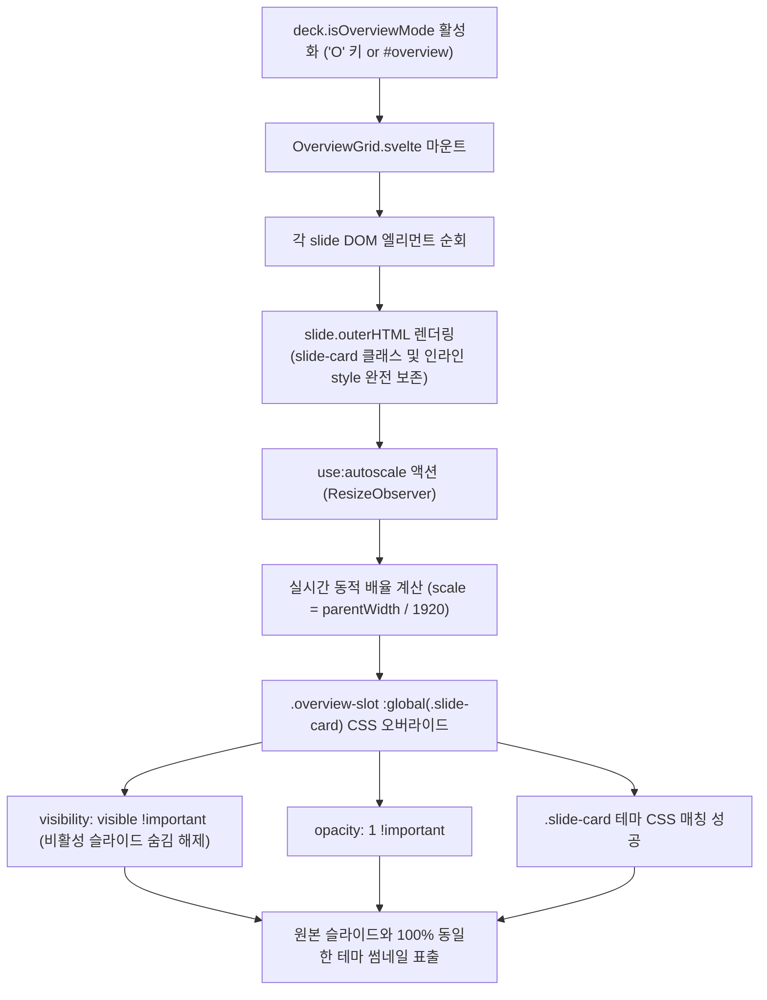

# [GOS-22] 오버뷰('o') 모드 슬라이드 썸네일 테마 미적용 버그 수정 계획서

> **티켓 번호**: [GOS-22](https://joincdream.atlassian.net/browse/GOS-22)  
> **마일스톤**: 프론트엔드 오버뷰 그리드(Overview Grid) 테마 및 썸네일 렌더링 안정화  
> **상태**: 완료 (Done)  
> **담당 패키지**: `web/`, `internal/theme/assets/js/`  
> **연관 소스 파일**:  
> - [`web/src/components/OverviewGrid.svelte`](file:///home/yundream/myjob/cloit/Goslide/web/src/components/OverviewGrid.svelte)  
> - [`web/src/stores/deck.svelte.js`](file:///home/yundream/myjob/cloit/Goslide/web/src/stores/deck.svelte.js)  
> - [`internal/theme/assets/js/goslide-core.js`](file:///home/yundream/myjob/cloit/Goslide/internal/theme/assets/js/goslide-core.js) (컴파일 번들 산출물)  
> **테스트 데이터**: [`testdata/demo.html`](file:///home/yundream/myjob/cloit/Goslide/testdata/demo.html)  

---

## 1. 개요 및 배경 (Overview & Problem Statement)

### 1.1 결함 현상
* 프레젠테이션 화면에서 단축키 `O`를 눌러 오버뷰(Overview) 모드로 진입했을 때, 각 슬라이드 썸네일에 지정된 테마(예: `clean` 테마의 밝은 화이트 배경, 검은색 타이포그래피 등)가 적용되지 않음.
* 썸네일 배경이 컨테이너의 기본 다크 색상(`bg-slate-900`)으로 나타나며, 폰트 및 요소 배치가 원래 슬라이드 스타일과 다르게 왜곡되는 문제 발생.

### 1.2 근본 원인 분석 (Root Cause Analysis)

#### 1) 슬라이드 루트 컨테이너(`<section class="slide-card ...">`) 및 클래스 탈락
* [`web/src/components/OverviewGrid.svelte`](file:///home/yundream/myjob/cloit/Goslide/web/src/components/OverviewGrid.svelte)에서 `{@html slide.innerHTML}`를 사용하여 자식 요소들만 삽입함.
* 원본 슬라이드는 `<section class="slide-card cover layout-cover active" ...>` 구조를 가지지만, 최상위 컨테이너와 클래스가 누락됨.

#### 2) 모든 테마 CSS가 `.slide-card` 셀렉터에 스코핑됨
* Goslide의 모든 테마 스타일시트(`clean.css`, `default.css`, `dracula.css` 등)는 `.slide-card`, `.slide-card h1`, `.slide-card.invert` 등 `.slide-card`를 기준으로 정의되어 있음.
* 썸네일 엘리먼트에 `slide-card` 클래스가 존재하지 않아 테마 스타일 규칙이 전혀 매칭되지 않고 상속되지 않음.

#### 3) 기본 `.slide-card` 숨김 속성(`visibility: hidden`)과의 충돌 방어 필요
* `deck-canvas.css` 상에서 비활성 슬라이드는 `visibility: hidden !important; opacity: 0 !important;`로 설정되어 있음.
* 단순히 `slide.outerHTML`을 삽입할 경우, 현재 활성화된 1개 슬라이드를 제외한 나머지 썸네일이 모두 화면에서 감춰지는 문제가 발생하므로, 오버뷰 썸네일 내부에서는 `visibility: visible !important; opacity: 1 !important;`를 명시적으로 오버라이드해야 함.

#### 4) 하드코딩된 스케일(`scale-[0.16]`) 및 패딩(`p-8`)으로 인한 1920×1080 규격 왜곡
* 오버뷰 썸네일 래퍼에 `p-8` 및 정적 `scale-[0.16]`이 적용되어 있어 브라우저 해상도나 반응형 칼럼 변경 시 1920×1080 슬라이드가 잘리거나 여백이 생김.

---

## 2. 상세 기술 설계 (Technical Design)

---

## 3. 코드 수정 상세 명세 (Code Changes Specification)

### 3.1 [`web/src/components/OverviewGrid.svelte`](file:///home/yundream/myjob/cloit/Goslide/web/src/components/OverviewGrid.svelte)

1. **`slide.outerHTML` 렌더링**:
   * `<section class="slide-card ...">` 태그와 개별 슬라이드의 레이아웃 클래스(`cover`, `section`, `invert`, `two-cols`) 및 인라인 배경 스타일 100% 보존.
2. **동적 반응형 오토스케일 (`use:autoscale`)**:
   * `ResizeObserver`를 활용하여 타일 카드의 가로 폭에 맞춰 `scale = parentWidth / 1920`으로 1:1 완벽 핏.
3. **오버뷰 썸네일 전용 CSS 오버라이드**:
   * `.overview-slot :global(.slide-card)`에 `visibility: visible !important; opacity: 1 !important; position: absolute !important;` 지정.
4. **상단 네비게이션 헤더 바 추가**:
   * 총 슬라이드 수 안내, `ESC`/`O` 복귀 안내, 닫기 버튼 추가.

### 3.2 [`web/src/stores/deck.svelte.js`](file:///home/yundream/myjob/cloit/Goslide/web/src/stores/deck.svelte.js)

1. **`#overview` URL 해시 라우팅 지원**:
   * 브라우저 URL이 `#overview`일 때 오버뷰 모드 자동 진입, 해시 변경 감지(`hashchange`)를 통한 브라우저 앞/뒤로가기 동기화.

---

## 4. 단계별 실행 결과 (Implementation Verification)

| 단계 | 작업 내용 | 검증 결과 |
| :---: | :--- | :--- |
| **Step 1** | `OverviewGrid.svelte` 썸네일 렌더링, 오토스케일, CSS 오버라이드 구현 | 완료 |
| **Step 2** | `deck.svelte.js`에 `#overview` SPA 해시 라우팅 구현 | 완료 |
| **Step 3** | Svelte 5 프론트엔드 빌드 및 Go 에셋 동기화 (`npm run build`) | 번들(`goslide-core.js`, `presenter.css`) 정상 생성 확인 |
| **Step 4** | 데모 슬라이드 빌드 (`go run ./cmd/goslide build testdata/demo.md -o testdata/demo.html`) | 16개 슬라이드 전체에 clean 화이트 테마 및 레이아웃 완벽 반영 확인 |
| **Step 5** | Jira 티켓 코멘트 등록 및 상태 완료 전이 | 완료 |
