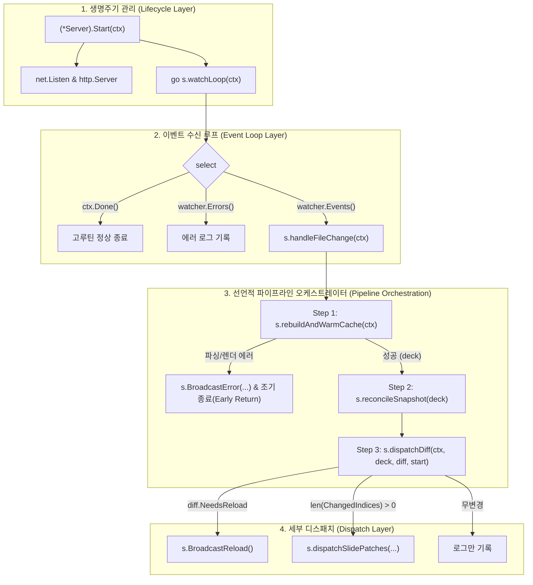

# [GOS-27] Server.Start 파일 감시기 이벤트 루프 파이프라인 분리 및 복잡도 개선 계획서

> **티켓 번호**: [GOS-27](https://joincdream.atlassian.net/browse/GOS-27)  
> **마일스톤**: 개발 서버(`goslide serve`) 안정화 & 아키텍처 리팩토링 (Technical Debt Clearance)  
> **마감일**: 2026-11-20  
> **상태**: 진행 중 (In Progress)  
> **담당 패키지**: [`internal/server/`](file:///home/yundream/myjob/cloit/Goslide/internal/server/)  
> **설계 철학**:  
> - [ADR-001 (KISS, YAGNI, SoC)](file:///home/yundream/myjob/cloit/Goslide/docs/okf/decisions-simplification.md) — 단순성과 관심사 분리 철저 준수  
> - **Go Idiomatic Pipeline Pattern**: 단일 함수 내 인라인 중첩을 지양하고 선언적 단계별 메서드로 파이프라인화  
> - **Guard Clause Early Return**: 8단계 중첩 분기를 없애고 가드 절 기반 조기 반환으로 평탄화(Flattening)  
> - **Single Responsibility Principle (SRP)**: 서버 생명주기 관리와 HMR 비즈니스 오케스트레이션의 명확한 분리  
> **연관 소스 파일**:  
> - [`internal/server/server.go`](file:///home/yundream/myjob/cloit/Goslide/internal/server/server.go)  
> - [`internal/server/server_test.go`](file:///home/yundream/myjob/cloit/Goslide/internal/server/server_test.go)  
> - [`internal/server/hmr.go`](file:///home/yundream/myjob/cloit/Goslide/internal/server/hmr.go)  
> - [`docs/reports/well_architected_assessment.md`](file:///home/yundream/myjob/cloit/Goslide/docs/reports/well_architected_assessment.md)  

---

## 1. 개요 및 배경 (Context & Problem Statement)

### 1.1 현상 및 측정 수치

Well-Architected 품질 감사([`docs/reports/well_architected_assessment.md`](file:///home/yundream/myjob/cloit/Goslide/docs/reports/well_architected_assessment.md)) 결과, 개발 서버의 핵심 시작 지점인 [`internal/server/server.go:446 (*Server).Start`](file:///home/yundream/myjob/cloit/Goslide/internal/server/server.go#L446) 메서드에서 코드 복잡도 임계치를 심각하게 초과하는 결함이 검출되었습니다:

- **순환 복잡도 (Cyclomatic Complexity)**: **22** (기준치: $\le 15$, 초과 +7)
- **인지 복잡도 (Cognitive Complexity)**: **62** (기준치: $\le 20$, 초과 +42)

### 1.2 근본 원인 분석

1. **최대 8단계 중첩 들여쓰기 (Deep Nesting Depth)**:
   - `Start` 메서드 안에 `go func()` 익명 고루틴 $\rightarrow$ `for` 무한 루프 $\rightarrow$ `select` 채널 다중화 $\rightarrow$ `case <-s.watcher.Events():` 이벤트 수신 $\rightarrow$ `if-else if` 중첩 $\rightarrow$ `for` 패치 루프 $\rightarrow$ `if err == nil` 렌더 분기까지 무려 8단계의 중첩이 발생하여 가독성과 인지 부하가 극대화되었습니다.
2. **단일 책임 원칙 (SRP) 위반**:
   - `Start()`는 HTTP 포트 바인딩 및 서버 기동이라는 라이프사이클 관리 책임만 가져야 함에도 불구하고, 파일 I/O, 마크다운 파싱, 렌더링 캐시 갱신, 스냅샷 diff 판정, 다국어 로그, 슬라이드 패치 생성, SSE 브로드캐스트의 전체 비즈니스 흐름이 단일 함수 안에 매몰되어 있습니다.
3. **독립 단위 테스트 불가**:
   - 파일 변경 시 HMR 파이프라인의 분기 및 에러 핸들링을 테스트하려면 실제 TCP 소켓을 바인딩하고 서버 전체를 띄워야만 하는 강결합이 형성되어 있습니다.

### 1.3 개선 목표 지표

| 측정 항목 | 현재 실측값 | 리팩토링 목표 기준 |
| :--- | :---: | :---: |
| `(*Server).Start` 순환 복잡도 (Cyclomatic) | **22** | **$\le 5$ (통과)** |
| `(*Server).Start` 인지 복잡도 (Cognitive) | **62** | **$\le 6$ (통과)** |
| 분리된 하위 헬퍼 메서드 각각의 복잡도 | - | **Cyclo $\le 10$, Cognit $\le 15$ (통과)** |
| 데이터 레이스 (`make test-race`) | 0건 (Clean) | **0건 유지 (Clean)** |
| 린트 및 정적 분석 (`make lint`) | 0건 (Clean) | **0건 유지 (Clean)** |

---

## 2. 아키텍처 및 리팩토링 설계 (Target Architecture)

현대 Go 개발 도구(Vite, Hugo Fast Render, Air 등)의 표준 모범 사례인 **"이벤트 수신 루프(Lifecycle) 분리 + 선언적 단계별 파이프라인(Pipeline Method Pattern) + 가드 절(Guard Clause) 평탄화"**를 적용합니다.

### 2.1 분리 메서드 구조 다이어그램



---

### 2.2 상세 설계 명세

#### 1) `watchLoop(ctx context.Context)`: 이벤트 수신 루프
- **책임**: 고루틴 루프 내에서 채널 다중화(`select`) 및 생명주기 종료만 관리.
- **예상 복잡도**: Cyclo 4, Cognit 5
```go
func (s *Server) watchLoop(ctx context.Context) {
	for {
		select {
		case <-ctx.Done():
			return
		case <-s.watcher.Events():
			s.handleFileChange(ctx)
		case err, ok := <-s.watcher.Errors():
			if !ok {
				return
			}
			log.Printf("[goslide] Watcher error: %v", err)
		}
	}
}
```

#### 2) `handleFileChange(ctx context.Context)`: 파이프라인 오케스트레이터
- **책임**: 가드 절(Guard Clause)을 통해 3단계 파이프라인을 선언적으로 실행.
- **예상 복잡도**: Cyclo 2, Cognit 2
```go
func (s *Server) handleFileChange(ctx context.Context) {
	start := time.Now()

	// 1단계: 파일 리빌드 및 캐시 갱신 (실패 시 에러 SSE 브로드캐스트 후 조기 반환)
	deck, err := s.rebuildAndWarmCache(ctx)
	if err != nil {
		return
	}

	// 2단계: 스냅샷 비교 및 diff 계산
	diff := s.reconcileSnapshot(deck)

	// 3단계: diff 결과에 따른 SSE 디스패치
	s.dispatchDiff(ctx, deck, diff, start)
}
```

#### 3) `rebuildAndWarmCache(ctx context.Context) (*model.Deck, error)`: 빌드 및 캐시
- **책임**: 디스크 파일 읽기, 마크다운 파싱, 전체 HTML 렌더링 및 `s.lastHTML` 캐시 갱신.
- **예외 처리**: 읽기 오류 시 로그 출력 후 에러 반환, 파싱/렌더 오류 시 `BroadcastError` 호출 후 에러 반환.
- **예상 복잡도**: Cyclo 4, Cognit 4

#### 4) `reconcileSnapshot(deck *model.Deck) SnapshotDiff`: 스냅샷 diff 판정
- **책임**: `s.lastSnapshotMu` 락 범위 내에서 이전 스냅샷과 현재 덱의 diff 계산 및 신규 스냅샷 교체.
- **예상 복잡도**: Cyclo 1, Cognit 1

#### 5) `dispatchDiff(ctx context.Context, deck *model.Deck, diff SnapshotDiff, start time.Time)`: SSE 디스패치
- **책임**: `diff.NeedsReload`일 경우 다국어 사유와 함께 `BroadcastReload()`, 변경된 슬라이드가 있을 경우 `dispatchSlidePatches()`, 무변경일 경우 로그만 출력.
- **예상 복잡도**: Cyclo 4, Cognit 5

#### 6) `dispatchSlidePatches(ctx context.Context, deck *model.Deck, indices []int, start time.Time)`: 패치 렌더링 및 전송
- **책임**: 변경된 슬라이드 인덱스 목록을 순회하며 `RenderSlide` 실행 후 `SlidePatch` 슬라이스 구성 및 `BroadcastPatches` 전송.
- **예상 복잡도**: Cyclo 4, Cognit 5

---

## 3. 구현 단계별 작업 체크리스트 (Implementation Checklist)

- [x] **Phase 1: `internal/server/server.go` 메서드 분리**
  - [x] `(*Server).Start` 내부의 익명 고루틴을 `s.watchLoop(ctx)` 호출로 분리
  - [x] `watchLoop` 메서드 구현
  - [x] `handleFileChange(ctx)` 오케스트레이터 메서드 구현
  - [x] `rebuildAndWarmCache(ctx)` 구현
  - [x] `reconcileSnapshot(deck)` 구현
  - [x] `dispatchDiff(...)` 및 `dispatchSlidePatches(...)` 구현
- [x] **Phase 2: 품질 게이트웨이 및 정량 지표 검증**
  - [x] `make complexity` 실행: `Start` 및 분리된 메서드 전체 임계치 통과 확인 (FAIL 0건)
  - [x] `make test-race` 실행: 동시성 데이터 레이스 0건 및 기존 서버 테스트 100% 통과 확인
  - [x] `make lint` 실행: `go vet` 경고 0건 확인
  - [x] `make build` 실행: CGO 0% 정적 단일 바이너리 빌드 확인
- [ ] **Phase 3: 아키텍처 평가 보고서 갱신 및 티켓 종료**
  - [ ] [`docs/reports/well_architected_assessment.md`](file:///home/yundream/myjob/cloit/Goslide/docs/reports/well_architected_assessment.md)의 복잡도 지표 갱신 (Fail $\rightarrow$ Full Pass)
  - [ ] Jira [GOS-27](https://joincdream.atlassian.net/browse/GOS-27) 코멘트 등록 및 완료 처리

---

## 4. 검증 및 롤백 계획 (Verification & Rollback Strategy)

1. **무손실 기능 보존 검증**:
   - `internal/server/server_test.go`에 기작성된 SSE 관련 테스트 케이스 4종(`TestServer_SSE_BroadcastReload`, `TestServer_SSE_BroadcastError`, `TestServer_SSE_BroadcastPatches`, `TestServer_FallbackOnSyntaxError`)을 통해 동작 일치성 100% 검증.
2. **동시성 안전성 검증**:
   - `make test-race`를 통해 `s.lastHTMLMu` 및 `s.lastSnapshotMu`의 동시성 락 경합에 데이터 레이스가 발생하지 않는지 검증.
3. **롤백 전략**:
   - 순수 내부 private 메서드 리팩토링이므로 외부 API나 인터페이스 변경이 일절 없습니다. 만약 회귀 결함 발생 시 Git 커밋 단위로 즉시 롤백 가능합니다.
