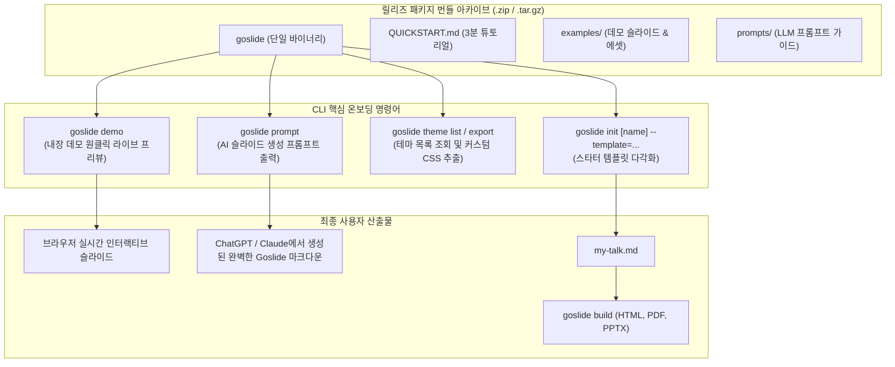
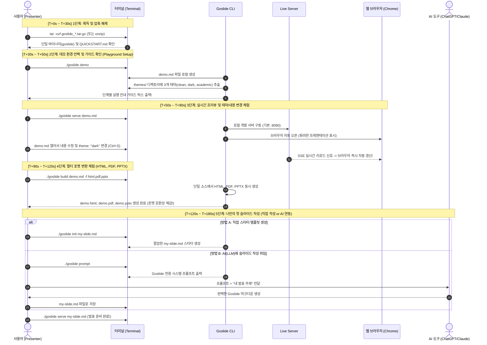

# [GOS-31] v1.0.0 릴리즈 패키징 아키텍처 수립 및 첫 사용자 경험(FTUX) 온보딩 번들 개발 계획서

> **티켓 번호**: [GOS-31](https://joincdream.atlassian.net/browse/GOS-31)  
> **마일스톤**: v1.0.0 정식 릴리즈 및 온보딩 완성 (FTUX & Release Packaging)  
> **마감일**: 2026-11-20  
> **상태**: 완료 (Done)  
> **담당 패키지**:  
> - [`cmd/goslide/`](file:///home/yundream/myjob/cloit/Goslide/cmd/goslide/)  
> - [`internal/theme/`](file:///home/yundream/myjob/cloit/Goslide/internal/theme/)  
> - [`Makefile`](file:///home/yundream/myjob/cloit/Goslide/Makefile)  
> **연관 문서**:  
> - [`AGENTS.md`](file:///home/yundream/myjob/cloit/Goslide/AGENTS.md) *(Section 1: 크로스 플랫폼 단일 바이너리 지향 & CGO 0%)*  
> - [`task/GOS-33.md`](file:///home/yundream/myjob/cloit/Goslide/task/GOS-33.md) *(CD 릴리즈 크로스 배포 파이프라인 구축 완료)*  

---

## 1. 개요 및 배경 (Context & Objective)

### 1.1 배경 및 문제의식
현재 Goslide는 6대 플랫폼(Linux, macOS, Windows)에 대한 정적 단일 바이너리 자동 빌드 및 GitHub Releases 배포 체계(GOS-33)를 성공적으로 구축했습니다.
그러나 현재 배포 아카이브(`.tar.gz`, `.zip`)에는 바이너리와 원본 `README.md`만 포함되어 있어, 처음 도구를 내려받은 사용자가 다음과 같은 온보딩 병목(Pain Points)을 겪게 됩니다:
1. **데모 마크다운 부재**: 압축을 풀었을 때 바로 실행해 볼 수 있는 샘플 슬라이드(`demo.md`)가 없어 직접 마크다운을 타이핑하기 전까지 결과물을 확인할 수 없음.
2. **도움말의 직관성 부족**: `goslide --help`에 명령어는 나열되어 있으나, 첫 실행 시 가장 먼저 입력해야 할 3단계 퀵스타트 가이드가 눈에 띄지 않음.
3. **AI/LLM 연동 가이드 부재**: 사용자가 ChatGPT, Claude, Cursor 등 AI 에이전트를 통해 슬라이드를 자동 생성하고 싶어도 Goslide 특유의 프론트매터 및 지시어(Directive) 규격을 AI가 알지 못해 잘못된 마크다운을 생성함.
4. **테마 커스텀 가이드 부재**: 기본 테마(clean, dark, academic, cyber-dark)의 CSS를 확인하거나 외장 테마로 수정·확장할 수 있는 CLI 도구 부재.

### 1.2 목표 (Objectives)
- **3분 온보딩(3-Minute FTUX) 달성**: 처음 다운로드한 사용자가 3분 이내에 데모를 확인하고 자신만의 첫 슬라이드를 완성할 수 있도록 지원.
- **자체 완결형(Self-Contained) CLI 경험 제공**: 마크다운 파일이 없는 빈 디렉토리에서도 `goslide demo` 명령 하나로 즉시 브라우저 프리뷰 체험.
- **AI 친화적 슬라이드 생성 지원**: LLM에 복사해 넣을 수 있는 최적화된 1줄 시스템 프롬프트 및 DSL 가이드 제공 (`goslide prompt`).
- **풍성한 배포 번들 패키징**: 릴리즈 아카이브에 `QUICKSTART.md`, `examples/`, `prompts/`를 기본 포함하여 오프라인 환경에서도 완벽한 학습 곡선 제공.

---

## 2. 사용자 여정 및 아키텍처 설계 (User Journey & Architecture)

### 2.1 릴리즈 패키지 및 CLI 온보딩 구성도


### 2.2 시간 흐름에 따른 3분 온보딩 시퀀스 다이어그램 (Time-based Sequence Diagram)


---

## 3. 세부 개발 명세 (Detailed Specifications)

### 3.1 CLI 온보딩 편의 커맨드 개발

#### 1) `goslide demo` 커맨드 (`cmd/goslide/demo.go`)
- **기능**:
  - `demo.md` 파일 로컬 생성 (내장 쇼케이스 덱).
  - `themes/` 디렉토리를 생성하고 대표 CSS 테마 3종(`clean.css`, `dark.css`, `academic.css`) 추출.
  - 실행 완료 후 터미널에 단계별 행동 유도형 가이드 출력.
- **옵션**:
  - `--force`: 이미 `demo.md`나 `themes/`가 존재할 경우 덮어쓰기 허용.
- **터미널 출력 가이드 명세**:
```text
🎉 Goslide 데모 및 테마 환경이 준비되었습니다!
   • 데모 슬라이드: ./demo/demo.md (14장 규모 쇼케이스 슬라이드 및 이미지 에셋)
   • 프로젝트 테마: ./themes/ (clean.css, dark.css, academic.css)

━━━━━━━━━━━━━━━━━━━━━━━━━━━━━━━━━━━━━━━━━━━━━━━━━━━━━━━━━━━━━━━━
🚀 다음 단계로 Goslide를 직접 체험해 보세요:

1. 실시간 미리보기 실행:
   $ goslide serve demo/demo.md
   (브라우저가 자동으로 열리며 발표 모드가 시작됩니다)

2. 실시간 라이브 리로드 체험:
   • demo/demo.md 파일을 에디터로 열어 내용을 수정하고 저장해 보세요.
   • 브라우저가 깜빡임 없이 즉시 갱신됩니다!

3. 테마 변경해보기:
   • demo/demo.md 상단의 theme: "clean"을 "dark" 또는 "academic"으로 바꿔보세요.
   • themes/ 폴더의 CSS를 직접 수정하여 나만의 스타일을 만들 수도 있습니다.

4. 다양한 포맷으로 변환해보기 (HTML, PDF, PPTX):
   $ goslide build demo/demo.md -f html,pdf,pptx
   (웹 슬라이드, 인쇄용 PDF, 파워포인트 PPTX 파일이 한 번에 생성됩니다)

5. 나만의 새 슬라이드 만들기:
   $ goslide init my-slide.md

💡 더 자세한 명령어는 'goslide --help', 전체 가이드는 'QUICKSTART.md'를 참고하세요.
━━━━━━━━━━━━━━━━━━━━━━━━━━━━━━━━━━━━━━━━━━━━━━━━━━━━━━━━━━━━━━━━
```

#### 2) `goslide prompt` 커맨드 (`cmd/goslide/prompt.go`)
- **기능**: 사용자가 ChatGPT, Claude, Cursor 등의 AI 도구에 그대로 전달할 수 있는 시스템 프롬프트를 터미널에 출력합니다.
- **세부 커맨드**:
  - `goslide prompt` (또는 `goslide prompt slide`):
    - 공식 Markdown DSL 규격서 URL(`docs/dsl-guide.md`)을 포함한 슬라이드 작성용 프롬프트 출력.
  - `goslide prompt theme`:
    - 공식 4-Tier DOM 아키텍처 테마 규격서 URL(`docs/theme-guide.md`)을 포함한 커스텀 테마 CSS 작성용 프롬프트 출력.
  - 시스템 로케일(`--lang`) 감지를 통한 완벽한 한/영 다국어 프롬프트 출력.

#### 3) `goslide theme` 서브커맨드 (`cmd/goslide/theme.go`)
- **`goslide theme list`**: 사용 가능한 내장 테마 목록(`clean`, `dark`, `academic`, `cyber-dark` 등) 및 설명 출력.
- **`goslide theme export <theme_name> [output.css]`**: 내장 테마의 CSS를 로컬 파일로 추출하여 사용자가 커스텀 테마를 쉽게 제작할 수 있도록 지원.

#### 4) CLI 도움말(`--help`) 최하단 퀵스타트 안내 추가
```text
Quickstart (3-Step Guide):
  1. goslide demo                 # 데모 마크다운 및 테마 언팩 & 가이드 확인
  2. goslide serve demo.md        # 실시간 미리보기 및 편집 체험
  3. goslide build demo.md        # HTML, PDF, PPTX 멀티포맷 변환
  4. goslide init my-slide.md     # 나만의 첫 슬라이드 템플릿 생성
```

#### 5) 전 기능 다국어(i18n) 번역 카탈로그 지원 ([`internal/i18n/`](file:///home/yundream/myjob/cloit/Goslide/internal/i18n/))
- `locales/ko.json` 및 `locales/en.json`에 신규 온보딩 메시지 키 등록:
  - `cli.demo.desc`: 데모 환경 언팩 커맨드 설명
  - `cli.demo.success`: 언팩 완료 및 단계별 행동 유도형 가이드 박스 텍스트 (한/영 완벽 대응)
  - `cli.demo.flag.force`: 덮어쓰기 플래그 설명
  - `cli.prompt.desc`: AI 시스템 프롬프트 출력 커맨드 설명
  - `cli.theme.desc`, `cli.theme.list.desc`, `cli.theme.export.desc`: 테마 커맨드 설명
  - `cli.quickstart.guide`: CLI `--help` 하단의 퀵스타트 단계별 가이드문
- 시스템 로케일(`LANG`, `LC_ALL`) 자동 감지 및 `--lang ko|en` 플래그 완벽 연동.

---

### 3.2 릴리즈 번들 아카이브 패키징 확장 ([`Makefile`](file:///home/yundream/myjob/cloit/Goslide/Makefile))

바이너리 내장형 `goslide demo` 커맨드가 데모 슬라이드(`demo/demo.md`), 테마(`themes/`), 및 이미지 에셋을 자체적으로 언팩하므로, 아카이브 압축 파일에는 파일 중복과 사용자 혼란을 방지하기 위해 `examples/`를 동봉하지 않고 단일 바이너리 중심으로 경량 패키징합니다.

`make package` 및 `make cross-build` 시 아카이브에 다음 에셋을 포함하도록 구성:
```text
goslide_linux_amd64/
├── goslide                  # 실행 바이너리 (내부에 demo, themes, 이미지 모두 내장)
├── QUICKSTART.md            # 3분 온보딩 실전 가이드 (영문)
├── QUICKSTART.ko.md         # 3분 온보딩 실전 가이드 (한국어)
├── README.md                # 기본 소개 (영문)
├── README.ko.md             # 기본 소개 (한국어)
├── LICENSE                  # Apache 2.0 라이선스 전문
└── prompts/                 # AI 에이전트 연동 시스템 프롬프트
    ├── slide-prompt.md      # 슬라이드 마크다운 생성 프롬프트 (docs/dsl-guide.md 링크)
    └── theme-prompt.md      # 커스텀 테마 CSS 생성 프롬프트 (docs/theme-guide.md 링크)
```

---

## 4. 단계별 실행 계획 (Action Items)

| 단계 | 작업 내용 | 대상 파일 | 검증 방식 |
| :---: | :--- | :--- | :--- |
| **Phase 1** | i18n 다국어 카탈로그 확장 (`ko.json`, `en.json`) | `internal/i18n/locales/*.json` | 단위 테스트 검증 |
| **Phase 2** | `goslide demo` 커맨드 구현 (데모/테마 언팩 & i18n 가이드 출력) | `cmd/goslide/demo.go` | `goslide demo` 및 `--lang en` 실행 검증 |
| **Phase 3** | `goslide prompt` 커맨드 구현 (LLM 시스템 프롬프트 출력) | `cmd/goslide/prompt.go` | `goslide prompt` 출력 검증 |
| **Phase 4** | `goslide theme` 커맨드 구현 (`list`, `export`) | `cmd/goslide/theme.go` | 테마 목록 조회 및 CSS 추출 검증 |
| **Phase 5** | 온보딩 문서 작성 (`QUICKSTART.md`, `prompts/goslide-prompt.md`) | `QUICKSTART.md`, `prompts/` | 마크다운 문서 검토 |
| **Phase 6** | CLI 도움말(`--help`) 퀵스타트 안내문 강화 | `cmd/goslide/main.go` | `goslide --help` 출력 확인 |
| **Phase 7** | `Makefile` 패키징 정책 고도화 (`package` 타겟에 문서 및 예제 포함) | `Makefile` | `make package` 아카이브 내용물 검증 |
| **Phase 8** | 단위 테스트 작성 및 전체 품질 게이트웨이 검증 | `*_test.go` | `make check` (fmt, lint, complexity, test-race) |
| **Phase 9** | Git 커밋, 푸시 및 Jira 완료 처리 | 전체 | `git commit & push`, `jira move GOS-31 "완료"` |

---

## 5. 완료 기준 (Definition of Done)

1. [x] [GOS-31](https://joincdream.atlassian.net/browse/GOS-31) 작업 계획서 수립 완료.
2. [x] `goslide demo` 명령어로 `demo.md` 및 `themes/` CSS 3종이 로컬에 생성되고 가이드가 출력됨.
3. [x] 모든 온보딩 및 안내 메시지에 한국어(`ko`) 및 영어(`en`) i18n 적용 완료.
4. [x] `goslide prompt` 명령어로 ChatGPT/Claude에 붙여넣을 수 있는 Goslide DSL 프롬프트가 출력됨.
5. [x] `goslide theme list` 및 `goslide theme export`로 내장 테마 CSS 추출 가능.
6. [x] `QUICKSTART.md` 및 `prompts/goslide-prompt.md` 문서 작성 완료.
7. [x] `make package` 시 바이너리와 함께 `QUICKSTART.md`, `examples/`, `prompts/`가 번들링됨.
8. [x] `make check` (린트, 복잡도, 데이터 레이스) 100% 통과.
