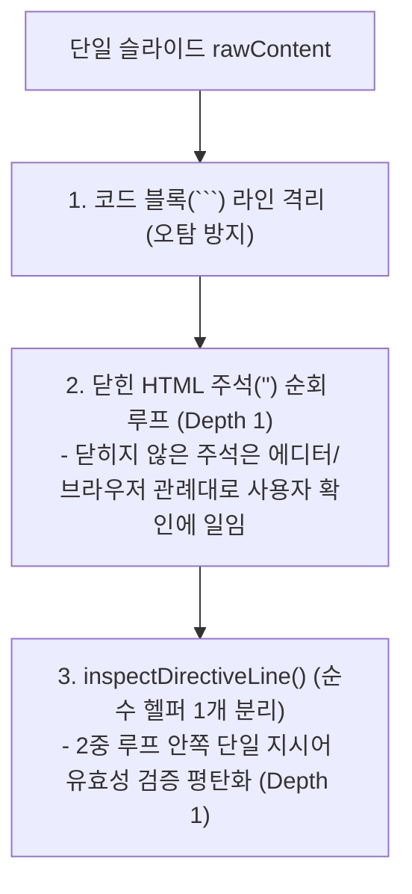
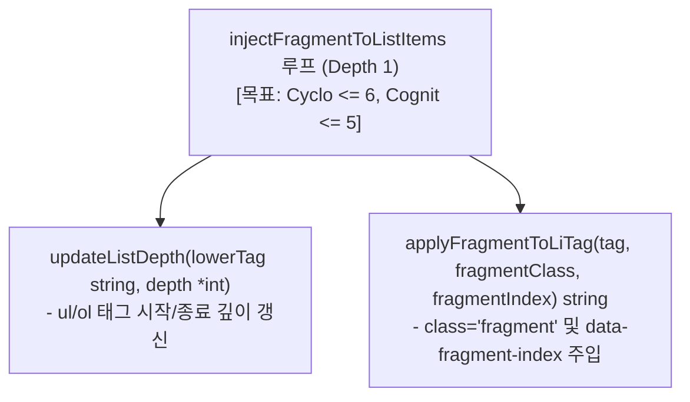
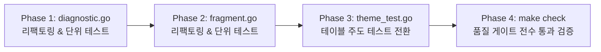

# [GOS-32] 코드 복잡도 임계치 초과 함수 3종 리팩토링 및 make check 품질 게이트 무결점 달성 계획서

> **티켓 번호**: [GOS-32](https://joincdream.atlassian.net/browse/GOS-32)  
> **마일스톤**: 코드베이스 품질 강화 & 기술 부채 청산 (Technical Debt Clearance)  
> **마감일**: 2026-11-20  
> **상태**: 완료 (Done)  
> **담당 패키지**:  
> - [`internal/parser/`](file:///home/yundream/myjob/cloit/Goslide/internal/parser/)  
> - [`internal/theme/`](file:///home/yundream/myjob/cloit/Goslide/internal/theme/)  
> **설계 철학**:  
> - [ADR-001 (KISS, YAGNI, SoC)](file:///home/yundream/myjob/cloit/Goslide/docs/okf/decisions-simplification.md) — 단순성과 관심사 분리 철저 준수  
> - **Pipeline Decomposition Pattern**: 단일 함수에 집중된 다중 책임을 순수 헬퍼 함수로 단계별 분리  
> - **Guard Clause Early Return**: 중첩된 `if-else` 분기문을 조기 반환(Guard Clause)으로 평탄화(Flattening)  
> - **Table-Driven Tests**: 나열식 중복 테스트 검증 코드를 Go 표준 관용구인 테이블 주도 테스트 패턴으로 통일  
> **연관 소스 파일**:  
> - [`internal/parser/diagnostic.go`](file:///home/yundream/myjob/cloit/Goslide/internal/parser/diagnostic.go)  
> - [`internal/parser/diagnostic_test.go`](file:///home/yundream/myjob/cloit/Goslide/internal/parser/diagnostic_test.go)  
> - [`internal/parser/fragment.go`](file:///home/yundream/myjob/cloit/Goslide/internal/parser/fragment.go)  
> - [`internal/parser/fragment_test.go`](file:///home/yundream/myjob/cloit/Goslide/internal/parser/fragment_test.go)  
> - [`internal/theme/theme_test.go`](file:///home/yundream/myjob/cloit/Goslide/internal/theme/theme_test.go)  
> - [`docs/reports/well_architected_assessment.md`](file:///home/yundream/myjob/cloit/Goslide/docs/reports/well_architected_assessment.md)  

---

## 1. 개요 및 배경 (Context & Problem Statement)

### 1.1 현상 및 측정 수치
Well-Architected 품질 감사([`docs/reports/well_architected_assessment.md`](file:///home/yundream/myjob/cloit/Goslide/docs/reports/well_architected_assessment.md))에서 `make check` 실행 결과, 코드 복잡도 분석 도구(`gocyclo`, `gocognit`)의 임계치를 초과하는 함수 3곳이 검출되어 엔지니어링 게이트웨이 통과에 실패하였습니다:

| 번호  | 패키지          | 대상 함수                                    | 위치                                                                                                                | 순환 복잡도 (기준 $\le 15$) | 인지 복잡도 (기준 $\le 20$) |        상태         |
| :-: | :----------- | :--------------------------------------- | :---------------------------------------------------------------------------------------------------------------- | :------------------: | :------------------: | :---------------: |
|  1  | `parser`     | `inspectSlideComments`                   | [`internal/parser/diagnostic.go:18`](file:///home/yundream/myjob/cloit/Goslide/internal/parser/diagnostic.go#L18) |   **28** (+13 초과)    |   **61** (+41 초과)    | <mark>FAIL</mark> |
|  2  | `parser`     | `injectFragmentToListItems`              | [`internal/parser/fragment.go:94`](file:///home/yundream/myjob/cloit/Goslide/internal/parser/fragment.go#L94)     |    **17** (+2 초과)    |   **42** (+22 초과)    | <mark>FAIL</mark> |
|  3  | `theme_test` | `TestManager_ResolveTheme_ExternalPaths` | [`internal/theme/theme_test.go:252`](file:///home/yundream/myjob/cloit/Goslide/internal/theme/theme_test.go#L252) |       13 (통과)        |    **22** (+2 초과)    | <mark>FAIL</mark> |

---

### 1.2 대상 함수별 근본 원인 분석

#### ① `inspectSlideComments` (순환: 28, 인지: 61)
- **단일 책임 원칙(SRP) 위배**: 단일 함수가 (1) 구분자 오타 새니타이징, (2) 코드 블록 라인 추적, (3) 주석 순회, (4) 특수 마커 및 오타 매칭, (5) Key-Value 지시어 유효성 검사 등 5가지 이종 작업을 모두 직접 수행함.
- **5단계 중첩(Deep Nesting)**: `for 주석` $\rightarrow$ `for 라인` $\rightarrow$ `if !isLocal` $\rightarrow$ `if MatchCanonicalDirective` $\rightarrow$ `if strings.EqualFold && !IsKnownLayout`으로 이어지는 5중 계단식 들여쓰기로 인해 인지 가중치가 61로 치솟음.
- **27개 결정 포인트**: `||` 연쇄 연산자(마커 오타 검증 등)와 다중 조건문이 한곳에 응집되어 순환 복잡도가 28에 도달함.

#### ② `injectFragmentToListItems` (순환: 17, 인지: 42)
- **문자열 스캐닝 루프 내 4단계 중첩**: `for idx < len(content)` 문자열 탐색 루프 내부에서 `if content[idx] == '<'` 조건 하에 `<ul`, `</ul`, `<li` 판별 및 하위 `class` 속성 파싱(`if hasClass && existingClass != ""`)이 최대 4단계까지 중첩됨.
- **태그 조작 로직 혼재**: 리스트 계층 깊이(`listDepth`) 추적과 `<li ...>` 태그 문자열 조작 로직이 단일 루프에 혼재되어 복잡도를 가중시킴.

#### ③ `TestManager_ResolveTheme_ExternalPaths` (인지: 22)
- **나열식 서브테스트 중복 구조**: 5개의 서브테스트(`t.Run`)가 공통 검증 로직(`if base != ...`, `if custom != ...`)을 반복해서 개별 작성하여 들여쓰기 인지 부하가 누적됨.
- **Go 표준 관용구 미적용**: 테이블 주도 테스트(Table-Driven Test) 구조를 사용하지 않아 테스트 케이스 추가 시마다 복잡도가 선형 증가하는 구조.

---

## 2. 리팩토링 아키텍처 및 상세 설계 (Target Architecture)

### 2.1 [함수 1] `inspectSlideComments` 리팩토링 설계 (KISS & Pure Stateless Linter)

HTML 편집기 및 웹 브라우저 표준 관례에 맞추어 **주석 열림/닫힘 상태 추적 및 임의 문자열 치환을 완전히 배제**하고, 순수 무상태(Stateless) 지시어 검사기 구조를 적용합니다:



#### 핵심 개선 내역
1. **임의 문자열 치환(Sanitizer) 로직 완전 삭제 (YAGNI & Determinism)**:
   - 파서가 원본 텍스트를 임의로 보정/치환(`ReplaceAllString`)하던 부작용 코드를 통째로 삭제.
   - 잘못 닫힌 구분자(`--->`)가 발견되면 치환 없이 순수 `Diagnostic` 경고만 기록.
   - 함수 시그니처를 `func inspectSlideComments(slideIndex int, rawContent string) []model.Diagnostic`로 순수화.

2. **완전한 무상태(Stateless) 유지 (에디터/브라우저 표준 관례 준수)**:
   - 주석 닫힘 여부를 쫓아다니는 상태 추적(OPEN Count/State)을 일절 도입하지 않음.
   - 닫히지 않은 주석은 마크다운 파서 및 브라우저의 기본 렌더링에 맡겨 사용자가 눈으로 직접 확인하고 수정하도록 함.
   - 오직 정상적으로 닫힌 주석(`<!-- ... -->`)에 대해서만 지시어 및 마커 린트(Lint) 수행.

3. **2중 루프 안쪽의 단일 라인 검증만 순수 헬퍼 1개로 분리 (KISS)**:
   - `inspectDirectiveLine(slideIndex, lineNum int, lineText, rawSnippet string) []model.Diagnostic`
   - 주석 내 5단계 중첩 분기문을 순수 함수 1개로 격리하고 가드 절(Guard Clause)을 적용하여 메인 함수를 2단계로 평탄화.

4. **오타 검증의 단순화**:
   - `if lowerBody == "splti" || lowerBody == "spilt" ...` 연쇄 분기를 직관적인 `switch` 문으로 단순화.

5. **결과 예측**:
   - 복잡도 점수: **순환 복잡도 $\le 6$**, **인지 복잡도 $\le 6$** (기준치 15, 20 대비 대폭 개선).
   - 파일 라인 수: 195줄 $\rightarrow$ 약 125줄로 축소 (마이너스 리팩토링).

---

### 2.2 [함수 2] `injectFragmentToListItems` 리팩토링 설계

리스트 깊이 계산과 `<li ...>` 태그 속성 주입을 독립 헬퍼로 분리하여 루프 내부를 평탄화합니다:



1. **`updateListDepth(lowerTag string, depth *int) bool`**:
   - `<ul`, `<ol`, `</ul`, `</ol` 여부를 확인하여 `depth` 포인터를 갱신하고 태그 처리 여부를 반환.
2. **`applyFragmentToLiTag(tag, fragmentClass, fragmentIndex string) string`**:
   - `<li ...>` 태그 내 기존 `class` 파싱 및 `fragment` 추가, `data-fragment-index` 설정을 단일 책임으로 캡슐화.
   - 조기 반환(Guard Clause)을 적용하여 들여쓰기 1레벨 유지.

---

### 2.3 [함수 3] `TestManager_ResolveTheme_ExternalPaths` 리팩토링 설계

Go의 표준 관용구인 **테이블 주도 테스트(Table-Driven Test)** 구조로 전면 전환합니다:

```go
tests := []struct {
    name           string
    themeInput     string
    customCSSPath  string
    expectedBase   string
    expectedCustom string
}{
    {"relative theme with ext", "themes/corporate.css", "", theme.DefaultTheme, corpCSSPath},
    {"relative theme without ext", "themes/corporate", "", theme.DefaultTheme, corpCSSPath},
    {"bare theme name in themes dir", "corporate", "", theme.DefaultTheme, corpCSSPath},
    {"builtin theme", "clean", "", "clean", ""},
    {"explicit customCSSPath overrides frontmatter", "clean", explicitPath, "clean", explicitPath},
}
for _, tt := range tests {
    tt := tt
    t.Run(tt.name, func(t *testing.T) {
        base, custom := mgr.ResolveTheme(tt.themeInput, tt.customCSSPath)
        // 공통 단언문 2줄로 검증 완료
    })
}
```
- **효과**: 중복된 `if` 검사 로직이 단 1개의 공통 블록으로 축소되어 인지 복잡도 **$\le 4$**로 대폭 감소.

---

## 3. 단계별 실행 계획 (Action Items)



| 단계 | 작업 내용 | 대상 파일 | 검증 명령어 |
| :---: | :--- | :--- | :--- |
| **Phase 1** | `inspectSlideComments` 임의 치환(Sanitizer) 로직 삭제 및 단일 지시어 헬퍼 분리 | [`internal/parser/diagnostic.go`](file:///home/yundream/myjob/cloit/Goslide/internal/parser/diagnostic.go) | `go test -v ./internal/parser -run TestInspectSlideComments` |
| **Phase 2** | `injectFragmentToListItems` 서브 헬퍼 분리 및 평탄화 | [`internal/parser/fragment.go`](file:///home/yundream/myjob/cloit/Goslide/internal/parser/fragment.go) | `go test -v ./internal/parser -run TestFragment` |
| **Phase 3** | `TestManager_ResolveTheme_ExternalPaths` 테이블 주도 테스트 전환 | [`internal/theme/theme_test.go`](file:///home/yundream/myjob/cloit/Goslide/internal/theme/theme_test.go) | `go test -v ./internal/theme -run TestManager_ResolveTheme_ExternalPaths` |
| **Phase 4** | 전체 엔지니어링 게이트웨이 및 정적 바이너리 빌드 전수 검증 | 전체 | `make check && make build` |

---

## 4. 완료 기준 (Definition of Done)

1. **복잡도 게이트웨이 완전 통과**:
   - `make complexity` 실행 시 임계치 초과 함수 **0건 (All PASS)**.
   - `inspectSlideComments`: Cyclo $\le 10$, Cognit $\le 15$ 달성.
   - `injectFragmentToListItems`: Cyclo $\le 10$, Cognit $\le 15$ 달성.
   - `TestManager_ResolveTheme_ExternalPaths`: Cognit $\le 10$ 달성.
2. **동시성 및 회귀 결함 0건**:
   - `make test-race` 100% 통과 (Data Race 0건).
   - 기존 골든 테스트(`internal/renderer/html`) 회귀 0건 유지.
3. **정적 분석 무결점**:
   - `make lint` (`go vet ./...`) 결함/경고 0건 유지.
4. **리포트 갱신**:
   - [`docs/reports/well_architected_assessment.md`](file:///home/yundream/myjob/cloit/Goslide/docs/reports/well_architected_assessment.md)의 복잡도 지표를 PASS(100.0점 만점)로 갱신.
