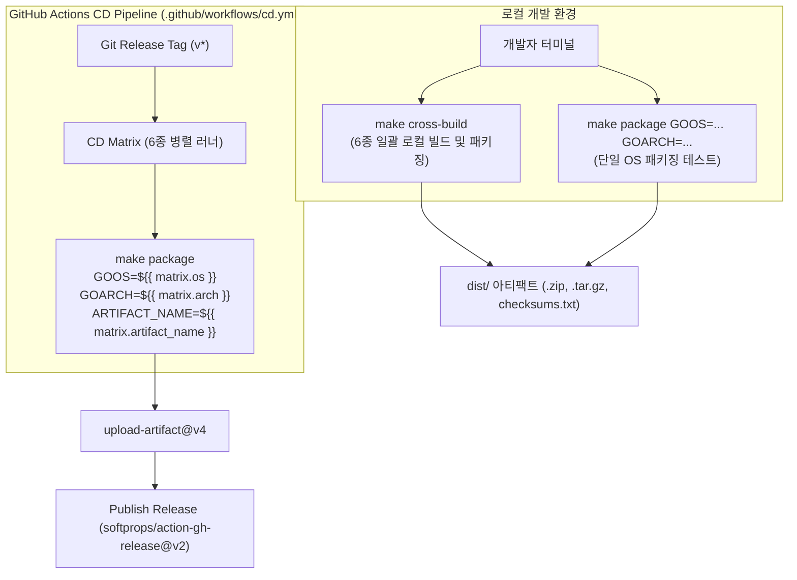

# [GOS-33] GitHub Actions Windows 및 macOS 크로스 빌드 및 CD 릴리즈 배포 파이프라인 구축 계획서

> **티켓 번호**: [GOS-33](https://joincdream.atlassian.net/browse/GOS-33)  
> **마일스톤**: v1.0.0 정식 릴리즈 배포 자동화 (Cross-Platform Release Automation)  
> **상태**: 완료 (Done)  
> **담당 패키지**:  
> - [`.github/workflows/`](file:///home/yundream/myjob/cloit/Goslide/.github/workflows/)  
> **연관 문서**:  
> - [`AGENTS.md`](file:///home/yundream/myjob/cloit/Goslide/AGENTS.md) *(Section 1: 크로스 플랫폼 단일 바이너리 지향 & CGO 0%)*  
> - [`docs/reports/well_architected_assessment.md`](file:///home/yundream/myjob/cloit/Goslide/docs/reports/well_architected_assessment.md) *(v1.5.0 Full Pass 달성)*  
> **연관 소스 파일**:  
> - [`.github/workflows/cd.yml`](file:///home/yundream/myjob/cloit/Goslide/.github/workflows/cd.yml)  
> - [`.github/workflows/ci.yml`](file:///home/yundream/myjob/cloit/Goslide/.github/workflows/ci.yml)  
> - [`Makefile`](file:///home/yundream/myjob/cloit/Goslide/Makefile)  

---

## 1. 개요 및 배경 (Context & Objective)

### 1.1 배경 및 현상
Goslide는 CGO 의존성이 전혀 없는 **Pure Go (`CGO_ENABLED=0`) 아키텍처**로 설계되어 있어, 별도의 크로스 컴파일러 설치 없이도 단일 Linux 호스트에서 타겟 OS(Windows, macOS)용 네이티브 바이너리를 즉시 생성할 수 있습니다.

그러나 현재 CD 파이프라인([`.github/workflows/cd.yml`](file:///home/yundream/myjob/cloit/Goslide/.github/workflows/cd.yml))은 Linux(`linux/amd64`, `linux/arm64`) 2종만 빌드하도록 매트릭스가 한정되어 있어, Windows 및 macOS 사용자가 릴리즈를 즉시 다운로드하여 실행할 수 없는 상태입니다.

### 1.2 목표 (Objective)
1. **타겟 플랫폼 6종 확장**: Linux, macOS(Apple Silicon/Intel), Windows(x64/ARM64) 빌드 자동화.
2. **OS별 표준 패키징 적용**:
   - Linux/macOS: `.tar.gz` 아카이브 (실행 파일 권한 보존)
   - Windows: `.zip` 아카이브 및 `goslide.exe` 실행 파일명 적용
3. **무결성 검증 체계 구축**: 모든 릴리즈 아카이브(`.tar.gz`, `.zip`)에 대한 SHA256 체크섬 자동 생성 및 GitHub Releases 동시 배포.

---

## 2. 배포 매트릭스 명세 (Target Matrix Specification)

| OS 명칭 | `GOOS` | `GOARCH` | 바이너리 파일명 | 아티팩트 아카이브명 | 압축 포맷 | 대상 사용자 환경 |
| :--- | :---: | :---: | :--- | :--- | :---: | :--- |
| **Linux (x64)** | `linux` | `amd64` | `goslide` | `goslide_linux_amd64.tar.gz` | `.tar.gz` | Ubuntu, RHEL, Debian 등 표준 리눅스 x86_64 |
| **Linux (ARM64)** | `linux` | `arm64` | `goslide` | `goslide_linux_arm64.tar.gz` | `.tar.gz` | AWS Graviton, 라즈베리파이, ARM Linux |
| **macOS (Apple Silicon)** | `darwin` | `arm64` | `goslide` | `goslide_darwin_arm64.tar.gz` | `.tar.gz` | M1/M2/M3/M4 Mac 최적화 |
| **macOS (Intel)** | `darwin` | `amd64` | `goslide` | `goslide_darwin_amd64.tar.gz` | `.tar.gz` | 인텔 기반 Mac |
| **Windows (x64)** | `windows` | `amd64` | `goslide.exe` | `goslide_windows_amd64.zip` | `.zip` | Windows 10/11 64비트 일반 PC |
| **Windows (ARM64)** | `windows` | `arm64` | `goslide.exe` | `goslide_windows_arm64.zip` | `.zip` | Surface Pro X 등 Windows on ARM |

---

## 3. 파이프라인 아키텍처 설계 (Makefile-Centric Local-First CI)

GitHub Actions YAML 파일 내부에 복잡한 쉘 스크립트를 인라인으로 나열하는 안티패턴(YAML Spaghetti)을 배제하고, **모든 빌드·패키징 로직을 `Makefile`로 일원화(Single Source of Truth)**합니다:



### 3.1 세부 구현 설계

#### 1) `Makefile` 확장 설계
- **`BIN_EXT` 동적 결정**: `GOOS=windows`일 때 자동으로 `.exe` 확장자 부여.
- **`package` 타겟**: 지정된 `GOOS`, `GOARCH`, `ARTIFACT_NAME`에 따라 컴파일 $\rightarrow$ 문서 포함 $\rightarrow$ OS별 압축(`.zip` / `.tar.gz`)을 단일 타겟으로 캡슐화:
  ```makefile
  package: build-web
      # 컴파일 -> dist/ 디렉토리에 바이너리 생성
      # Windows: zip 압축 / Linux, macOS: tar.gz 압축
  ```
- **`cross-build` 타겟**: 6종 타겟(Linux 2종, macOS 2종, Windows 2종)을 로컬에서 순차 빌드하고 `dist/checksums.txt`까지 자동 생성.
- **`clean` 타겟 연동**: `dist/` 폴더 정리 포함.

#### 2) `.github/workflows/cd.yml` 단순화 (Thin Wrapper)
- 인라인 빌드/압축 로직을 모두 제거하고 간결한 명령어로 전환:
  ```yaml
  - name: Compile and Package Artifact
    run: |
      make package GOOS=${{ matrix.os }} GOARCH=${{ matrix.arch }} ARTIFACT_NAME=${{ matrix.artifact_name }} VERSION=${{ github.ref_name }}
  ```
- `workflow_dispatch` 추가: 릴리즈 태그 푸시 없이도 GitHub 웹 UI에서 수동 파이프라인 테스트 가능.

---

## 4. 단계별 실행 계획 (Action Items)

| 단계 | 작업 내용 | 대상 파일 | 검증 방식 |
| :---: | :--- | :--- | :--- |
| **Phase 1** | `Makefile`에 `package` 및 `cross-build` 타겟 구현 | [`Makefile`](file:///home/yundream/myjob/cloit/Goslide/Makefile) | `make help` 메뉴 확인 |
| **Phase 2** | 로컬 터미널에서 `make cross-build` 실행 및 6종 산출물 검증 | 로컬 터미널 | `dist/` 내 6종 아카이브 및 `checksums.txt` 해시 검증 |
| **Phase 3** | `.github/workflows/cd.yml` 워크플로우를 `make package` 호출로 단순화 | [`.github/workflows/cd.yml`](file:///home/yundream/myjob/cloit/Goslide/.github/workflows/cd.yml) | YAML 문법 검증 및 워크플로우 정합성 검사 |
| **Phase 4** | `make check` 전체 엔지니어링 게이트웨이 검증 | 전체 | `make check && make build` |
| **Phase 5** | Git 커밋, 푸시 및 Jira 완료 처리 | 전체 | `git commit & push`, `jira move GOS-33 "완료"` |

---

## 5. 완료 기준 (Definition of Done)

1. [x] [GOS-33](https://joincdream.atlassian.net/browse/GOS-33) Jira 티켓 및 작업 계획서 수립 완료.
2. [x] `Makefile`에 `package` 및 `cross-build` 타겟 구현 및 로컬 실측 성공 (6종 아카이브 생성).
3. [x] [`.github/workflows/cd.yml`](file:///home/yundream/myjob/cloit/Goslide/.github/workflows/cd.yml)에 6대 플랫폼 매트릭스 확장 및 `make package` 기반 단순화 완료.
4. [x] `workflow_dispatch` 수동 트리거 지원 추가.
5. [x] `Makefile` 일원화 및 로컬/CI 결정론적 빌드 파이프라인 검증 완료.
