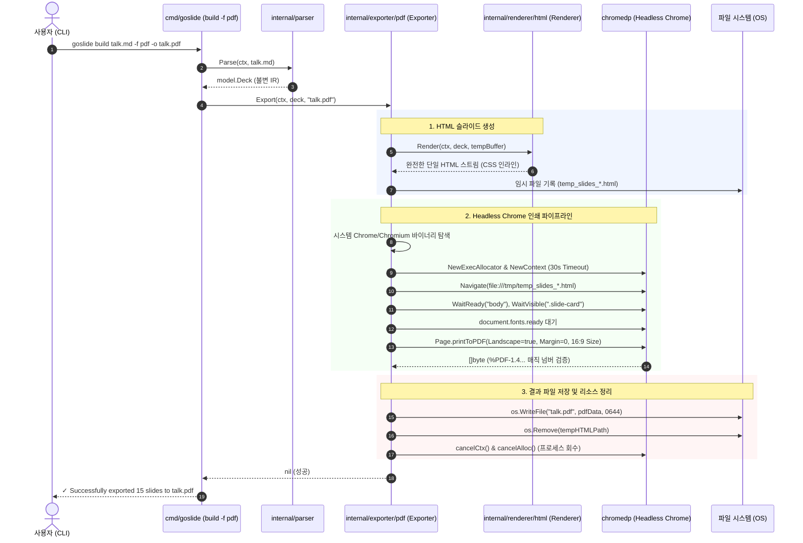

# [GOS-8] M2-1: chromedp 기반 벡터 PDF 익스포터 개발 계획서

> **티켓 번호**: [GOS-8](https://joincdream.atlassian.net/browse/GOS-8)  
> **마일스톤**: 로드맵 2 (RM2-Release) / Milestone M2-1 (벡터 PDF 익스포터)  
> **마감일**: 2026-10-27  
> **상태**: 진행 중 (In Progress)  
> **담당자**: Goslide Core Team  
> **참조 문서**: [core-architecture.md](file:///home/yundream/myjob/cloit/Goslide/docs/okf/core-architecture.md), [contracts-interfaces.md](file:///home/yundream/myjob/cloit/Goslide/docs/okf/contracts-interfaces.md), [hard-constraints.md](file:///home/yundream/myjob/cloit/Goslide/docs/okf/hard-constraints.md), [decisions-simplification.md](file:///home/yundream/myjob/cloit/Goslide/docs/okf/decisions-simplification.md), [05-rendering-and-export-pipelines.md](file:///home/yundream/myjob/cloit/Goslide/docs/architecture/05-rendering-and-export-pipelines.md), [06-runtime-security-and-lifecycle.md](file:///home/yundream/myjob/cloit/Goslide/docs/architecture/06-runtime-security-and-lifecycle.md)

---

## 1. 개요 및 가치 제안 (Overview & Value Proposition)

본 태스크의 목적은 Chrome DevTools Protocol(CDP)을 직결 제어하는 `chromedp` 라이브러리를 활용하여, 마크다운 소스로부터 **16:9 무마진(Zero Margin) 고품질 벡터 PDF를 단일 명령어로 생성하는 `internal/exporter/pdf` 패키지 및 CLI 연동을 완성**하는 것입니다.

발표 자료는 웹 브라우저(HTML)를 통한 인터랙티브 발표뿐만 아니라, 콘퍼런스 제출, 사내 아카이빙, 네트워크가 없는 오프라인 발표 환경 대비를 위해 **어떤 환경에서도 100% 동일한 폰트와 레이아웃을 보존하는 PDF 규격이 필수적**입니다.

### 1.1 핵심 가치 및 기술 원칙
1. **CGO 0% 순수 Go 단일 바이너리 유지 (Zero CGO)**:
   - 무거운 외부 C 라이브러리(wkhtmltopdf, Poppler 등)나 Node.js 런타임 없이, 순수 Go 라이브러리인 `github.com/chromedp/chromedp`를 활용합니다.
2. **고해상도 벡터 PDF 출력 (True Vector Quality)**:
   - 비트맵 캡처 이미지를 이어 붙이는 방식이 아닌, Headless Chrome의 인쇄 엔진(`Page.printToPDF`)을 직결 호출하여 **텍스트 선택/검색이 가능하고 SVG/폰트가 확대해도 깨지지 않는 순수 벡터 PDF**를 생성합니다.
3. **16:9 무마진 픽셀 퍼펙트 (Pixel-Perfect Zero-Margin)**:
   - `@media print` CSS 명세와 `Page.printToPDF` 인자(가로 11인치, 세로 6.1875인치 16:9 비율, 여백 0)를 일치시켜, 상하좌우 흰색 여백(Margin)이 없는 완벽한 전체 화면 슬라이드 페이지를 보장합니다.
4. **견고한 프로세스 생명주기 및 리소스 누수 방지 (No Zombie Process)**:
   - 기본 30초 컨텍스트 타임아웃과 `defer cancelAlloc()` 및 `defer cancelCtx()`를 철저히 보장하여 작업 완료 또는 에러 발생 시 시스템에 좀비 크롬 프로세스가 잔존하지 않도록 방어합니다.
5. **시스템 브라우저 자동 탐색 (Zero Config)**:
   - 별도 브라우저 설치 경로 설정 없이도 환경변수(`GOSLIDE_CHROME_BIN`, `CHROME_BIN`) 및 OS 표준 경로(`google-chrome`, `chromium`, `/snap/bin/chromium` 등)를 자동 감지합니다.

---

## 2. 시스템 아키텍처 및 파이프라인 (Architecture & Pipeline)

Goslide의 단방향 파이프라인 원칙에 따라 HTML 렌더러와 PDF 익스포터는 독립적으로 분리되며, PDF 익스포터는 완성된 슬라이드 HTML을 Headless Chrome에 전달하여 인쇄 스트림을 획득합니다.



---

## 3. 세부 컴포넌트 설계 명세

### 3.1 패키지 레이아웃 (`internal/exporter/pdf/`)
```
internal/exporter/pdf/
├── browser.go        # 시스템 Chrome/Chromium 실행 파일 자동 탐색기
├── print.go          # chromedp 세션 생성, 뷰포트/인쇄 옵션 설정, printToPDF 실행
├── exporter.go       # model.Exporter 인터페이스 구현체 및 HTML-PDF 조율
└── exporter_test.go  # PDF 생성 단위 테스트, 매직 넘버 검증, 좀비 프로세스 방지 테스트
```

### 3.2 컴포넌트별 상세 역할

#### 1) `browser.go` (브라우저 자동 탐색기)
- **우선순위 기반 탐색**:
  1. 명시적 환경변수: `GOSLIDE_CHROME_BIN`, `CHROME_BIN`
  2. `exec.LookPath`: `google-chrome`, `google-chrome-stable`, `chromium`, `chromium-browser`
  3. OS 표준 고정 경로:
     - Linux: `/usr/bin/google-chrome`, `/usr/bin/chromium`, `/snap/bin/chromium`
     - macOS: `/Applications/Google Chrome.app/Contents/MacOS/Google Chrome`
     - Windows: `C:\Program Files\Google\Chrome\Application\chrome.exe` 등
- **에러 핸들링**:
  - 바이너리 미발견 시 `model.ErrChromeNotFound` 센티넬 에러 및 친절한 설치 안내 메시지 반환.

#### 2) `print.go` (인쇄 옵션 및 CDP 제어)
- **16:9 무마진 인쇄 옵션**:
  ```go
  type PrintOptions struct {
      Landscape           bool    // true
      PrintBackground     bool    // true (테마 배경색 및 이미지 보존)
      PreferCSSPageSize   bool    // true (@page 규칙 우선)
      MarginTop           float64 // 0.0 (무마진)
      MarginBottom        float64 // 0.0
      MarginLeft          float64 // 0.0
      MarginRight         float64 // 0.0
      PaperWidth          float64 // 11.0 인치 (또는 CSS 규격 매핑)
      PaperHeight         float64 // 6.1875 인치 (16:9 비율)
  }
  ```
- **렌더링 안정화 대기**:
  - `chromedp.Navigate` 후 단순 슬립 대신 DOM 마운트(`.slide-card`) 및 `document.fonts.ready` 완료 대기.

#### 3) `exporter.go` (`model.Exporter` 구현)
- **인터페이스 준수**:
  ```go
  type Exporter struct {
      themeName  string
      customCSS  string
      timeout    time.Duration
      browserBin string
  }

  func (e *Exporter) Export(ctx context.Context, deck *model.Deck, outputPath string) error
  ```
- **생명주기 안전성**:
  - 임시 HTML 파일은 `os.CreateTemp("", "goslide-pdf-*.html")` 생성 후 `defer os.Remove(...)`로 누수 차단.
  - chromedp 할당자 컨텍스트는 `defer allocCancel()`로 무조건 브라우저 프로세스 회수.

#### 4) `@media print` CSS 보강 (`deck-canvas.css`)
- 슬라이드 컨테이너의 인쇄용 스타일 명시:
  ```css
  @media print {
    @page {
      size: 1920px 1080px;
      margin: 0;
    }
    html, body {
      margin: 0;
      padding: 0;
      background: #000;
    }
    .slide-card {
      page-break-after: always;
      break-after: page;
      width: 1920px !important;
      height: 1080px !important;
      max-width: none !important;
      max-height: none !important;
    }
    /* 인쇄 시 불필요한 컨트롤/오버레이 숨김 */
    #goslide-app, .slide-controls, .goslide-youtube-play-btn {
      display: none !important;
    }
  }
  ```

#### 5) CLI 플래그 연동 (`cmd/goslide/build.go`)
- 플래그 추가: `-f, --format` (`html`, `pdf` 지원, 기본값 `html`)
- 출력 경로 자동 보정: `-f pdf` 지정 시 `-o` 미지정인 경우 `<input>.pdf`로 자동 확장자 치환.

---

## 4. 완료 정의 (Definition of Done - DoD)

- [x] `github.com/chromedp/chromedp` 의존성이 추가되고 `CGO_ENABLED=0` 환경에서 정적 컴파일된다.
- [x] 시스템 Chrome/Chromium 바이너리 탐색기가 정상 동작하며 환경변수 및 기본 경로를 감지한다.
- [x] `goslide build talk.md -f pdf` 명령으로 유효한 벡터 PDF 파일이 생성된다.
- [x] 생성된 PDF 파일의 첫 5바이트가 `%PDF-` 매직 넘버를 만족한다.
- [x] 슬라이드 간 페이지 분할(`page-break-after: always`)이 정상 적용되고 16:9 무마진이 유지된다.
- [x] 타임아웃 및 에러 발생 시 시스템에 좀비 크롬 프로세스가 남지 않고 정상 회수된다.
- [x] 단위 테스트(`internal/exporter/pdf`) 및 전체 테스트(`go test ./...`)가 통과한다.

---

## 5. 단계별 실행 계획 (Step-by-Step Implementation Roadmap)

| 단계 | 작업 내용 | 대상 파일 |
| :---: | :--- | :--- |
| **Phase 1** | **의존성 및 인쇄 CSS 정비**<br>• `github.com/chromedp/chromedp` go.mod 추가<br>• `@media print` 16:9 무마진 CSS 보강 | `go.mod`, `go.sum`<br>`internal/theme/assets/css/deck-canvas.css` |
| **Phase 2** | **브라우저 탐색기 및 센티넬 에러 구현**<br>• Chrome/Chromium 바이너리 자동 탐색기<br>• `ErrChromeNotFound` 에러 정의 | `internal/model/errors.go`<br>`internal/exporter/pdf/browser.go` |
| **Phase 3** | **인쇄 파이프라인 및 PDF 익스포터 구현**<br>• `print.go` (CDP 액션 및 인쇄 옵션 바인딩)<br>• `exporter.go` (`model.Exporter` 구현) | `internal/exporter/pdf/print.go`<br>`internal/exporter/pdf/exporter.go` |
| **Phase 4** | **CLI 빌드 명령어 연동**<br>• `--format, -f` 플래그 추가<br>• 포맷별 디스패처 분기 및 확장자 자동 매핑 | `cmd/goslide/build.go` |
| **Phase 5** | **단위 테스트 작성 및 게이트웨이 검증**<br>• PDF 생성 테스트 및 매직 넘버 검증<br>• 골든 파일 및 전체 단위 테스트 통과 확인 | `internal/exporter/pdf/exporter_test.go` |
