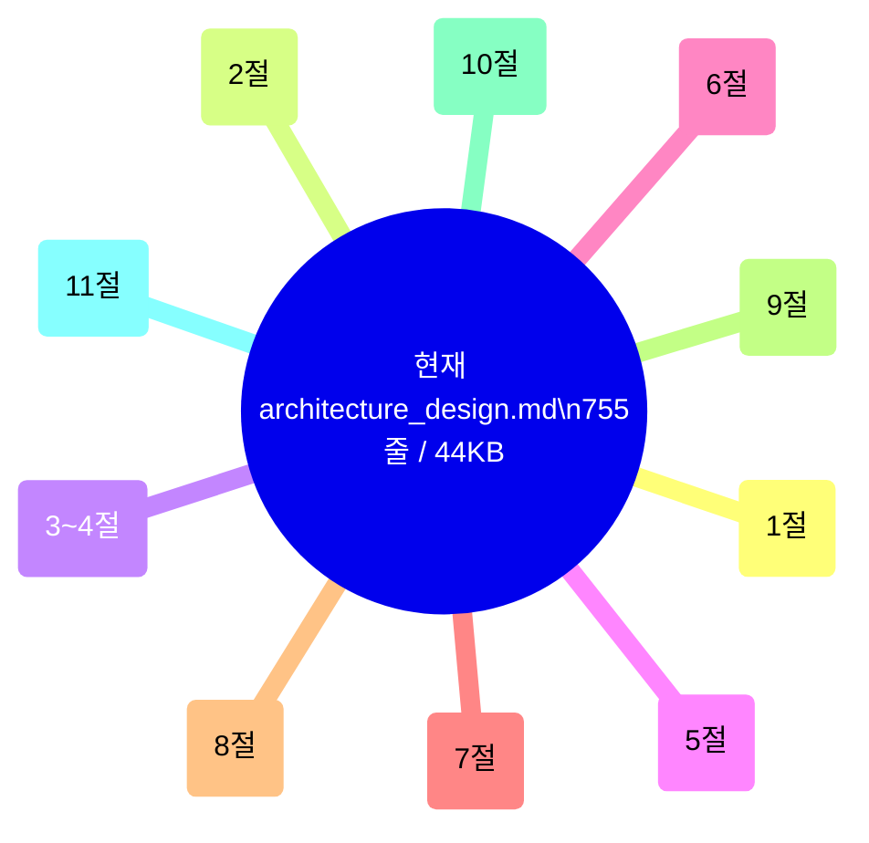
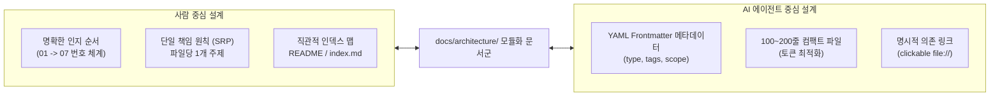

# [TASK] Goslide 시스템 아키텍처 문서 모듈화 및 지식 체계 개선 계획서

> **문서 상태**: 계획 수립 (Draft)  
> **작성일**: 2026-10-05  
> **작성자**: Goslide Core Architecture Team  
> **대상 원본 문서**: [`docs/architecture_design.md`](file:///home/yundream/myjob/cloit/Goslide/docs/architecture_design.md) (755줄, 44KB 단일 모놀리식 문서)  
> **목표 산출물 경로**: `docs/architecture/` 디렉토리 모듈화 문서군  
> **연관 문서**: [`docs/okf/index.md`](file:///home/yundream/myjob/cloit/Goslide/docs/okf/index.md), [`docs/layout-design.md`](file:///home/yundream/myjob/cloit/Goslide/docs/layout-design.md), [`AGENTS.md`](file:///home/yundream/myjob/cloit/Goslide/AGENTS.md)

---

## 1. 개요 및 추진 배경 (Overview & Motivation)

### 1.1 현재 문제점 분석: 단일 모놀리식 문서의 한계
현재 [`docs/architecture_design.md`](file:///home/yundream/myjob/cloit/Goslide/docs/architecture_design.md)는 총 **755줄, 44KB**에 달하는 거대한 단일 파일에 비즈니스 철학부터 저수준 Go 코드, 마크다운 DSL, 프로세스 수명주기, CI/CD 배포 스크립트까지 모든 도메인이 한곳에 혼재되어 있습니다.



이러한 모놀리식 구조는 **사람과 AI 모두에게 심각한 관리성 및 생산성 저하**를 유발합니다:

1. **사람(개발자/설계자) 관점의 문제**:
   - **인지 부하(Cognitive Load)**: 특정 기능(예: PPTX 내보내기, 종료 코드) 하나를 확인하려 해도 750줄이 넘는 문서를 스크롤하며 맥락을 찾아야 함.
   - **관심사의 혼재**: 시스템 아키텍트가 검토하는 '컴포넌트 경계'와 프런트엔드/DevOps가 검토하는 '빌드/배포 스크립트'가 동일 파일에 뒤섞임.
   - **Git 충돌(Merge Conflict)**: 여러 엔지니어가 각기 다른 설계 영역을 수정할 때 단일 파일에서 충돌 빈도가 급증함.

2. **AI(LLM 에이전트) 관점의 문제**:
   - **토큰 예산 낭비(Token Inefficiency)**: 특정 모듈(예: 파서 에러 처리)만 파악하면 되는 에이전트에게 44KB 전체를 프롬프트 컨텍스트에 주입해야 하므로 불필요한 토큰 소비와 지연 시간(Latency)이 발생함.
   - **환각 및 주의력 분산(Attention Dilution)**: 하나의 긴 문서에 마크다운 DSL, Go 구조체, Bash 스크립트, Chrome DevTools Protocol이 혼재되어 LLM의 Attention이 분산되고, 엉뚱한 맥락을 참조할 위험이 커짐.
   - **도구 호출 실패 위험**: 긴 파일 대상의 `replace_file_content` 또는 읽기 작업 시 줄 번호 오차나 토큰 제한으로 인한 도구 호출 실패율이 증가함.

---

## 2. 설계 원칙: "사람과 AI가 모두 관리하기 쉬운 형태"

본 모듈화 계획은 소프트웨어 문서화의 글로벌 표준인 **arc42**, **C4 Model**, **Diátaxis 프레임워크**, 그리고 **Open Knowledge Format(OKF)** 원칙을 결합하여 구축합니다.



### 2.1 사람을 위한 설계 원칙
- **단일 책임 원칙 (Single Responsibility Principle for Docs)**: 하나의 문서는 하나의 관심사만 다룹니다.
- **점진적 상세화 (Progressive Disclosure)**: 인덱스(Overview) → 아키텍처 원칙 → 컴포넌트/인터페이스 → 세부 파이프라인 → 인프라/운영 순으로 번호 기반 정렬.
- **시각화 우선 (Visual Diagrams)**: 각 모듈마다 관련된 Mermaid 다이어그램을 본문 바로 옆에 배치.

### 2.2 AI를 위한 설계 원칙
- **구조화된 YAML Frontmatter 탑재**: 문서 상단에 `title`, `description`, `scope`, `tags`, `related_code`를 정의하여 AI 에이전트가 본문을 다 읽지 않고도 필요한 문서를 0-Shot으로 선별(Routing)할 수 있도록 지원.
- **컴팩트한 토큰 예산**: 파일당 100~250줄 내외(1.5KB~5KB)로 분할하여 프롬프트 컨텍스트 윈도우를 최소한으로 점유.
- **절대적/상대적 상호 참조 링크 보장**: 다른 문서나 실제 Go 소스 코드에 대해 명확한 마크다운 링크를 제공하여 에이전트의 자율 탐색(Autonomous Traversal)을 지원.

---

## 3. 원본 문서 매핑 및 모듈 분할 사양 (Module Breakdown)

기존 [`docs/architecture_design.md`](file:///home/yundream/myjob/cloit/Goslide/docs/architecture_design.md) (755줄)를 아래와 같이 **7개의 전문 모듈과 1개의 인덱스 문서**로 체계화합니다.

```
docs/
├── architecture/
│   ├── index.md                               # [Entry] 전체 아키텍처 개요 및 지식 내비게이션 맵
│   ├── 01-principles-and-vision.md            # [개념] 시스템 비전 및 핵심 5대 아키텍처 원칙
│   ├── 02-slide-spec-and-domain-model.md      # [모델] 슬라이드 마스터 DSL 규격 및 불변 IR 모델
│   ├── 03-package-structure-and-c4.md         # [구조] C4 컴포넌트 뷰, 패키지 레이아웃, 의존성 경계
│   ├── 04-interfaces-and-contracts.md         # [계약] 코어 인터페이스(Parser/Renderer/Exporter) 및 에러 체계
│   ├── 05-rendering-and-export-pipelines.md   # [파이프라인] HTML/PDF/PPTX 변환 흐름 및 브라우저 제어
│   ├── 06-runtime-security-and-lifecycle.md   # [안전성] chromedp 프로세스 생명주기 및 보안 격리
│   └── 07-operations-build-and-cicd.md        # [운영] CLI 규격, 종료 코드, 테스트 전략, CI/CD
```

### 3.1 섹션별 상세 이관 매핑표

| 원본 섹션 (`architecture_design.md`) | 원본 내용 | 이관 대상 신규 모듈 | 예상 분량 |
| :--- | :--- | :--- | :---: |
| **Header & 1절** | 시스템 개요, 5대 아키텍처링 원칙 (단방향, 불변, 무상태, DIP, Resource) | `01-principles-and-vision.md` | ~120줄 |
| **2절 & 5.2절** | 슬라이드 표현 기능, Frontmatter/지시어, 레이아웃 결정 규칙, `model.Deck`/`Slide` IR | `02-slide-spec-and-domain-model.md` | ~180줄 |
| **3절 & 4절** | C4 컨테이너 다이어그램, Go 표준 디렉토리 트리, 모듈 책임, 패키지 의존성 격리 규칙 | `03-package-structure-and-c4.md` | ~180줄 |
| **5.1절 & 10.1절** | `model.Parser`, `Renderer`, `Exporter` 인터페이스, 도메인 센티넬 에러 | `04-interfaces-and-contracts.md` | ~110줄 |
| **6절 & 7절** | 기술 스택 선정 이유, HTML 렌더러, PDF 벡터 인쇄, PPTX OpenXML 파이프라인 | `05-rendering-and-export-pipelines.md` | ~190줄 |
| **8절 & 9절** | chromedp 프로세스 트리 회수(Allocator), 좀비 방지, 세마포어 동시성, Raw HTML 보안 격리 | `06-runtime-security-and-lifecycle.md` | ~130줄 |
| **10.2절 & 11절** | CLI 표준 종료 코드(Exit Codes), Makefile 빌드, 테스트 피라미드, GoReleaser 배포 | `07-operations-build-and-cicd.md` | ~150줄 |
| **-** | 모듈 전체 내비게이션, AI 라우팅 테이블, 빠른 참조 링크 | `index.md` | ~80줄 |

---

## 4. 파일별 세부 내용 및 Frontmatter 명세

### 4.1 `docs/architecture/index.md` (중앙 라우터)
- **역할**: 사람에게는 아키텍처 대시보드, AI에게는 Context Routing Map 제공.
- **내용**:
  - 시스템 한 줄 정의 및 핵심 철학 요약.
  - 7개 모듈에 대한 한 줄 설명 및 역할 매핑 테이블.
  - "이런 작업을 할 때는 이 문서를 보세요" 가이드 (예: 신규 출력 포맷 추가 시 → `04` & `05`).
  - 전체 시스템의 거시적 데이터 흐름 다이어그램 (High-Level Context Flow).

### 4.2 `01-principles-and-vision.md` (철학 및 시스템 개요)
- **Frontmatter**:
  ```yaml
  ---
  title: Goslide Vision & Core Architectural Principles
  type: concept
  tags: [vision, principles, immutability, zero-global-state, pipeline]
  target_audience: [all, architects, agents]
  ---
  ```
- **내용**: 단방향 파이프라인, 불변 IR 모델, 제로 전역 상태, 인터페이스 격리, Context 기반 리소스 안전성.

### 4.3 `02-slide-spec-and-domain-model.md` (슬라이드 명세 & IR 모델)
- **Frontmatter**:
  ```yaml
  ---
  title: Slide Master Specification & Domain IR Model
  type: specification
  tags: [slide-dsl, directives, frontmatter, layout, model-deck, model-slide]
  related_code: [internal/model/deck.go, internal/parser/directive.go]
  ---
  ```
- **내용**: Frontmatter YAML, `_layout` / `_class` / `<!-- split -->` 지시어, 명시적 레이아웃 결정 알고리즘(Flowchart), `model.Deck` 및 `model.Slide` 불변 Go 구조체 정의.

### 4.4 `03-package-structure-and-c4.md` (패키지 구조 & 경계)
- **Frontmatter**:
  ```yaml
  ---
  title: Component Architecture & Package Boundaries
  type: architecture
  tags: [c4-model, go-layout, dependencies, import-rules, embed-fs]
  related_code: [cmd/, pkg/, internal/]
  ---
  ```
- **내용**: C4 컴포넌트 뷰 다이어그램, Go 표준 디렉토리 구조 트리, 모듈별 단일 책임표, 순환 참조 방지 4대 규칙, `embed.FS` 정적 에셋 트리.

### 4.5 `04-interfaces-and-contracts.md` (인터페이스 & 도메인 계약)
- **Frontmatter**:
  ```yaml
  ---
  title: Core Interfaces & Domain Error Contracts
  type: contract
  tags: [interfaces, parser-contract, renderer-contract, exporter-contract, sentinel-errors]
  related_code: [internal/model/interfaces.go, internal/model/errors.go]
  ---
  ```
- **내용**: `Parser`, `Renderer`, `Exporter`의 Go 인터페이스 시그니처, 계층형 센티넬 에러(`ErrSlideNotFound`, `ErrExportFailed` 등) 및 `errors.Is`/`errors.As` 처리 규칙.

### 4.6 `05-rendering-and-export-pipelines.md` (렌더링 및 익스포트 파이프라인)
- **Frontmatter**:
  ```yaml
  ---
  title: Multi-Format Rendering & Export Pipelines
  type: architecture
  tags: [pipeline, html-renderer, pdf-print, pptx-openxml, chroma]
  related_code: [internal/renderer/, internal/exporter/]
  ---
  ```
- **내용**: 기술 스택 선정 근거(Pure Go 원칙), HTML 렌더러 합성 파이프라인, PDF 무마진 벡터 인쇄 시퀀스 다이어그램, PPTX OpenXML(OPC Zip) 고해상도 뷰포트 캡처 및 슬라이드 노트 보존 파이프라인.

### 4.7 `06-runtime-security-and-lifecycle.md` (프로세스 생명주기 & 보안)
- **Frontmatter**:
  ```yaml
  ---
  title: Headless Browser Lifecycle & Security Hardening
  type: operations
  tags: [chromedp, process-isolation, zombie-prevention, concurrency, security, xss]
  related_code: [internal/exporter/pdf/, internal/exporter/pptx/]
  ---
  ```
- **내용**: chromedp Allocator 프로세스 트리 회수 패턴(`defer cancelAlloc()`), 고루틴 타임아웃 격리, 동시성 세마포어 스로틀링, 마크다운 Raw HTML 보안 격리(`--unsafe-html`).

### 4.8 `07-operations-build-and-cicd.md` (운영, CLI, CI/CD)
- **Frontmatter**:
  ```yaml
  ---
  title: Operations, Exit Codes & CI/CD Pipeline
  type: operations
  tags: [cli, exit-codes, makefile, testing-pyramid, goreleaser, github-actions]
  related_code: [Makefile, cmd/goslide/]
  ---
  ```
- **내용**: 표준 CLI Exit Code 사양표(0~5), Makefile 타깃 명세, 3계층 테스트 전략(단위, 골든, 통합), GoReleaser 크로스 컴파일 매트릭스.

---

## 5. 관리 및 활용 가이드 (Human & AI Collaboration Guide)

### 5.1 사람(엔지니어)을 위한 가이드
1. **신규 기능 추가 시**: 전체 문서를 건드릴 필요 없이 해당 주제의 문서(예: PPTX 기능 확장 시 `05-rendering-and-export-pipelines.md`)만 열어 수정합니다.
2. **신규 입사자 온보딩 시**: `docs/architecture/index.md` → `01-principles-and-vision.md` → `03-package-structure-and-c4.md` 순서로 읽으면 시스템 전반을 15분 내에 파악할 수 있습니다.
3. **PR 리뷰 시**: 아키텍처 문서 변경 PR이 단일 주제로 격리되어 코드 리뷰의 집중도와 속도가 크게 향상됩니다.

### 5.2 AI 코딩 에이전트(LLM)를 위한 가이드
1. **컨텍스트 로딩 규칙**:
   - 에이전트는 항상 먼저 [`docs/architecture/index.md`](file:///home/yundream/myjob/cloit/Goslide/docs/architecture/index.md)의 테이블을 스캔합니다.
   - 요청받은 태스크와 관련된 단 1개의 모듈만 선택적으로 읽어 컨텍스트 윈도우를 아낍니다.
2. **코드 수정 시 일관성 유지**:
   - `internal/model` 수정 시: `02-slide-spec-and-domain-model.md`와 `04-interfaces-and-contracts.md`만 로드.
   - `internal/exporter` 작업 시: `05-rendering-and-export-pipelines.md`와 `06-runtime-security-and-lifecycle.md`만 로드.
3. **토큰 절약 효과**:
   - 기존: 단일 질문마다 ~44KB (약 12,000 토큰) 소비.
   - 모듈화 후: 대상 모듈 ~6KB (약 1,500 토큰) 소비로 **토큰 비용 약 87% 절감**.

---

## 6. 단계별 실행 계획 (Action Items & Milestones)

| 단계 | 작업 내용 | 세부 액션 아이템 |
| :---: | :--- | :--- |
| **Phase 1** | **디렉토리 생성 및 인덱스 구축** | • `docs/architecture/` 디렉토리 신설<br>• `docs/architecture/index.md` 작성 (지식 내비게이션 맵 및 매핑 테이블) |
| **Phase 2** | **코어 모듈 7종 순차 분할 및 작성** | • `01-principles-and-vision.md` 추출<br>• `02-slide-spec-and-domain-model.md` 추출<br>• `03-package-structure-and-c4.md` 추출<br>• `04-interfaces-and-contracts.md` 추출<br>• `05-rendering-and-export-pipelines.md` 추출<br>• `06-runtime-security-and-lifecycle.md` 추출<br>• `07-operations-build-and-cicd.md` 추출 |
| **Phase 3** | **상호 참조 및 링크 무결성 검증** | • 각 파일 상단에 표준 YAML Frontmatter 적용<br>• Mermaid 다이어그램 문법 검증<br>• 코드 파일 및 모듈 간 링크 경로(`file:///...` 및 상대경로) 동작 확인 |
| **Phase 4** | **기존 문서 정리 및 호환성 처리** | • `docs/architecture_design.md`를 `docs/architecture/index.md`로 안내하는 리다이렉션 문서(또는 완전 대체)로 전환<br>• `README.md`, `AGENTS.md`, `docs/okf/index.md`의 아키텍처 참조 경로 업데이트 |

---

## 7. 완료 기준 (Definition of Done)

1. `docs/architecture/` 하위에 8개 파일(`index.md` + `01`~`07`)이 모두 정상 생성되어야 함.
2. 각 파일의 길이가 250줄 이하로 유지되어 단일 관심사(SRP)를 명확히 충족해야 함.
3. 모든 신규 파일에 YAML Frontmatter 메타데이터(`title`, `type`, `tags` 등)가 누락 없이 포함되어야 함.
4. 모든 다이어그램(Mermaid)이 문법 오류 없이 렌더링되어야 함.
5. 기존 `docs/architecture_design.md`가 깔끔하게 정리되고 프로젝트 내 모든 연관 문서(`AGENTS.md`, `docs/okf/index.md` 등)의 링크가 깨지지 않고 연결되어야 함.
