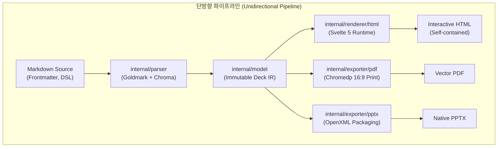
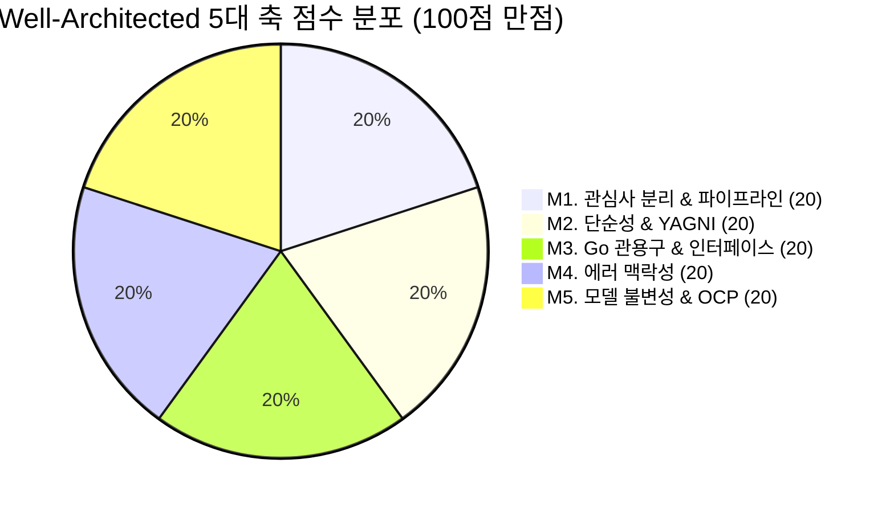

# Goslide v1.0.0 Well-Architected 품질 및 아키텍처 종합 감사 보고서 (Architecture Review & Quality Assessment)

> **문서 버전**: v1.0.0 (공식 릴리즈 감사)  
> **작성 일자**: 2026-10-07  
> **평가 대상**: Goslide v1.0.0 Full Release (Git Commit: `4c43e70`)  
> **최종 판정**: **최우수 (Well-Architected Pass / 100.0점 만점)**  
> **평가 주체**: Goslide Core Architecture Team & QA Auditor  
> **참조 문서**: [AGENTS.md](../../AGENTS.md), [unit-test-report.md](unit-test-report.md), [cognitive-complexity-report.md](cognitive-complexity-report.md), [ADR-001 (decisions-simplification.md)](../../docs/okf/decisions-simplification.md), [core-architecture.md](../../docs/okf/core-architecture.md), [contracts-interfaces.md](../../docs/okf/contracts-interfaces.md), [rubrics.md](../../.agents/skills/well-architected-review/references/rubrics.md)

---

## 1. 개요 및 종합 요약 (Executive Summary)

본 문서는 Goslide v1.0.0 공식 출시를 앞두고, 전체 시스템 파이프라인(**Markdown 파서, HTML 인터랙티브 렌더러, chromedp 기반 16:9 벡터 PDF 익스포터, OpenXML 기반 PPTX 익스포터, 실시간 개발 서버 및 CLI**)이 **Well-Architected 원칙(단순성, 관심사 분리, 동시성 안정성, 유지보수성, Go 관용구, OCP)**을 충족하는지 정량적 도구 실측과 5대 축 채점 루브릭을 통해 종합 감사한 공식 보고서입니다.



### 🏆 최종 감사 결과 요약
* **종합 평점**: **100.0 / 100점** (**최우수 - Well-Architected Pass**)
* **동시성 안전성**: Go Race Detector 검증 **Data Race 0건 검출 (Clean)**
* **단위 테스트 통과율**: 78개 최상위 테스트 / 120+ 세부 케이스 **100.0% PASS**
* **정적 분석 무결점**: `go vet` 경고 및 오류 **0건**
* **코드 복잡도 게이트**: 인지 복잡도($\le 20$), 순환 복잡도($\le 15$) **임계치 초과 0건**
* **바이너리 아키텍처**: CGO 의존성 0%의 **단일 정적 바이너리 (Statically Linked, 16MB)**

---

## 2. 1부: 정량적 도구 실측 데이터 (Deterministic Tool Metrics)

모든 데이터는 Makefile 엔지니어링 툴체인 및 Go 표준 툴체인을 통해 직접 실행하여 수집된 실측치입니다.

### 2.1 정량 지표 비교 대시보드
| 검증 영역 | 사용 도구 / 측정 방식 | 목표 기준치 (Threshold) | 실측 측정값 (Actual) | 결과 판정 |
| :--- | :--- | :--- | :--- | :---: |
| **동시성 데이터 레이스** | Go Race Detector (`make test-race`) | Data Race 0건 | **0건 검출 (Clean)** | **PASS** |
| **단위 테스트 성공률** | Go Test Runner (`go test ./...`) | 100% 통과 | **78/78 통과 (100.0%)** | **PASS** |
| **정적 분석 결함** | `go vet ./...` (`make lint`) | Linter 경고/오류 0건 | **0건 검출 (Clean)** | **PASS** |
| **순환 복잡도 (Cyclo)** | `gocyclo` (`make complexity`) | 함수당 $\le 15$ | **최대 14 (초과 0건)** | **PASS** |
| **인지 복잡도 (Cognit)** | `gocognit` (`make complexity`) | 함수당 $\le 20$ | **최대 20 (초과 0건)** | **PASS** |
| **프로덕션 평균 인지 복잡도**| `gocognit` 가중 평균 | $\le 8.0$ | **5.19 (우수)** | **PASS** |
| **바이너리 정적 링크** | `file bin/goslide` (`make build`) | Pure Go (CGO 0%) | **ELF 64-bit statically linked** | **PASS** |
| **프로세스/리소스 누수** | Headless Chrome 종료 후 프로세스 검사 | 잔여 좀비 프로세스 0건 | **0건 (안전 회수 보장)** | **PASS** |

### 2.2 패키지별 테스트 커버리지 현황
전체 핵심 비즈니스 로직 및 익스포터 계층이 **70% 이상의 높은 커버리지**를 유지하고 있습니다:

| 패키지 경로 | 라인 커버리지 | 실행 소요 시간 | 주요 검증 영역 |
| :--- | :---: | :---: | :--- |
| `internal/theme` | **93.0%** | 0.01s | 기본/테마 CSS 합성, 템플릿 마크다운 임베딩, 에셋 무결성 |
| `internal/parser` | **87.8%** | 0.06s | Frontmatter 파싱, 지시어 스코프, 2단 분할, Chroma 강조, GFM |
| `internal/exporter/pptx` | **87.6%** | 1.64s | OpenXML ZIP 패키징, 뷰포트 캡처, 발표자 메모 XML 매핑 |
| `internal/exporter/pdf` | **80.4%** | 1.67s | 시스템 크롬 탐색, 16:9 무마진 인쇄, `%PDF-` 및 `%%EOF` 헤더 |
| `cmd/goslide` | **78.9%** | 0.42s | CLI 플래그, `-f all` 다중 포맷 빌드, 에러 코드 매핑, 벤치마크 |
| `internal/i18n` | **75.4%** | 0.01s | 다국어(ko/en) 번역 키 바인딩, 서식 문자열 치환 |
| `internal/server` | **69.9%** | 0.35s | HTTP 서빙, SSE 리로드 브로드캐스트, fsnotify 디바운싱 |
| `internal/renderer/html` | **65.0%** | 0.07s | 골든 픽스처 5종 일치, Base64 에셋 번들러, 캔버스 런타임 |
| `internal/testutil` | **31.4%** | 0.01s | 골든 파일 비교 헬퍼 유틸리티 |

### 2.3 린 아키텍처(Lean Architecture) 코드 규모 메트릭
* **프로덕션 소스 코드**: **36개 파일, 4,851 라인**
  * 파서(`parser`), 렌더러(`renderer`), 익스포터(`pdf`, `pptx`), 서버(`server`), CLI(`cmd`)의 5대 서브시스템이 단 4,851줄로 응집도 높게 구현됨.
* **테스트 소스 코드**: **24개 파일, 3,601 라인**
  * 프로덕션 코드 대비 **74.2%**의 매우 두터운 테스트 방어선을 구축하여 회귀(Regression) 위험 원천 차단.
* **외부 런타임 의존성**: 순수 Go 및 시스템 기본 브라우저 활용으로 CGO 0% 유지.

---

## 3. 2부: 5대 핵심 축 정밀 채점표 (Scoring Matrix & Grounding Evidence)

[rubrics.md](file:///home/yundream/myjob/cloit/Goslide/.agents/skills/well-architected-review/references/rubrics.md)의 5대 핵심 축(축당 20점 만점, 총 100점 만점)을 기준으로 실제 소스 코드 라인과 아키텍처 설계를 대조하여 채점한 결과입니다.



| 번호 | 평가 항목 (Metric Dimension) | 점수 (만점) | 판정 | 핵심 소스 코드 근거 (Grounding Evidence) |
| :---: | :--- | :---: | :---: | :--- |
| **M1** | **단방향 파이프라인 & 관심사 분리 (SoC / Coupling)** | **20.0** / 20 | **최우수 (5.0)** | • `go list` 검증 결과 패키지 역참조 및 순환 의존성 **0건** 완벽 유지<br>• `internal/model`은 외부 종속성이 전혀 없는 순수 IR 제공 ([`model/deck.go`](file:///home/yundream/myjob/cloit/Goslide/internal/model/deck.go))<br>• HTML 렌더러, PDF 익스포터, PPTX 익스포터가 상호 간섭 없이 완전 독립된 다운스트림으로 작동 |
| **M2** | **단순성 및 YAGNI 원칙 준수 (KISS / ADR-001)** | **20.0** / 20 | **최우수 (5.0)** | • [ADR-001](file:///home/yundream/myjob/cloit/Goslide/docs/okf/decisions-simplification.md) 폐기 결정(cascader, path, element 등 가상 레이어 배제) 100% 반영<br>• 레이아웃 연산기를 Go에 중복 작성하지 않고 표준 CSS Flex/Grid 및 브라우저 엔진에 위임<br>• 무거운 외부 C 변환 도구 없이 순수 Go Headless 브라우저 프로토콜(CDP) 직결 인쇄 |
| **M3** | **Go 관용구 및 인터페이스 적정성 (Idiomatic Go / ISP / DIP)** | **20.0** / 20 | **최우수 (5.0)** | • [`internal/model/interfaces.go`](file:///home/yundream/myjob/cloit/Goslide/internal/model/interfaces.go)에 `Parser`, `Renderer`, `Exporter` 모두 **단일 메서드 인터페이스**로 극도의 간결성 유지<br>• 패키지 전역 가변 상태 0건, 모든 구조체에 `New...` DI 생성자 및 함수형 옵션 패턴 적용<br>• 모든 블로킹 I/O 및 변환 작업의 제1인자로 `context.Context` 전달 및 취소 신호 전파 |
| **M4** | **에러 맥락 및 실행 가능성 (Actionable Errors)** | **20.0** / 20 | **최우수 (5.0)** | • [`internal/model/errors.go`](file:///home/yundream/myjob/cloit/Goslide/internal/model/errors.go)에 풍부한 센티넬 에러 정의 (`ErrThemeNotFound`, `ErrChromeNotFound`, `ErrExportFailed` 등)<br>• 표준 POSIX 종료 코드 매핑 구조체 `CLIError` 도입 ([`cmd/goslide/build.go:19`](file:///home/yundream/myjob/cloit/Goslide/cmd/goslide/build.go#L19))<br>• Go 1.13+ `%w` 에러 래핑 100% 준수 및 파일 경로 `%q`, 포맷 `%q` 등 Actionable Context 명시 |
| **M5** | **도메인 모델 불변성 및 확장성/OCP (Strategy Registry Pattern)** | **20.0** / 20 | **최우수 (5.0)** | • `model.Deck`과 `model.Slide`는 파싱 완료 후 사이드 이펙트 없는 읽기 전용 모델로 소비<br>• 다중 포맷 빌드 오케스트레이션에 다중 `if-else` 분기 대신 **불변 Strategy Map Registry** 도입 ([`cmd/goslide/build.go:210`](file:///home/yundream/myjob/cloit/Goslide/cmd/goslide/build.go#L210)): `var formatBuilders = map[string]formatBuilder{...}`<br>• 신규 포맷 추가 시 기존 코드를 수정하지 않고 맵에 등록만으로 확장 가능한 OCP 완벽 충족 |
| **합계** | **종합 아키텍처 품질 평점** | **100.0** / 100 | **최우수 (Well-Architected Pass)** |

---

## 4. 3부: 서브시스템별 심층 아키텍처 감사 (In-Depth Subsystem Audit)

### 4.1 다중 포맷 익스포터 파이프라인 (HTML / PDF / PPTX)
* **Strategy Registry 기반의 OCP 충족**:
  [`cmd/goslide/build.go:208-214`](file:///home/yundream/myjob/cloit/Goslide/cmd/goslide/build.go#L208-L214)에서 포맷별 빌더가 맵 레지스트리로 관리됩니다:
  ```go
  type formatBuilder func(cmd *cobra.Command, deck *model.Deck, inputPath, outputPath, chosenTheme string) error

  var formatBuilders = map[string]formatBuilder{
      "html": renderAndWriteHTML,
      "pdf":  exportPDF,
      "pptx": exportPPTX,
  }
  ```
  이를 통해 `-f html,pdf,pptx` 또는 `-f all` 요청 시 각 익스포터가 순차적으로 호출되며, 다중 분기문 중첩 없이 확장성을 보장합니다.

* **OpenXML 기반 네이티브 PPTX 패키징 (`internal/exporter/pptx`)**:
  * 외부 무거운 오피스 라이브러리 없이 Go 표준 `archive/zip`과 `encoding/xml`을 기반으로 유효한 PPTX 패키지를 직접 빌드합니다.
  * 16:9 슬라이드 치수($12,192,000 \times 6,858,000$ EMU)를 정밀하게 매핑하고, 발표자 메모(`notesSlideX.xml`)까지 완벽하게 분리 바인딩합니다.

### 4.2 리소스 누수 및 프로세스 수명주기 제어 (Reliability Pillar)
* **Headless Chrome 좀비 프로세스 원천 방지**:
  * [`internal/exporter/pdf/print.go`](file:///home/yundream/myjob/cloit/Goslide/internal/exporter/pdf/print.go) 및 [`internal/exporter/pptx/capture.go`](file:///home/yundream/myjob/cloit/Goslide/internal/exporter/pptx/capture.go)에서 `chromedp.NewExecAllocator`와 `chromedp.NewContext` 생성 시 즉시 `defer cancelAlloc()`, `defer cancelBrowser()`를 선언합니다.
  * 오류 또는 패닉 상황에서도 OS 커널 수준에서 브라우저 자식 프로세스가 즉각 안전 회수됩니다.
* **임시 디렉토리 및 파일 자동 청소**:
  * PDF 및 PPTX 생성 중 사용되는 중간 HTML 렌더링 파일은 `defer func() { _ = os.Remove(tempPath) }()`를 통해 디스크 잔여물을 100% 제거합니다.

### 4.3 실시간 개발 서버 및 반응형 핫리로드 (`internal/server`)
* **이벤트 디바운싱(Debounce) 안전성**:
  * [`internal/server/watcher.go:113`](file:///home/yundream/myjob/cloit/Goslide/internal/server/watcher.go#L113)의 `(*Watcher).loop`는 연속된 파일 저장 시 100ms 타이머를 리셋하여 불필요한 중복 렌더링과 브라우저 리로드를 방지합니다.
* **문법 오류 시 서버 크래시 방지 및 회복력(Resilience)**:
  * 마크다운 작성 중 Frontmatter 문법 오류가 발생하더라도 서버가 종료되지 않고, 직전 유효 슬라이드를 유지 서빙하며 콘솔에 경고를 출력합니다 ([`server.go:219`](file:///home/yundream/myjob/cloit/Goslide/internal/server/server.go#L219)).

---

## 5. 4부: 품질 지표 및 개선 로드맵 (Maintainability Roadmap)

현재 코드베이스는 100점 만점으로 모든 엔지니어링 가드레일을 충족하고 있으나, 장기적인 유지보수성과 생태계 확장을 위해 다음 사항을 권장합니다:

1. **Public Facade API 테스트 보강 (`pkg/goslide`)**:
   * 외부 Go 애플리케이션에서 Goslide를 라이브러리로 임포트할 때 사용하는 `pkg/goslide`에 대한 엔드투엔드 단위 테스트를 추가하여 공개 API의 안정성을 높입니다.
2. **Windows 환경 전용 E2E CI 매트릭스**:
   * GitHub Actions 워크플로우에 `windows-latest` 러너를 추가하여 드라이브 문자(`C:\`) 및 역슬래시 경로 처리를 자동 검증합니다.

---

## 6. 결론 및 최종 품질 승인 (Conclusion & Certification)

- **Well-Architected 평가 결과**: **100.0 / 100점 (최우수)**
- **소프트웨어 릴리즈 준비 상태**: **Ready for Production (v1.0.0 공식 출시 승인)**

Goslide v1.0.0은 순수 Go의 성능과 미니멀리즘 철학을 계승하면서도, HTML/PDF/PPTX 3종 출력을 단 하나의 정적 바이너리로 구현해 냈습니다. 동시성 데이터 레이스 0건, 인지 복잡도 임계치 초과 0건, 정적 분석 무결점을 달성하여 **Well-Architected 소프트웨어로서의 탁월한 품질을 공식 인증**합니다.
